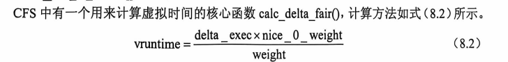

### 8.3 进程调度

进程调度是操作系统中的核心机制，用于合理分配处理器资源，提高系统性能。以下从进程分类、优先级、调度策略和时间片等方面详细总结。

假设在只有单核处理器的系统中，同一时刻只有一个进程可以拥有处理器资源，那么其他的进程只能在就绪队列(runqueue)中等待，等到处理器空闲之后才有机会获取处理器资源并运行。==在这种场景下，操作系统就需要从众多的就绪进程中选择一个最合适的进程来运行，这就是进程调度器(scheduler)。==进程调度器产生的最大原因是为了提高处理器的利用率。==一个进程在运行的过程中有可能需要等待某些资源，比如等待磁盘操作的完成、等待键盘输入、等待物理页面的分配等。如果处理器和进程一起等待，那么明显会浪费处理器资源，所以一个进程在睡眠等待时，调度器可以调度其他进程来运行，这样就提高了处理器的利用率。==

------

#### 8.3.1 进程的分类

从资源使用的角度，进程可以分为两类：

1. **CPU消耗型（CPU-Bound）**：==进程大部分时间在执行计算，持续占用CPU资源。例如大量数学计算、循环操作。==
2. **I/O消耗型（I/O-Bound）**：==进程大部分时间在等待I/O操作，仅偶尔需要CPU时间，例如等待键盘输入或网络I/O的进程。==

调度器需要在系统响应性（面向I/O密集型）和系统吞吐量（面向CPU密集型）之间找到平衡，以便适应不同类型的进程。

------

#### 8.3.2 进程的优先级和权重

Linux中的进程调度基于优先级调度机制，按照紧急程度来安排进程运行。优先级较高的进程获得更多的处理器时间。

- **nice值**：==范围为`-20`至`+19`，用于表示进程对其他进程的“友好程度”。值越低，优先级越高；`-20`表示最高优先级，`19`为最低。==
- **内核优先级**：范围从`0`至`139`，其中`0`-`99`为实时进程优先级，`100`-`139`为普通进程优先级。

##### 优先级字段示例（task_struct数据结构）

```
struct task_struct {
    int prio;           // 动态优先级，用于调度
    int static_prio;    // 静态优先级，初始分配，用户可调
    int normal_prio;    // 基于static_prio计算出的优先级
    unsigned int rt_priority; // 实时进程优先级
};
```

- **优先级划分**：

  - `static_prio`：进程启动时的静态优先级，与nice值相关。

  tatic_prio是静态优先级，在进程启动时分配。内核不存储 nice值，取而代之的是static _prio。NICE_TO_PRIO0宏可以把 nice值转换成 static_prio。之所以被称为静态优先级，是因为它不会随着时间而改变，用户可以通过 nice或 sched_setscheduler等系统调用来修改该值。

  - `normal_prio`：基于`static_prio`和调度策略计算出的优先级。

  normal_prio是基于static_prio和调度策略计算出来的优先级，在创建进程时会继承父进程的 normal_prio。对于普通进程来说，normal_prio 等同于 static _prio;对于实时进程，会根据rt_priority 重新计算 normal_prio,详见 effective_prio()函数。

  - `prio`：动态优先级，用于调度时的实际优先级。
  - `rt_priority`：实时进程优先级。


==在 Linux 内核中，除了使用优先级来表示进程的轻重缓急之外，在实际的调度器中也可使用权重的概念来表示进程的优先级。==为了计算方便，Linux 内核约定 nice值0对应的权重值为 1024,其他 nice 值对应的权重值可以通过查表的方式来获取。内核预先计算好了表sched_prio_to_weight[40],表的下标对应 nice值，即-20～19的整数。

- **权重表**：Linux使用`nice`值来映射权重，通过权重决定分配给进程的CPU时间。

  ```
  const int sched_prio_to_weight[40] = { 88761, 71755, 56483, 46273, ... };
  ```

- **用户空间API**：

  - `nice()`：用于调整进程的优先级。
  - `getpriority()`和`setpriority()`：系统调用，获取和设置进程的`nice`值。

------

#### 8.3.3 调度策略

==调度策略决定了进程何时获得CPU以及运行时长。Linux内核将不同的调度策略归纳为五个调度类，==每类由`sched_class`定义，并以`next`指针串联。

==进程调度依赖于调度策略(schedule policy), Linux 内核把相同的调度策略抽象成了调度类(schedule class)。==不同类型的进程采用不同的调度策略，目前 Linux 内核中默认实现了5个调度类，分别是stop、deadline、realtime、CFS和 idle,它们分别使用 sched_class 来定义，并且通过 next 指针串联在一起，

##### Linux调度类

1. **stop类**：优先级最高，负责进程迁移、系统负载均衡等特殊任务。
2. **deadline类**：严格的实时调度类，适用于高实时性要求的任务，如视频编解码。
3. **realtime类**：包括`SCHED_FIFO`和`SCHED_RR`，适用于IRQ线程化等实时任务。
4. **CFS类**：完全公平调度类，管理普通进程。
5. **idle类**：最低优先级，用于系统空闲时运行。

##### 调度策略API示例

```
#include <sched.h>

// 设置调度策略及优先级
int sched_setscheduler(pid_t pid, int policy, const struct sched_param *param);
int sched_getscheduler(pid_t pid);

// 获取和设置调度参数
int sched_setparam(pid_t pid, const struct sched_param *param);
int sched_getparam(pid_t pid, struct sched_param *param);
```

##### 调度策略定义

- **SCHED_RR（轮转调度）**：==每个进程按固定的时间片轮流获得CPU。==
- **SCHED_FIFO（先进先出）**：==无时间片，进程一直占用CPU，直到自愿放弃或被更高优先级进程抢占。==
- **SCHED_BATCH（批处理）**：==适合CPU密集型进程，降低对交互响应的影响。==
- **SCHED_NORMAL**：==默认调度策略，适用于普通分时任务。==
- **SCHED_IDLE**：空闲调度策略，仅在系统无其他任务时运行。

------

#### 8.3.4 时间片

==时间片定义了进程可连续运行的时间，长度决定了系统的响应速度和调度效率。传统Linux调度器使用固定时间片，现代完全公平调度器（CFS）根据进程权重动态分配时间片。==

- **时间片的平衡**：I/O密集型进程需要较短的时间片以响应I/O操作；CPU密集型进程希望获得较长的时间片以降低切换开销。
- **CFS的动态时间片**：==CFS根据进程的权重和系统总权重来分配CPU时间，优先级高的进程权重较大，获得更多CPU时间。==

------

通过优先级和时间片的结合，Linux调度器能够灵活适配不同类型的任务，在吞吐量和响应性之间找到最佳平衡。


### 8.3.5 经典调度算法

多级反馈队列(Multi-Level Feedback Queue, MLFQ)算法由Corbato等人于1962年提出，对操作系统调度器的设计产生了重要影响。该算法通过动态调整进程优先级，使CPU资源得到合理分配。

#### 多级反馈队列算法的基本规则

==多级反馈队列算法的核心思想是根据优先级将进程划分成多个队列，优先级越高的队列越靠前。调度器总是优先选择优先级高的队列中的进程。当队列中进程的优先级相同时，采用轮转调度算法进行调度。==

##### ==基本规则==

1. **规则1**：如果进程A的优先级高于进程B，调度器优先选择进程A。
2. **规则2**：如果进程A和B的优先级相同，采用轮转调度算法。
3. **规则3**：新进程进入时，放入优先级最高的队列。
4. **规则4a**：当进程在时间片用尽后，将其优先级降低，移动到下一级队列。
5. **规则4b**：如果进程在时间片未结束时放弃CPU，保持其优先级不变，留在当前队列。

##### 改进规则

- **规则5**：为防止低优先级进程的“饥饿”现象，每隔一个时间周期S，将所有进程的优先级提升至最高。通过调整S的大小，可以控制系统交互性和响应时间。
- **新的规则4**：防止进程欺骗调度器，所有使用完时间片的进程，无论是否在时间片末尾发起I/O请求，都会被降低优先级。

#### 多级反馈队列算法的实际应用

在现代操作系统中，MLFQ算法的变种通常允许动态改变时间片。例如：

- **高优先级队列**：通常包含I/O密集型进程，时间片较短（如10ms）。
- **低优先级队列**：通常包含CPU密集型进程，时间片较长（如20ms）。

------

### 8.3.6 Linux O(n)调度算法

==Linux 2.4及更早版本使用了O(n)调度算法，它的就绪队列采用全局链表形式。每次调度器从就绪队列中寻找最佳进程时，需要遍历整个队列，时间复杂度为O(n)，当进程数增多时会导致系统性能下降。==

- **时间片**：每个进程在创建时被分配固定的时间片。当前进程用完时间片后，调度器会选择下一个进程。当所有进程的时间片用完后，再次为它们分配时间片。

------

### 8.3.7 Linux O(1)调度算法

Linux 2.6采用了Ingo Molnar设计的O(1)调度算法，基于多级反馈队列算法，每个CPU拥有独立的就绪队列，减少了锁竞争问题。调度算法的时间复杂度为O(1)，与系统中就绪进程数量无关。

- **就绪队列结构**：包括活跃优先级数组和过期优先级数组，每个数组包含140个优先级队列。
- **选择下一个进程**：调度器从活跃优先级数组中选择优先级最高的非空队列中的第一个进程。==通过位图查找，时间复杂度为O(1)。==
- **活跃/过期数组互换**：当活跃数组中的所有进程用完时间片后，活跃和过期数组互换，继续调度。

------

### 8.3.8 Linux CFS算法

==完全公平调度器（CFS）引入了权重和虚拟时间(`vruntime`)的概念，抛弃了固定时间片和固定调度周期。==

#### CFS的核心概念

1. **权重和虚拟时间**：==每个进程的虚拟时间`vruntime`由实际运行时间和权重的比值计算得到。优先级高的进程权重大，虚拟时间增速慢，从而获得较多CPU时间；优先级低的进程权重小，虚拟时间增速快，获得的CPU时间较少。==

   - **权重表**：==Linux内核预先计算了一张权重表`sched_prio_to_weight`，nice值为0的权重为1024。nice值越低，权重越大，进程获得更多的CPU时间。==

   ```
   const int sched_prio_to_weight[40] = { 88761, 71755, 56483, 46273, ... };
   ```

==CFS总是选择虚拟时间最小的进程(即选择 vruntime 最短的进程),它就像一个多级变速箱，nice值为0的进程是基准齿轮，其他各个进程在不同的变速比下相互追赶，从而达到公正公平。==


2.**虚拟时间计算**：==CFS的关键是`vruntime`的计算，每个调度实体的数据结构`load_weight`包含权重和逆权重信息。==

```
struct load_weight {
    unsigned long weight;
    u32 inv_weight;
};

struct sched_entity {
    struct load_weight load;
    ...
};
```

- **虚拟时间计算公式**：

  

  其中，`delta_exec`为实际执行时间，`nice_0_weight`是nice值为0的基准权重。

#### CFS调度器的数据结构和函数

- **调度类**：每个调度类实现了特定的操作方法集。CFS的调度类通过`fair_sched_class`定义，包含了诸如`enqueue_task_fair`、`dequeue_task_fair`等函数，用于进程的入队、出队和调度切换。

  ```
  const struct sched_class fair_sched_class = {
      .enqueue_task = enqueue_task_fair,
      .dequeue_task = dequeue_task_fair,
      .pick_next_task = pick_next_task_fair,
      ...
  };
  ```

- **选择下一个进程**：CFS调度器采用红黑树存储就绪进程，选择虚拟时间`vruntime`最小的进程（红黑树最左节点）作为下一个调度对象。

  ```
  struct task_struct *pick_next_task_fair(struct rq *rq) {
      return rq->cfs.rb_leftmost;
  }
  ```

CFS通过引入权重、虚拟时间等概念，使得每个进程在不同的速率下公平竞争CPU资源。


### 8.3.9 进程切换

在Linux内核中，`_schedule()`是调度器的核心函数，用于选择和切换到合适的进程执行。进程切换时机包括阻塞操作、检查调度标志位`TIF_NEED_RESCHED`等情况。

#### 调度时机

1. **阻塞操作**：例如互斥量、信号量、等待队列等操作时，进程可能会阻塞，从而触发调度。

2. **中断和系统调用返回**：==当中断处理或系统调用即将返回用户空间时，检查`TIF_NEED_RESCHED`标志位，决定是否需要调度。==

3. **唤醒操作**：==被唤醒的进程不会立即调用`_schedule()`，而是加入就绪队列并设置`TIF_NEED_RESCHED`标志位，视内核是否可抢占而定。==
- 可抢占内核：
   
  - 在系统调用或异常处理返回时，会检查是否需要调度。
  - 在硬件中断处理结束时，检查是否需要抢占当前进程。
    
   - 不可抢占内核：

     - 在调用`cond_resched()`时检查调度需求。
- 系统调用、异常处理或中断处理返回用户空间时可能触发调度。

#### 进程调度

- schedule()是进程调度的主要接口函数，还存在一些变种函数：
  - `preempt_schedule()`：用于内核可抢占情况下的调度。
  - `preempt_schedule_irq()`：在中断结束返回时调用。
  - `schedule_timeout()`：用于在指定时间内使进程休眠。

##### `schedule()`核心代码

```
static void schedule(void) {
    next = pick_next_task(rq, prev);
    if (likely(next != prev))
        context_switch(rq, prev, next);
}
```

该代码实现了两个关键功能：选择下一个进程（`pick_next_task()`）和上下文切换（`context_switch()`）。

------

#### 进程切换

进程切换即挂起当前进程并恢复先前挂起的另一个进程的执行状态。Linux内核通过`context_switch()`函数实现进程切换。

- 步骤：

  1. **切换进程地址空间**：通过`switch_mm()`切换页表，从而切换进程的地址空间。
2. **切换栈和硬件上下文**：通过`switch_to()`函数切换内核栈和硬件寄存器，使新进程获得CPU控制权。

------

#### `switch_mm()`函数

`switch_mm()`的主要功能是将新进程的页表基地址加载到页表基地址寄存器，以便CPU能够正确映射内存。

- **ARM64处理器**：在进程切换时刷新TLB（Translation Lookaside Buffer），以清除上个进程的缓存项。
- **ASID机制**：在ARM架构中使用ASID（地址空间ID）标识不同进程的地址空间，使得切换进程时无需刷新整个TLB，避免性能下降。

------

#### `switch_to()`函数

在切换页表和TLB后，`switch_to()`函数完成栈空间和硬件寄存器的切换。

```
#define switch_to(prev, next, last)  \
    do { /* ... */ } while(0)
```

- 参数：

  - `prev`：当前被切出的进程。
  - `next`：即将切入的进程。
  - `last`：记录切出的进程信息，以便进行后续清理。

##### `switch_to()`的切换过程

1. **代码分段**：`switch_to()`的前半部分代码用于切换到新进程，后半部分代码在新进程中恢复。
2. **第三个参数`last`**：`switch_to()`的最后执行清理工作，如`finish_task_switch(last)`，以确保资源正确释放和进程状态更新。

#### `thread_struct`数据结构

在`task_struct`中，==`thread_struct`用于存储与架构相关的硬件上下文信息。==以下是ARM64的`thread_struct`定义。

```
struct thread_struct {
    struct cpu_context cpu_context;
    unsigned long tp_value;     // TLS寄存器
    struct user_fpsimd_state fpsimd_state;
    ...
};
```

- 主要字段：

  - ==`cpu_context`：包含了寄存器的硬件上下文。==
  - `tp_value`、`tp2_value`：TLS寄存器。
  - `fpsimd_state`：保存浮点和SIMD寄存器的状态。
  - `sve_state`、`sve_vl`：用于SVE（可伸缩向量扩展）的寄存器信息。

#### `cpu_context`结构体

在ARM64架构中，`cpu_context`结构体包含了进程切换时需要保存和恢复的寄存器信息。

```
struct cpu_context {
    unsigned long x19;   // 保存寄存器x19到x28
    unsigned long x20;
    ...
    unsigned long fp;    // 帧指针
    unsigned long sp;    // 栈指针
    unsigned long pc;    // 程序计数器
};
```

进程切换的核心在于保存`prev`进程的上下文到`cpu_context`，并从`next`进程的`cpu_context`中恢复上下文，以确保进程切换的正确性。

#### 进程上下文切换流程

1. **保存当前进程上下文**：将`prev`进程的寄存器内容保存到其`cpu_context`中。
2. **恢复下一个进程上下文**：将`next`进程的`cpu_context`中的值恢复到硬件寄存器。

在ARM64架构中，进程切换过程如下图所示：

1. **(a) 保存`prev`进程上下文**：将x19~x28、fp、sp和pc寄存器内容保存至`prev`的`cpu_context`。
2. **(b) 恢复`next`进程上下文**：将`next`的`cpu_context`内容恢复到寄存器，继续执行`next`进程。

------

通过`_schedule()`、`switch_mm()`和`switch_to()`等函数的协同作用，Linux内核实现了高效的进程调度和上下文切换，确保多任务环境下的进程运行调度。


### 8.3.10 与调度相关的数据结构

本节介绍了与调度器操作密切相关的几个重要数据结构，如 `task_struct`、`sched_entity`、`rq`、`cfs_rq` 以及调度类的操作方法等。这些数据结构和操作方法在调度过程中协同工作，实现了Linux内核复杂的多进程调度机制。

#### 1. `task_struct`

`task_struct`是Linux内核中用来描述进程的主要数据结构，它包含了进程运行状态和控制信息。与调度相关的成员包括当前进程的优先级、调度类、调度实体等。

| 成员名称      | 类型                        | 说明                |
| ------------- | --------------------------- | ------------------- |
| `state`       | `volatile long`             | 当前进程状态        |
| `on_cpu`      | `int`                       | 进程是否正在运行    |
| `cpu`         | `unsigned int`              | 进程在哪个CPU上执行 |
| `prio`        | `int`                       | 进程的动态优先级    |
| `static_prio` | `int`                       | 进程的静态优先级    |
| `sched_class` | `const struct sched_class*` | 指向进程的调度类    |
| `se`          | `struct sched_entity`       | 普通进程的调度实体  |

#### 2. `sched_entity`

`sched_entity` 是描述进程调度行为的数据结构，它记录了进程作为调度实体时的相关信息，如权重、虚拟时间、调度节点等。这些信息对于CFS调度策略至关重要。

| 成员名称           | 类型                 | 说明                        |
| ------------------ | -------------------- | --------------------------- |
| `load`             | `struct load_weight` | 调度实体的权重              |
| `run_node`         | `struct rb_node`     | 调度实体在CFS红黑树中的节点 |
| `vuntime`          | `u64`                | 调度实体的虚拟时间          |
| `sum_exec_runtime` | `u64`                | 总执行时间（真实时间）      |

#### 3. `rq`

`rq`（runqueue）结构用于描述每个CPU的就绪队列。系统中的每个CPU都有一个独立的`rq`结构，其中包括CFS、实时进程、deadline进程等各个调度器的数据结构，以及负载等信息。

| 成员名称     | 类型                  | 说明                       |
| ------------ | --------------------- | -------------------------- |
| `nr_running` | `unsigned int`        | 就绪队列中可运行进程的数量 |
| `cfs`        | `struct cfs_rq`       | 指向CFS的就绪队列          |
| `rt`         | `struct rt_rq`        | 指向实时进程的就绪队列     |
| `curr`       | `struct task_struct*` | 指向当前正在执行的进程     |
| `idle`       | `struct task_struct*` | 指向`idle`进程             |

#### 4. `cfs_rq`

`cfs_rq`结构表示CFS的就绪队列。CFS使用该结构存储调度实体的相关信息，例如就绪队列的总权重、运行时间等。CFS采用红黑树来组织调度实体，`cfs_rq`结构中包含了红黑树的根节点等信息。

| 成员名称         | 类型                    | 说明                       |
| ---------------- | ----------------------- | -------------------------- |
| `load`           | `struct load_weight`    | 就绪队列的总权重           |
| `exec_clock`     | `u64`                   | 就绪队列的总执行时间       |
| `min_vruntime`   | `u64`                   | 红黑树中最小的虚拟时间     |
| `rb_root_cached` | `struct rb_root_cached` | CFS红黑树的根节点          |
| `curr`           | `struct sched_entity*`  | 指向当前正在运行的调度实体 |

#### 5. 调度类的操作方法

每个调度类（如CFS、实时调度等）都有一套操作方法集，定义了调度器的核心操作，包括加入/移出就绪队列、检查抢占、选择下一任务等。这些方法通过函数指针表关联在调度类中，实现了不同调度策略的功能扩展。

| 操作方法             | 说明                       |
| -------------------- | -------------------------- |
| `enqueue_task`       | 将进程加入就绪队列         |
| `dequeue_task`       | 将进程移出就绪队列         |
| `check_preempt_curr` | 检查是否需要抢占当前进程   |
| `pick_next_task`     | 从就绪队列中选择下一个进程 |
| `put_prev_task`      | 将当前进程重新加入就绪队列 |
| `task_tick`          | 处理时钟滴答               |
| `task_fork`          | 初始化新创建进程的调度信息 |

Linux内核中的调度器相关数据结构关系如图8.15所示，每个CPU都拥有独立的就绪队列，内部包含CFS、实时进程、deadline进程等多种调度结构，所有数据结构相互配合，实现了多种调度策略。