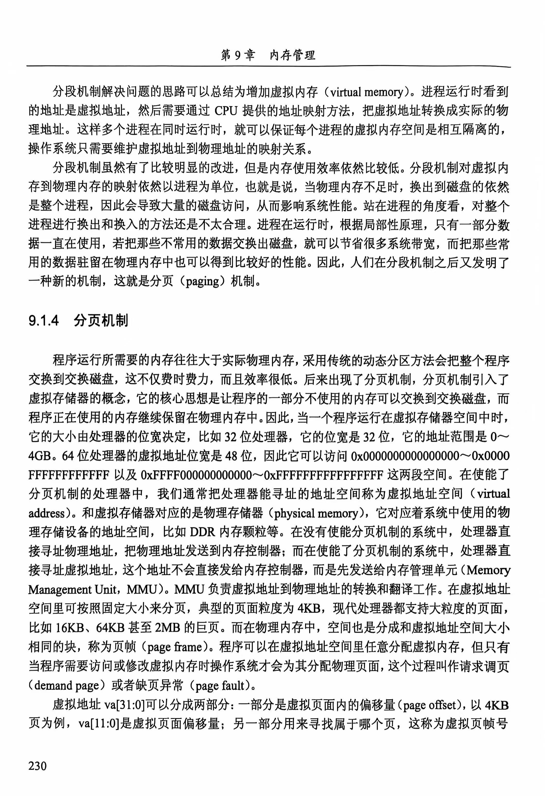
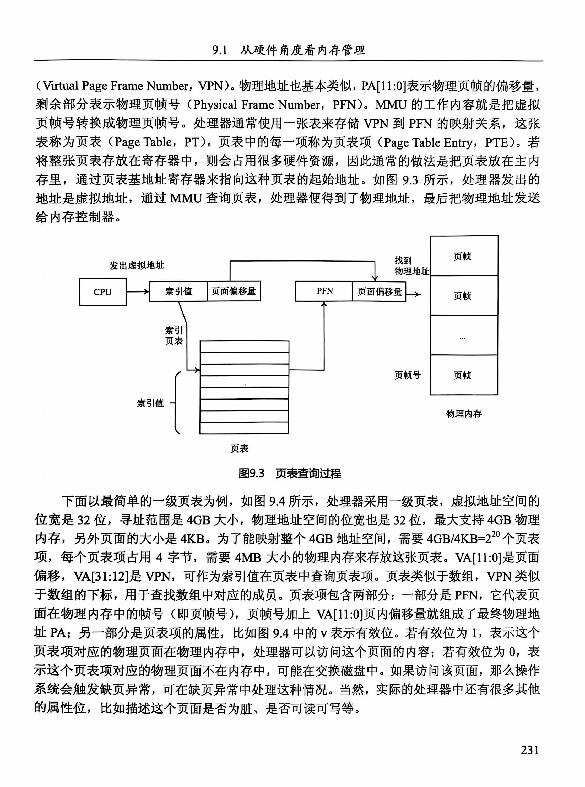
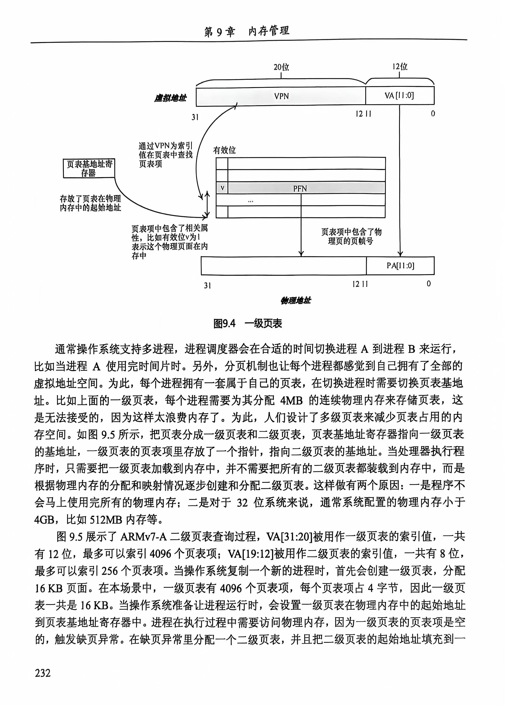
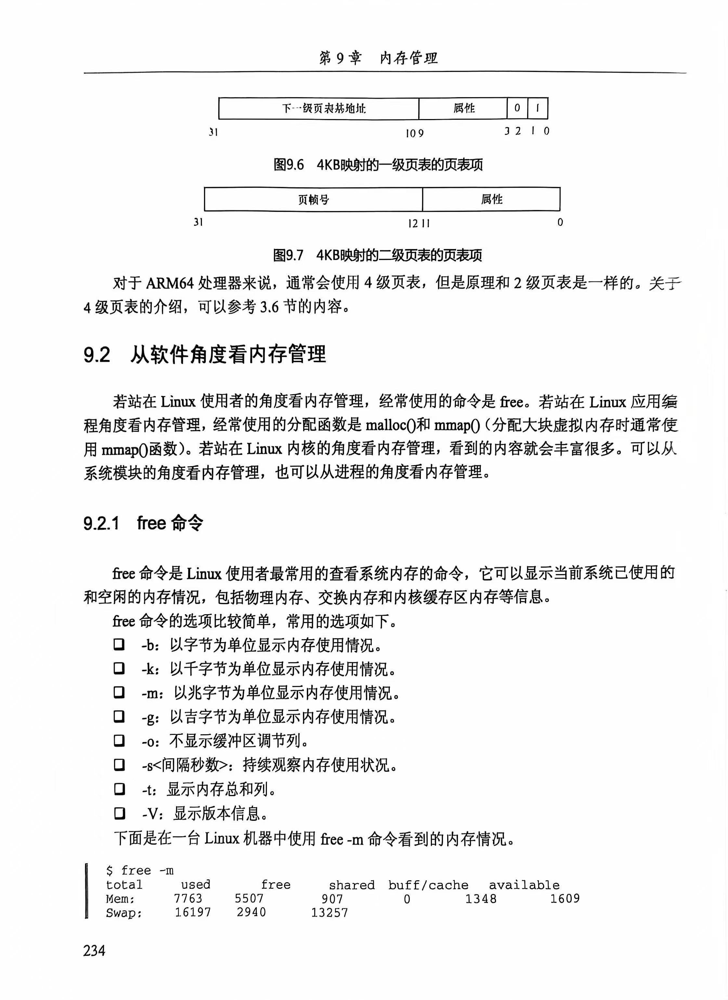

# 第9章 内存管理

内存管理是操作系统中的核心模块之一，其复杂性主要源于硬件与软件紧密结合的特点。随着计算机技术的发展，从简单的内存管理到现代的分页机制，内存管理的实现不断演进。以下是第9章内存管理硬件方面的详细总结。

------

## **9.1 从硬件角度看内存管理**

内存管理需要结合硬件和软件技术共同实现，尤其涉及如何将程序在内存中的组织形式抽象并进行有效管理。

------

### **9.1.1 内存管理的“远古时代”**

1. **单道编程**：

   - 只有一个用户进程和操作系统运行，程序直接使用物理地址，不涉及复杂的内存管理。
   - 缺点：
     - 程序不能超过物理内存大小。
     - 系统只能运行一个程序，导致资源浪费。
     - 程序无法在不同机器间迁移。

2. **多道编程**：

   - 同时运行多个进程，采用两种分区方式：
     - 固定分区：
       - 在系统编译时划分固定大小的内存分区，每个分区用于一个进程。
       - 缺点：地址空间不可动态扩展，程序大小必须匹配分区。
     - 动态分区：
       - 按需从剩余内存中分配与进程大小一致的空间，但会出现**内存碎片**。

   **动态分区内存碎片的示例：**

   - 操作系统预留4MB内存，其余部分供进程使用。
   - 多个进程加载和换出后，会形成内存空洞（如图9.1所示）。
   - 解决碎片化的方案：进程迁移，但此过程非常耗时。

3. **内存管理的问题**：

   - **地址空间保护问题**：进程之间可以互相访问内存，存在安全隐患。
   - **内存使用效率低**：频繁换出、换入导致系统性能低下。
   - **地址重定位问题**：进程换入换出时地址不固定，需使用重定位技术。

------

### **9.1.2 地址空间的抽象**

内存管理通过**虚拟内存**概念解决上述问题：

1. 虚拟内存：
   - 进程通过虚拟地址访问内存，由**处理器的MMU**将虚拟地址转换为物理地址。
   - 解决问题：
     - **隔离性与安全性**：进程A无法访问进程B的物理内存。
     - **效率提升**：减少动态分区中的内存碎片。
     - **重定位简化**：进程使用统一的虚拟地址，无需关心物理地址。

------

### **9.1.3 分段机制**

1. **概念**：
   - 将进程的虚拟地址映射到物理地址空间，不同进程占用的地址互不重叠。
   - 若进程访问未映射的地址，会触发**缺页异常**，操作系统负责处理。
2. **优缺点**：
   - **优点**：实现地址空间的隔离，程序可在不同系统间迁移。
   - **缺点**：内存利用率低，当内存不足时需将整个进程换出到磁盘。
     - 进程在运行时，根据**局部性原理**，只有一部分数据一直在使用，若把那些不常用的数据交换出磁盘，就可以节省很多系统带宽，而把那些常用的数据驻留在物理内存中也可以得到比较好的性能

补充：局部性原理

局部性原理是指[CPU](https://baike.baidu.com/item/CPU/120556?fromModule=lemma_inlink)访问[存储器](https://baike.baidu.com/item/存储器/1583185?fromModule=lemma_inlink)时，无论是存取指令还是存取数据，所访问的[存储单元](https://baike.baidu.com/item/存储单元/8727749?fromModule=lemma_inlink)都趋于聚集在一个较小的连续区域中。

三种不同类型的局部性:

[时间局部性](https://baike.baidu.com/item/时间局部性/56138378?fromModule=lemma_inlink)（Temporal Locality）：如果一个信息项正在被访问，那么在近期它很可能还会被再次访问。

[程序循环](https://baike.baidu.com/item/程序循环/50886238?fromModule=lemma_inlink)、[堆栈](https://baike.baidu.com/item/堆栈/1682032?fromModule=lemma_inlink)等是产生时间局部性的原因。

[空间局部性](https://baike.baidu.com/item/空间局部性/56102310?fromModule=lemma_inlink)（Spatial Locality）：在最近的将来将用到的信息很可能与正在使用的信息在空间地址上是临近的。

顺序局部性（Order Locality）：在典型程序中，除转移类指令外，大部分指令是顺序进行的。[顺序执行](https://baike.baidu.com/item/顺序执行/332454?fromModule=lemma_inlink)和非顺序执行的比例大致是5:1。此外，对大型数组访问也是顺序的。

指令的顺序执行、数组的连续存放等是产生顺序局部性的原因。

------

### **9.1.4 分页机制**

1. **概念**：

   - 将虚拟地址空间划分为固定大小的页面，每页大小通常为4KB。
   - 程序使用时，仅访问和修改的部分虚拟内存会被映射到物理页面（**请求调页**）。

2. **虚拟地址与物理地址映射**：

   - 虚拟地址

     由两部分组成：

     - 页偏移量（如VA[11:0]）决定页面内的具体位置。
     - 虚拟页帧号（VPN）用于定位页表中的页表项。

   - **页表**记录虚拟页帧号（VPN）与物理页帧号（PFN）的映射关系。

3. **页表结构与查询过程**（如图9.3所示）：

   - **一级页表**：直接映射整个虚拟地址空间，但占用内存过多（4MB）。
   - 多级页表：
     - 将页表分为**一级页表**和**二级页表**，减少页表占用的物理内存。

   **ARMv7-A二级页表查询过程**：

   - 虚拟地址的VA[31:20]用于索引一级页表，找到相应的页表项。
   - VA[19:12]用于索引二级页表，找到物理页面的地址。

------

#### **代码示例：一级页表与二级页表结构**

```C
// 页表项结构体示例
struct page_table_entry {
    unsigned int valid : 1;  // 有效位
    unsigned int pfn : 20;   // 物理页帧号
    unsigned int flags : 11; // 页表项标志位（脏页、可读写等）
};

// 一级页表查询示例
unsigned int vpn = (virtual_address >> 12) & 0xFFFFF;
struct page_table_entry *pte = &page_table[vpn];

// 检查有效位是否为1，若无效则触发缺页异常
if (!pte->valid) {
    handle_page_fault(virtual_address);
} else {
    // 计算物理地址
    unsigned int physical_address = (pte->pfn << 12) | (virtual_address & 0xFFF);
}
```

#### 补充：为什么64位操作系统只有48位虚拟地址空间？

虽然64位处理器**理论上**可以支持 2^{64} 个地址（即约16 EB, exabytes），但目前主流的64位操作系统和硬件架构通常只启用了**48位的虚拟地址空间**。这背后的原因涉及硬件设计、性能优化、软件管理和安全性。

------

##### **1. 页表的复杂性和存储开销**

- **多级页表的存储需求**：
  - 在64位系统中，每增加1位地址位宽会显著增加页表的大小。如果启用64位地址空间，页表的层级和所需的内存将大幅度增加，导致性能下降。
  - 48位虚拟地址空间已经对应**256 TB**的地址空间，足以满足当前和未来一段时间内的需求。
- **页表结构的限制**：
  - ==在x86-64架构中，CPU使用了**四级页表**来管理虚拟地址空间。如果启用完整的64位地址空间，需要**六级页表**，这会极大增加访问虚拟地址时的延迟和页表管理的复杂度。==

------

##### **2. CPU与MMU的设计**

- **地址空间分段和逐步扩展**：
  - **x86-64处理器**最初只支持48位虚拟地址，并计划未来逐步扩展至57位（目前有些ARM64系统支持57位）。这种逐步扩展策略既简化了硬件设计，又确保了未来可以根据需求扩展地址空间。
- **虚拟地址符号扩展**：
  - ==在x86-64架构中，48位虚拟地址使用**符号扩展（sign extension）**填充剩余的64位地址。也就是说，有效地址的高16位要么全为0，要么全为1，用于区分内核地址空间和用户地址空间。==这种机制简化了地址转换，并避免了误用高位地址空间。

------

##### **3. 256 TB虚拟地址空间已经足够**

- **当前应用的需求**：
  - 256 TB的虚拟地址空间足以满足绝大多数应用场景，如数据库、大型科学计算和虚拟化等。即使是**大型服务器和云计算**环境，也难以耗尽如此巨大的虚拟地址空间。
- **物理内存的限制**：
  - 当前服务器和计算设备的物理内存通常在数百GB至数TB之间，远低于256 TB的虚拟地址限制。因此，启用超过48位的虚拟地址空间没有实际意义。

------

##### **4. 节省硬件资源与提升性能**

- **TLB（Translation Lookaside Buffer）的效率**：
  - TLB是用于加速虚拟地址到物理地址转换的缓存。如果启用更多的地址位宽，会导致TLB缓存的压力增大，并增加地址转换的开销。
  - ==使用48位地址空间可以有效减少TLB的开销，并提升内存访问性能。==
- **缓存友好性**：
  - 硬件和操作系统开发者发现，将虚拟地址空间限制为48位可以减少不必要的内存碎片，并提高缓存命中的概率，进而提升系统性能。

------

##### **5. 兼容性与操作系统管理的复杂性**

- **软件适配与兼容性问题**：
  - ==如果启用完整的64位虚拟地址，操作系统和许多应用程序需要进行大量的修改和测试，尤其是涉及**指针和内存管理**的部分。==
- **安全性和内存布局的优化**：
  - ==现代操作系统利用虚拟地址空间的稀疏性来实现**地址空间布局随机化（ASLR）**等安全机制。如果启用完整的64位地址空间，管理这些稀疏空间的复杂性将会急剧增加。==

------

##### **总结**

64位操作系统使用**48位虚拟地址空间**的原因主要是出于**硬件设计的简化、性能优化、页表开销的控制**以及**安全性和兼容性**的考虑。256 TB的虚拟地址空间已经足够应对目前的需求，而启用完整的64位虚拟地址空间会显著增加系统的复杂性和资源开销。随着未来技术的发展和需求的增长，地址空间可能会进一步扩展（例如57位），但目前启用48位已是最合理的选择。

------

#### **ARM64的四级页表**

在ARM64架构下，分页机制进一步扩展为四级页表，每级页表逐步映射到更细粒度的地址空间，减少页表在内存中的占用。

------

### 原文：









------

### 补充：VA[31:20]含义

在 **ARMv7-A 架构**中，使用**二级页表**进行虚拟地址到物理地址的转换时，虚拟地址（**VA**）被分解成不同的段，每段用于不同层级的页表索引。下面详细解释如何从虚拟地址（VA）提取**VA[31:20]**，并用于**一级页表索引**。

------

### **虚拟地址结构解析：ARMv7-A 二级页表**

一个 **32 位虚拟地址（VA）\**可以表示\**4 GB**的虚拟地址空间。ARMv7-A 分为 **两级页表**：**一级页表**和**二级页表**，用于查找最终的物理页帧地址。其结构如下：

- **VA[31:20]**：用于一级页表索引。
- **VA[19:12]**：用于二级页表索引。
- **VA[11:0]**：用于物理页内的偏移（offset）。

------

#### **虚拟地址分解的结构**

假设一个虚拟地址 VA=0x1234ABCDVA = 0x1234ABCDVA=0x1234ABCD，我们将其二进制形式展示如下：

```
VA (32 位): 0001 0010 0011 0100 1010 1011 1100 1101
            └───┬──────┘ └───────┬───────┘ └───┬──────┘
                一级页表           二级页表        页内偏移
                [31:20]           [19:12]        [11:0]
```

具体字段含义如下：

1. VA[31:20]

   （12 位）：

   - 一级页表索引：决定一级页表中要访问的条目。

2. VA[19:12]

   （8 位）：

   - 二级页表索引：决定二级页表中具体要访问的条目。

3. VA[11:0]

   （12 位）：

   - 页内偏移：决定页帧中的具体位置。

------

#### **如何计算 VA[31:20]：**

1. **虚拟地址（VA）**是一个32位数，比如：`VA = 0x1234ABCD`。

2. 将 

   ```
   VA
   ```

    转换为二进制形式：

   ```
   0001 0010 0011 0100 1010 1011 1100 1101
   ```

3. 取 VA 的 [31:20] 位

   作为一级页表索引：

   ```
   VA[31:20] = 0001 0010 0011
             = 0x123 （十六进制）
   ```

4. **将 0x123 作为索引**，它指向一级页表中的第 291 项（十进制：291）。

------

#### **计算一级页表大小：**

- **一级页表**共有 **4096 项**，每项占 **4 字节**：

  ```
  4096 * 4 字节 = 16 KB
  ```

- 一级页表存储在**16 KB**的连续内存中，`VA[31:20]` 索引对应一级页表的某个条目。

------

#### **从一级页表到二级页表的过程：**

1. **CR3 寄存器（或 TTBR0 寄存器）**存储一级页表的基地址。例如：`0x1000`。
2. **VA[31:20]** 用来在一级页表中找到对应的 **二级页表的物理地址**。
3. 在对应的二级页表中，**使用 VA[19:12]** 进一步找到具体的页表条目。
4. 最后使用 **VA[11:0]** 作为页内偏移，确定物理页帧内的具体地址。

------

#### **示例计算**

假设：

- **CR3 = 0x1000**（一级页表基地址）。
- 虚拟地址：`VA = 0x1234ABCD`

1. 从 CR3 找到一级页表：

   ```
   一级页表基地址 = 0x1000
   ```

2. VA[31:20] = 0x123，表示一级页表中的第 291 项：

   ```
   一级页表项地址 = 0x1000 + (0x123 * 4) = 0x148C
   ```

3. **查找二级页表地址**，假设条目中存储了物理地址 `0x2000`（即二级页表基地址）。

4. 使用 VA[19:12] = 0x34

    在二级页表中查找：

   ```
   二级页表项地址 = 0x2000 + (0x34 * 4) = 0x2134
   ```

5. 最后，查找到具体的物理页帧，使用 **VA[11:0]** 作为偏移。

------

#### **总结**

在 ARMv7-A 的二级页表体系中：

1. **VA[31:20]**：用于索引一级页表条目，找到对应的二级页表地址。
2. **VA[19:12]**：用于索引二级页表条目，找到最终的物理页帧地址。
3. **VA[11:0]**：用于页内偏移。

整个过程确保了**虚拟地址的高效映射**到物理地址，并支持进程地址空间的隔离和管理。


------

### 补充：VFN的分配

**VFN (Virtual Frame Number)** 是虚拟内存管理中的一个概念，通常指**虚拟地址空间中的页号**。VFN 是通过将虚拟地址按页大小对齐并去除页内偏移后计算得到的，因此它不是随机分配的，而是由操作系统根据**虚拟内存地址映射策略**决定的。下面详细说明：

------

#### **1. VFN 计算：**

- **虚拟地址**（Virtual Address）由页号和页内偏移组成。

- VFN 由虚拟地址的高位部分表示，低位部分用于页内偏移。

  **计算公式：**
  VFN=Virtual AddressPage Size\text{VFN} = \frac{\text{Virtual Address}}{\text{Page Size}}VFN=Page SizeVirtual Address​

------

#### **2. VFN 的分配原则：**

- **非随机分配**：操作系统不会随意或随机分配 VFN。相反，它会基于进程的内存需求、映射策略和内存布局进行分配。

**具体映射方式：**

1. **线性分配：**

   - 系统为一个进程的代码段、数据段、栈、堆等内存区域按需连续映射到虚拟地址空间，保证它们之间的逻辑顺序。

2. **分区分配：**

   - 栈、堆、代码段等被放置在

     不同的虚拟地址范围

     。例如：

     - 栈通常位于高地址，从高地址向低地址扩展。
     - 堆则从低地址向高地址增长。

3. **需求分页 (Demand Paging)：**

   - 只有在进程真正访问某个虚拟页时，操作系统才会分配物理页，并在页表中建立映射关系。

4. **共享与文件映射：**

   - 通过 `mmap()` 等系统调用，文件的内容可以映射到虚拟地址空间，生成相应的 VFN。

------

#### **3. 操作系统如何管理 VFN：**

- **每个进程**有独立的页表，用于管理虚拟地址和物理地址之间的映射关系。
- **MMU (Memory Management Unit)** 会根据页表，把虚拟地址中的 VFN 转换为对应的物理页号（PFN, Physical Frame Number）。

------

#### **4. 总结：**

VFN 不是随机分配的，而是由操作系统根据**内存管理策略**来分配和管理。每个进程的虚拟地址空间是独立的，且操作系统会确保地址空间的逻辑布局。

------

### 补充：举例说明

让我们更详细地拆解**四级页表地址转换过程**，并通过示例逐步分析从虚拟地址到物理地址的映射过程。

------

### **四级页表映射过程：从虚拟地址到物理地址的详细步骤**

假设：

- **虚拟地址**：`0x0000_0123_4567_89AB`
- 页大小：**4KB** (2¹² 字节)
- 每级页表条目：**512 个**（9 位索引，2⁹ = 512）
- 页表基地址在 **CR3** 寄存器中存储

页表结构如下：

```
| PGD (9 bits) | PUD (9 bits) | PMD (9 bits) | PTE (9 bits) | Offset (12 bits) |
```

虚拟地址（`0x0000_0123_4567_89AB`）拆分如下：

```
PGD 索引：  0x000  
PUD 索引：  0x001  
PMD 索引：  0x091  
PTE 索引：  0x089  
页内偏移：  0xAB  
```

------

#### **步骤 1：从 PGD 表获取 PUD 表地址**

1. **CPU 从 CR3 寄存器读取 PGD 表的物理地址**。
   - **假设**：CR3 寄存器中的 PGD 表基地址为 `0x1000`。
2. **访问 PGD 表**：PGD 表存储在物理地址 `0x1000` 开始的内存区域，每个 PGD 条目占用 **8 字节**。
3. **通过 PGD 索引计算偏移量**：
   - PGD 索引为 `0x000`，因此偏移量是：`0x000 * 8 = 0x0`。
   - **地址计算**：PGD 表地址 + 偏移量 = `0x1000 + 0x0 = 0x1000`。
4. **读取 PGD 表中的条目**：
   - 从 `0x1000` 处读取 **8 字节**，假设得到的值是 `0x2000`，这是 **PUD 表的物理地址**。

------

#### **步骤 2：从 PUD 表获取 PMD 表地址**

1. **访问 PUD 表**：PUD 表从物理地址 `0x2000` 开始。
2. **通过 PUD 索引计算偏移量**：
   - PUD 索引为 `0x001`，因此偏移量是：`0x001 * 8 = 0x8`。
   - **地址计算**：PUD 表地址 + 偏移量 = `0x2000 + 0x8 = 0x2008`。
3. **读取 PUD 表中的条目**：
   - 从 `0x2008` 处读取 **8 字节**，假设读取到的值是 `0x3000`，这是 **PMD 表的物理地址**。

------

#### **步骤 3：从 PMD 表获取 PTE 表地址**

1. **访问 PMD 表**：PMD 表从物理地址 `0x3000` 开始。
2. **通过 PMD 索引计算偏移量**：
   - PMD 索引为 `0x091`，因此偏移量是：`0x091 * 8 = 0x488`。
   - **地址计算**：PMD 表地址 + 偏移量 = `0x3000 + 0x488 = 0x3488`。
3. **读取 PMD 表中的条目**：
   - 从 `0x3488` 处读取 **8 字节**，假设读取到的值是 `0x4000`，这是 **PTE 表的物理地址**。

------

#### **步骤 4：从 PTE 表获取页帧地址**

1. **访问 PTE 表**：PTE 表从物理地址 `0x4000` 开始。
2. **通过 PTE 索引计算偏移量**：
   - PTE 索引为 `0x089`，因此偏移量是：`0x089 * 8 = 0x448`。
   - **地址计算**：PTE 表地址 + 偏移量 = `0x4000 + 0x448 = 0x4448`。
3. **读取 PTE 表中的条目**：
   - 从 `0x4448` 处读取 **8 字节**，假设读取到的值是 `0x80000`，这是 **物理页帧的基地址**。

------

#### **步骤 5：计算最终物理地址**

1. **从虚拟地址提取页内偏移**：偏移量为 `0xAB`。
2. **计算物理地址**：物理页帧基地址 + 页内偏移：

```
物理地址 = 0x80000 + 0xAB = 0x800AB
```

------

#### **总结：从虚拟地址到物理地址的路径**

1. **PGD**：从 `CR3` 获取 PGD 表地址，读取 PUD 表地址。
2. **PUD**：通过索引查找 PMD 表地址。
3. **PMD**：通过索引查找 PTE 表地址。
4. **PTE**：通过索引查找物理页帧地址。
5. **计算物理地址**：页帧地址 + 页内偏移。

------

#### **图示：虚拟地址到物理地址映射**

```
虚拟地址：0x0000_0123_4567_89AB  
+---> PGD (索引：0x000) ---> 物理地址：0x2000  
       +---> PUD (索引：0x001) ---> 物理地址：0x3000  
             +---> PMD (索引：0x091) ---> 物理地址：0x4000  
                   +---> PTE (索引：0x089) ---> 页帧地址：0x80000  
                         + 页内偏移：0xAB  
                         = 最终物理地址：0x800AB  
```

------

通过以上步骤，我们完整地展示了四级页表如何将虚拟地址转换为物理地址。每级页表通过 9 位索引定位下一层，直到 PTE 找到页帧基地址，加上页内偏移后得到最终的物理地址。

------

### 补充：寄存器存储在哪，PGD等这些表又存储在哪

#### **寄存器和页表存储的位置解析**

#### **1. 寄存器的存储位置**

寄存器是**CPU 内部的高速存储单元**，用于存储即将被处理的临时数据和指令。它们的特点是访问速度极快，但数量有限。常见的寄存器包括：

- **CR3 寄存器**：存储**页表的基地址**（PGD 表的物理地址）。
- **通用寄存器**：如 RAX、RBX、RCX 等，用于数据运算。
- **控制寄存器（CR0、CR2、CR3、CR4）**：存储与 CPU 控制、内存管理和分页相关的信息。

**总结**：寄存器存储在**CPU 内部**，在电路级别紧邻处理单元，以支持高速数据交换。

------

**2. 页表（PGD、PUD、PMD、PTE）的存储位置**

页表是用于虚拟内存管理的重要数据结构，用来建立**虚拟地址与物理地址之间的映射关系**。这些页表存储在**物理内存（RAM）**中。

- **PGD（Page Global Directory）**：
  存放在**物理内存**中，并通过 **CR3 寄存器**指向它的物理地址。
- **PUD、PMD、PTE**：
  这些表也存储在**物理内存**中，并通过各级页表条目提供的物理地址找到下一层页表。

------

#### **页表存储过程详解**

1. **CR3 寄存器**指向 PGD 表的物理地址。例如：`CR3 = 0x1000`。
2. **PGD 表**存放在 RAM 中的物理地址 `0x1000` 处。
3. **PGD 条目**中包含 PUD 表的物理地址。
4. **PUD 表**同样在 RAM 中某个位置存储，并在 **PGD 表条目**中找到它的地址。
5. **依次访问 PMD、PTE**，每一层表的地址都存储在上一层的表条目中，直到找到对应的物理页帧地址。

**总结**：PGD、PUD、PMD 和 PTE 等页表全部存储在**RAM**中，但它们的基地址通过分页硬件逐级查找，最终映射到物理地址。

------

#### **图示：CR3、页表与内存的关系**

```
[CPU]
  |-- CR3 (寄存器) --> [PGD] 物理地址：0x1000 (在 RAM 中)
                      |
                      +--> [PUD] 物理地址：0x2000 (在 RAM 中)
                            |
                            +--> [PMD] 物理地址：0x3000 (在 RAM 中)
                                  |
                                  +--> [PTE] 物理地址：0x4000 (在 RAM 中)
                                        |
                                        +--> 物理页帧地址：0x80000
```

------

#### **为什么页表存储在 RAM 中？**

1. **访问速度**：页表需要频繁查找（每次虚拟地址访问都要查页表），所以必须存储在**RAM**中。
2. **灵活性**：页表内容在系统运行时会不断更新（例如页面置换时），RAM 适合存储这种易变的数据。
3. **缓存机制**：为了减少每次访问 RAM 的开销，CPU 还会使用 **TLB（Translation Lookaside Buffer）** 缓存最近访问的页表项。

------

### **总结：寄存器与页表的存储位置**

- **寄存器**：存储在 CPU 内部（如 CR3 寄存器）。
- **PGD、PUD、PMD、PTE 页表**：存储在 **RAM** 中，通过 CR3 逐层查找每级表的地址，最终找到物理页帧地址。


------

### **总结**

本章详细介绍了内存管理的发展历程，从单道、多道编程到分段和分页机制。**虚拟内存**的引入解决了内存的安全性、效率和重定位问题，而**分页机制**通过按需加载页面，提高了内存的利用率。通过多级页表结构，现代系统有效减少了页表占用的内存空间。