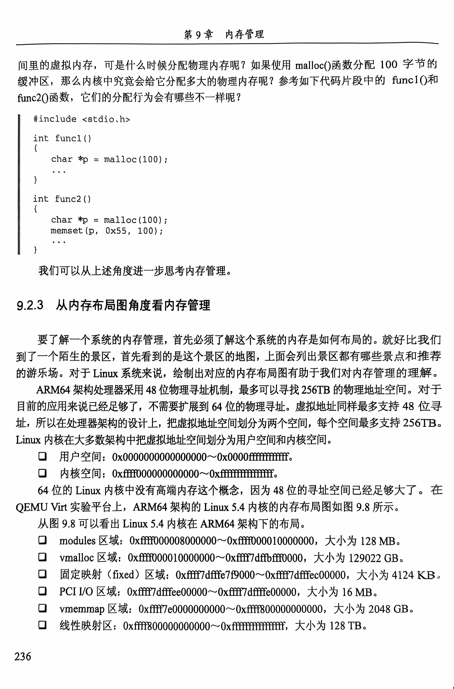
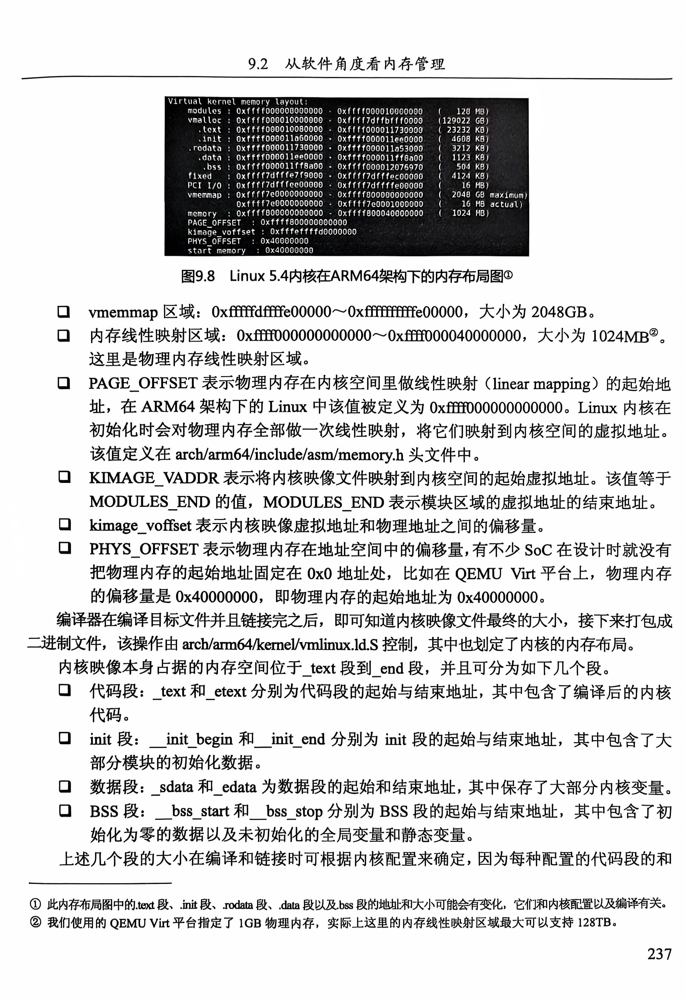
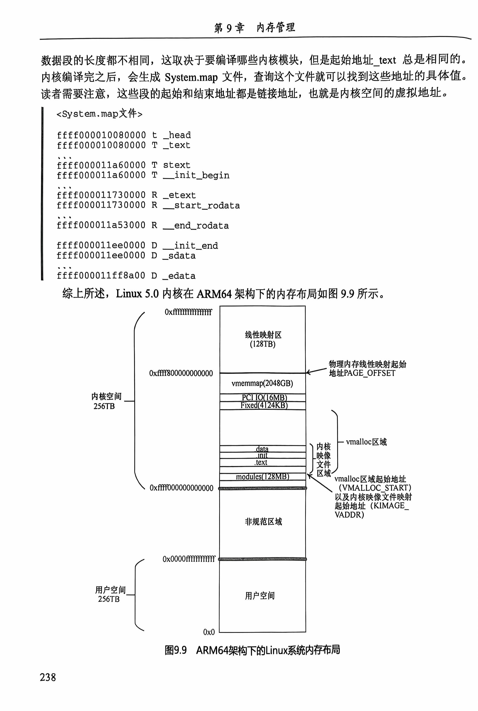
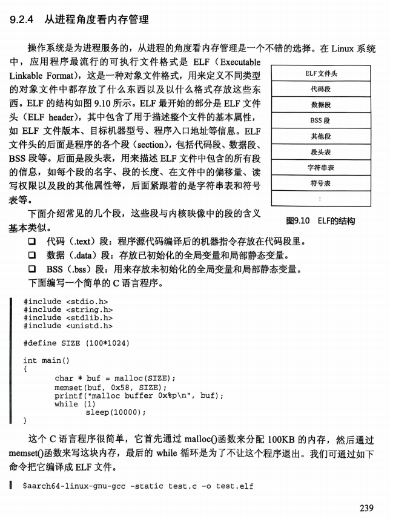
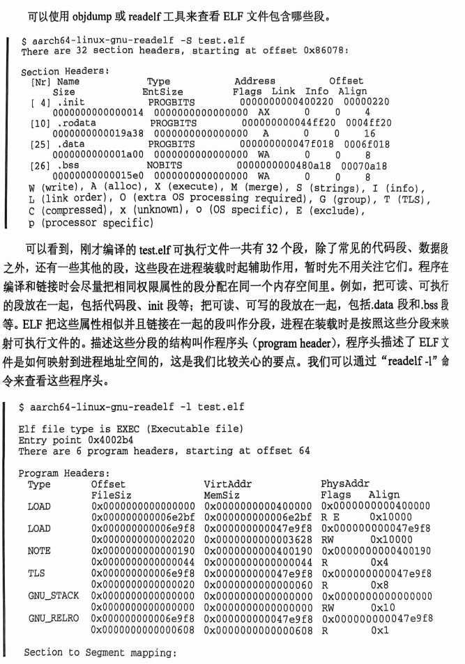
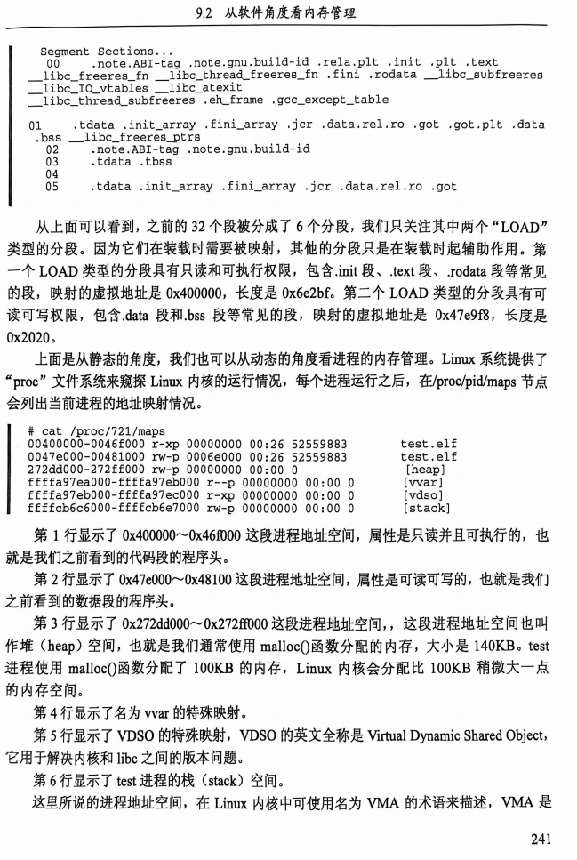
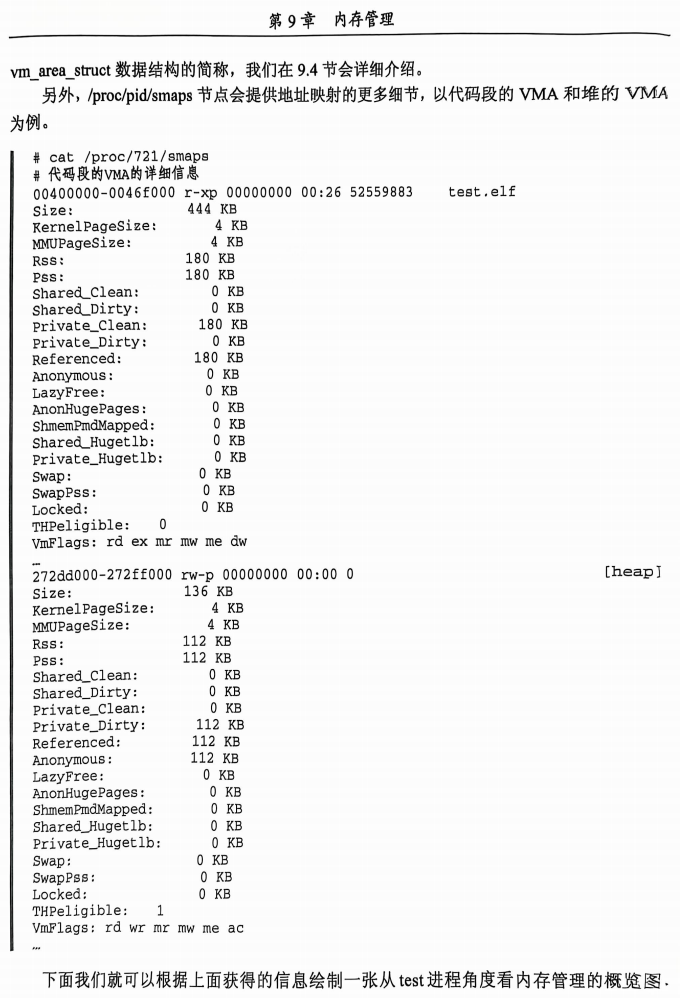
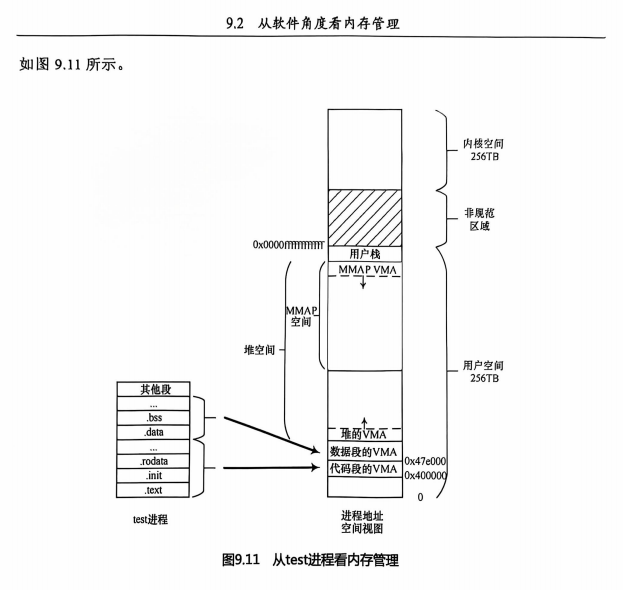
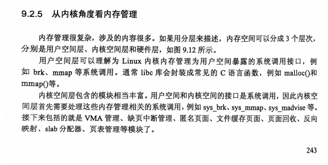
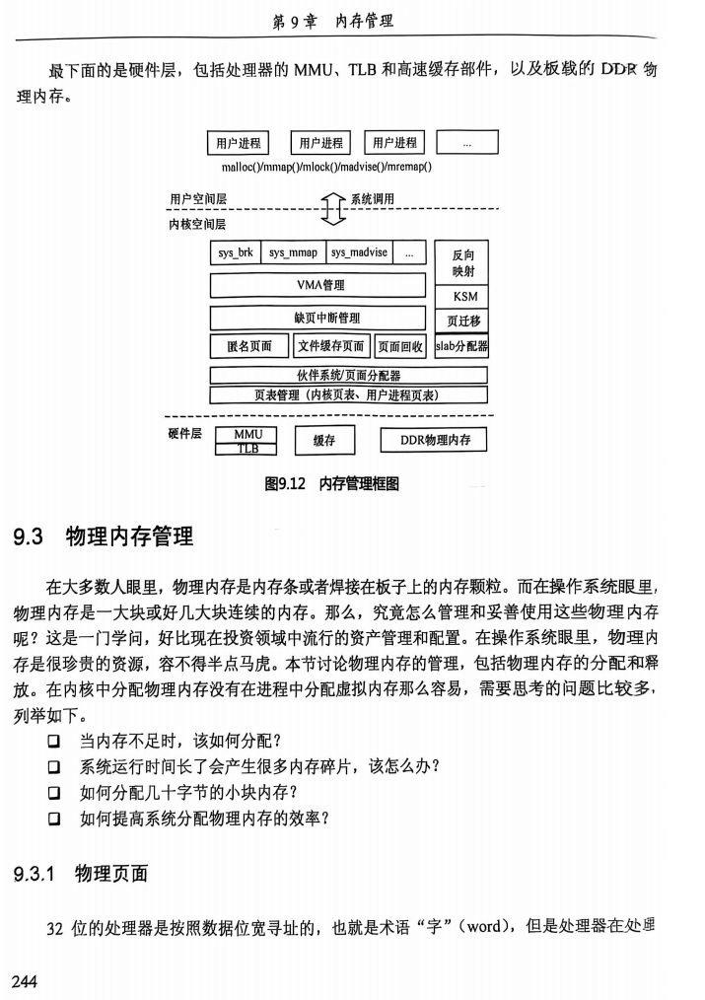

## **9.2 从软件角度看内存管理**

本节介绍了从不同角度（Linux使用者、应用程序开发者、系统内存布局、进程及内核）对内存管理的理解和实现。每个层面都涉及不同的内存管理工具与机制，使得Linux内存管理体系结构严谨且复杂。

------

### **9.2.1 free命令**

`free`命令是用户查看系统内存使用情况的工具，显示了物理内存、交换空间及内核缓存区的详细状态。

- **常用选项**：

  - `-b`：以字节为单位显示内存使用情况。
  - `-k`：以千字节为单位显示。
  - `-m`：以兆字节为单位显示。
  - `-g`：以吉字节为单位显示。
  - `-t`：显示内存总和。
  - `-s <秒数>`：每隔指定秒数刷新一次内存使用情况。
  - `-V`：显示`free`命令的版本信息。

- **示例输出**：

  ```
  $ free -m
                total   used   free  shared  buff/cache  available
  Mem:          7763    5507      0     907         1348       1609
  Swap:        16197    2940  13257
  ```

  - 解释：
    - **total**：内存总量（分为物理内存和交换空间）。
    - **used**：已使用的内存。
    - **free**：空闲内存。
    - **shared**：进程共享的内存（用于进程间通信）。
    - **buff/cache**：内核缓存和页面缓存，用于提高文件访问效率。
    - **available**：系统可回收的内存，但包含不可回收部分，如`tmpfs`。

------

### **9.2.2 从应用编程角度看内存管理**

- **常用内存管理函数**：

  ```C
  void *malloc(size_t size);         // 分配内存
  void free(void *ptr);              // 释放内存
  void *mmap(void *addr, size_t length, int prot, int flags, int fd, off_t offset);
  int munmap(void *addr, size_t length); // 解除内存映射
  int mprotect(const void *addr, size_t len, int prot); // 修改内存保护属性
  ```

- **示例代码**：

  ```C
  #include <stdio.h>
  #include <stdlib.h>
  #include <string.h>
  
  int func1() {
      char *p = malloc(100);  // 分配100字节内存，但未初始化
  }
  
  int func2() {
      char *p = malloc(100);  
      memset(p, 0x55, 100);  // 初始化分配的内存
  }
  ```

  - **分析**：
    `func1()`中的内存未使用，因此不会实际分配物理内存。`func2()`中通过`memset()`访问了分配的内存，因此触发了物理页面的分配。

------

### **9.2.3 从内存布局图角度看内存管理**

- **ARM64架构的内存布局**：
  - **物理地址空间**：最大支持256TB。
  - **虚拟地址空间**：用户空间和内核空间各支持256TB。
- **Linux 5.4内核的内存布局**（如图9.8）：
  - **modules区域**：128MB。
  - **vmalloc区域**：129022GB，用于动态内存分配。
  - **PCI IO区域**：16MB。
  - **vmemmap区域**：2048GB，用于页表的管理。
  - **线性映射区**：最大128TB。
- **内核映像的主要段**：
  - **代码段**：`_text`到`_etext`。
  - **init段**：`_init_begin`到`_init_end`。
  - **数据段**：`_sdata`到`_edata`。
  - **BSS段**：`__bss_start`到`__bss_stop`。

### 原文：







------

### **9.2.4 从进程角度看内存管理**

- **ELF可执行文件结构**（如图9.10）：

  - **ELF头**：描述文件属性，如版本、入口地址。
  - **代码段、数据段、BSS段**：存放程序代码、初始化数据和未初始化数据。

- **内存映射示例**：

  ```
  cat /proc/<pid>/maps
  ```

  - 显示进程的内存映射情况：

    ```
    00400000-0046f000 r-xp 00000000 00:26 52559883 test.elf
    272dd000-272ff000 rw-p 00000000 00:00 0 [heap]
    ```

  - **解释**：

    - **代码段**：可读、可执行的内存区域。
    - **堆空间**：通过`malloc()`分配的内存。
  
  
  
  
  
  
  
  ==VMA==
  
  ```
  cat /proc/pid/smaps
  ```
  
  
  
  

------

### **9.2.5 从内核角度看内存管理**

- 内存管理的三层结构

  （如图9.12）：

  1. **用户空间层**：==提供系统调用接口（如`brk`、`mmap`），由`libc`库封装为`malloc()`等函数。===
  2. 内核空间层：
     - 管理用户内存请求，如`sys_mmap`、`sys_brk`。
     - ==管理虚拟内存区域（VMA）、页表、文件缓存页面及缺页中断。==
     - ==包含内存分配器（如`slab`、伙伴系统）。==
  3. 硬件层：
     - 包括MMU、TLB（转换后备缓冲）及DDR物理内存。
  
  
  
  

------

### **总结**

本节从多个层面介绍了Linux内存管理的实现与工具。

- **Linux用户**：使用`free`命令监控内存使用情况。
- **应用开发者**：通过`malloc()`和`mmap()`管理虚拟内存。
- **进程角度**：分析ELF文件结构及进程内存布局。
- **内核层面**：负责虚拟内存管理、页表维护及缺页异常处理。

这些视角相辅相成，共同构建了Linux系统高效的内存管理体系。


