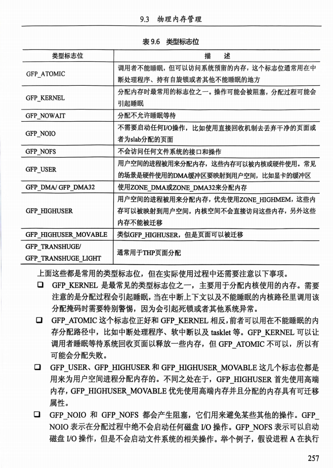

### 9.3 物理内存管理

物理内存管理在 Linux 内核中至关重要，负责有效利用和管理有限的内存资源，避免碎片化，并确保内存分配和释放的高效。以下是物理内存管理的关键内容。

#### 9.3.1 物理页面

在 Linux 内核中，物理内存的最小管理单元是 **页面**。每个页面通常为 4KB，但在某些架构上可以为 8KB、16KB、甚至 64KB。内核使用 `struct page` 数据结构来描述每个物理页面，它在内核的内存管理中发挥核心作用。

#### `struct page` 数据结构

`struct page` 是 Linux 内核用于管理物理页面的关键数据结构。该结构包括四个主要部分：

1. **flags 成员**：保存页面的状态标志位，包含页面是否上锁、是否在回收队列中、是否为脏页等信息。标志位帮助内核快速判断页面的状态，并执行相应的操作。
2. **_refcount 和 _mapcount 成员**：
   - `_refcount`：记录页面被引用的次数。如果为 0，表示页面空闲或即将被释放；大于 0 表示页面已被分配且在使用中。
   - `_mapcount`：记录页面被映射的次数，即 PTE (Page Table Entry) 中对页面的引用数量。主要用于匿名页面的反向映射机制（RMAP），实现共享页面的引用计数管理。
3. **mapping 字段**：用于文件缓存和匿名页面的映射关系。文件缓存页面的 `mapping` 指向文件的 `address_space`，而匿名页面的 `mapping` 指向 `anon_vma` 结构。
4. **其他字段**：
   - **lru 字段**：用于页面的 LRU 链表管理。
   - **virtual 字段**：指向页面的虚拟地址。对于高端内存，这一字段为 NULL，只有在需要时才会动态映射。

这些字段使内核能够跟踪页面的状态、用途和映射关系，从而实现精细化的内存管理。

#### page 数据结构与物理页面的对应关系

Linux 内核为每个物理页面分配一个 `struct page` 结构，并将这些结构存储在 `mem_map` 数组中，实现与物理页面的 1:1 映射。由于 `struct page` 占用内存，内核社区严格控制其大小，避免因数据结构浪费过多内存。


### ==原文：==


------

### 9.3.2 内存管理区

==在 Linux 内核中，物理内存被分割成不同的管理区域，称为 **内存管理区（zone）**，==以满足不同的内存需求。根据处理器架构和硬件限制，==Linux 使用多个内存管理区，如 `ZONE_DMA`、`ZONE_NORMAL`、和 `ZONE_HIGHMEM` 等。==以下是内存管理区的概述和其在 32 位与 64 位处理器中的适用情况：

- **ZONE_DMA**：主要用于 DMA 操作，适用于支持 DMA 的设备（如 x86 架构），它限制设备只能访问物理内存的前 16MB。这在 ARM 架构中不常见。
- **ZONE_NORMAL**：用于线性映射内存，是内核能直接访问和管理的物理内存区域。在 32 位系统中，内核可以直接映射的物理内存最大约为 1GB。
- **ZONE_HIGHMEM**：用于管理高端内存，在 32 位系统中常见，因为内核无法直接映射到超过 1GB 的高端内存。高端内存必须通过特定方法（如临时映射）来访问。对于 64 位系统，由于有足够的地址空间，`ZONE_HIGHMEM` 通常不存在。

### 内存管理区描述符

==Linux 内核使用 `struct zone` 数据结构来描述每个内存管理区，其定义在 `include/linux/mmzone.h` 文件中。`struct zone` 包含三个主要部分：只读域、写敏感域、和统计信息。==

#### 1. `struct zone` 数据结构的主要成员

==`struct zone` 的重要成员包括：==

- **watermark**：==为每个内存管理区定义了三个水位：`WMARK_MIN`、`WMARK_LOW` 和 `WMARK_HIGH`，用于控制页面分配器的行为。在页面分配时，系统会根据当前可用页面的数量与水位的对比来决定是否触发页面回收或是否允许分配。==
- **lowmem_reserve**：==在不同内存管理区之间设置的预留内存量，避免低区内存被高优先级需求耗尽。==
- **zone_pgdat**：==指向该管理区所在的内存节点，便于在 NUMA 系统中管理不同的内存节点。==
- **pageset**：存储 per-CPU 页面数据集，用于减少页面分配中自旋锁的争用。
- **zone_start_pfn**：管理区的起始页帧号，帮助标识该管理区在物理地址空间中的位置。
- **managed_pages**：管理区中由伙伴系统管理的页面总数。
- **spanned_pages** 和 **present_pages**：分别表示管理区覆盖的页面数和实际管理的页面数。在某些架构上，它们可能相等。
- **free_area**：一个数组，用于管理不同顺序的空闲页面区，支持伙伴系统分配器（Buddy System Allocator）的实现。
- **lock**：自旋锁，用于保护 `struct zone` 数据结构的并行访问，避免数据竞争。
- **vm_stat**：用于存储该管理区的各种统计信息，如页面分配和释放的次数。

### 2. 辅助操作函数

Linux 内核提供了若干辅助函数用于操作和查询内存管理区，这些函数位于 `include/linux/mmzone.h` 文件中，常用函数包括：

- **for_each_zone()**：遍历系统中所有的内存管理区，方便在多个管理区间执行某些统一操作。
- **is_highmem(struct zone \*zone)**：判断一个内存管理区是否为 `ZONE_HIGHMEM` 类型。
- **zone_idx(struct zone \*zone)**：返回该管理区在其所属内存节点中的编号，用于识别特定管理区。

### 内存管理区的分布与布局优化

为了提升并发访问性能，`struct zone` 通过缓存行对齐（`cacheline_internodealigned_in_smp`）和填充对齐（`ZONE_PADDING`）的方式，避免缓存伪共享（cache false sharing）。这种对齐方式确保了频繁访问的 `struct zone` 数据结构不会因为共享缓存行而导致性能下降。

总体来说，内存管理区机制有效地将系统物理内存划分为多个层级区域，配合适当的描述符结构和操作函数，使内核在不同的需求场景中可以有序、高效地管理内存资源。这种结构化的内存分配方式也为 Linux 系统在多架构、多平台上的适配提供了灵活性。

### ==原文：==


## 

### 9.3.3 分配和释放页面

在 Linux 内核的物理内存管理中，页面的分配和释放是核心操作之一。Linux 使用伙伴系统（buddy system）算法管理内存分配，通过不同的分配策略和类型标志位，实现对内存的精细控制，满足各种需求。

#### 1. 伙伴系统算法

**伙伴系统**是一种常见的内存管理算法，通过将内存分割成 2 的幂次方大小的块来进行分配与回收。==Linux 将内存块分为 11 个大小不同的区域（`MAX_ORDER` 通常为 11），每个区域包含 2^order 个连续页面。例如，`order=0` 表示分配单个页面，`order=10` 表示分配 1024 个页面（4MB）。==

在伙伴系统中，内存分配器通过维护一个链表数组 `free_area`（大小为 `MAX_ORDER`）记录空闲页块。每个链表保存相应 order 大小的连续空闲页面。当用户请求内存时，分配器会在合适的链表中找到空闲块，切割后分配。如果用户释放的块与相邻块可以合并，系统会将它们合并，形成更大的块，这一过程称为“伙伴合并”。

#### 2. 页面分配函数

Linux 内核提供了多个用于分配和管理页面的接口：

- **`alloc_pages(gfp_t gfp_mask, unsigned int order)`**：这是核心的页面分配函数，分配 2^order 个连续页面，并返回首个页面的 `page` 结构。`gfp_mask` 是分配掩码，控制分配行为，`order` 为所需页面块的大小。
- **`_get_free_pages(gfp_t gfp_mask, unsigned int order)`**：类似于 `alloc_pages`，返回的是分配页面块的内核虚拟地址，适合直接访问线性映射内存。
- **`page_address(const struct page \*page)`**：用于将 `page` 结构转化为相应的内核虚拟地址。
- **`get_zeroed_page(gfp_t gfp_mask)`** 和 **`alloc_page(gfp_t gfp_mask)`**：这两个函数用于分配单个页面，分别提供了清零和非清零的页面分配。

#### 3. 分配掩码（GFP Flags）

分配掩码（GFP Flags）决定了页面分配的行为，Linux 内核将这些掩码分为以下五大类，以满足不同场景需求：

##### 1. 内存管理区修饰符

==内存管理区修饰符用于指定页面分配的内存管理区。常见标志位如下：==

- **`GFP_DMA`**：从 `ZONE_DMA` 中分配内存，用于需要 DMA 支持的设备。
- **`GFP_HIGHMEM`**：优先从 `ZONE_HIGHMEM` 分配内存，用于高端内存分配。
- **`__GFP_MOVABLE`**：表示页面可以迁移或回收，用于内存规整机制。

##### 2. 移动修饰符

移动修饰符用于指示页面的迁移属性，常见标志位包括：

- **`__GFP_RECLAIMABLE`**：页面可以通过 shrinkers 回收，用于 slab 分配器。
- **`__GFP_THISNODE`**：从指定的内存节点分配内存，适合 NUMA 系统。

##### 3. 水位修饰符

==水位修饰符控制是否允许访问紧急预留内存：==

- **`__GFP_HIGH`**：高优先级，允许访问紧急内存池。
- **`__GFP_ATOMIC`**：用于中断上下文，不允许页面回收或睡眠操作，优先级高。
- **`GFP_MEMALLOC`**：允许访问所有内存，包括系统预留的紧急内存池。

##### 4. 页面回收修饰符

页面回收修饰符用于控制内存分配的页面回收行为：

- **`__GFP_IO`**：允许启动 I/O 传输。
- **`__GFP_DIRECT_RECLAIM`**：直接页面回收，系统会尝试清理内存以满足分配请求。
- **`__GFP_NOFAIL`**：确保分配不会失败，适用于关键内存分配任务。

##### 5. 行动修饰符

行动修饰符用于控制页面内容初始化和错误报告：

- **`__GFP_COLD`**：返回一个冷缓存页面（不会被立即使用）。
- **`GFP_ZERO`**：返回已清零的页面。
- **`GFP_NOWARN`**：关闭分配过程中的错误报告。

#### 4. 常用的类型标志位（Type Flags）

类型标志位是内核为简化常见内存分配操作定义的组合掩码：

- **`GFP_KERNEL`**：常用于内核内存分配，允许阻塞和页面回收。
- **`GFP_ATOMIC`**：用于中断上下文，不允许睡眠，确保分配快速完成。
- **`GFP_USER`** 和 **`GFP_HIGHUSER`**：为用户空间分配内存，高端内存优先。
- **`GFP_NOIO`** 和 **`GFP_NOFS`**：避免引发 I/O 或文件系统操作，常用于文件系统内部。

### 5. 页面释放

页面释放主要通过 **`put_page()`** 和 **`free_pages()`** 实现。`put_page()` 减少页面引用计数，当引用计数为零时，释放页面。`free_pages()` 则根据页面数量（order 值）回收到伙伴系统。

### 6. 使用建议

- **`GFP_KERNEL`**：适合大部分内核操作，但不能在中断上下文中使用。
- **`GFP_ATOMIC`**：适合中断上下文或需要快速完成的操作。
- **`GFP_USER`**：适合为用户空间分配内存。

这些标志位组合使得 Linux 内核的内存分配具有很高的灵活性，可以适应各种复杂场景，同时也为开发者提供了细粒度的内存控制接口。

### ==原文：==





## 

### 9.3.4 关于内存碎片化

内存碎片化是 Linux 内核内存管理中的一个难题，尤其是在动态内存分配频繁的系统中，随着时间的推移，碎片化问题会导致内存的利用率下降。为了减少内存碎片，Linux 内核的伙伴系统算法（Buddy System）结合了多种策略来优化内存分配和合并过程。

#### 1. 伙伴系统算法中的内存块条件

==伙伴系统算法有三个基本条件来确定哪些内存块可以合并为“伙伴”：==

- **大小相同**：两个内存块必须具有相同的大小。
- **地址连续**：两个内存块的物理地址在内存中是相邻的。
- **来自相同的父块**：伙伴块必须来自同一个更大的内存块。

如图 9.17 所示，通过这种条件限制，系统能够将同样大小的空闲块合并回原始的大块内存，从而减少碎片化。

#### 2. 外碎片化问题

==外碎片化（External Fragmentation）是内存中空闲块分布不连续，导致无法分配大块内存的问题。即便系统有足够的物理内存，总是可能因碎片化问题而无法找到一块连续的物理内存。==

图 9.18 显示了当内存块之间有被占用的页面时，即使空闲页面很多，内存块也无法合并成大块。这种情况导致的碎片称为外碎片化问题，常常出现在需要大块连续内存分配的场景中，例如 DMA 缓冲区的分配。

#### 3. 内存规整（Memory Compaction）

为了解决外碎片化，Linux 引入了内存规整（Memory Compaction）技术，通过移动页面将空闲页面聚集到一起。这类似于垃圾收集，将离散的空闲块连成一片以便分配更大的内存块。然而，并非所有页面都可以迁移，例如内核使用的某些关键页面无法移动。

#### 4. 反碎片化机制：迁移类型（MIGRATE_TYPES）

==Linux 内核在 2.6.24 版本引入了一种反碎片化机制，即**迁移类型**（Migration Types），用以区分哪些页面可以移动、哪些页面不可移动。==根据页面的可移动性，将内存划分为不同类型的区域，确保内存碎片化更少。迁移类型包括：

- **不可移动页面（UNMOVABLE）**：这些页面无法移动，典型的例子是内核自身使用的内存，如 `GFP_KERNEL` 分配的内存、DMA 缓冲区等。内核代码和 DMA 传输缓冲区通常位于不可移动区域。
- **可移动页面（MOVABLE）**：表示用户进程分配的页面，如通过 `malloc` 或 `mmap` 分配的匿名页面，这些页面可以安全地迁移到其他地方以释放空间。
- **可回收页面（RECLAIMABLE）**：此类页面不直接移动，但可以被回收并重新分配。例如，通过 slab 分配器分配的对象可以通过内存回收机制被释放。

#### 5. 伙伴系统中的迁移类型链表

==在伙伴系统的 `free_area` 结构中，每个 `order` 块链表依据迁移类型再细分成多个链表（如图 9.20 所示）。每种 `order` 大小的页块链表分为三类（不可移动、可移动、可回收），保证每个链表中的页块属于同一迁移类型。==

通过这种改进，Linux 内核能够将不可移动的内存和可移动的内存进行隔离，避免不同类型的页面混合在一起，减少了合并过程中的阻碍，从而有效地减少内存碎片化问题。

### ==原文：==


## 

### 9.3.5 分配小块内存

==Linux 内核中小块内存的分配不适合直接通过页面分配器，因为页面分配以整页（通常4KB）为单位，分配几十字节的小块内存会导致资源浪费。为了解决这一问题，Linux 内核引入了 **slab 分配器**，==最早来源于 Sun 公司的 Solaris 操作系统。slab 分配器通过将小块内存分配整合成对象池，优化了小块内存的管理。

#### 1. Slab 分配器概述

slab 分配器主要有两个变种：

- **slob 机制**：适合嵌入式系统，因 slab 的元数据开销较大且代码复杂度高，slob 提供了更简化的实现。
- **slub 机制**：为更大型的服务器优化，减少了元数据开销和复杂性。

==slab 分配器适合管理反复分配和释放的常用小内存对象（如 `mm_struct` 和 `task_struct`），其核心思想是将内存块视作对象并创建对象缓存池（即 slab），在内存不紧张时预分配一批空闲对象，从而减少频繁的小块内存分配开销。==

#### 2. Slab 分配接口

slab 分配器提供了一组接口用于创建、销毁 slab 描述符以及分配和释放缓存对象：

- **创建 slab 描述符**：`kmem_cache_create()` 函数，用于创建对象缓存池。
- **释放 slab 描述符**：`kmem_cache_destroy()` 函数，用于销毁对象缓存池。
- **分配缓存对象**：`kmem_cache_alloc()` 函数，从 slab 缓存中分配一个对象。
- **释放缓存对象**：`kmem_cache_free()` 函数，释放对象以供其他使用者再利用。

例如，在 ext4 文件系统中，可以调用 `kmem_cache_create()` 创建特定名称的 slab 描述符，为特定数据结构提供缓存池。

#### 3. Slab 分配思想

slab 分配器的设计基于以下几个特点：

- **对象化管理**：将内存块视作对象，支持构造函数（constructor）和析构函数（destructor），在分配和释放时自动初始化和清理对象。
- **对象缓存**：释放后的对象不立即归还系统，而是保留在缓存中，供后续使用。
- **多层缓存池**：每个 CPU 拥有本地缓存池，避免多核间的竞争；内存节点拥有共享缓存池，便于分配时快速查找。
- **减少锁争用**：通过本地对象缓存池降低多核系统中 CPU 间的锁竞争，提高分配效率。

slab 描述符中包含共享缓存池和本地对象缓存池。本地缓存池仅供所在 CPU 使用，减少多核竞争。当本地缓存池无可用对象时，从共享缓存池中取一批对象。

#### 4. Slab 内部结构

每个 slab 描述符由 `kmem_cache` 数据结构描述，包含了：

- **本地对象缓存池**：每个 CPU 的独立缓存池，减少跨核竞争。
- **共享对象缓存池**：全局缓存池，当本地缓存池为空时，从共享缓存池中获取对象。
- **三类链表**：每个 slab 描述符维护三个链表（`slabs_full`、`slabs_partial`、`slabs_free`），分别表示已满、部分满和空闲的 slab。

slab 内存布局包括三个部分：

1. **着色区**：防止缓存行冲突。
2. **对象区**：包含实际存储的对象。
3. **管理区（freelist）**：管理对象的空闲和分配状态。

slab 分配器支持传统模式、OFF_SLAB 模式和 OBJFREELIST_SLAB 模式。其中，传统模式将管理数据与 slab 对象存储在同一内存块中。

#### 5. Slab 回收机制

slab 分配器包含自动回收机制，当对象缓存池中空闲对象数量超过上限时，系统会主动释放部分对象，并在空闲对象达到极限后销毁相应的 slab。这一过程通过 `cache_reap()` 函数的定时器完成，定期检查并清理不活跃的对象缓存。

#### 6. kmalloc 机制

**kmalloc** 是内核中常用的内存分配函数，其背后使用 slab 分配器实现，提供按 2 的幂次分配内存块的功能。例如，系统启动时会预创建多种大小的 slab 描述符（如 `kmalloc-16`、`kmalloc-32` 等），当分配小内存块时，直接从适配大小的缓存池中获取对象。

`kmalloc()` 函数和 `kfree()` 函数用于分配和释放小块内存，通过适配不同大小的 slab 缓存池提高内存分配的效率。

### ==原文：==

将常用的数据结构当成对象来看，内存不紧张时，可以分配若干该对象，类似于内存池。


### 补充：本地CPU概念

**本地 CPU** 是一种上下文相关的说法，常用于**多核系统**中描述任务在某个**具体 CPU 核**上的执行情况。要理解这个概念，我们需要从**多核处理器**、**并发处理**和**缓存管理**等角度来剖析。

#### **1. 什么是“本地 CPU”？**

- 在多核系统（如 ARM 或 x86）中，一个处理器通常包含多个**独立的 CPU 核（Core）**。这些 CPU 核可以同时执行任务。
- **“本地 CPU”**指的是：**当前执行某段代码的 CPU 核**。
- 当你进行某些**线程调度、任务执行或内存分配**时，内核代码会识别并管理在哪个 CPU 核上执行该任务，这个 CPU 核即称为“本地 CPU”。

**例子**：

- 任务 A 正在 CPU 核 0 上运行，我们称 CPU 核 0 是**本地 CPU**。
- 如果任务 B 在 CPU 核 1 上运行，那么对于任务 B 来说，CPU 核 1 是**本地 CPU**。

#### **2. 本地 CPU 的意义**

#### **(1) 性能优化和缓存友好性**

- 每个 CPU 核都有**自己的缓存（L1 缓存）**。如果任务在同一个 CPU 核上反复执行，那么可以减少对共享内存的访问，提升**缓存命中率**，提高性能。这叫**缓存友好性**。

#### **(2) 避免竞争和锁冲突**

- 在多核系统中，为了避免不同 CPU 核对共享资源的争用，操作系统尽量将某个任务固定在**特定 CPU 核**上执行，这样可以减少锁竞争。

#### **(3) 数据局部性**

- 当多个 CPU 核共享同一个内存时，不同的核访问内存会有开销。因此，任务会尽量在同一个 CPU 核上运行，以提高数据的局部性，减少内存开销。

#### **3. 内核中的“本地 CPU”案例**

#### **(1) 内存分配（Per-CPU 缓冲池）**

- 在 Linux 内核中，常用 **Per-CPU 缓冲池（Per-CPU Variables）** 来存储某些数据。这意味着每个 CPU 核有自己的一套数据，这些数据只在**本地 CPU** 上访问，不与其他 CPU 核共享。

  **例子：**

  - Slab 分配器（内核内存管理）会为每个 CPU 核维护一个本地对象缓冲池（local object cache），从而减少多个核之间的锁竞争。

#### **(2) 中断处理**

- 在处理中断时，如果一个 CPU 核正在执行关键任务，系统可能会**将中断转移到其他 CPU 核**处理，以减少对本地 CPU 的打扰。

#### **4. 示例：Per-CPU 变量**

```
// 定义一个 Per-CPU 变量
DEFINE_PER_CPU(int, my_cpu_variable);

// 在本地 CPU 上访问该变量
int local_value = get_cpu_var(my_cpu_variable);
```

在这个代码片段中：

- `my_cpu_variable` 是一个 Per-CPU 变量。
- `get_cpu_var()` 函数会访问**当前本地 CPU 核上的该变量的副本**。

这样做的好处是：

- 每个 CPU 核有自己独立的数据，避免锁争用和共享数据一致性问题。

#### **5. 任务调度中的本地 CPU**

在多核系统的任务调度中，调度器通常会优先选择将任务**调度回之前运行过的 CPU 核**（即本地 CPU），因为这样可以提高**缓存命中率**。这称为 **CPU 亲和性（CPU affinity）**。

#### **6. 本地 CPU 与 NUMA 系统**

在 NUMA（非均匀内存访问）架构中，每个 CPU 核与某一部分物理内存之间有不同的访问延迟。本地 CPU 概念在 NUMA 系统中也很重要，任务应尽量访问**离自己最近的内存**。

#### **总结**

- **本地 CPU**指的是：**当前执行任务或代码的 CPU 核**。
- 在多核系统中，为了提升性能和减少锁竞争，内核会优先将任务固定在同一个 CPU 核上执行，并使用 Per-CPU 缓冲池等机制来减少资源争用。
- **内存分配、任务调度和中断处理**等场景下，“本地 CPU”是一个重要的概念。

------


------

### **总结**

本节深入分析了物理内存的管理方式。通过伙伴系统解决内存的分配与释放问题，并采用`slab`机制提高小块内存的分配效率。同时，Linux内核利用反碎片化和内存规整技术，减轻了内存碎片化带来的影响。通过这些机制，Linux系统能够在复杂环境下高效地管理物理内存资源。