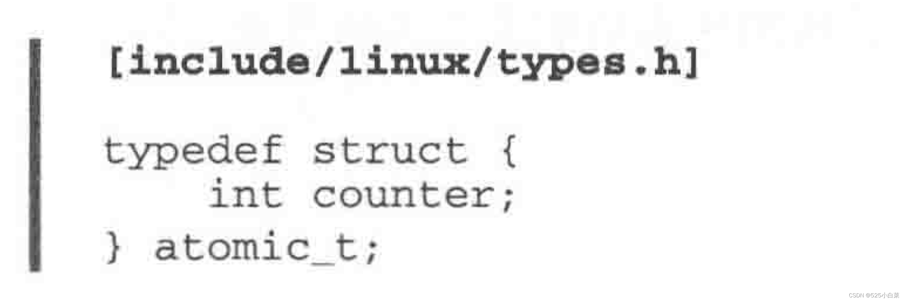
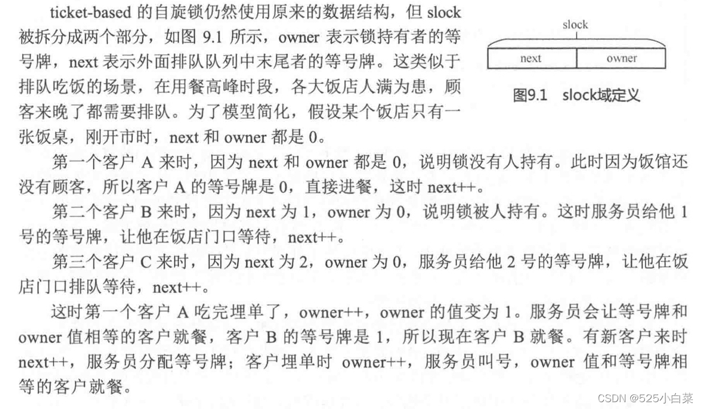
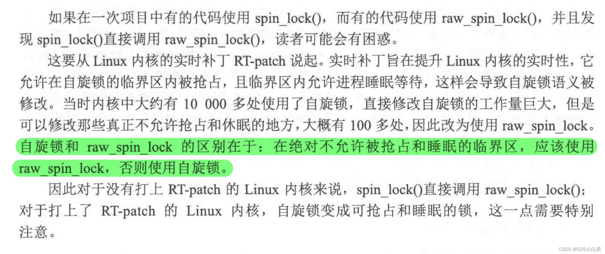
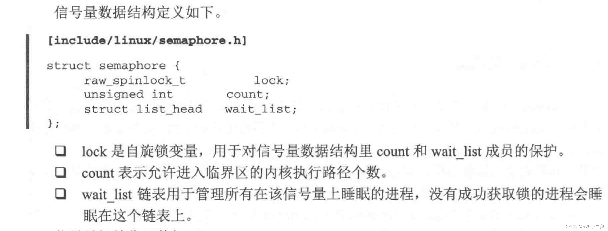
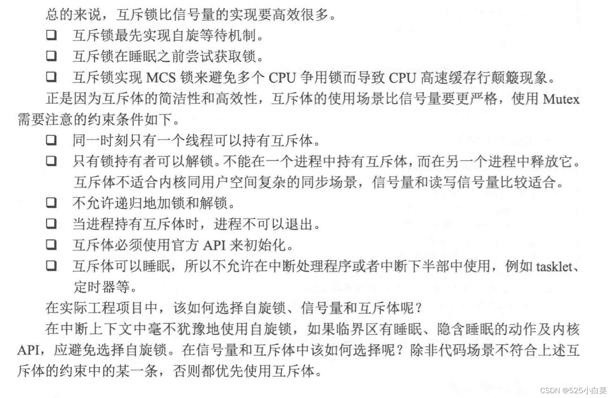

# 《奔跑吧Linux内核（第二版）》第十章笔记

## 临界区与并发访问

在早期不支持 [SMP](https://so.csdn.net/so/search?q=SMP&spm=1001.2101.3001.7020) 对称多处理器的 Linux 内核中，导致并发访问的因素是中断服务程序，只有在中断发生时，或者内核代码路径显式地要求重新调度并且执行另一个进程时，才有可能发生并发访问。在支持 SMP 对称多处理器的 Linux 内核中，并发运行在不同 CPU 中的内核线程完全有可能在同一时刻并发访问共享数据，并发访问随时可能发生。特别是现在的 Linux内核已经支持内核抢占（进程即使陷入内核态也可以被抢占），调度器可以抢占正在运行的进程，重新调度其他进程来执行。

在计算机术语中，临界区是指访问和操作共享数据的代码段，这些资源无法同时被多个执行线程访问，也就是说在临界区内不能有多个并发源同时执行，整个临界区就像一个不可分割的整体。

在[内核](https://so.csdn.net/so/search?q=%E5%86%85%E6%A0%B8&spm=1001.2101.3001.7020)中产生并发访问的并发源主要有如下4种

-   中断和异常：中断发生后，中断处理程序和被中断的进程之间有可能产生并发访问。
-   软中断和 tasklet：中断下半部（软中断或者 tasklet ）可能随时被调度执行，从而打断当前正在执行的进程上下文。
-   内核抢占：调度器支持可抢占特性，会导致进程和进程之间的并发访问。
-   多处理器并发执行：多处理器上可以同时运行多个进程。

上述情况需要将单核和多核系统区别对待。

对于单处理器的系统，主要有如下并发源：

-   中断处理程序可以打断软中断、tasklet 和进程上下文的执行。
-   软中断和 tasklet 之间不会并发，但是可以打断进程上下文的执行。
-   在支持抢占的内核中，进程上下文之间会产生并发。
-   在不支持抢占的内核中，进程上下文之间不会产生并发。

对于 SMP 系统，情况会更为复杂：

-   同一类型的中断处理程序不会并发，但是不同类型的中断有可能被送到不同的 CPU，因此不同类型的中断处理程序可能存在并发执行。
-   同一类型的软中断会在不同的 CPU 上并发执行。
-   不同类型的 tasklet 是串行执行的，不会在多个CPU 上并发。
-   不同CPU 上的进程上下文会并发。

在实际工程中，真正困难的是如何发现内核代码存在并发访问的可能性，并采取有效的保护措施。究竟什么样的数据需要被保护呢？

-   除了当前内核代码路径外，是否还有其他内核代码路径会访问它？例如中断处理程序、工作者（worker）处理程序、tasklet 处理程序、软中断处理程序等。
-   当前内核代码路径访问该资源数据时被抢占，被调度执行的进程会不会访问该数据？
-   进程会不会睡眠阻塞等待该资源？

## [Linux](https://so.csdn.net/so/search?q=Linux&spm=1001.2101.3001.7020)内核提供了多种并发访问的保护机制

### 1、原子操作（针对临界区只是一个变量）

Linux 内核提供了 atomic\_t类型的原子变量，它的实现依赖于具体架构是否提供了原子操作的汇编指令。atomic\_t类型的具体定义如下：  
atomic\_t类型的原子操作函数实现了操作的原子性和完整性，在内核看来，原子操作函数就像一条汇编语句，保证了操作不会被打断。因此，处理器必须提供原子操作的汇编指令来完成上述操作，比如 ARM64 处理器提供cas 指令，x86 处理器提供 cmpxchg 指令。

**内存屏障**：编译器的代码优化有可能引起指令重排，进而影响代码执行顺序，故引入内存屏障。

### 2、自旋锁（属于忙等待 自旋锁的临界区内不能睡眠）

如果临界区只是一个变量，那么原子变量可以解决问题。但是临界区大多是一个数据操作的集合，例如先从一个数据结构中移出数据，对其进行数据解析，再写回到该数据结构或者其他数据结构中，类似“read->modify->write”〞 操作；再比如临界区是一个链表操作等。  
整个执行过程需要保证原子性，在数据被更新完牛前，不能有其他内核代码路径访问和改写这些数据。这个过程使用原子变量显得不合适，需要锁机制来完成。自旋锁 (spinlock）是Linux 内核中最常见的锁机制。

自旋锁同一时刻只能被一个内核代码路径持有，如果有另一个内核代码路径试图获取一个已经被持有的自旋锁，那么该内核代码路径需要一直忙等待，直到锁持有者释放了该锁。如果该锁没有被别人持有（或争用），那么可以立即获得该锁。自旋锁的特性如下。

-   忙等待的锁机制。操作系统中锁的机制分为两类，  
    一类是忙等待，另一类是睡眠等待。自旋锁属于前者，当无法获取自旋锁时会不断尝试，直到获取锁为止。
-   同一时刻只能有一个内核代码路径可以获得该锁。
-   要求自旋锁持有者尽快完成临界区的执行任务。如果临界区执行时间过长，在锁外面忙等待的 CPU 比较浪费，特别是自旋锁临界区里不能睡眠。
-   自旋锁可以在中断上下文中使用。（中断上下文是不能出现忙等或睡眠状态的）

刚刚释放锁的 CPU 的L1 缓存中存储了该锁，它比别的 CPU 更快获得锁，这对于那些己经等待很久的 CPU 是不公平的。为此在 Linux 2.6.25  
内核后，自旋锁实现了一套名为“FIFO ticket-based” 算法的自旋锁机制，本书称之为排队自旋锁。  
排队自旋锁有可能导致CPU缓存行颠簸，解决方法：MCS算法。

#### 自旋锁的变种

当处于临界区时发生了外部硬件中断，此时系统暂停当前进程的执行而转去处理该中断。假设中断处理程序恰巧也要操作该链表，链表的操作是一个临界区，那么在操作之前要调用 spin lockO两数对该链表进行保护。中断处理函数试图去获取该自旋锁，但因为它己经被别人持有了，导致中断处理函数进入忙等待状态或者睡眠状态。在中断上下文出现忙等待或者睡眠状态是致命的，中断处理程序要求“短”和“快”，锁的持有者因为被中断打断而不能尽快释放锁，而中断处理程序一直在忙等待锁，从而导致死锁的发生。Linux 内核的自旋锁的变种 spin lock irg0函数在获取自旋锁时关闭本地CPU 中断，可以解决该问题。

既然关闭了本地 CPU 的中断，那么别的 CPU 依然可以响应外部中断，会不会也有可能死锁呢？持有锁者在 CPU0 上，CPU1 响应了外部中断且中断处理函数同样试图去获取该锁，因为 CPUO 上的锁持有者也在继续执行，所以它很快会离开临界区并释放锁，这样CPU1 上的中断处理函数可以很快获得该锁。

使用自旋锁的重要原则是：**拥有自旋锁的临界区代码必须是原子执行，不能休眠和主动调度**。

自旋锁还有另一个常用的变种 spin\_lock\_bh() 函数，用于处理进程和延迟处理机制导致的并发访问的互斥问题。

#### 自旋锁和raw\_spin\_lock

### 3、信号量（睡眠等待）

信号量（semaphore）是操作系统中最常用的同步原语之一。自旋锁是实现一种忙等待的锁，信号量则允许进程进入睡眠状态。简单来说，信号量是一个计数器，它支持两个操作原语，即P和V操作。P和V取自荷兰语中的两个单词，分别表示减少和增加，后来美国人把它改成 down 和up，现在 Linux 内核里也叫这两个名字。  
信号量有一个有趣的特点，它可以同时允许任意数量的锁持有者。信号量初始化函数为sema init(struct semaphore \*sem, int count)，其中count 的值可以大于等于1。当count 大于1时，表示允许在同一时刻至多有count 个锁持有者，操作系统书中把这种信号量叫作计数信号量;当count 等于1时，同一时刻仅允许一个人持有锁，操作系统书中把这种信号量称为互斥信号量或者二进制信号量。在Linux 内核中，大多使用count 计数为1的信号量。相比自旋锁，信号量是一个允许睡眠的锁。信号量适用于一些情况复杂、加锁时间比较长的应用场景，例如内核与用户空间复杂的交互行为等。

### 4、互斥锁

在Linux 内核中，还有一个类似信号量的实现叫作互斥锁(Mutex）。信号量是在并行处理环境中对多个处理器访问某个公共资源进行保护的机制，互斥锁则用于互斥操作。

互斥锁从作用上讲就是count为1的信号量，只不过实现方式比较简单，互斥锁可以睡眠。

既然互斥体类似count 计数等于 1的信号量，为什么内核社区要重新开发互斥体，而不是复用信号量的机制呢？

信号量在 Linux 内核中的实现没有任何问题，但是互斥体的语义相对于信号量要简单、轻便一些，在锁争用激烈的测试场景下，互斥体比信号量执行速度更快，可扩展性更好。另外，互斥体数据结构的定义比信  
号量小。

互斥锁也有一种自旋等待机制。自旋等待机制的核心原理如下：

当发现持有锁者正在临界区执行并且没有其他优先级高的进程要被调度时，那么当前进程坚信锁持有者会很快离开临界区并释放锁，因此与其睡眠等待不如乐观地自旋等待，以减少睡眠唤醒的开销。在实现自旋等待机制时，内核实现了一套MCS 锁机制来保证只有一个人自旋等待持锁者释放锁。

### 5、读写锁（适用于读写着问题的专用锁）

上述介绍的信号量有一个明显的缺点——没有区分临界区的读写属性。读写锁通常允许多个线程并发地读访问临界区，但是写访问只限制于一个线程。读写锁能有效地提高并发性，在多处理器系统中允许同时有多个读者访问共享资源，但写者是排他的，读写锁具有如下特性。

-   允许多个读者同时进入临界区，但同一时刻写者不能进入。
-   同一时刻只允许一个写者进入临界区。
-   读者和写者不能同时进入临界区。

读写锁有两种，分别是自旋锁类型和信号量类型。

### 6、RCU

RCU 的全称是read-copy-update，是Linux 内核中一种重要的同步机制。

RCU 机制要实现的目标是希望读者线程没有同步开销，或者说同步开销变得很小，甚至可以忽略不计，不需要额外的锁，不需要使用原子操作指令和内存屏障，即可畅通无阻地访问；而把需要同步的任务交给写者线程，写者线程等待所有读者线程完成后才会把旧数据销毁。在RCU 中，如果有多个写者同时存在，那么需要额外的保护机制。  
1）读者可以一块读  
2）可以读者读的同时，写者写  
3）写者不能一块写

RCU 机制的原理可以概括为 RCU 记录了所有指向共享数据的指针的使用者，当要修改该共享数据时，首先创建一个副本，并在副本中修改。所有读访问线程都离开读临界区之后，使用者的指针指向新修改后的副本，并且删除旧数据。

## 参考

[《奔跑吧Linux内核（第二版）》第十章笔记-CSDN博客](https://blog.csdn.net/weixin_51760563/article/details/122915390)