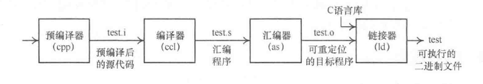
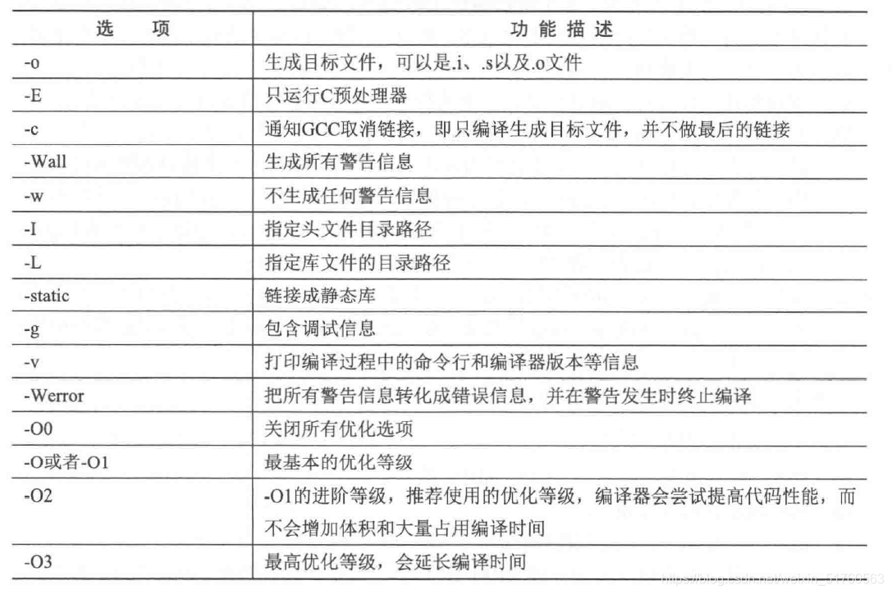
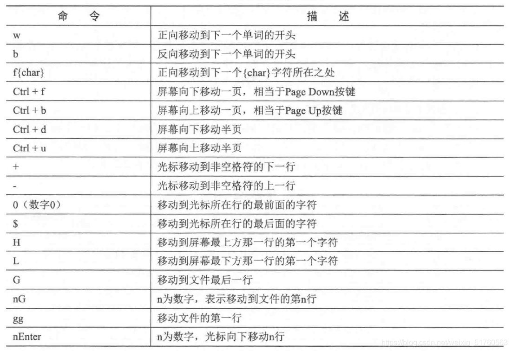
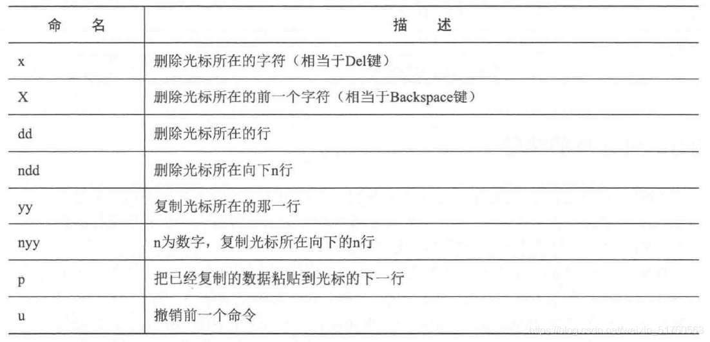

## GCC与[交叉编译](https://so.csdn.net/so/search?q=%E4%BA%A4%E5%8F%89%E7%BC%96%E8%AF%91&spm=1001.2101.3001.7020)

### 1.GCC简介

GCC（GNU Compiler Collection）编译器在1987年发布了第一个C语言版本，它是用GPL许可证发行的自由软件，也是GNU计划的关键部分。GCC现在是GNU Linux操作系统的默认编译器，同时也被很多自由软件采用。GCC在后续的发展过程中，扩展支持了很多的编程语言，如C++、Java、Go等语言。另外，GCC还支持多种不同的硬件平台，如x86、ARM等体系结构。

GCC的编译流程主要分成4个步骤。

-    预处理（Pre-Process）
-    编译（Compile）
-    汇编（Assemble）
-    链接（Link）

  
如图所示，用C语言编写test程序的源代码test.c。首先进入GCC的预处理器（cpp）进行预处理，把头文件、宏等进行展开，生成test.i文件。接下来，进入GCC的编译器，由于GCC可以支持多种编程语言，这里调用C语言的编译器ccl，编译完成之后生成汇编程序，输出test.s文件。在汇编阶段，GCC调用汇编器（as）进行汇编，生成可重定位的目标程序。最后一步是链接，GCC调用链接器把所有目标文件和C语言的标准库链接成可执行的二进制文件。

链接阶段会对编译好的二进制文件进行链接，这里会默认链接C语言标准库（libc）。链接过程会把程序的目标文件和所需的库文件链接起来，最终生成可执行文件。

Linux的库文件分成两大类：一类是动态链接库（通常以.so结尾），另一类是静态链接库（通常以.a结尾）。

> `静态链接`：在链接阶段，将源文件中用到的库函数与汇编生成的目标文件.o合并生成可执行文件。这种链接方式的好处是：方便程序移植，因为可执行程序与库函数再无关系，放在任何环境当中都可以执行。但缺点是：文件太大。  
> `动态链接`：动态链接库不是执行程序的一部分，而是根据执行程序需要按需装入，同时其执行代码可在多个执行程序间共享。启动多个应用程序的时候，只需要将动态库加载到内存一次即可。动态库在内存中只存在一份拷贝，避免了浪费空间的问题。但是动态链接有一个缺点就是可移植性太差，使用动态链接库的程序必须将动态链接库部署到相应的环境中，若动态链接库不存在，程序必然会报错！如果两台电脑运行环境不同，动态库存放的位置不一样，很可能导致程序运行失败。

在默认情况下，GCC在链接时优先使用动态链接库，只有当动态链接库不存在时才使用静态链接库。下面使用"–static"来让test程序静态链接C语言标准库，原因是交叉工具链使用的libc的动态库和QEMU中使用的库可能不一样。如果使用动态链接，可能导致运行报错。

### 2\. 交叉编译

GCC具有良好的可扩展性，除了可以编译x86体系结构的二进制程序外，还可以支持很多其他体系结构的处理器，如ARM，MIPS、RISC-V等。这里涉及两个概念，一个是本地编译，另一个是交叉编译。

-    本地编译：在当前目标平台编译出来的程序，并且可以运行在当前平台上。
-    交叉编译：在一种平台上编译，然后放到另一种平台上运行，这个过程称为交叉编译。之所以有交叉编译，主要是因为嵌入式系统的资源有限，不适合在嵌入式系统中进行编译，如早期ARM处理器性能低下，要编译一个完整的Linux系统是不现实的。因此，首先会在某个高性能的计算机上编译出能在ARM处理器运行的Linux二进制文件，然后烧录到ARM系统中运行。
-    交叉工具链：交叉工具链不只是GCC，还包含binutils，glibc等工具组成的综合开发环境，可以实现编译、链接等功能。在嵌入式环境中，通常使用uclibc等小型的C语言库。

> `binutils` 提供了一系列用来创建管理和维护二进制目标文件的工具程序，通常它与GCC是紧密结合在一起的，没有它GCC不能正常工作。  
> `glibc` 是gnu发布的libc库，glibc是Linux系统中最底层的API，几乎其他的运行库都会依赖于glibc。

交叉工具链的命名规则一般如下：  
`[arch] [-os] [-(gn)eabi]`

-    arch：表示目标体系结构，如ARM，MIPS等
-    os：表示目标操作系统。
-    eabi：嵌入式应用二进制接口。

许多Linux发行版提供了编译好的用于ARM64 GCC的工具链。

-    arm-linux-gnueabi：主要用于基于ARM32架构的Linux系统，可以用来编译ARM32架构的u-boot，Linux内核以及Linux应用程序等。ubuntu 20.04系统中提供了GCC7，GCC8、GCC9以及GCC10等多个版本。
-    aarch-linux-gnueabi：主要用于基于ARM64架构的Linux系统。
-    arm-linux-gnueabinf：hf指的是支持硬件浮点（Hard Float）的ARM处理器。在之前的一些ARM处理器中不支持硬件浮点单元，所以由软件浮点来实现。但是最新的一些高端ARM处理器内置了硬件浮点单元，这样新旧两种架构的差异就产生了两个不同的EABI接口。

### 3\. GCC编译选项

GCC编译的一般格式：

`gcc [选项] 源文件 [选项] 目标文件`

GCC的常用选项如表所示。  

## Vim工具的使用

Vim是Linux开源操作系统中最著名的代码编辑器之一，并且拥有众多插件，使用Vim工具一样可以打造出堪比Source Insight的功能。Vim的设计理念是整个文本编辑使用键盘来操作，而不需要使用鼠标，键盘的每个键都有用处。

### Vim的基本模式

Vim编辑器有3种工作模式，分别是命令模式（Command mode）、输入模式（Insert mode）  
和底行命令模式（Last line mode）。

-    命令模式：用户打开Vim时便进入命令模式。在命令模式下输入的键盘动作会被Vim识别成命令，而非输入字符。比如这时输入`i`，Vim识别的是一个`i`命令。用户可以输入命令来控制屏幕光标的移动、文本的删除或者复制某段区域等，也可以进入底行模式或者插入模式。
-    插入模式：在命令模式下输入`i`；命令就可以进入插入模式，按`Esc`键可以回到命令行模式。要想在文本中输入字符，必须是在插入模式下。
-    底行模式：在命令模式下按下`:`就进入底行模式。在底行模式下可以输入单个或者多个字符的命令。比如`:q`表示退出Vim编辑器。

### 命令模式下常用命令

Vim的强大之处在于它的命令模式。所以越熟悉Vim，就会在插入模式上花费越少的时间。

##### 光标移动

Vim编辑器放弃使用键盘的箭头键，而使用h、j、k、l来实现左、下、上、右箭头的功能，这样就不用频繁地在箭头键和字母键之间来回移动，从而节省时间。另外，在h、j，k，l命令前面可以添加数字，比如9j表示向下移动9行。

常见的光标移动命令如表所示。  

##### 复制、删除、粘贴

##### 查找和替换

## 实验

1、配置Vim成为强大的IDE编辑工具  
2、本地创建git仓库并推送至远程仓库

## 参考

[《奔跑吧Linux内核（第二版）》第二章笔记_奔跑吧linux内核第二版 pdf-CSDN博客](https://blog.csdn.net/weixin_51760563/article/details/119852757)