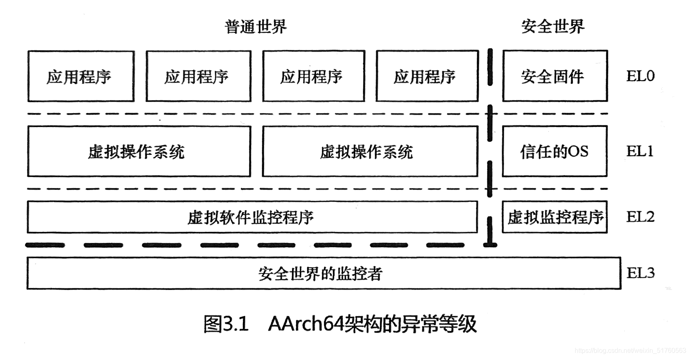
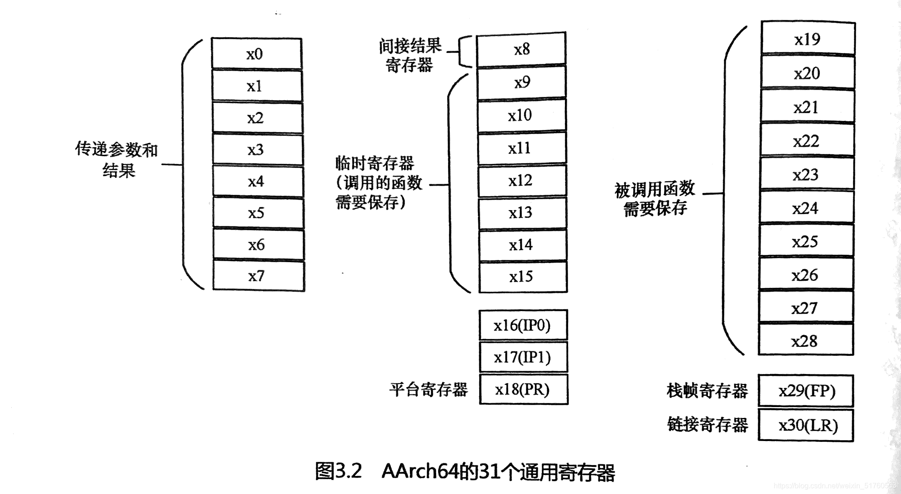
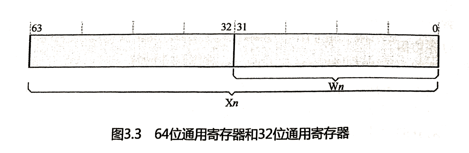
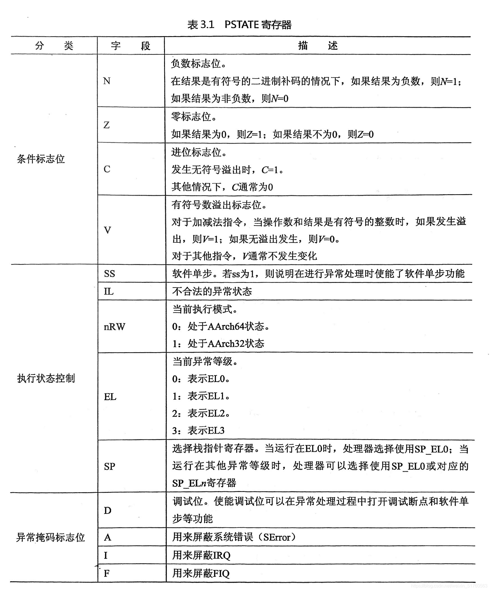
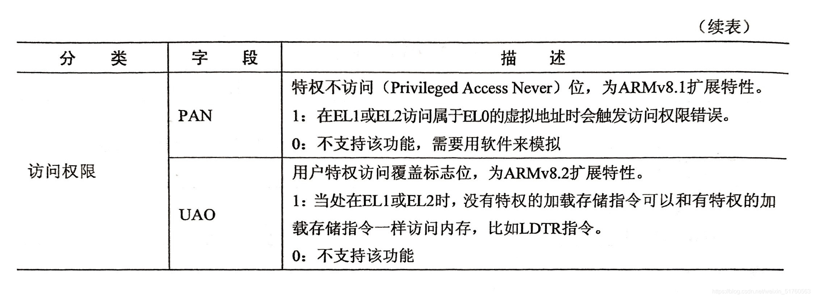
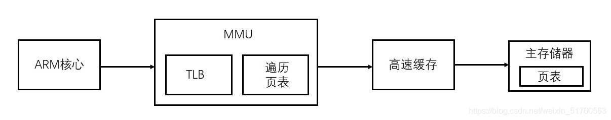

# 《奔跑吧Linux内核（第二版）》第三章笔记

## [ARM](https://so.csdn.net/so/search?q=ARM&spm=1001.2101.3001.7020)架构基础知识

ARM公司除了提供处理器IP和配套工具外，主要还定义了一系列的ARM兼容指令集来构建整个ARM的软件生态系统。

到了ARMv7指令集，处理器以Cortex命名，又分成A、R和M系列，通常A系列针对大型嵌入式系统（例如手机），R系列针对实时性系统，M系列针对单片机市场。Cortex-A7、Cortex-A9处理器是前几年手机的主流配置，是32位处理器。虚拟化和安全特性在ARMv7上已经实现。

ARMv8-A是ARM公司发布的第一代支持64位处理器的指令集和[架构](https://so.csdn.net/so/search?q=%E6%9E%B6%E6%9E%84&spm=1001.2101.3001.7020)。它在扩充64位寄存器的同时，提供对上一代架构指令集的兼容，通过定义AArch32与AArch64两套运行环境来分别运行64位和32位指令集，因而能同时提供运行32位和64位应用程序的执行环境。AArch32也称ARM32，AArch64也称ARM64。

常见的ARMv8处理器：Cortex-A53、Cortex-A57、Cortex-A72。

### ARMv8-A架构中的基本概念

1.  处理单元

ARM公司的官方技术手册中提到了一个概念，可以把处理器处理事务的过程抽象为处理单元（Processing Element，PE）。

2.  执行状态

执行状态（execution state）是处理器运行时的环境，包括寄存器的位宽、支持的指令集、异常模型、内存管理以及编程模型等。ARMv8架构定义了两种执行模式。

-    AArch64：64位的执行状态
    -    提供31个64位的通用寄存器
    -    提供64位的程序计数（PC）寄存器、栈指针（SP）寄存器以及异常链接寄存器（ELR）
    -    提供A64指令集
    -    定义ARMv8异常模型，支持4个异常等级——EL0~EL3
    -    提供64位的内存模型
    -    定义一组处理器状态（PSTATE）用来保存PE的状态
-    AArch32：32的执行状态
    -    提供13个32位的通用寄存器，再加上PC寄存器、SP寄存器、链接寄存器（LR）
    -    支持两套指令集，分别是A32和T32指令集（Thumb指令集）。
    -    支持ARMV7-A异常模型，基于PE模式并映射到ARMv8的异常模型。
    -    提供32位的虚拟内存访问机制。
    -    定义一组处理器状态（PSTATE）用来保存PE的状态。

3.  ARMv8指令集

ARMv8架构根据不同的执行状态提供对不同指令集的支持。

-    A64指令集：运行在AArch64状态，提供64位指令集支持。
-    A32指令集：运行在AArch32状态，提供32位指令集支持。
-    T32指令集：运行在AArch32状态，提供16和32位指令集支持。

4.  系统寄存器命名

在AArch64状态下，很多系统寄存器会根据不同的异常等级提供不同的变种寄存器。

`<register_name>_ELx，where x is 0，1，2，or 3`

比如，SP\_EL0表示EL0下的栈指针寄存器，SP\_EL1表示EL1下的栈指针寄存器。

5.  异常等级

AArch64架构的异常等级（exception level）确定了处理器当前运行的特权级别，类似于ARMv7架构中的特权等级，如图所示。  

-    EL0：用户特权，用于运行普通用户程序。
-    EL1：系统特权，通常用于运行操作系统。
-    EL2：运行虚拟化扩展的虚拟监控程序（hypervisor）
-    EL3：运行安全世界中的安全监控器（secure monitor）

6.  ARMv8架构支持的数据宽度

-    字节：8位
-    半字：16位
-    字：32位
-    双字：64位
-    4字：128位

7.  不对齐访问

不对齐访问有两种情况。一种是指令对齐，另一种是数据对齐。A64指令集要求指令存放的位置必须以字（word，32位宽）为单位对齐。访问存储位置不是以字为单位对齐的指令会导致PC对齐异常（PC aligment fault）。

对于数据访问，需要区分不同的内存类型。对内存类型是设备内存的不对齐访问会触发对齐异常（alignment fault）。

对于访问普通内存，除了使用独占。加载/独占-存储（load-exclusive/store-exchusive）指令或加载-获取/存储-释放（load-acquire/store-release）指令外，还这可使用其他的用于加载或存储单个或多个寄存器的所有指令。如果访问地址和要访问的数据元素大小不对齐，那么可以根据以下两种情况进行处理。

-    若对应的异常等级中的SCTLR-ELx寄存器的A域设置为1，则说明打开了地址对齐检查功能，因而会触发对齐异常。
-    若对应的异常等级中的SCTLR ELx寄存器的A域设置为0，则说明处理器支持不对齐访问。

当然，处理器支持的不对齐访问也有一些限制。

-    不能保证单次访问原子地完成，有可能复制多次
-    不对齐访问比对齐访问需要更多的处理时间
-    不对齐的地址访问可能会引发中止（abort）

8.  通用寄存器

AArch64运行状态支持31个64位的通用寄存器，分别是x0-x30寄存器，而AArch32运行状态支持16个32位的通用寄存器。

通用寄存器除了用于数据运算和存储之外，还可以在函数调用过程中起到特殊作用。ARM64架构的函数调用标准和规范对此有所约定，如图所示。  
  
在AArch64运行状态下，使用X来表示64位通用寄存器，比如X0、X30等。另外，还可以使用W来表示低32位的寄存器，比如W0表示X0寄存器的低32位数据，W1表示X1寄存器的低32位数据，如图所示。

9.  状态寄存器  
      
    
10.  特殊寄存器

-    零寄存器  
    ARMv8架构提供两个零寄存器，这两个零寄存器的内容全是0，可以用作源寄存器，也可以用作目标寄存器。WZR是32位的零寄存器，XZR是64位的零寄存器。
-    栈指针寄存器  
    ARMv8架构支持4个异常等级，每一个异常等级都有专门的SP\_ELn寄存器。当处理器处于比EL0高的异常等级时，可以将SP\_EL0当作临时寄存器。但运行在EL0时，只能使用SP\_EL0寄存器。
-    PC寄存器  
    用来指向当前运行指令的下一条指令的地址。
-    异常链接寄存器  
    异常链接寄存器（ELR）用来存放异常返回的地址。
-    保存处理器状态寄存器  
    当我们进行异常处理时，处理器的处理状态会保存到保存处理器状态寄存器（SPSR）里。当异常将要发生时，处理器会把处理器状态寄存器（PSTATE）的值暂时保存到SPSR里，当异常处理完成并返回时，再把SPSR中的值恢复到处理器状态寄存器中。
-    CurrentEL寄存器  
    PSTATE寄存器中的EL字段保存了当前异常等级。使用MRS可以读取当前异常等级。

11.  系统寄存器

可以通过访问和设置这些系统寄存器来完成对处理器不同功能的配置。ARMv8支持以下七大类的系统寄存器：

通用系统控制寄存器、调试寄存器、性能监控寄存器、活动监控寄存器、统计扩展寄存器、RAS寄存器、通用定时器寄存器。

12.  A64指令集

A64指令集和A32指令集是不兼容的，它们是两套完全不一样的指令集架构，它们的指令编码也不一样。需要注意的是，A64指令集的指令为32位宽，而不是64位宽。

具体指令集详见书上85~94页。

13.  ARM64异常处理

在ARMv8架构中，中断是异常的一种。

同步异常是指处理器需要等待异常处理的结果，然后再继续处理后面的指令。  
异步异常是指处理器正在处理的指令和中断完全没有关系。

当CPU检测到异常后，CPU会自动做如下一些事情。

-    将处理器状态寄存器PSTATE保存到对应目标异常等级的SPSR\_ELx中。
-    将返回地址保存在对应目标异常等级的ELR\_ELx中。
-    把PSTATE寄存器里的DAIF域都设置为1，这相当于把调试异常、系统错误（SError）、IRQ以及FIQ都关闭了。PSTATE寄存器是ARMv8里新增的寄存器。
-    如果出现同步异常，那么究竟是什么原因导致的呢？具体原因需要查看ESR\_ELx。
-    设置栈指针，指向对应目标异常等级下的栈，自动切换SP到SP\_ELx。
-    CPU处理器会从异常发生现场的异常等级切换到对应目标异常等级，然后跳转到异常向量表并执行。

上述是ARMv8处理器检测到异常发生后自动做的事情。操作系统需要做的事情是从中断向量表开始，根据异常发生的类型，跳转到合适的异常向量表。异常向量表中的每项会保存一个异常处理的跳转函数，然后跳转到恰当的异常处理函数并处理异常。

当操作系统的异常处理完成后，执行一条eret指令即可从异常返回。这条指令会自动完成如下工作。

-    从ELR\_ELx中恢复PC指针。
-    从SPSR\_ELx恢复处理器的状态。

中断处理过程是在中断关闭的情况下进行的，那么中断处理完成后，应该在什么时候把中断打开呢？

当中断发生时，CPU会把PSTATE寄存器中的值保存到对应目标异常等级的SPSR\_ELx中，并且把PSTATE寄存器里的DAIF域都设置为1，这相当于把本地CPU的中断关闭了。

当中断完成后，操作系统调用eret指令以返回中断现场，此时会把SPSR\_ELx恢复到PSTATE寄存器中，这就相当于把中断打开了。

ARMv8架构的异常向量表每一个表项需要128字节，这样可以存放32条指令。异常向量表存放的基地址可以通过VBAR（Vector Base Address Register）来设置。VBAR是异常向量表的基地址寄存器。

14.  ARM64内存管理

页表查询的过程由硬件自动完成，但是页表的维护需要由软件完成。  
  
AArch64架构中的MMU不仅支持单一阶段的地址转换，还支持虚拟化扩展中的两阶段页表转换。

在AArch64架构中，因为地址总线位宽最多支持48位，所以虚拟地址被划分为两个空间，每个空间最多支持256TB。

-    低位的虚拟地址空间位0x0000000000000000~0x0000FFFFFFFFFFFF。如果虚拟地址的最高位等于0，那就使用这个虚拟地址空间，并且使用TTBR0\_ELx来存放页表的基地址。
-    高位的虚拟地址空间介于0xFFFF000000000000~0xFFFFFFFFFFFFFFFF。如果虚拟地址的最高位等于1，那就使用这个虚拟地址空间，并且使用TTBR1\_ELx来存放页表的基地址。

## 参考

[《奔跑吧Linux内核（第二版）》第三章笔记_奔跑吧linux内核 第2版 pdf-CSDN博客](https://blog.csdn.net/weixin_51760563/article/details/119883632)