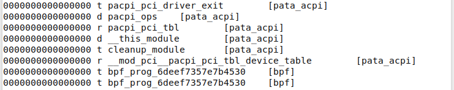

# 《奔跑吧Linux内核（第二版）》第五章笔记

[Linux](https://so.csdn.net/so/search?q=Linux&spm=1001.2101.3001.7020)内核采用宏内核架构，即操作系统的大部分功能都在内核中实现，比如进程管理、内存管理、进程调度、设备管理等，并且都在特权模式下（内核空间）运行。而与之相反的另一种流行的架构是微内核架构，它把操作系统最基本的功能放入内核中，而其他大部分的功能（如设备驱动等）都放到非特权模式下，这种架构有天生优越的动态扩展性。

内核模块全称Loadable Kernel Module（LKM）。在内核运行时加载一组目标代码来实现某个特定的功能，这样在实际使用Linux的过程中可以不需要重新编译内核代码来实现动态扩展。

Linux内核通过内核模块来实现动态添加和删除某个功能。

### 简单的模块代码

    #include <linux/init.h>
    #include <linux/module.h>
     
    static int __init my_test_init(void)
    {
         printk("my first kernel module init\n");
         return 0;
    }
      
    static void __exit my_test_exit(void)
    {
         printk("goodbye\n");
    }
     
    module_init(my_test_init);
    module_exit(my_test_exit);
    
    MODULE_LICENSE("GPL");
    MODULE_AUTHOR("rlk");
    MODULE_DESCRIPTION("my test kernel module");
    MODULE_ALIAS("mytest");

第1行和第2行包含了两个Linux内核的头文件，其中<inux/init.h>头文件对应的是内核源代码的include/inux/init.h文件，在这个头文件中包含了第14行和第15行中的module\_inito() 和module\_exit() 函数的声明。<linux/module.h>头文件对应的是内核源代码的include/inux/module.h文件，包含了第18-21行的MODULE\_AUTHOR()这些宏的声明。

第15行的module init()告诉内核这是该模块的入口。

第16行的module\_exit()宏告诉内核这个模块的退出函数是my\_test\_exit()。

第4-8行是该内核模块初始化函数，这个函数在内核模块被加载时运行，可以使用insmod命令来加载一个内核模块。

第10-13行是该内核模块的退出函数，该函数在模块被卸载时自动运行，可以使用rmmod命令卸载一个内核模块。

第18-21行，MODULE\_LICENSE()表示这个模块代码接受的软件许可协议。MODULE\_AUTHOR()用来描述该模块的作者信息，可以包括作者的姓名和邮箱等。MODULE\_DESCRIPTION()用来简单描述该模块的用途或者功能介绍。MODULE\_ALIAS()为用户空间提供一个合适的别名。

下面我们来看编译这个内核模块的Makefile文件。

    BASEINCLUDE ?= /lib/modules/`uname -r`/build
    
    mytest-objs := my_test.o
    obj-m  := mytest.o
    
    all : 
          $(MAKE) -C $(BASEINCLUDE) M=$(PWD) modules;
    
    clean:
          $(MAKE) -C $(BASEINCLUDE) M=$(PWD) clean;
          rm -f *.ko;

第1行的BASEINCLUDE指向正在运行Linux的内核编译目录，通过"uname -r"命令可以找到对应的内核版本。

第3行表示该内核模块需要哪些目标文件，格式是：  
<模块名>-objs := <目标文件>.o

第4行表示要生成的模块。注意，模块名字不能和目标文件名相同。格式是：  
obj-m := <模块名>.o

第6-7行表示要编译执行的动作。  
这里的$(MAKE)就相当于make，-C 选项的作用是指将当前工作目录转移到你所指定的位置。“M=”选项的作用是，当用户需要以某个内核为基础编译一个外部模块的话，需要在make modules 命令中加入“M=dir”，程序会自动到你所指定的dir目录中查找模块源码，将其编译，生成KO文件。

第9-11行表示执行make clean需要的动作。

### 编译模块

在终端中输入`make`命令执行编译，编译完成之后会生成mytest.ko文件。  

### 安装模块

接下来就可以安装我们的模块：  

你会发现没有输出，别着急，因为例子中的输出函数printk()的默认输出等级，可以使用dmesg命令查看内核的打印信息。

  
另外，你可以通过1smod命令查看当前mytest模块是否已经被加载到系统中，它会显示模块之间的依赖关系。

加载模块之后，系统会在/sys/modules目录下新建一个目录，比如对于mytest模块会建一个名为mytest的目录。  

### 卸载模块

可以通过rmmod卸载模块  
  

### 模块参数

内核模块作为一个可扩展的动态模块，为Linux内核提供了灵活性。但是有时我们需要根据不同的应用场景给内核模块传递不同的参数。

##### 1\. 参数声明及初始化

如果需要向内核模块传递参数，该参数必须事先在模块代码中声明及初始化：

    module_param(name,type,perm);
    MODULE_PARM_DESC(parm,desc);

module\_param()宏由3个参数组成，name表示参数名，type表示参数类型，perm表示参数的读写等权限。参数类型可以是byte，short，ushort，int，uint，long，ulong，char和bool等类型。perm指定在sysfs中相应文件的访问权限，如设置为0表示不会出现在sysfs文件系统中；如设置成S\_IRUGO（0444）可以被所有人读取，但是不能修改；如设置成S\_IRUGO|S\_IWUSR（0644），说明可以让root权限的用户修改这个参数。

MODULE\_PARM\_DESC()宏为这个参数的简单说明。

例如上面的模块添加参数a，代码如4~6行所示，第11行将该参数打印出来

    #include <linux/init.h>
    #include <linux/module.h>
     
    static int a = 100; 
    module_param (a, int, 0644); 
    MODULE_PARM_DESC(a, "test for module parameter");
    
    static int __init my_test_init(void)
    {
         printk("my first kernel module init\n");
         printk("module parameter=%d\n", a);
         return 0;
    }
      
    static void __exit my_test_exit(void)
    {
         printk("goodbye\n");
    }
     
    module_init(my_test_init);
    module_exit(my_test_exit);
    
    MODULE_LICENSE("GPL");
    MODULE_AUTHOR("rlk");
    MODULE_DESCRIPTION("my test kernel module");
    MODULE_ALIAS("mytest");

编译和加载上面的模块之后，通过dmesg查看内核登录信息，会发现输出a的值为默认值100。

##### 2\. 调用模块参数

当通过"insmod mymodule.ko a=200”命令来加载模块时，可以看到终端dmsg输出为：

##### 3\. 查看模块参数

在`/sys/module/XXXXX/parameters`目录下面可以看到模块参数。

### 符号共享

我们在为一个设备编写驱动程序时，会把驱动按照功能分成好几个内核模块，这些内核模块之间有一些接口函数需要相互调用，这怎么实现呢？Linux内核为我们提供两个宏来解决这个问题。

    EXPORT_SYMBOL()
    EXPORT_SYMBOL_GPL()

EXPORT\_SYMBOL()把函数或者符号对全部内核代码公开，也就是将一个函数以符号的方式导出给内核中的其他模块使用。  
其中，EXPORT\_SYMBOL\_GPL()只能包含GPL许可的模块，内核核心的大部分模块导出来的符号都是使用GPL这种形式的。如果要使用EXPORT\_SYMBOL\_GPL()导出函数，那么需要显式地通过模块申明为"GPL"，如MODULE\_LICENSE（“GPL”）。

内核导出的符号表可以通过 `cat /proc/kallsyms`来查看。

其中，第1列显示的是该符号在内核地址空间的地址；第2列是符号属性，比如T表示该符号在text段中；第3列表示符号的字符串，也就是EXPORT\_SYMBOL()导出来的符号；第4列显示哪些内核模块在使用这些符号。

### 内核模块结构总结

-    模块加载函数：加载模块时，该函数会被自动执行，通常做一些初始化工作。
-    模块卸载函数：卸载模块时，该函数也会被自动执行，做一些清理工作。
-    模块许可声明：内核模块必须声明许可证，否则内核会发出被污染的警告。
-    模块参数：根据需求来添加，为可选项。
-    模块作者和描述声明：一般都需要完善这些信息。
-    模块导出符号：根据需求来添加，为可选项。

## 参考

[《奔跑吧Linux内核（第二版）》第五章笔记_奔跑吧linux内核第二版 pdf-CSDN博客](https://blog.csdn.net/weixin_51760563/article/details/119980606)