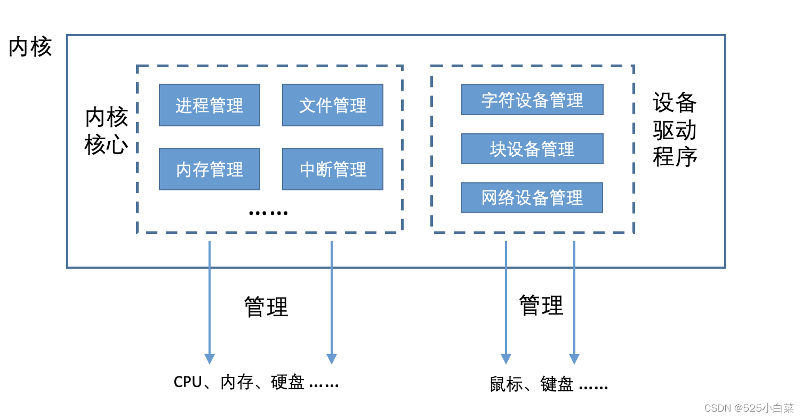
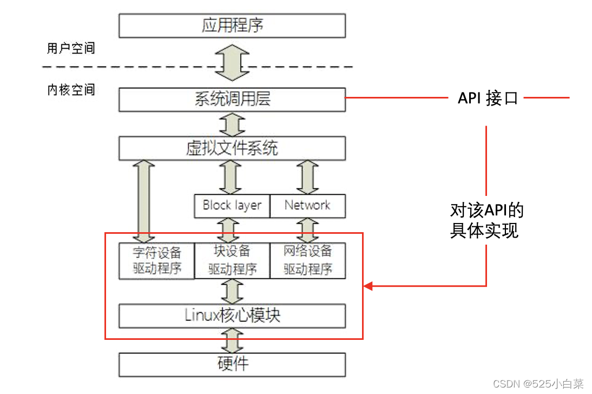
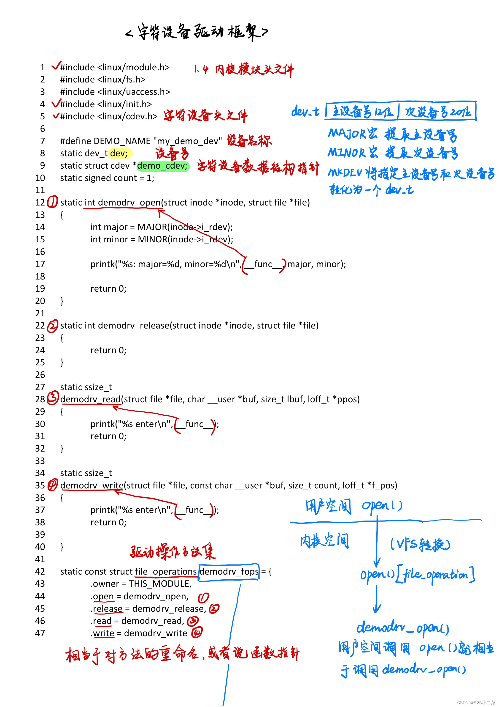
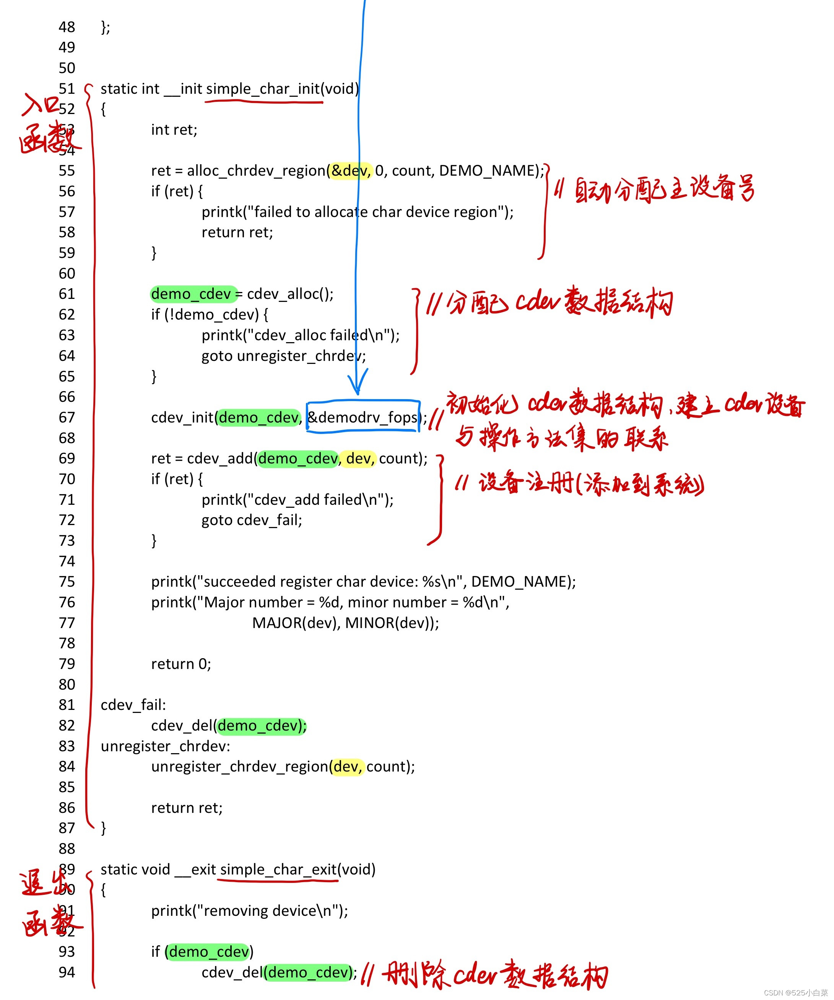
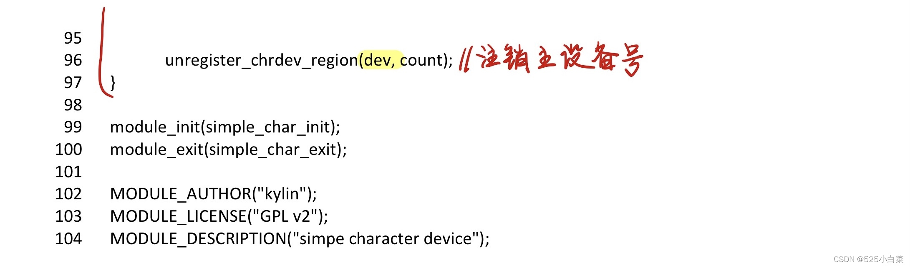
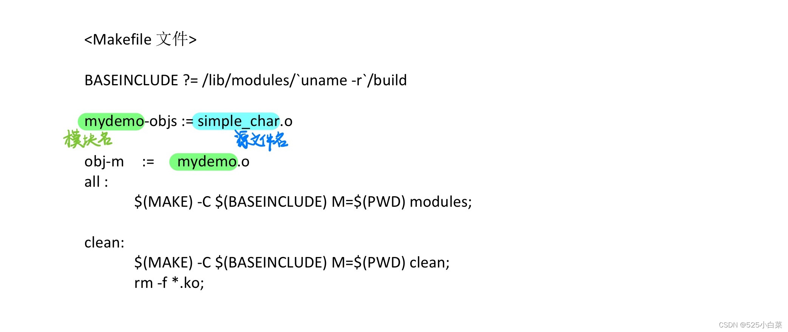
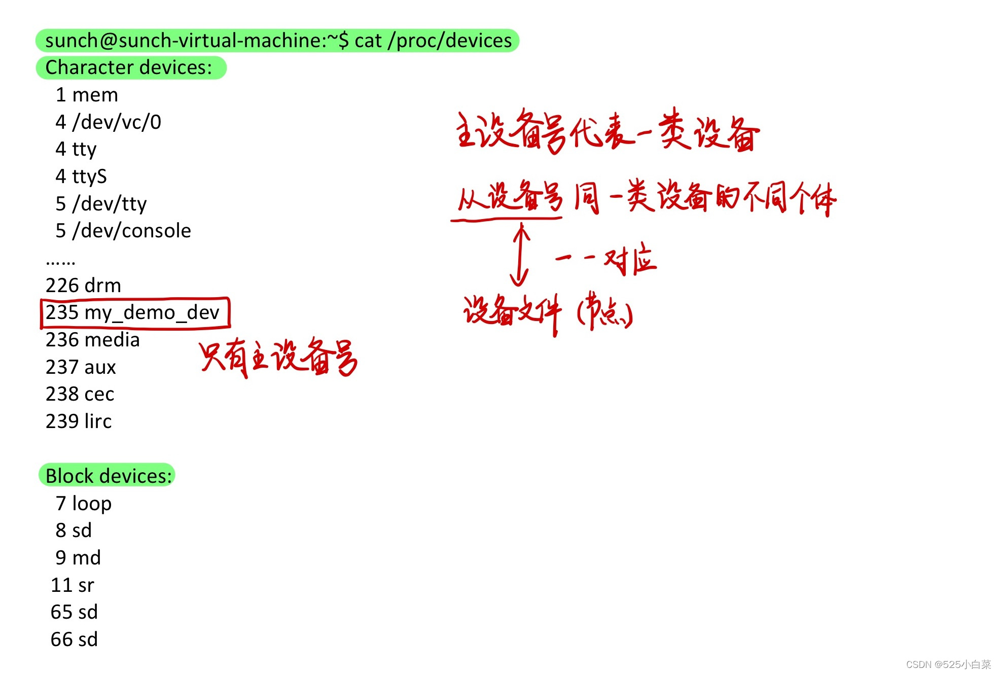
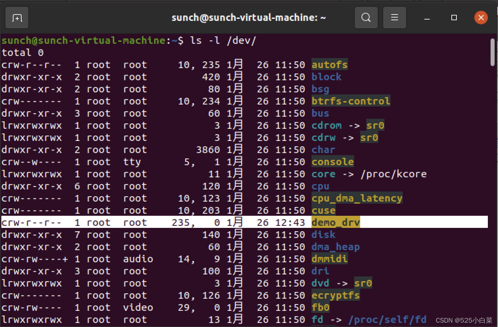

# 《奔跑吧Linux内核（第二版）》第六章笔记

## 如何理解设备驱动？

内核由管理各种硬件资源的模块组成，根据重要程度不同，一些模块称为核心模块，另一些称为[驱动程序](https://so.csdn.net/so/search?q=%E9%A9%B1%E5%8A%A8%E7%A8%8B%E5%BA%8F&spm=1001.2101.3001.7020)。  


## 设备驱动分类

Linux很早就根据设备的共性特征将其划分为三大类型：

-   字符设备：采用的是以字节为单位的I/O传输，这种字符流的传输率通常比较低，常见的字符设备有鼠标、键盘、触摸屏。
-   块设备：以块为单位传输的，常见的块设备是磁盘。
-   网络设备：是一类比较特殊的设备，涉及网络协议层，因此单独分为一类。  
    

## [字符设备驱动](https://so.csdn.net/so/search?q=%E5%AD%97%E7%AC%A6%E8%AE%BE%E5%A4%87%E9%A9%B1%E5%8A%A8&spm=1001.2101.3001.7020)框架

  




字符设备驱动管理的核心对象是以字符为数据流的设备。从Linux 内核设计的角度来看，需要有一个数据结构来对其进行抽象和描述，这就是struct cdev 数据结构。

```c
<include/linux/cdev.h>
struct cdev
{
	struct kobject kobj;
	struct module *owner;
	const struct file_operations *ops;
	struct list_head list;
	dev_t dev:
	unsigned int count;
}
```


-   kobj：用于Linux设备驱动模型。
-   owner：字符设备驱动程序所在的内核模块对象指针。
-   ops：字符设备驱动程序中最关键的一个操作函数，在和应用程序交互过程中起到桥梁枢纽的作用。
-   list：用来将字符设备串成一个链表。
-   dev：字符设备的设备号，由主设备号和次设备号组成。
-   count：同属一个主设备号的次设备号的个数。

设备驱动程序可以由两种方式来产生 struct cdev , 一种是使用全局[静态变量](https://so.csdn.net/so/search?q=%E9%9D%99%E6%80%81%E5%8F%98%E9%87%8F&spm=1001.2101.3001.7020)，另一种是使用内核提供的cdev\_alloc()接口函数。

```c
static struct cdev mydemo_cdev;
或者
struct mydemo_cdev = cdev_alloc();
```


除此之外，Linux 内核还提供若干个与 cdev 相关的 API 函数。

1.  cdev\_init() 函数，初始化 cdev 数据结构，并且建立该设备与驱动操作方法集 file\_operations 之间的连接关系。

    void cdev_init (struct cdev *dev, const struct file_operations *fops)
    

2）cdev\_add()函数，把一个字符设备添加到系统中，通常在驱动程序的 probe 函数里会调用该接口来注册一个字符设备。

```c
int dev_add (struct cdev *p, dev_t dev, unsigned count)
```


-   p表示一个设备的 cdev 数据结构。
-   dev 表示设备的设备号，
-   count 表示这个主设备号里可以有多少个次设备号。通常同一个主设备号可以有多个次设备号不相同的设备，如系统中同时有多个串口，它们都是名为“tty”的设备，主设备号都是 4。

3）cdev\_del()函数，从系统中删除一个cdev，通常在驱动程序的卸载函数里会调用该接口。

```c
void cdev_del (struct cdev *p)
```


设备号是系统中珍贵的资源，内核必须避免发生两个设备驱动使用同一个主设备号的情况，因此在编写驱动程序时要格外小心。Linux 内核提供两个接口函数完成设备号的申请。

```c
# 自己手动分配主设备号
int register_chrdev_region (dev_t from, unsigned count, const char *name)
# 系统自动分配主设备号
int alloc_chrdev_region(dev_t *dev, unsigned baseminor, unsigned count,
const char *name)
```


在驱动程序的卸载函数中需要把主设备号释放给系统，可以调用如下的接口函数。

```c
void unregister_chrdev_region (dev_t from, unsigned count)
```


## 设备驱动的使用

### 1、编译

以下是编译该设备驱动的Makefile文件：  


### 2、挂载

和内核模块的挂载方式一样，make后会生成mydemo.ko文件，使用insmod命令挂载。挂载完成后，查看`/proc/devices`这个proc虚拟文件系统的devices节点信息，可以看到生成了名为“my\_demo\_device”的设备，主设备号是235。  


### 3、生成设备文件

在Linux 系统中有一个原则，即万物皆文件。设备节点也算一个特殊的文件，称为设备文件，是连接内核空间驱动程序和用户空间应用程序的桥染。如果应用程序想使用驱动程序提供的服务或者操作设备，那么需要通过访问该设备文件来完成。设备文件使得用户程序操作硬件设备就像操作普通文件一样方便。

前面写的驱动程序是针对一类设备（主设备号）的操作方法。而具体操作是针对该类设备中一个具体设备文件（节点）的，所以我们要借助命令手动生成该类设备的一个设备文件（节点）。这样用户程序才可以操作该类设备文件。

mknod命令用于手动生成设备文件（节点），该命令格式如下：

> mknod filename type major minor

生成235这类设备的一个具体设备文件：

```shell
$ sudo mknod /dev/demo_drv c 235 0 
```


按照Linux的习惯，系统中所有设备节点都存放在`/dev/`目录中，生成之后，可以通过“ls -l”命令查看`/dev/`目录的情况。  


### 4、用户程序操作该设备文件

```C
#include <stdio.h>
#include <fcntl.h>
#include <unistd.h>

#define DEMO_DEV_NAME "/dev/demo_drv"

int main()
{
	char buffer[64];
	int fd;

	fd = open(DEMO_DEV_NAME, O_RDONLY);
	if (fd < 0) {
		printf("open device %s failded\n", DEMO_DEV_NAME);
		return -1;
	}

	read(fd, buffer, 64);
	close(fd);

	return 0;
}
```