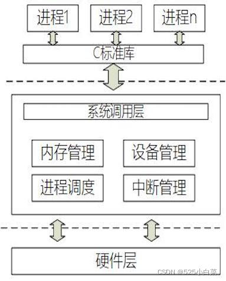

# 《奔跑吧Linux内核（第二版）》第七章笔记

每个处理器的[架构设计](https://so.csdn.net/so/search?q=%E6%9E%B6%E6%9E%84%E8%AE%BE%E8%AE%A1&spm=1001.2101.3001.7020)中都提供了一些特殊指令来实现内核态与用户态之间的切换。x86处理器模式从Ring3向Ring0的切换发生在控制权转移时，有以下两种情况：访问调用门的长转移指令CALL，访问中断门或陷阱门的INT指令。

### 用户态切换到内核态的3种方式

（1) [系统调用](https://so.csdn.net/so/search?q=%E7%B3%BB%E7%BB%9F%E8%B0%83%E7%94%A8&spm=1001.2101.3001.7020)：这是用户态进程主动要求切换到内核态的一种方式，用户态进程通过系统调用申请使用操作系统提供的服务程序完成工作。而系统调用的机制其核心还是使用了操作系统为用户特别开放的一个中断来实现，例如Linux的int 80h中断。

（2) 异常：当CPU在执行运行在用户态下的程序时，发生了某些事先不可知的异常，这时会触发由当前运行进程切换到处理此异常的内核相关程序中，也就转到了内核态，比如缺页异常。

（3) 外围设备的中断：当外围设备完成用户请求的操作后，会向CPU发出相应的中断信号，这时CPU会暂停执行下一条即将要执行的指令转而去执行与中断信号对应的处理程序，如果先前执行的指令是用户态下的程序，那么这个转换的过程自然也就发生了由用户态到内核态的切换。比如硬盘读写操作完成，系统会切换到硬盘读写的中断处理程序中执行后续操作等。

这3种方式是系统在运行时由用户态转到内核态的最主要方式，其中系统调用可以认为是用户进程主动发起的，异常和外围设备中断则是被动的。三种方式总结来说，就是中断，系统调用也是中断，称为系统调用中断。

### 中断

中断可以发生在内核态，也可以发生在用户态，但是所有的中断处理程序都存放在内核中，因此:

-   若中断发生在内核态，因为在中断发生的前后 cpu 都处于内核态。在中断响应阶段依次将寄存器 eflags、cs 和 eip 中的值压入内核栈保存起来，在中断返回阶段，即 cpu 运行 iret 指令时，再从内核栈依次出栈(出栈顺序和入栈顺序相反)恢复这 3 个寄存器的值。
-   若中断发生在用户态，因为在中断发生前，在 cpu 上运行的是当前任务的可执行文件，而在中断发生 后，运行的是中断处理程序所在的内核的可执行文件，即 cpu 必须从中断发生前的用户态切换到中断发生后的内核态。和中断发生在内核态不同，当中断发生在用户态时，在中断响应阶段需要依次压入当前任务的内核栈保存起来的寄存器有 5 个: ss、esp、eflags、cs 和 eip。在中断返回阶段，即 cpu 运行 iret 指令时，再从当前任务的内核栈依次出栈(出栈顺序和入栈顺序相反)恢复这 5 个寄存器的值。当中断返回后，cpu 从当前任务的可执行文件中的中断发生前的位置继续运行，即 cpu 从内核态切换到用户态。因此，可以通过虚拟一 个中断返回的过程，来实现 cpu 从内核态切换到用户态。

**由用户态切换到内核态的步骤主要包括**：

\[1\] 从当前进程的描述符中提取其内核栈的位置。

\[2\] 使用该内核栈将当前进程的cs,eip,eflags,ss,esp信息保存起来，然后使用ss和esp寄存器指向该内核栈，完成由用户栈到内核栈的切换。这样内核栈中保存了被暂停执行的程序的下一条指令地址（cs、eip），用户进程的用户栈信息（ss、esp），CPU各标志寄存器信息（eflags）。

\[3\] 将先前由中断向量检索得到的中断处理程序的cs、eip信息装入相应的寄存器，开始执行中断处理程序，这时就转到了内核态的程序执行了。

### 系统调用

C标准库是对系统调用的进一步封装。应用程序开发者不会直接访问系统调用，而是通过C标准库函数来访问系统调用。  

#### 1、系统调用和C库

有的读者可能对应用编程接口 （API）和系统调用之间的关系有点糊涂了。一般来说，应用程序调用用户空间实现的应用编程接口来编程，而不是直接调用系统调用。一个 API接口函数可以由一个系统调用实现，也可以由多个系统调用来实现，甚至完全不使用任何系统调用。因此，一个API 接口没有必要对应一个特定的系统调用。

在UNIX 的世界里，最通用的系统调用层接口是 POSIX (Portable Operating System Interface of UNIX）标准。但是需要注意的是，POSIX 标准针对的是 API 而不是系统调用。判断一个系统是否与 POSIX 兼容时，要看它是否提供一组合适的应用编程接口，而不是看它的系统调用是如何定义和实现的。即，POSIX标准定义的是接口。

[Linux](https://so.csdn.net/so/search?q=Linux&spm=1001.2101.3001.7020) 操作系统的 API接口通常是以C标准库的方式提供的，比如Linux 中的libc 库。C库提供了 POSIX 的绝大部分的 API 的实现，同时也为内核提供的每个系统调用封装了相应的函数，并且系统调用和 C 库封装的函数名称通常是相同的。

系统调用是内核提供的接口，C 库是对这些系统调用的进一步封装，用户直接接触的是 C 库，C 库再去调用内核提供的系统调用。

#### 2、系统调用的大致过程

系统调用也是中断的一种，称为系统调用中断，中断号是0x80。该中断的中断处理程序是system\_call。用户调用系统调用时，通过向eax寄存器写入要调用的系统调用编号，这个编号就是sys\_call\_table数组（系统调用表）的下标，然后显式的执行`int 0x80`指令，进入该软中断的中断处理程序system\_call。system\_call函数获取eax寄存器的值，然后通过eax寄存器的值查询sys\_call\_table数组（系统调用表），找到要调用的系统调用入口，并且进行调用。调用完成后，系统调用会把返回值保存到eax寄存器中。

当用户要调用系统调用时，需要传递一些系统调用所需的参数。因为用户态和内核态使用的栈不同，而调用系统调用是在用户态调用的，而进入系统调用后会变成内核态，所以参数就不能通过栈来传递。Linux使用寄存器来传递参数，参数与寄存器的关系如下：

-   第1个参数放置在ebx寄存器。
-   第2个参数放置在ecx寄存器。
-   第3个参数放置在edx寄存器。
-   第4个参数放置在esi寄存器。
-   第5个参数放置在edi寄存器。
-   第6个参数放置在ebp寄存器。

在system\_call中会将这些寄存器压入进程的内核栈，这样系统调用就可以通过内核栈获取到参数。

## 参考

[《奔跑吧Linux内核（第二版）》第七章笔记-CSDN博客](https://blog.csdn.net/weixin_51760563/article/details/122702111)