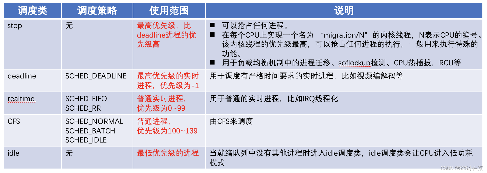
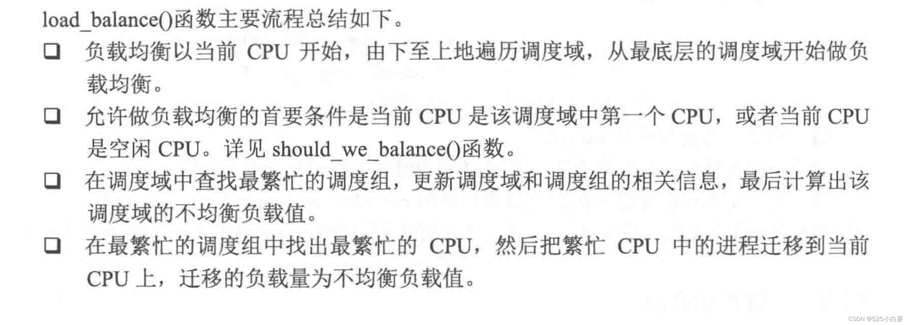

# 《奔跑吧Linux内核（第二版）》第八章笔记

## 进程

进程的抽象是为了提高 CPU 的利用率，任何的抽象都需要一个物理基础，进程  
的物理基础便是程序。

进程是用来实现[多进程](https://so.csdn.net/so/search?q=%E5%A4%9A%E8%BF%9B%E7%A8%8B&spm=1001.2101.3001.7020)并发执行的一个实体，实现对 CPU 的虚拟化，让每个进程  
都感觉拥有一个 CPU。实现这个 CPU [虚拟化](https://so.csdn.net/so/search?q=%E8%99%9A%E6%8B%9F%E5%8C%96&spm=1001.2101.3001.7020)的核心技术是上下文切换 (Context  
Switch）以及进程调度 (Scheduling )。

### 进程描述符task\_struct

Linux 内核利用链表 task\_list 来存放所有进程描述符，task\_struct 数据结构定义在  
include/linux/sched.h 文件中。

系统中所有进程的 task\_struct数据结构都通过 list\_head 类型的双向链表链在一起，因此每个 task\_struct 数据结构都包含一个list\_head 类型的 tasks 成员。这个进程链表的头是init\_task 进程，也就是所谓的0号进程。init\_task 进程的 tasks.prev 字段指向链表中最后插入的进程 task\_struct 数据结构的 tasks 成员。另外，如果这个进程的下面有线程组（进程的pid=tgid），那么线程会加入线程组的thread\_group链表中。（thread\_group也是task\_struct成员之一）。

新创建的进程都会链入进程链表，新创建的线程都会链入进程下的线程组thread\_group链表。  
  
next\_task()宏用来遍历下一个进程的task\_task数据结构，next\_thread()用来遍历线程组中下一个线程的task\_struct数据结构。

Linux 内核提供一个很常用的宏for\_ each\_process§，用来扫描系统中所有的进程。这个宏从 init\_task 进程开始遍历，一直循环到 init\_task 为止。另外，宏for\_each\_process\_thread()用来遍历系统中所有的线程。另外，宏for\_each\_process\_thread()用来遍历系统中所有线程。

    #define next_task (p) \
    list entry_rcu((p)->tasks.next, struct task_struct, tasks)
    #define for_each_process (p) \
    for ( p = &init task ;(p = next_task(p)) != &init task ;)
    #define for_each_process_thread(p,t) \
    for_each_process(p) for_each_thread(p,t)


**获取task\_struct**：Linux内核提供了current宏，current宏的实现和具体的系统架构相关。在内核态，ARM64处理器运行在EL1下，sp\_el0寄存器在EL1上下文中没有使用。利用sp\_el0寄存器来存放task\_struct数据结构。

在Linux 5.4中，获取当前进程的task\_struct数据结构的流程如图所示。  
  
**进程的两个栈**

每个进程都会有两个栈：一个用户栈，存在于用户地址空间中，一个内核栈，存在于内核地址空间。

处于用户态时，cpu堆栈指针寄存器的内容是用户栈地址，处于内核态时，其内容是内核态地址。

在Linux 5.4中，进程的内核栈和用户栈地址都存在进程描述符task\_struct中，内核栈地址存在task\_struct的stack分量中；用户栈地址在task\_struct的thread\_struct的cpu\_context中保存的CPU通用寄存器信息中可以查到。

用户栈：保存进程在用户态发生函数调用时的参数。  
内核栈：保存进程由用户态切换到内核态时的CPU寄存器信息（x86架构的cs、ip、flags、ss、sp）以及在内核态下发生函数调用时的参数。

在单一状态内（用户态/内核态）发生进程切换，CPU寄存器信息（即硬件上下文）保存在进程描述符中（task\_struct的thread\_struct的cpu\_context中）。由用户态切换到内核态，CPU寄存器信息（即硬件上下文）保存在内核栈中，其中CPU寄存器信息包括cs、ip（下一条指令地址）；eflags（标志位信息）；ss、sp（用户栈地址）。

**task\_struct 数据结构**很大，它包含的内容可以简单归纳成如下几类:

-   进程属性的相关信息
-   进程间的关系
-   进程调度相关信息
-   内存管理相关信息
-   文件管理相关信息
-   信号相关信息
-   资源限定的相关信息

#### 1、进程属性相关信息

进程属性的相关信息主要包括和进程状态相关的信息，比如进程状态、进程的 PID等  
信息。

-   state 成员：用来记录进程的状态，进程的状态主要有 TASK\_RUNNING、TASK\_INTERRUPTIBLE、 TASK\_UNINTERRUPTIBLE、EXIT\_ZOMBIE、 TASK\_DEAD 等几个状态。
-   pid 成员：这是进程唯一的进程标识符 (Process Identifier )。 pid 的定义是整数类型，pid 默认最大值见/proc/sys/kernel/pid\_max。
-   flag 成员：用来描述进程属性的一些标志位，这些标志位是在include/linux/schude.h中定义的。
-   exit\_code 和exit\_signal 成员：用来存放进程退出值和终止信号，这样父进程可以知道子进程的退出原因。
-   pdeath\_ signal 成员：父进程消亡时发出的信号。
-   comm 成员：存放可执行程序的名称。
-   real\_cred 和cred 成员：用来存放进程的一些认证信息，cred 数据结构里包含了 uid、gid 等信息。

##### 进程的5种状态：

  
  
建议使用Linux 内核提供的接口函数set\_current\_state()来设置进程的状态。

##### 进程标识

进程被创建时会分配唯一的号码来标识，这个号码就是进程标识符 PID (Process Identifier)。PID存放在进程描述符的 pid 字段中，PID是 int 类型。为了循环使用 PID ，内核使用 bitmap 机制来管理当前已经分配的 PID 和空闲的 PID，bitmap 机制可以保证每个进程创建时都能分配到唯一的号码。

分配一个空闲pid，本质上等同于找出位图中第一个值为0的比特。pid号对应于比特位偏移号。

除了PID外，Linux内核还引入了线程组的概念。同一线程组内有各自的PID，但TGID相同。唯一一个TGID与PID相同的，是组内主线程（group\_leader）

#### 2、调度相关的信息

-   prio 成员：保存着进程的动态优先级，是调度类考虑的优先级
-   static\_prio 成员：静态优先级，在进程启动时分配。内核不存储 nice 值，取而代之的是 static prio
-   normal\_prio 成员：基于static\_prio 和调度策略计算出来的优先级
-   rt\_priority 成员：实时进程的优先级
-   sched\_class 成员：调度类
-   se 成员：普通进程调度实体
-   rt成员：实时进程调度实体
-   dl 成员：deadline 进程调度实体
-   policy 成员：用来确定进程的类型，比如是普通进程还是实时进程
-   cpus\_allowed 成员：进程可以在哪几个 CPU 上运行

#### 3、进程间的关系

系统中最初的第一个进程是 idle 进程（或者叫作0号进程），此后每个进程都有一个创建它的父进程，进程本身也可以创建其他的进程，父进程可以创建多个进程，进程类似一个家族，有父进程、子进程，还有兄弟进程

-   real\_parent 成员：指向当前进程的父进程的 task\_struct 数据结构，如果他的父进程不存在了，则指向进程1（init进程）的进程描述符。
-   children 成员：指向当前进程的子进程的链表
-   sibling 成员：指向当前进程的兄弟进程的链表
-   group\_leader 成员：进程组的组长

> sibling.next指向下一个兄弟进程的sibling成员，若其后没有其他兄弟进程，则指向父进程，而sibling.prev指向进程的上一个兄弟进程，若之前没兄弟进程，则指向父进程。  
> children.next指向父进程第一个子进程的sibling成员，而children.prev指向父进程的最后一个子进程的sibling成员。

#### 4、内存管理和文件管理相关信息

进程在加载运行之前需要加载到内存，因此进程描述符里必须有一个抽象描述内存相关的信息，有一个指向mm\_struct 数据结构的指针mm。此外，进程在生命周期内总是需要通过打开文件、读写文件等操作来完成一些任务，这就和文件系统密切相关了。

-   mm 成员：指向进程所管理的内存的一个总的抽象的数据结构 mm\_struct
-   fs成员：保存一个指向文件系统信息的指针
-   files 成员：保存一个指向进程的文件描述符表的指针

### 进程的创建和终止

#### 进程创建

Linux 的进程创建和执行通常是由两个单独的函数去完成，即fork()和 execve()。 fork()通过写时复制技术复制当前进程的相关信息来创建一个全新的子进程。这时子进程和父进程运行在各自的进程地址空间中，但它们共享相同的内容。另外，它们有各自的PID。execve()函数负责读取可执行文件，并将其装入子进程的地址空间中开始运行，这时父进程和子进程才开始分道扬镳。

我们最常见的一种场景是在shell界面中输入命令，然后等待命令返回。若从进程创建和终止的角度看，经历的过程如下：

  
**写时复制技术**  
现代的操作系统都采用写时复制 (copy on write，COW）的技术进行优化。写时复制技术就是父进程在创建子进程时，不需要复制进程地址空间的内容给子进程，只需要复制父进程的进程地址空间的页表给子进程，这样父子进程就共享了相同的进程地址空问。当父子进程有一方需要修改某个物理页面的内容时，会发生写保护的缺页异常，然后才把共享页面的内容复制出来，从而让父子进程拥有各自的副本。也就是说，进程地址空间是以只读的方式共享，当需要写入时才发生复制。写时复制是一种可以推迟甚至避免复制数据的技术，在现代操作系统中有广泛的应用。

**与进程创建相关的三个系统调用**  
在Linux内核中，fork()、vfork()、clone()这三个系统调用都是通过调用同一函数do\_fork()函数来完成的，只是调用的参数不一样。

fork()只将父进程的页表复制给子进程。fork()函数会返回两次，一次在父进程，另一次在子进程。如果返回值为0，说明这是子进程。如果返回值为正数，说明这是父进程，父进程会返回子进程的ID。子进程返回0。如果返回-1，表示创建失败。

fork()创建子进程后，父子进程同时运行，都执行fork()后的下一条指令（因为有相同的PC计数器值），区分当前进程是父进程还是子进程看fork()的返回值。

vfork()函数和fork()函数很类似，但是vfork()的父进程会一直阻塞，直到子进程调用 exit()或者 execve()为止。【fork()父子进程同时运行(微观上次序不确定)；vfork()保证子进程先运行，退出后父进程才运行。】vfork()的另一个优势是连父进程的页表项复制动作也被省去了，直接共享父进程的地址空间。

clone()函数通常用来创建用户线程。在Linux 内核中没有专门的线程这个概念，而是把线程当成普通进程来看待，在内核中还是以 task\_struct 数据结构来描述，并没有特殊的数据结构或者调度算法来描述线程。

clone()函数功能强大，可以传递众多参数，可以有选择地继承父进程的资源，比如可以和vfork()一样和父进程共享进程地址空间，从而创建线程；也可以不和父进程共享进程地址空间，甚至可以创建兄弟关系进程。

**内核线程**  
  


#### 进程终止

进程的终止有两种方式：一种方式是主动的终止，包括显式地调用 exit()系统调用或者从某个程序的主函数返回；另一种方式是被动终止，在接收到终止的信号或者异常时终止。

进程主动终止主要有如下两个途径。

-    从main函数返回，链接程序会自动添加对 exitQ系统调用。
-    主动调用exito系统调用

进程被动终止主要有如下了个途径。

-    进程收到一个自己不能处理的信号。
-    进程在内核态执行时产生了一个异常。
-    进程收到 SIGKILL 等终止信号。

当一个进程终止时，Linux 内核会释放它所占有的资源，并把这个消息告知父进程，而一个进程的终止可能有两种情况。

-    它有可能先于父进程终止，那么子进程会变成一个僵尸进程，只保留task\_struct结构，直到父进程调用 wait()才算最终消亡，释放掉task\_struct结构。
-    也有可能在父进程之后终止，这时 init 进程将成为子进程的新父进程。

wait()主要功能如下：

-    获取进程终止的原因等信息。
-    销毁进程 task\_struct 数据结构等最后的资源。

所谓的**托孤进程**是指如果父进程先于子进程消亡，那么子进程就变成孤儿进程，这时Linux 内核会让它托孤给 init 进程（1号进程），这时 init 进程就成了子进程的父进程。

### 进程调度

进程调度的原因是为了提高处理器的利用率。

schedule()函数的核心代码片段如下：

```C
static void sched schedule(void)
{
     next = pick_next_task(rq,prev);
     if (likely(prev != next)){
		rq = context_switch(rq,prev,next) 
    }
}
```


这里主要实现了两个功能：一个是选择下一个要运行的进程，另一个是调用context\_switch()函数来进行上下文切换。

#### 选择下一个要运行的进程

##### nice值

Linux 系统最早采用 nice 值来调整进程的优先级，取值范围-20~19，默认值是0；nice值越大、优先级越低，nice 值越低，优先级越高。-20 表示这个进程的任务是非常重要的，优先级最高；而19则允许其他所有进程都可以优先享有宝贵的 CPU 时间，nice背后的思想是对其他进程友好，nice值越大支持其他的进程消耗更多的处理器时间，这也是nice 这个名称的来由。

##### 优先级

目前，Linux 内核使用 0~139 的数值表示进程的优先级，数值越低，优先级越高。优先级0~99给实时进程使用，100~139 给普通进程使用。另外，在用户空间有一个传统的变量nice 值映射到普通进程的优先级，即 100~139。


普通进程使用nice值作为自己的优先级，除此之外，nice值还代表了该进程所能占有的CPU时间片比例。时间片比例是通过nice值对应的权重值来计算的。

##### 权重

为了计算方便，Linux内核约定nice值0对应的权重为1024，其他nice值对应的权重值可以通过查表的方式来获取。内核预先计算好了表sched\_prio\_to\_weight\[40\]。

优先级越高，权重越大。

##### 调度策略

Linux调度器是以模块方式提供，这种模块化结构称为称为调度类。目前Linux内核默认实现了5个调度类，分别是stop、deadline、realtime、CFS和idle，他们分别使用sched\_class来定义，并通过next指针串联在一起。  
  
按优先级范围划分为5个调度类：  
  
每个调度类都有一个优先级，基础调度器代码定义在kernel/sched.c中，它会按照优先级顺序遍历调度器类，拥有一个可执行进程的最高优先级调度器类胜出，再去选择它下面的进程。

##### 时间片

现在的 CFS 调度器已经抛弃固定时间片的做法，而是采用进程权重占比的方法来公平地划分 CPU 的时间，这样进程获得的 CPU时间和进程的权重以区 CPU 上的总权重有关系。权重和优先级相关，优先级高的进程权重也高，那么就有机会占用更多的 CPU 时间：而优先级低的进程权重也低，那么占用的 CPU时间也少。

##### Linux CFS算法

CFS的核心是**计算进程的vruntime**以及**选择下一个运行的进程**。

###### 1、虚拟运行时间

虚拟时间 = n i c e 值为 0 的权重 进程权重 ∗ 真实运行时间 虚拟时间 = \\frac{nice值为0的权重}{进程权重}\*真实运行时间 虚拟时间\=进程权重nice值为0的权重∗真实运行时间

CFS 调度器抛弃以前固定时间片和固定调度周期的算法，采用进程权重值的比重来量化和计算实际运行时间。另外，CFS 调度器引入虚拟时间（vruntime）的概念，也称为虚拟运行时间；作为对照，还引入实际运行时间（real time）的概念，也称为真实运行时间，也就是进程在物理时钟下实际运行的时间。每个进程的虚拟时间是实际运行时间相对 nice 值0的权重的比例值。进程按照各自不同的速率比在物理时钟节拍内前进。nice 值小的进程，优先级高，权重大，其虚拟时钟比真实时钟跑得慢，但是可以获得比较多的运行时间；反之，nice 值大的进程，优先级低，权重也低，其虚拟时钟比真实时钟跑得快，反而获得比较少的运行时间。CFS 调度器总是选择虛拟时钟跑得慢（vruntime最小）的进程，它像一个多级变速箱，nice 为0的进程是基准齿轮，其他各个进程在不同的变速比下相互追赶，从而达到公正、公平。【从表盘看，数字越小，时间过得越慢。】

###### 2、选择下一个进程

CFS 调度器选择下一个进程来运行的规则也比较简单，就是挑选vruntime 值最小的进程。CFS 使用红黑树来组织就绪队列，因此可以快速找到 vruntime 最小的那个进程，只需要查找树中最左侧的叶子节点即可。

#### 进程切换

-   抢占式调度（进程非自愿情况下调用schedule）
-   主动调度（进程主动调用schedule）

##### 抢占式调度需要两步：

第一步在current进程设置TIF\_NEED\_RESCHED(需要重新调度标志)  
第二步在中断返回或系统调用返回时检查current进程是否设置了该标志，如果设置了就调用schedule

检查是否需要设置TIF\_NEED\_RESCHED标志的时机：1、时钟中断处理时 2、唤醒新进程时

进程抢占的时机指的是什么时候检查TIF\_NEED\_RESCHED标志，然后调用schedule。  
用户态的抢占时机：1、系统调用返回 2、中断返回用户态  
内核态的抢占时机：1、中断返回内核态时 2、开启可抢占标志时

操作系统会把当前正在运行的进程挂起并且恢复以前挂起的某个进程的执行，这个过程称为进程切换，或者上下文切换。

虽然每个进程可以拥有属于自己的进程地址空间，但是所有进程都必须共享 CPU 的寄存器，所以在进程切换时，必须把 next 进程在挂起时保存的寄存器值重新装载到 CPU 中。在进程恢复执行前必须装入 CPU 寄存器的数据，称之为硬件上下文。进程切换可以总结为如下两步。

1）切换进程的进程地址空间，也就是切换next 进程的页表到硬件页表中，这是由switch\_mm()函数实现的。  
2）切换到 next 进程的内核态栈和硬件上下文，这是switch\_to()函数实现的。硬件上下文提供了内核执行 next 进程所需要的所有硬件信息。

switch\_mm()函数实质上是把新进程的页表基地址设置到页表基地址寄存器。在运行进程时，除了高速缓存会缓存进程的数据外，MMU内部还有叫做TLB的硬件单元，因此切换进程需要对TLB进行刷新操作（在ARM架构也称为失效操作）。但是这种方法导致整个TLB刷新后，next进程将面对空白的TLB，因此刚开始执行会面临很严重的TLB未命中或高速缓存未命中。解决办法就是不要刷新整个TLB，内核空间是所有进程共享的，这部分TLB不用刷新。ARM架构提供了一种硬件解决方案就是ASID，给每个TLB项标识其所属进程，这样prev进程缓存的TLB不会影响到next进程。

task\_struct数据结构里的thread\_struct数据结构里的cpu\_context是一个非常重要的数据结构，它勾画了在切换进程时，CPU 需要保存哪些寄存器，我们称为进程硬件上下文。对于 ARM64 处理器来说，在切换进程时，我们需要把 prev 进程的x19~x28 寄存器以及fp、sp 和pc寄存器保存到cpu\_context数据结构中，然后把 next 进程中上一次保存的cpu\_context 数据结构的值恢复到实际硬件的寄存器中，这样就完成了进程的上下文切换。

#### 与进程调度有关的数据结构


-   rq数据结构是描述CPU的通用就绪队列，每个CPU一个通用就绪队列，每个通用就绪队列都包含各调度类的就绪队列cfs\_rq 、rt\_rq 、dl\_rq。
-   sched\_entity，调度实体。这种数据结构描述了进程作为调度实体参与调度所需要的所有信息，例如load表示调度实体的权重，run\_node表示调度实体在红黑树中的节点。

### 多核调度

#### 调度域和调度组

CPU拓扑结构存在下面三个level（SMT level最低）：

-   SMT Level 超线程处理器的一个核心
-   MC Level 多核CPU的一个核心
-   DIE Level 一个物理CPU的晶片（注意不是package，package是封装好了的，肉眼看到的CPU处理器）

cpu最小级别的就是超线程处理器的一个smt核，次小的一级就是一个[多核cpu](https://so.csdn.net/so/search?q=%E5%A4%9A%E6%A0%B8cpu&spm=1001.2101.3001.7020)的核，然后就是一个物理cpu封装，再往后就是cpu阵列，根据这些cpu级别的不同，Linux将所有同一级别的cpu归为一个“调度组”，然后将同一级别的所有的调度组组成一个“调度域”。


#### 负载均衡机制

SMP 负载均衡机制从注册软中断开始，系统处理每次调度 tick 中断时，都会检查当前是否需要处理 SMP 负载均衡。rebalance\_domains()函数是负载均衡的核心入口。它会调用load\_balance()函数。

