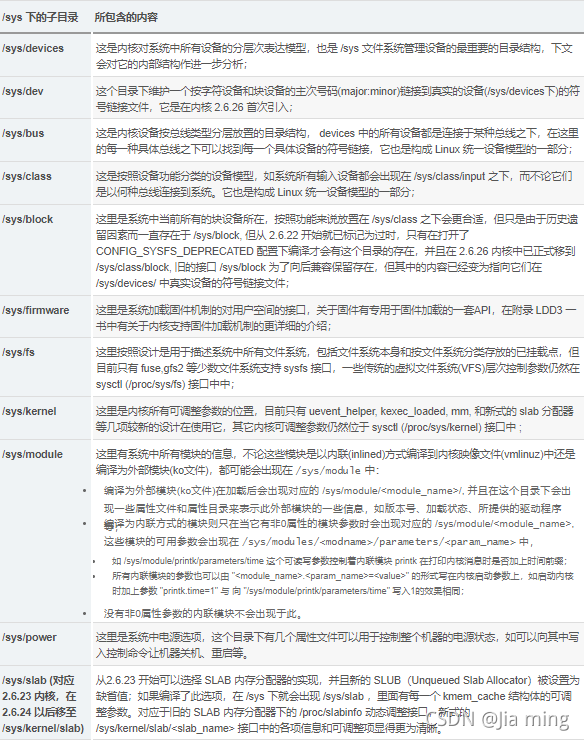

#### 文章目录

-   [printk() 输出函数和动态输出](https://blog.csdn.net/weixin_39541632/article/details/120609035?ops_request_misc=%257B%2522request%255Fid%2522%253A%2522BF4EE104-DE9A-42AE-8495-5767B8871C4E%2522%252C%2522scm%2522%253A%252220140713.130102334.pc%255Fall.%2522%257D&request_id=BF4EE104-DE9A-42AE-8495-5767B8871C4E&biz_id=0&utm_medium=distribute.pc_search_result.none-task-blog-2~all~first_rank_ecpm_v1~rank_v31_ecpm-18-120609035-null-null.142^v100^pc_search_result_base5&utm_term=%E5%A5%94%E8%B7%91%E5%90%A7linux%E5%86%85%E6%A0%B8%20%E7%AC%AC2%E7%89%88&spm=1018.2226.3001.4187#printk__1)
-   -   [1\. 使用printk()输出函数](https://blog.csdn.net/weixin_39541632/article/details/120609035?ops_request_misc=%257B%2522request%255Fid%2522%253A%2522BF4EE104-DE9A-42AE-8495-5767B8871C4E%2522%252C%2522scm%2522%253A%252220140713.130102334.pc%255Fall.%2522%257D&request_id=BF4EE104-DE9A-42AE-8495-5767B8871C4E&biz_id=0&utm_medium=distribute.pc_search_result.none-task-blog-2~all~first_rank_ecpm_v1~rank_v31_ecpm-18-120609035-null-null.142^v100^pc_search_result_base5&utm_term=%E5%A5%94%E8%B7%91%E5%90%A7linux%E5%86%85%E6%A0%B8%20%E7%AC%AC2%E7%89%88&spm=1018.2226.3001.4187#1_printk_2)
    -   [2\. 使用动态输出](https://blog.csdn.net/weixin_39541632/article/details/120609035?ops_request_misc=%257B%2522request%255Fid%2522%253A%2522BF4EE104-DE9A-42AE-8495-5767B8871C4E%2522%252C%2522scm%2522%253A%252220140713.130102334.pc%255Fall.%2522%257D&request_id=BF4EE104-DE9A-42AE-8495-5767B8871C4E&biz_id=0&utm_medium=distribute.pc_search_result.none-task-blog-2~all~first_rank_ecpm_v1~rank_v31_ecpm-18-120609035-null-null.142^v100^pc_search_result_base5&utm_term=%E5%A5%94%E8%B7%91%E5%90%A7linux%E5%86%85%E6%A0%B8%20%E7%AC%AC2%E7%89%88&spm=1018.2226.3001.4187#2__73)
-   [proc 和 debugfs](https://blog.csdn.net/weixin_39541632/article/details/120609035?ops_request_misc=%257B%2522request%255Fid%2522%253A%2522BF4EE104-DE9A-42AE-8495-5767B8871C4E%2522%252C%2522scm%2522%253A%252220140713.130102334.pc%255Fall.%2522%257D&request_id=BF4EE104-DE9A-42AE-8495-5767B8871C4E&biz_id=0&utm_medium=distribute.pc_search_result.none-task-blog-2~all~first_rank_ecpm_v1~rank_v31_ecpm-18-120609035-null-null.142^v100^pc_search_result_base5&utm_term=%E5%A5%94%E8%B7%91%E5%90%A7linux%E5%86%85%E6%A0%B8%20%E7%AC%AC2%E7%89%88&spm=1018.2226.3001.4187#proc__debugfs_121)
-   -   [3\. 使用 procfs](https://blog.csdn.net/weixin_39541632/article/details/120609035?ops_request_misc=%257B%2522request%255Fid%2522%253A%2522BF4EE104-DE9A-42AE-8495-5767B8871C4E%2522%252C%2522scm%2522%253A%252220140713.130102334.pc%255Fall.%2522%257D&request_id=BF4EE104-DE9A-42AE-8495-5767B8871C4E&biz_id=0&utm_medium=distribute.pc_search_result.none-task-blog-2~all~first_rank_ecpm_v1~rank_v31_ecpm-18-120609035-null-null.142^v100^pc_search_result_base5&utm_term=%E5%A5%94%E8%B7%91%E5%90%A7linux%E5%86%85%E6%A0%B8%20%E7%AC%AC2%E7%89%88&spm=1018.2226.3001.4187#3__procfs_127)
    -   [4\. 使用 sysfs](https://blog.csdn.net/weixin_39541632/article/details/120609035?ops_request_misc=%257B%2522request%255Fid%2522%253A%2522BF4EE104-DE9A-42AE-8495-5767B8871C4E%2522%252C%2522scm%2522%253A%252220140713.130102334.pc%255Fall.%2522%257D&request_id=BF4EE104-DE9A-42AE-8495-5767B8871C4E&biz_id=0&utm_medium=distribute.pc_search_result.none-task-blog-2~all~first_rank_ecpm_v1~rank_v31_ecpm-18-120609035-null-null.142^v100^pc_search_result_base5&utm_term=%E5%A5%94%E8%B7%91%E5%90%A7linux%E5%86%85%E6%A0%B8%20%E7%AC%AC2%E7%89%88&spm=1018.2226.3001.4187#4__sysfs_136)
    -   [5\. 使用 debugfs](https://blog.csdn.net/weixin_39541632/article/details/120609035?ops_request_misc=%257B%2522request%255Fid%2522%253A%2522BF4EE104-DE9A-42AE-8495-5767B8871C4E%2522%252C%2522scm%2522%253A%252220140713.130102334.pc%255Fall.%2522%257D&request_id=BF4EE104-DE9A-42AE-8495-5767B8871C4E&biz_id=0&utm_medium=distribute.pc_search_result.none-task-blog-2~all~first_rank_ecpm_v1~rank_v31_ecpm-18-120609035-null-null.142^v100^pc_search_result_base5&utm_term=%E5%A5%94%E8%B7%91%E5%90%A7linux%E5%86%85%E6%A0%B8%20%E7%AC%AC2%E7%89%88&spm=1018.2226.3001.4187#5__debugfs_145)
-   [ftrace](https://blog.csdn.net/weixin_39541632/article/details/120609035?ops_request_misc=%257B%2522request%255Fid%2522%253A%2522BF4EE104-DE9A-42AE-8495-5767B8871C4E%2522%252C%2522scm%2522%253A%252220140713.130102334.pc%255Fall.%2522%257D&request_id=BF4EE104-DE9A-42AE-8495-5767B8871C4E&biz_id=0&utm_medium=distribute.pc_search_result.none-task-blog-2~all~first_rank_ecpm_v1~rank_v31_ecpm-18-120609035-null-null.142^v100^pc_search_result_base5&utm_term=%E5%A5%94%E8%B7%91%E5%90%A7linux%E5%86%85%E6%A0%B8%20%E7%AC%AC2%E7%89%88&spm=1018.2226.3001.4187#ftrace_158)
-   -   [6\. 使用 ftrace](https://blog.csdn.net/weixin_39541632/article/details/120609035?ops_request_misc=%257B%2522request%255Fid%2522%253A%2522BF4EE104-DE9A-42AE-8495-5767B8871C4E%2522%252C%2522scm%2522%253A%252220140713.130102334.pc%255Fall.%2522%257D&request_id=BF4EE104-DE9A-42AE-8495-5767B8871C4E&biz_id=0&utm_medium=distribute.pc_search_result.none-task-blog-2~all~first_rank_ecpm_v1~rank_v31_ecpm-18-120609035-null-null.142^v100^pc_search_result_base5&utm_term=%E5%A5%94%E8%B7%91%E5%90%A7linux%E5%86%85%E6%A0%B8%20%E7%AC%AC2%E7%89%88&spm=1018.2226.3001.4187#6__ftrace_254)
    -   [7\. 添加新的跟踪点](https://blog.csdn.net/weixin_39541632/article/details/120609035?ops_request_misc=%257B%2522request%255Fid%2522%253A%2522BF4EE104-DE9A-42AE-8495-5767B8871C4E%2522%252C%2522scm%2522%253A%252220140713.130102334.pc%255Fall.%2522%257D&request_id=BF4EE104-DE9A-42AE-8495-5767B8871C4E&biz_id=0&utm_medium=distribute.pc_search_result.none-task-blog-2~all~first_rank_ecpm_v1~rank_v31_ecpm-18-120609035-null-null.142^v100^pc_search_result_base5&utm_term=%E5%A5%94%E8%B7%91%E5%90%A7linux%E5%86%85%E6%A0%B8%20%E7%AC%AC2%E7%89%88&spm=1018.2226.3001.4187#7__257)
    -   [8\. 使用示踪标志](https://blog.csdn.net/weixin_39541632/article/details/120609035?ops_request_misc=%257B%2522request%255Fid%2522%253A%2522BF4EE104-DE9A-42AE-8495-5767B8871C4E%2522%252C%2522scm%2522%253A%252220140713.130102334.pc%255Fall.%2522%257D&request_id=BF4EE104-DE9A-42AE-8495-5767B8871C4E&biz_id=0&utm_medium=distribute.pc_search_result.none-task-blog-2~all~first_rank_ecpm_v1~rank_v31_ecpm-18-120609035-null-null.142^v100^pc_search_result_base5&utm_term=%E5%A5%94%E8%B7%91%E5%90%A7linux%E5%86%85%E6%A0%B8%20%E7%AC%AC2%E7%89%88&spm=1018.2226.3001.4187#8__259)
    -   [9\. 使用 kernelshark 分析数据](https://blog.csdn.net/weixin_39541632/article/details/120609035?ops_request_misc=%257B%2522request%255Fid%2522%253A%2522BF4EE104-DE9A-42AE-8495-5767B8871C4E%2522%252C%2522scm%2522%253A%252220140713.130102334.pc%255Fall.%2522%257D&request_id=BF4EE104-DE9A-42AE-8495-5767B8871C4E&biz_id=0&utm_medium=distribute.pc_search_result.none-task-blog-2~all~first_rank_ecpm_v1~rank_v31_ecpm-18-120609035-null-null.142^v100^pc_search_result_base5&utm_term=%E5%A5%94%E8%B7%91%E5%90%A7linux%E5%86%85%E6%A0%B8%20%E7%AC%AC2%E7%89%88&spm=1018.2226.3001.4187#9__kernelshark__261)
-   [分析 Oops 错误](https://blog.csdn.net/weixin_39541632/article/details/120609035?ops_request_misc=%257B%2522request%255Fid%2522%253A%2522BF4EE104-DE9A-42AE-8495-5767B8871C4E%2522%252C%2522scm%2522%253A%252220140713.130102334.pc%255Fall.%2522%257D&request_id=BF4EE104-DE9A-42AE-8495-5767B8871C4E&biz_id=0&utm_medium=distribute.pc_search_result.none-task-blog-2~all~first_rank_ecpm_v1~rank_v31_ecpm-18-120609035-null-null.142^v100^pc_search_result_base5&utm_term=%E5%A5%94%E8%B7%91%E5%90%A7linux%E5%86%85%E6%A0%B8%20%E7%AC%AC2%E7%89%88&spm=1018.2226.3001.4187#_Oops__273)
-   -   [10\. 分析 Oops 错误](https://blog.csdn.net/weixin_39541632/article/details/120609035?ops_request_misc=%257B%2522request%255Fid%2522%253A%2522BF4EE104-DE9A-42AE-8495-5767B8871C4E%2522%252C%2522scm%2522%253A%252220140713.130102334.pc%255Fall.%2522%257D&request_id=BF4EE104-DE9A-42AE-8495-5767B8871C4E&biz_id=0&utm_medium=distribute.pc_search_result.none-task-blog-2~all~first_rank_ecpm_v1~rank_v31_ecpm-18-120609035-null-null.142^v100^pc_search_result_base5&utm_term=%E5%A5%94%E8%B7%91%E5%90%A7linux%E5%86%85%E6%A0%B8%20%E7%AC%AC2%E7%89%88&spm=1018.2226.3001.4187#10__Oops__277)
-   [perf 性能分析工具](https://blog.csdn.net/weixin_39541632/article/details/120609035?ops_request_misc=%257B%2522request%255Fid%2522%253A%2522BF4EE104-DE9A-42AE-8495-5767B8871C4E%2522%252C%2522scm%2522%253A%252220140713.130102334.pc%255Fall.%2522%257D&request_id=BF4EE104-DE9A-42AE-8495-5767B8871C4E&biz_id=0&utm_medium=distribute.pc_search_result.none-task-blog-2~all~first_rank_ecpm_v1~rank_v31_ecpm-18-120609035-null-null.142^v100^pc_search_result_base5&utm_term=%E5%A5%94%E8%B7%91%E5%90%A7linux%E5%86%85%E6%A0%B8%20%E7%AC%AC2%E7%89%88&spm=1018.2226.3001.4187#perf__279)
-   -   [11\. 使用 perf 工具进行性能分析](https://blog.csdn.net/weixin_39541632/article/details/120609035?ops_request_misc=%257B%2522request%255Fid%2522%253A%2522BF4EE104-DE9A-42AE-8495-5767B8871C4E%2522%252C%2522scm%2522%253A%252220140713.130102334.pc%255Fall.%2522%257D&request_id=BF4EE104-DE9A-42AE-8495-5767B8871C4E&biz_id=0&utm_medium=distribute.pc_search_result.none-task-blog-2~all~first_rank_ecpm_v1~rank_v31_ecpm-18-120609035-null-null.142^v100^pc_search_result_base5&utm_term=%E5%A5%94%E8%B7%91%E5%90%A7linux%E5%86%85%E6%A0%B8%20%E7%AC%AC2%E7%89%88&spm=1018.2226.3001.4187#11__perf__293)
    -   [12\. 采集 perf 数据以生成火焰图](https://blog.csdn.net/weixin_39541632/article/details/120609035?ops_request_misc=%257B%2522request%255Fid%2522%253A%2522BF4EE104-DE9A-42AE-8495-5767B8871C4E%2522%252C%2522scm%2522%253A%252220140713.130102334.pc%255Fall.%2522%257D&request_id=BF4EE104-DE9A-42AE-8495-5767B8871C4E&biz_id=0&utm_medium=distribute.pc_search_result.none-task-blog-2~all~first_rank_ecpm_v1~rank_v31_ecpm-18-120609035-null-null.142^v100^pc_search_result_base5&utm_term=%E5%A5%94%E8%B7%91%E5%90%A7linux%E5%86%85%E6%A0%B8%20%E7%AC%AC2%E7%89%88&spm=1018.2226.3001.4187#12__perf__295)
-   [内存检测](https://blog.csdn.net/weixin_39541632/article/details/120609035?ops_request_misc=%257B%2522request%255Fid%2522%253A%2522BF4EE104-DE9A-42AE-8495-5767B8871C4E%2522%252C%2522scm%2522%253A%252220140713.130102334.pc%255Fall.%2522%257D&request_id=BF4EE104-DE9A-42AE-8495-5767B8871C4E&biz_id=0&utm_medium=distribute.pc_search_result.none-task-blog-2~all~first_rank_ecpm_v1~rank_v31_ecpm-18-120609035-null-null.142^v100^pc_search_result_base5&utm_term=%E5%A5%94%E8%B7%91%E5%90%A7linux%E5%86%85%E6%A0%B8%20%E7%AC%AC2%E7%89%88&spm=1018.2226.3001.4187#_297)
-   -   [13\. 使用 slub\_debug 检查内存泄露](https://blog.csdn.net/weixin_39541632/article/details/120609035?ops_request_misc=%257B%2522request%255Fid%2522%253A%2522BF4EE104-DE9A-42AE-8495-5767B8871C4E%2522%252C%2522scm%2522%253A%252220140713.130102334.pc%255Fall.%2522%257D&request_id=BF4EE104-DE9A-42AE-8495-5767B8871C4E&biz_id=0&utm_medium=distribute.pc_search_result.none-task-blog-2~all~first_rank_ecpm_v1~rank_v31_ecpm-18-120609035-null-null.142^v100^pc_search_result_base5&utm_term=%E5%A5%94%E8%B7%91%E5%90%A7linux%E5%86%85%E6%A0%B8%20%E7%AC%AC2%E7%89%88&spm=1018.2226.3001.4187#13__slub_debug__307)
    -   [14\. 使用 kmemleak 检查内存泄露](https://blog.csdn.net/weixin_39541632/article/details/120609035?ops_request_misc=%257B%2522request%255Fid%2522%253A%2522BF4EE104-DE9A-42AE-8495-5767B8871C4E%2522%252C%2522scm%2522%253A%252220140713.130102334.pc%255Fall.%2522%257D&request_id=BF4EE104-DE9A-42AE-8495-5767B8871C4E&biz_id=0&utm_medium=distribute.pc_search_result.none-task-blog-2~all~first_rank_ecpm_v1~rank_v31_ecpm-18-120609035-null-null.142^v100^pc_search_result_base5&utm_term=%E5%A5%94%E8%B7%91%E5%90%A7linux%E5%86%85%E6%A0%B8%20%E7%AC%AC2%E7%89%88&spm=1018.2226.3001.4187#14__kmemleak__316)
    -   [15\. 使用 kasan 检查内存泄露](https://blog.csdn.net/weixin_39541632/article/details/120609035?ops_request_misc=%257B%2522request%255Fid%2522%253A%2522BF4EE104-DE9A-42AE-8495-5767B8871C4E%2522%252C%2522scm%2522%253A%252220140713.130102334.pc%255Fall.%2522%257D&request_id=BF4EE104-DE9A-42AE-8495-5767B8871C4E&biz_id=0&utm_medium=distribute.pc_search_result.none-task-blog-2~all~first_rank_ecpm_v1~rank_v31_ecpm-18-120609035-null-null.142^v100^pc_search_result_base5&utm_term=%E5%A5%94%E8%B7%91%E5%90%A7linux%E5%86%85%E6%A0%B8%20%E7%AC%AC2%E7%89%88&spm=1018.2226.3001.4187#15__kasan__322)
    -   [16\. 使用 valgrind 检查内存泄露](https://blog.csdn.net/weixin_39541632/article/details/120609035?ops_request_misc=%257B%2522request%255Fid%2522%253A%2522BF4EE104-DE9A-42AE-8495-5767B8871C4E%2522%252C%2522scm%2522%253A%252220140713.130102334.pc%255Fall.%2522%257D&request_id=BF4EE104-DE9A-42AE-8495-5767B8871C4E&biz_id=0&utm_medium=distribute.pc_search_result.none-task-blog-2~all~first_rank_ecpm_v1~rank_v31_ecpm-18-120609035-null-null.142^v100^pc_search_result_base5&utm_term=%E5%A5%94%E8%B7%91%E5%90%A7linux%E5%86%85%E6%A0%B8%20%E7%AC%AC2%E7%89%88&spm=1018.2226.3001.4187#16__valgrind__326)
-   [使用 kdump 解决死机问题](https://blog.csdn.net/weixin_39541632/article/details/120609035?ops_request_misc=%257B%2522request%255Fid%2522%253A%2522BF4EE104-DE9A-42AE-8495-5767B8871C4E%2522%252C%2522scm%2522%253A%252220140713.130102334.pc%255Fall.%2522%257D&request_id=BF4EE104-DE9A-42AE-8495-5767B8871C4E&biz_id=0&utm_medium=distribute.pc_search_result.none-task-blog-2~all~first_rank_ecpm_v1~rank_v31_ecpm-18-120609035-null-null.142^v100^pc_search_result_base5&utm_term=%E5%A5%94%E8%B7%91%E5%90%A7linux%E5%86%85%E6%A0%B8%20%E7%AC%AC2%E7%89%88&spm=1018.2226.3001.4187#_kdump__337)
-   -   [17\. 搭建 ARM64 的 kdump 实验环境](https://blog.csdn.net/weixin_39541632/article/details/120609035?ops_request_misc=%257B%2522request%255Fid%2522%253A%2522BF4EE104-DE9A-42AE-8495-5767B8871C4E%2522%252C%2522scm%2522%253A%252220140713.130102334.pc%255Fall.%2522%257D&request_id=BF4EE104-DE9A-42AE-8495-5767B8871C4E&biz_id=0&utm_medium=distribute.pc_search_result.none-task-blog-2~all~first_rank_ecpm_v1~rank_v31_ecpm-18-120609035-null-null.142^v100^pc_search_result_base5&utm_term=%E5%A5%94%E8%B7%91%E5%90%A7linux%E5%86%85%E6%A0%B8%20%E7%AC%AC2%E7%89%88&spm=1018.2226.3001.4187#17__ARM64__kdump__347)
    -   [18\. 分析一个简单的宕机案例](https://blog.csdn.net/weixin_39541632/article/details/120609035?ops_request_misc=%257B%2522request%255Fid%2522%253A%2522BF4EE104-DE9A-42AE-8495-5767B8871C4E%2522%252C%2522scm%2522%253A%252220140713.130102334.pc%255Fall.%2522%257D&request_id=BF4EE104-DE9A-42AE-8495-5767B8871C4E&biz_id=0&utm_medium=distribute.pc_search_result.none-task-blog-2~all~first_rank_ecpm_v1~rank_v31_ecpm-18-120609035-null-null.142^v100^pc_search_result_base5&utm_term=%E5%A5%94%E8%B7%91%E5%90%A7linux%E5%86%85%E6%A0%B8%20%E7%AC%AC2%E7%89%88&spm=1018.2226.3001.4187#18__349)
-   [性能和测试](https://blog.csdn.net/weixin_39541632/article/details/120609035?ops_request_misc=%257B%2522request%255Fid%2522%253A%2522BF4EE104-DE9A-42AE-8495-5767B8871C4E%2522%252C%2522scm%2522%253A%252220140713.130102334.pc%255Fall.%2522%257D&request_id=BF4EE104-DE9A-42AE-8495-5767B8871C4E&biz_id=0&utm_medium=distribute.pc_search_result.none-task-blog-2~all~first_rank_ecpm_v1~rank_v31_ecpm-18-120609035-null-null.142^v100^pc_search_result_base5&utm_term=%E5%A5%94%E8%B7%91%E5%90%A7linux%E5%86%85%E6%A0%B8%20%E7%AC%AC2%E7%89%88&spm=1018.2226.3001.4187#_351)
-   -   [19\. 运行 BCC 工具进行性能测试](https://blog.csdn.net/weixin_39541632/article/details/120609035?ops_request_misc=%257B%2522request%255Fid%2522%253A%2522BF4EE104-DE9A-42AE-8495-5767B8871C4E%2522%252C%2522scm%2522%253A%252220140713.130102334.pc%255Fall.%2522%257D&request_id=BF4EE104-DE9A-42AE-8495-5767B8871C4E&biz_id=0&utm_medium=distribute.pc_search_result.none-task-blog-2~all~first_rank_ecpm_v1~rank_v31_ecpm-18-120609035-null-null.142^v100^pc_search_result_base5&utm_term=%E5%A5%94%E8%B7%91%E5%90%A7linux%E5%86%85%E6%A0%B8%20%E7%AC%AC2%E7%89%88&spm=1018.2226.3001.4187#19__BCC__373)

## printk() 输出函数和动态输出

### 1\. 使用printk()输出函数

prink() 函数和printf() 函数的一个重要区别就是前者提供了输出等级，内核根据输出等级判断是否在终端或者串口中输出结果。当输出等级高于 `KERN_WARNING` 时才会输出到终端或者串口，默认为 4 ，如果没有设置输出等级，会按照默认方式输出。

```
#define KERN_EMERG        "<0>" /* system is unusable */
#define KERN_ALERT         "<1>" /* action must be taken immediately */
#define KERN_CRIT            "<2>" /* critical conditions */
#define KERN_ERR             "<3>" /* error conditions */
#define KERN_WARNING   "<4>" /* warning conditions */
#define KERN_NOTICE       "<5>" /* normal but significant condition */
#define KERN_INFO            "<6>" /* informational */
#define KERN_DEBUG       "<7>" /* debug-level messages */
```

**宏定义设置输出等级**

```
CONFIG_MESSAGE_LOGLEVEL_DEFAULT=8 <arch/arm64/configs/debian_deconfig>
```

**内核启动参数制定输出等级**

```
qemu-system-aarch64 
-m 1024 \ # 1024M内存
-cpu cortex-a57 # cpu mode
-smp 4 \ # cpu 个数
-M virt,gic-version=3,its=on,iommu=smmuv3 \ # 选择虚拟机
-bios QEMU_EFI.fd \ # 
-nographic \ # 通常，QEMU使用SDL显示VGA输出，使用这个选项，使qemu成为简单的命令行应用程
-kernel arch/arm64/boot/Image \ # 内核镜像
crashkernel=256M \
loglevel=8 \
-append "noinintrd sched_debug root=/dev/vda rootfstype=ext4 rw crashkernel=256M loglevel=8" \ # 内核命令行
-drive if=none,file=$rootfs_image,id=hd0 \ # 定义一个新的驱动器，以下均是磁盘相关参数
-device virtio-blk-device,drive=hd0 \
--fsdev local,id=kmod_dev,path=./kmodules,security_model=none \
-device virtio-9p-pci,fsdev=kmod_dev,mount_tag=kmod_mount \
```

**系统运行时修改输出等级**

```
cat /proc/sys/kernel/printk # 默认有 4 个等级
7	4	1	7 # 控制台输出等级、默认消息输出等级、最低输出等级、默认控制台输出等级
echo 8 > /proc/sys/kernel/printk
```

实际调试中，输出函数名和代码行号是一个很好的习惯。

```
printk(KERN_EMERG "figo: %s, %d", __func__, __LINE__);
```

printk() 输出格式

| 数据类型           | prink 格式符 |
| ------------------ | ------------ |
| int                | %d %x        |
| unsigned int       | %u %x        |
| long               | %ld %lx      |
| long long          | %lld %llx    |
| unsigned long long | %llu %llx    |
| size\_t            | %zu %zx      |
| ssize\_t           | %zd %zx      |
| 函数指针           | %pf          |

内核还提供了一些在实际工程中会用到的有趣的输出函数：

-   内存数据的输出函数 `print_hex_dump()`
-   栈输出函数 `dump_stack()`

### 2\. 使用动态输出

在系统运行时可以由系统维护者动态地打开和关闭指定的 printk() 输出，也可以有选择地打开某些模块的输出，而 printk() 是全局的，只能设置输出等级。要使用动态输出，必须在配置内核时打开 `CONFIG_DYNAMIC_DEBUG` 宏，还需要挂载 debugfs 文件系统。

动态输出在 debugfs 文件系统中对应的是 control 文件节点。control 文件节点记录了系统中所有使用动态输出技术的文件名路径、输出语句所在的行号、模块名和将要输出的语句等。

内核代码里使用了大量的 `pr_debug()/dev_dbg()` 函数来输出信息，使用了动态输出技术。

```
cat /sys/kernel/debug/dynamic_debug/control
[...]
mm/cma.c:372 [cma]cma_alloc =_ "%s(cma %p, count %d, align %d)\012" # 对于cma模块，文件名路径是mm/cma.c，输出语句所在的行号是372，所在函数是cma_alloc()，将要输出的语句是"%s(cma %p, count %d, align %d)\012"
[...]
```

**查询control文件节点 获知系统有哪些动态输出语句**  
`cat control | grep XXX`

```
// 打开svcsock.c文件中的所有的动态输出语句
echo 'file svcsock.c +p' > /sys/kernel/debug/dynamic_debug/control
// 打开usbcore模块中的所有动态输出语句
echo 'module usbcore +p' > /sys/kernel/debug/dynamic_debug/control
// 打开svc_process()函数中的所有动态输出语句
echo 'func svc_process +p' > /sys/kernel/debug/dynamic_debug/control
// 关闭svc_process()函数中的所有动态输出语句
echo 'func svc_process -p' > /sys/kernel/debug/dynamic_debug/control
// 打开文件路径种包含usb的文件里的所有动态输出语句
echo -n '*usb* +p' > /sys/kernel/debug/dynamic_debug/control
// 打开系统所有的动态输出语句
echo -n '+p' > /sys/kernel/debug/dynamic_debug/control
```

除了能够输出pr\_debug()/dev\_dbg()函数中定义的输出语句外，还能够输出一些额外的信息。例如函数名、行号、模块名和线程ID等。

-   p：打开动态输出语句。
-   f：输出函数名。
-   l：输出行号。
-   m：输出模块名。
-   t：输出线程ID。

**对于内核启动过程中的系统调试输出**

比如用于调试 SMP 初始化的代码，在 topology 模块中有一些动态输出语句。可以在内核启动的命令行中添加 “topology.dyndbg=+plft” 字符串即可。

**还可以在各个子系统的Makefile中添加ccflags来打开动态输出的功能**

```
ccflags-y := -DDEBUG
ccflags-y += -DVERBOSE_DEBUG
```

## proc 和 debugfs

Linux 系统中的 proc 和 sys 两个目录提供了一些内核调试参数。

**系统的整体信息可通过 procfs 来获取，设备模型相关信息可以通过 sysfs 来获取。**

### 3\. 使用 procfs

proc 用于内核和内核模块用来向进程发送消息，可以让用户和内核内部的数据结构进行交互，比如获取进程的有用信息、系统的有用信息等，可以查看系统的信息，比如 /proc/meminfo 用来查看内存的管理信息、/proc/cpuinfo 用来观察 CPU 的信息。这些虚拟文件在查看时会返回大量信息，但是文件本身显示为 0 字节。ps、top 等 shell 命令就是从 proc 文件系统中读取信息的。

proc 文件系统并不是真正意义上的文件系统，虽然存在于内存中，却不占用磁盘空间。proc 文件系统包含有一些结构化的目录和虚拟文件，既可以向用户呈现内核中的一些信息，也可以用作一种从用户空间向内核发送信息的手段。

具体该文件目录下的节点信息，可以参考这篇博文：[https://www.cnblogs.com/lidabo/p/5628020.html](https://www.cnblogs.com/lidabo/p/5628020.html)

### 4\. 使用 sysfs

Linux2.5 在开发期间设计了一套统一的设备驱动模型，解决了 proc 目录中混乱的内容这个问题，这就是 sysfs。这套新的设备模型是为了对计算机上的所有设备统一地进行表示和操作，包括设备本身和设备之间的连接关系。这套模型建立在对PCI和USB的总线枚举过程的分析上，这两种总线类型能代表当前系统中的大多数设备类型。

很多子系统、设备驱动程序已经将 sysfs 作为与用户空间交互的接口。



### 5\. 使用 debugfs

debugfs 是一种用来调试内核的内存文件系统，内核开发者可以通过 debugfs 和用户空间交换数据，有点类似前文的 procfs 和 sysfs。在进行内核调试时候，经常使用的最原始调试手段是添加输出语句，但是有时候我们需要在运行中修改某些内核的数据，这时候printk()就办不到了，一种可行的办法是修改内核代码并编译，然后重新运行，这种办法效率低下，同时有时候系统并不能重启。

为此，可以使用临时的文件系统把关心的数据映射到用户空间 —— debugfs。

debugfs 一般会挂载到 /sys/kernel/debug 目录，可以通过 mount 命令来实现。

```
mount -t debugfs none /sys/kernel/debug
```

## ftrace

ftrace 最早出现在 Linux 2.6.27 版本中，不仅设计目标简单，而且给予静态代码插桩技术，不需要用户通过额外的编程就能定义 trace 行为。静态代码插桩技术比较可靠，不会因为用户的不当使用而导致内核奔溃。ftrace 这一名字由 function trace 而来，可利用 gcc 编译器的 profile 特性在所有函数入口处添加一段插桩代码，ftrace 则通过重载这段代码来实现 trace 功能。

在使用 ftrace 之前，需要确保内核编译了配置选项。

```
CONFIG_FTRACE=y
CONFIG_HAVE_FUNCTION_TRACER=y
CONFIG_HAVE_FUNCTION_GRAPH_TRACER=y
CONFIG_HAVE_DYNAMIC_FTRACE=y
CONFIG_FUNCTION_TRACER=y
CONFIG_IRQSOFF_TRACER=y
CONFIG_SCHED_TRACER=y
CONFIG_ENABLE_DEFAULT_TRACERS=y
CONFIG_FTRACE_SYSCALLS=y
CONFIG_PREEMPT_TRACER=y
```

ftrace 的相关配置选项比较多，针对不同的跟踪器有各自对应的配置选项。ftrace 通过debugfs 文件系统向用户空间提供访问接口，因此需要在系统启动时挂载 debugfs。

/sys/kernel/debug/trace 目录里提供了各种跟踪器（tracer）和事件（event），一些常用的选项如下：

-   available\_tracers: 列出当前系统支持的跟踪器。
-   available\_events：列出当前系统支持的事件。
-   current\_tracer：设置和显示当前正在使用的跟踪器。使用 echo 命令可以把跟踪器的名字写入 current 文件，从而切换不同的跟踪器。默认为 nop。表示不执行任何跟踪操作。
-   trace：读取跟踪信息，可通过 cat 命令查看 ftrace 记录下来的跟踪信息。
-   tracing\_on：用于开始或暂停跟踪。
-   trace\_options：设置 ftrace 的一些相关选项。

| ftrace 常用的跟踪器 | 说明                                             |
| ------------------- | ------------------------------------------------ |
| nop                 | 不跟踪任何信息，用于清空之前收集到的跟踪信息     |
| function            | 跟踪内核函数执行情况                             |
| function\_graph     | 可以显示类似于 C 语言的函数调用关系图            |
| hwlat               | 跟踪硬件相关的延时                               |
| blk                 | 跟踪块设备函数                                   |
| mmiotrace           | 跟踪内存映射I/O操作                              |
| wakeup              | 跟踪普通优先级的进程从获得到被唤醒的最长延迟时间 |
| wakeup\_rt          | 跟踪RT类型的任务从获得调度到被唤醒的最长延迟时间 |
| irqsoff             | 跟踪关闭中断信息，并记录关闭的最大时长           |
| preemptoff          | 跟踪关闭禁止抢占信息，并记录关闭的最大时长       |

**irqsoff 跟踪器**

当中断关闭后，CPU 就不能响应其他事件，如果这时候有一个鼠标中断，那么在下一次开中断时才能响应这个鼠标中断，这段延迟称为中断延迟。向 current\_tracer 文件写入 irqsoff 字符串即可打开 irqsoff 来跟踪中断延迟。

```
cd /sys/kernel/debug/tracing/
echo 0 > options/function-trace
echo irqsoff > current_tracer
echo 1 > tracing_on
echo 0 > tracing_on
cat trace
```

**function 跟踪器**

function 跟踪器会记录当前系统运行过程中的所有函数，如果只想跟踪某个进程，可以使用 set\_ftrace\_pid。

```
cd /sys/kernel/debug/tracing/
cat set_ftrace_pid
no pid
echo 3111 > set_ftrace_pid
cat set_ftrace_pid
3111
echo function > current_tracer
echo 1 > tracing_on
usleep 1
echo 0 > tracing_on
cat trace
```

**动态 trace**

在配置内核时打开 CONFIG\_DYNAMIC\_FTRACE 选项，就可以支持动态 ftrace 功能。set\_ftrace\_filter 和 set\_ftrace\_notrace 这两个文件可以配对使用。前者设置要跟踪的函数，后者指定不要跟踪的函数。

可以支持通配符，如果要跟踪所有 hrtimer 开头的函数，可以使用 `echo hrtimer_* > set_ftrace_filter`。> 表示会覆盖过滤器里的内容，>> 表示新添加的函数会增加到过滤器中，但不会覆盖。

**事件跟踪**

1.  函数。简单操作。
2.  跟踪点。Linux 内核中的占位符函数，可以输出开发者想要的参数、局部变量等信息。跟踪点的位置比较固定，一般都是由内核开发者添加的，可以理解为传统 C 语言程序中的 `#if DEBUG` 部分。

```
cd /sys/kernel/debug/tracing
cat avaiable_events | grep sched_stat_runtime // 查询系统是否支持这个跟踪点
echo sched:sched_stat_runtime > set_event // 跟踪这个事件
echo 1 > tracing_on
cat trace
echo sched:* > set_event // 支持通配符，跟踪所有以sched开头的事件
echo *:* > set_event // 跟踪系统中的所有事件

```

事件跟踪还支持设定跟踪条件，每个跟踪点都定义了 format，又定义了跟踪点支持的域。

### 6\. 使用 ftrace

### 7\. 添加新的跟踪点

### 8\. 使用示踪标志

### 9\. 使用 kernelshark 分析数据

使用 trace-cmd 和 kernelshark 工具抓取和分析 ftrace 数据。

`sudo apt-get install trace-cmd kernelshark`

trace-cmd 的使用方式遵循 reset->record->stop->report 模式。使用 record 命令搜集数据，Ctrl+C 组合键停止收集动作，在当前目录下生成 trace.dat 文件，然后使用 trace-cmd report 解析 trace.dat 文件。

kernelshark 是图形化的，更方便开发者观察和分析数据。

## 分析 Oops 错误

在编写驱动或内核模块时，常常会显式或隐式地对指针进行非法进行非法取值或使用不正确的指针，导致内核发生Oops错误，Oops表示内核发生了致命错误，当内核检测到致命错误时，就会把当前寄存器的值、函数栈的内容、函数调用关系等信息输出出来，以便开发人员定位问题。

### 10\. 分析 Oops 错误

## perf 性能分析工具

在进行性能优化时通常有两个阶段，一个是性能剖析，另一个是性能优化。性能剖析的目标就是寻找性能瓶颈，通常借助 perf 等工具来实现。

```
# ubuntu linux 20.04 安装 perf 工具
sudo apt-get install linux-tools-common
sudo apt-get install linux-tools-5.4.0-21-genergic # perf 工具和内核版本相关

```

### 11\. 使用 perf 工具进行性能分析

### 12\. 采集 perf 数据以生成火焰图

## 内存检测

一般的内存访问错误如下：

1.  越界访问；
2.  访问已经释放的内存；
3.  重复释放；
4.  内存泄漏；
5.  栈溢出；

### 13\. 使用 slub\_debug 检查内存泄露

小块内存的分配会大量使用 slab/slub 分配器。它提供了一个用于内存检测的小功能，可方便在产品开发阶段进行内存检查。内存访问中比较容易出现错误的地方：

1.  访问已经释放的内存；
2.  越界访问；
3.  释放已经释放过的内存；

### 14\. 使用 kmemleak 检查内存泄露

kmemleak 是内核提供的一种内存泄漏检测工具，它会启动一个内核线程来扫描内存，并输出新发现的未引用对象的数量。kmemleak 有误报的可能性，需要在配置内核时打开选项。

### 15\. 使用 kasan 检查内存泄露

kasan 在 linux4.0 中被合并到官方 Linux，是一款用于动态监测内存错误的工具，可以检查内存越界访问和使用已经释放的内存。

### 16\. 使用 valgrind 检查内存泄露

valgrind 是 Linux 提供的上一套基于仿真技术的程序调试和分析工具，可以用来检测内存泄漏和内存越界，valgrind 内置了很多功能。

-   memcheck：检查程序中的内存问题，如内存泄漏、越界访问、非法指针等。
-   callgrind：检测程序代码是否覆盖了以及分析程序性能。
-   cachegrind：分析CPU的缓存命中率、丢失率，用于代码优化。
-   helgrind：用于检查多线程程序的竞态条件。
-   massif：栈分析器，指示程序中使用了多少栈内存。

## 使用 kdump 解决死机问题

kdump 内核转储工具，kdump 的核心实现基于 kexec，kernel execution，类似于 Linux 内核中的 exec 系统调用。kexec 可以快速启动新的内核，并且跳过 BIOS 或者 bootloader 等引导程序的初始化阶段。这个特性可以让系统上奔溃时快速切换到备份的内核，这样第一个内核的内存就得到了保留。在第二个内核中，可以对第一个内核产生的奔溃数据进行继续分析。第一个内核通常称为生产内核，是产品或线上服务器主要运行的内核，第二个内核成为捕获内核，当生产内核奔溃时就会快速切换到捕获内核进行信息的收集和转储。

crash 工具是由红帽工程师开发的，可以和 kdump 配套使用来分析内核转储文件。kdump 的工作流程并不复杂，kdump 会在内存中保留一块区域，这块区域用来存放捕获内核。当生产内核在运行过程中遇到奔溃等情况时，kdump 会通过 kexec 机制自动启动到捕获内核，这时会绕过 BIOS，以免破坏第一个内核的内存，然后把生产内核的完整信息转储到指定文件中，然后使用 crash 工具分析这个转储文件，就可以快速定位宕机问题了。

-   适用范围：Linux 物理机或 Linux 虚拟机。
-   kdump 主要用来分析系统宕机黑屏、无响应等问题。比如 ssh、串口、鼠标键盘无响应等。当系统不能正常地热重启，只能通过重新关闭和开启电源才能启动，这种情况下，kdump 就不适用了。

### 17\. 搭建 ARM64 的 kdump 实验环境

### 18\. 分析一个简单的宕机案例

## 性能和测试

常见的 Linux 性能测试工具

| 工具               | 描述                                              |
| ------------------ | ------------------------------------------------- |
| kernel-selftests   | 内核源代码目录自带的测试程序                      |
| perf-bench         | perf 工具自带的测试程序，包含对内存、调度等的测试 |
| phoronix-test-suit | 综合性能测试程序                                  |
| sysbench           | 综合性能测试套件，包含对 CPU、内存、多线程的测试  |
| unixbench          | 综合性能测试套件，UNIX 系统的一套传统的测试程序   |
| pmbench            | 用来测试内存性能的工具                            |
| iozone             | 用来测试文件系统性能的工具                        |
| AIM7               | 一套来自UNIX系统的测试系统底层性能的工具          |
| iperf              | 用来测试网络性能的工具                            |
| linpack            | 用来测试 CPU 的浮点运算的性能                     |
| vm-scalability     | 用来测试 Linux 内核内存管理模块的扩展性           |
| glbenchmark        | 用来测试 GPU 的性能                               |
| GFXbenchmark       | 用来测试 GPU 的性能                               |
| DBENCH             | 用来测试 I/O 性能                                 |

### 19\. 运行 BCC 工具进行性能测试

BCC 是一个 Python 库，它对 eBPF 应用层接口进行了封装，并且拥有自动完成编译、解析 ELF、加载 BPF 代码块以及创建 map 等基本功能。

`apt install bpfcc-tools`

BCC 工具安装在 /usr/sbin 目录下，它们都是以 bpfcc 结尾的可执行的 python 脚本。


## 参考

[【调试和性能优化实验】奔跑吧Linux内核_奔跑吧linux内核 csdn-CSDN博客](https://blog.csdn.net/weixin_39541632/article/details/120609035?ops_request_misc=%7B%22request%5Fid%22%3A%22BF4EE104-DE9A-42AE-8495-5767B8871C4E%22%2C%22scm%22%3A%2220140713.130102334.pc%5Fall.%22%7D&request_id=BF4EE104-DE9A-42AE-8495-5767B8871C4E&biz_id=0&utm_medium=distribute.pc_search_result.none-task-blog-2~all~first_rank_ecpm_v1~rank_v31_ecpm-18-120609035-null-null.142^v100^pc_search_result_base5&utm_term=奔跑吧linux内核 第2版&spm=1018.2226.3001.4187)