# 实验 10-1：自旋锁

## 1．实验目的

​		了解和熟悉自旋锁的使用。

## 2．实验要求

​		写一个简单的内核模块，然后测试如下功能。

-  在自旋锁里面，调用 alloc_page(GFP_KERNEL)函数来分配内存，观察会发


生什么情况。

-  手工创造递归死锁，观察会发生什么情况。


-  手工创造 AB-BA 死锁，观察会发生什么情况。


## 3．实验步骤

### 下面是本实验的实验步骤。

### 启动 QEMU+runninglinuxkernel。

```
$ ./run_rlk_arm64.sh run
```

### 进入本实验的参考代码。

```
# cd /mnt/rlk_lab/rlk_basic/chapter_10_lock/lab1
```

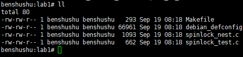

### 编译内核模块

```shell
benshushu:lab1# make
make -C /lib/modules/`uname -r`/build 
M=/mnt/rlk_lab/rlk_basic/chapter_10_lock/lab1 modules;
make[1]: Entering directory '/usr/src/linux'
 CC [M] /mnt/rlk_lab/rlk_basic/chapter_10_lock/lab1/spinlock_test.o
 LD [M] /mnt/rlk_lab/rlk_basic/chapter_10_lock/lab1/spinlock-test.o
 CC [M] /mnt/rlk_lab/rlk_basic/chapter_10_lock/lab1/spinlock_nest.o
 LD [M] /mnt/rlk_lab/rlk_basic/chapter_10_lock/lab1/spinlock-nest.o
 Building modules, stage 2.
 MODPOST 2 modules
 CC /mnt/rlk_lab/rlk_basic/chapter_10_lock/lab1/spinlock-nest.mod.o
 LD [M] /mnt/rlk_lab/rlk_basic/chapter_10_lock/lab1/spinlock-nest.ko
 CC /mnt/rlk_lab/rlk_basic/chapter_10_lock/lab1/spinlock-test.mod.o
 LD [M] /mnt/rlk_lab/rlk_basic/chapter_10_lock/lab1/spinlock-test.ko
 make[1]: Leaving directory '/usr/src/linux'
```

```makefile
BASEINCLUDE ?= /lib/modules/`uname -r`/build

spinlock-test-objs := spinlock_test.o
spinlock-nest-objs := spinlock_nest.o

obj-m	:=   spinlock-test.o
obj-m	+=   spinlock-nest.o
all :
	$(MAKE) -C $(BASEINCLUDE) M=$(PWD) modules;
clean:
	$(MAKE) -C $(BASEINCLUDE) M=$(PWD) clean;
	rm -f *.ko;
```

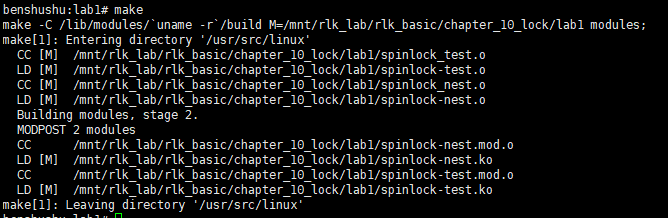

### 安装内核模块

```shell
benshushu:lab1# insmo]d spinlock-nest.ko
```

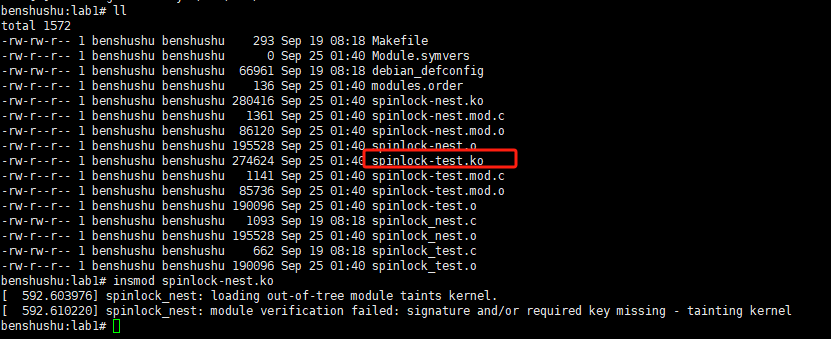

​		过一会，通过 dmesg 命令来查看内核日志信息，发现 rcu 已经检测到有 CPU 发生了 stall 现象。

```
[ 556.193652] spinlock_nest: loading out-of-tree module taints kernel.
[ 577.270607] rcu: INFO: rcu_sched self-detected stall on CPU
[ 577.272198] rcu: 3-....: (5224 ticks this GP) 
idle=cc6/1/0x4000000000000002 softirq=9601/9601 fqs=2324 
[ 577.272959] rcu: (t=5251 jiffies g=24341 q=598)
[ 577.274864] Task dump for CPU 3:
[ 577.275913] lockdep_test R running task 0 938 2 0x0000002a
[ 577.277490] Call trace:
[ 577.278980] dump_backtrace+0x0/0x528
[ 577.279723] show_stack+0x24/0x30
[ 577.280414] sched_show_task+0x6f4/0x730
[ 577.280774] dump_cpu_task+0x54/0x60
[ 577.281398] rcu_dump_cpu_stacks+0x330/0x414
[ 577.281699] print_cpu_stall+0x51c/0xaf8
[ 577.282078] check_cpu_stall+0x750/0x968
[ 577.282621] rcu_pending+0x64/0x38c
[ 577.282983] rcu_check_callbacks+0x54c/0x8e4
[ 577.283448] update_process_times+0x50/0x188
[ 577.284054] tick_sched_handle+0x9c/0xb0
[ 577.284293] tick_sched_timer+0xa4/0x108
[ 577.284543] __run_hrtimer+0x7d4/0xe6c
[ 577.285361] __hrtimer_run_queues+0xac/0x124
[ 577.285818] hrtimer_interrupt+0x464/0x9d8
[ 577.286394] arch_timer_handler_virt+0x7e4/0x824
[ 577.286800] handle_percpu_devid_irq+0x4e4/0xa14
[ 577.287338] generic_handle_irq+0x4c/0x5c
[ 577.288111] __handle_domain_irq+0x180/0x234
[ 577.288502] gic_handle_irq+0x1e4/0x590
[ 577.288818] el1_irq+0xb0/0x140
[ 577.289240] queued_spin_lock_slowpath+0x4c4/0x1994
[ 577.290901] nest_lock+0x538/0x62c [spinlock_nest]
[ 577.291202] lockdep_thread+0x3c/0x60 [spinlock_nest]
[ 577.291513] kthread+0x3c0/0x3cc
```

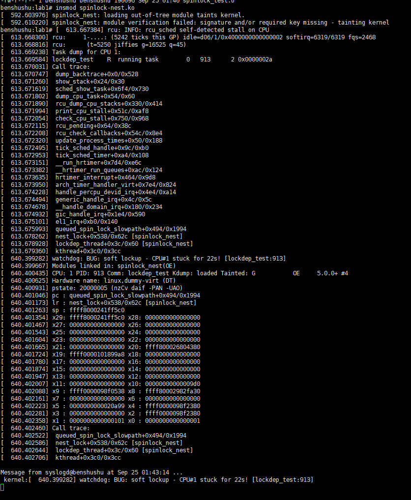

​		再过一会，系统的 watchdog 也触发了 soft lockup 了。

```
[ 604.305899] watchdog: BUG: soft lockup - CPU#3 stuck for 22s! 
[lockdep_test:938]
[ 604.306999] Modules linked in: spinlock_nest(O)
[ 604.307977] CPU: 3 PID: 938 Comm: lockdep_test Kdump: loaded Tainted: G 
O 5.0.0+ #4
[ 604.308329] Hardware name: linux,dummy-virt (DT)
[ 604.308747] pstate: 20000005 (nzCv daif -PAN -UAO)
[ 604.309020] pc : queued_spin_lock_slowpath+0x494/0x1994
[ 604.309622] lr : queued_spin_lock_slowpath+0x330/0x1994
[ 604.309895] sp : ffff80001fd3f5c0
[ 604.310084] x29: ffff80001fd3f5c0 x28: 0000000000000000 
[ 604.310648] x27: 0000000000000000 x26: 0000000000000000 
[ 604.311140] x25: 0000000000000000 x24: 0000000000000000 
[ 604.311324] x23: 0000000000000000 x22: 0000000000000000
[ 604.311626] x21: 0000000000000000 x20: ffff800028441300 
[ 604.311785] x19: ffff00001018b3e0 x18: 0000000000000000 
[ 604.312155] x17: 0000000000000000 x16: 0000000000000000 
[ 604.312332] x15: 0000000000000000 x14: 00000000000c8000 
[ 604.312588] x13: 0000000000000516 x12: 0000000000000516 
[ 604.312902] x11: ffffffffffffffff x10: 00000000000009d0 
[ 604.313254] x9 : ffff000009880538 x8 : ffff800029990a30 
[ 604.313913] x7 : 0000000000000000 x6 : 0000000000000000 
[ 604.314693] x5 : 000000000002021e x4 : ffff000009882380 
[ 604.315178] x3 : 0000000000000000 x2 : ffff000009882380 
[ 604.315541] x1 : 0000000000000101 x0 : 0000000000000001 
[ 604.315893] Call trace:
[ 604.316095] queued_spin_lock_slowpath+0x494/0x1994
[ 604.316403] nest_lock+0x538/0x62c [spinlock_nest]
[ 604.316776] lockdep_thread+0x3c/0x60 [spinlock_nest]
[ 604.317427] kthread+0x3c0/0x3cc
```

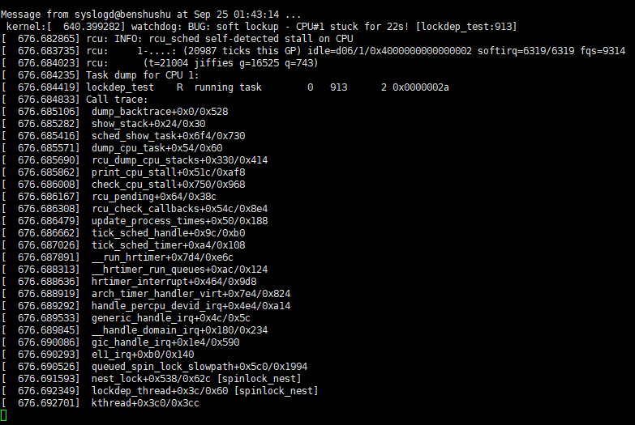

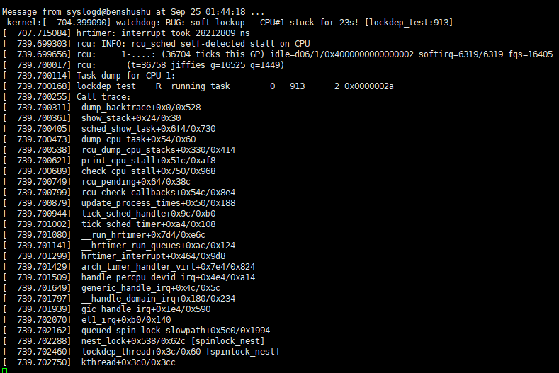

## 4．死锁检测

​		要在 Linux 内核中使用 Lockdep 功能，需要打开 CONFIG_DEBUG_LOCKDEP 选项。修改内核配置文件 arch/arm64/configs/debian _defconfig.

​		请在 Ubuntu 主机上修改如下文件：

```shell
/home/rlk/rlk/runninglinuxkernel_5.0/arch/arm64/configs/debian _defconfig
```

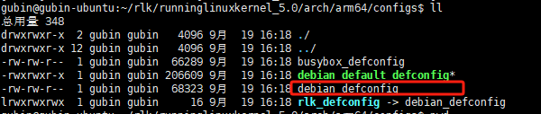

```shell
vim debian_defconfig
```

```
CONFIG_PROVE_LOCKING=y
CONFIG_LOCKDEP=y
CONFIG_LOCK_STAT=y
CONFIG_DEBUG_LOCKDEP=y
```

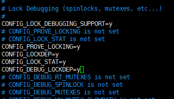

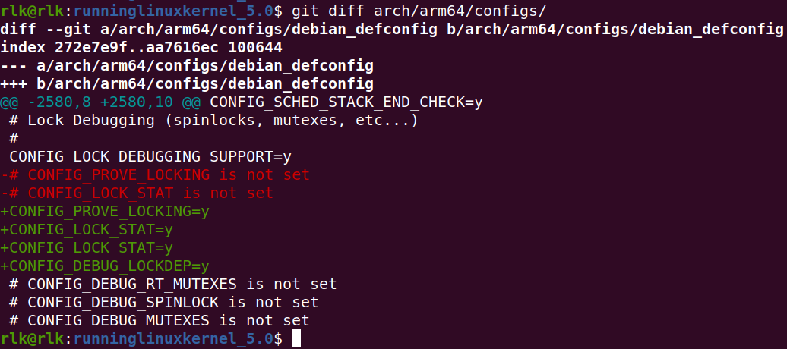

### 重新编译内核以及本实验的内核模块。

```shell
rlk@rlk:runninglinuxkernel_5.0$ ./run_debian_arm64.sh build_kernel
```

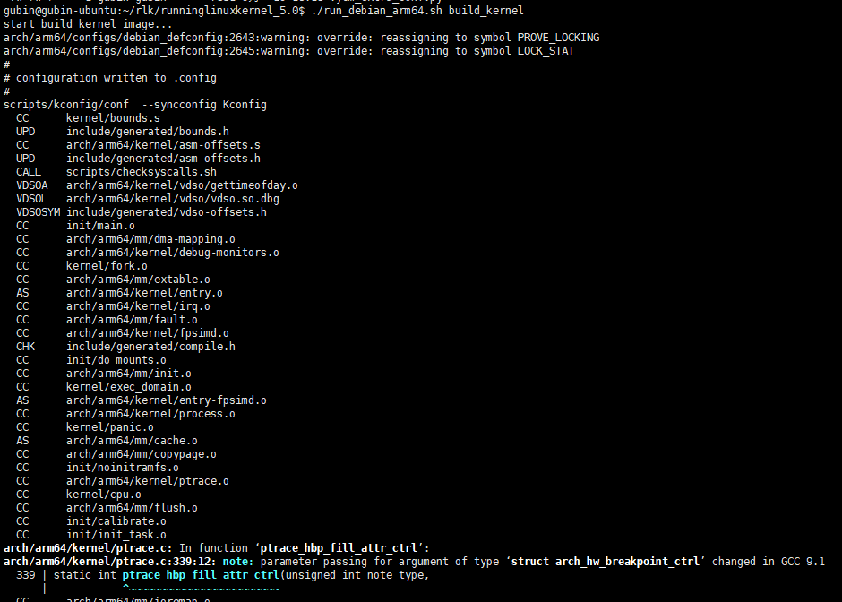

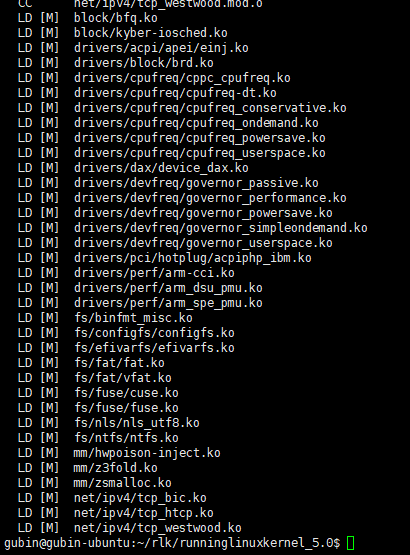

### 内核编译完成之后，我们还需要更新一下根文件系统

更新根文件需要root权限

```shell
rlk@rlk:runninglinuxkernel_5.0$ sudo ./run_rlk_arm64.sh update_rootfs
```

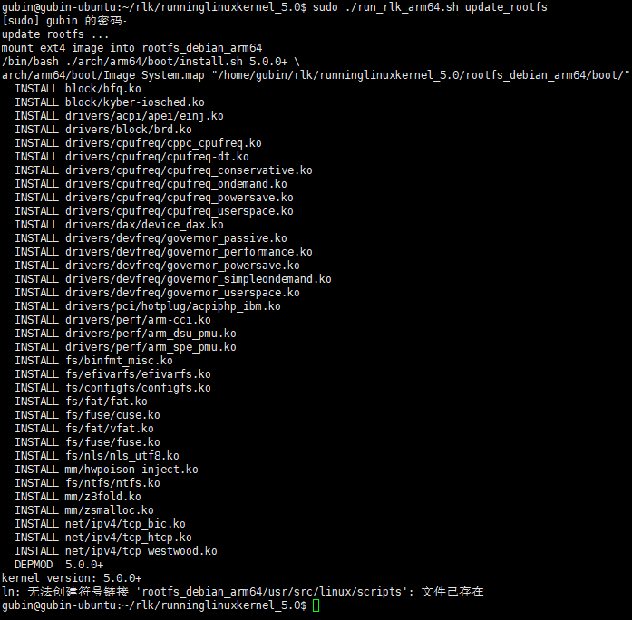

### 启动 QEMU+runninglinuxkernel。

```
$ ./run_rlk_arm64.sh run
```

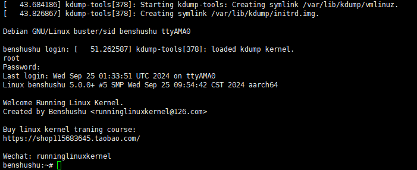

### 进入本实验的参考代码。

```
# cd /mnt/rlk_lab/rlk_basic/chapter_10_lock/lab1
```

### 重新编译内核模块。

```
benshushu:lab1# make
```

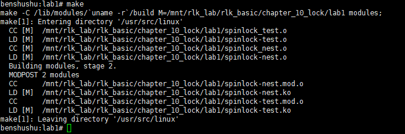

### 加载内核模块。

```
benshushu:lab1# insmod spinlock-nest.ko 
[ 290.903214] spinlock_nest: loading out-of-tree module taints kernel.
[ 290.996309] 
[ 290.997642] ============================================
[ 290.998886] WARNING: possible recursive locking detected
[ 290.999613] 5.0.0+ #5 Tainted: G O 
[ 291.000312] --------------------------------------------
[ 291.001301] lockdep_test/2013 is trying to acquire lock:
[ 291.003450] 000000002955add6 (hack_spinA){+.+.}, at: nest_lock+0x9c/0xf8 
[spinlock_nest]
[ 291.005816] 
[ 291.005816] but task is already holding lock:
[ 291.006203] 000000002955add6 (hack_spinA){+.+.}, at: nest_lock+0x2c/0xf8 
[spinlock_nest]
[ 291.006719] 
[ 291.006719] other info that might help us debug this:
[ 291.007150] Possible unsafe locking scenario:
[ 291.007150] 
[ 291.007596] CPU0
[ 291.007797] ----
[ 291.008007] lock(hack_spinA);
[ 291.008294] lock(hack_spinA);
[ 291.009004] 
[ 291.009004] *** DEADLOCK ***
[ 291.009004] 
[ 291.009654] May be due to missing lock nesting notation
[ 291.009654] 
[ 291.010372] 1 lock held by lockdep_test/2013:
[ 291.010839] #0: 000000002955add6 (hack_spinA){+.+.}, at: 
nest_lock+0x2c/0xf8 [spinlock_nest]
[ 291.011674] 
[ 291.011674] stack backtrace:
[ 291.012373] CPU: 2 PID: 2013 Comm: lockdep_test Kdump: loaded Tainted: G 
O 5.0.0+ #5
[ 291.013015] Hardware name: linux,dummy-virt (DT)
[ 291.013835] Call trace:
[ 291.014769] dump_backtrace+0x0/0x52c
[ 291.015583] show_stack+0x24/0x30
[ 291.016316] __dump_stack+0x20/0x2c
[ 291.016904] dump_stack+0x298/0x3fc
[ 291.017285] print_deadlock_bug+0x128/0x15c
[ 291.017603] check_deadlock+0x294/0x2bc
[ 291.017878] validate_chain+0x1220/0x14d0
[ 291.018137] __lock_acquire+0xaf4/0xc18
[ 291.018436] lock_acquire+0x664/0x6b8
[ 291.018835] _raw_spin_lock+0x4c/0x98
[ 291.019141] nest_lock+0x9c/0xf8 [spinlock_nest]
[ 291.019453] lockdep_thread+0x3c/0x60 [spinlock_nest]
[ 291.019901] kthread+0x3c0/0x3cc
```

​		从内核日志可以看到，lockdep 已经很清晰地显示了死锁发生的路径和发生时的函数调用的栈信息，开发者根据这些信息可以很快速地定位问题和解决问题。

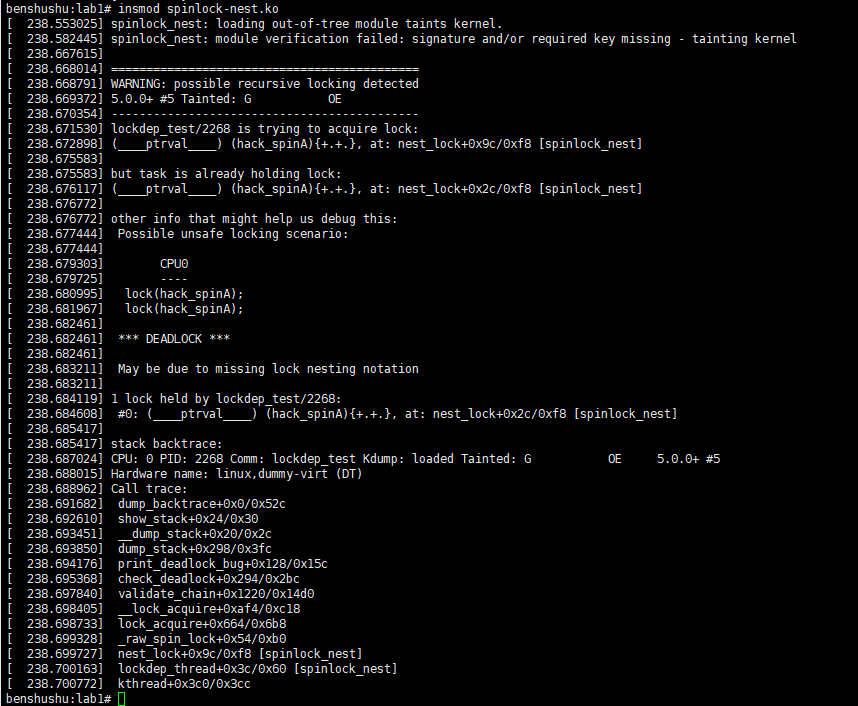

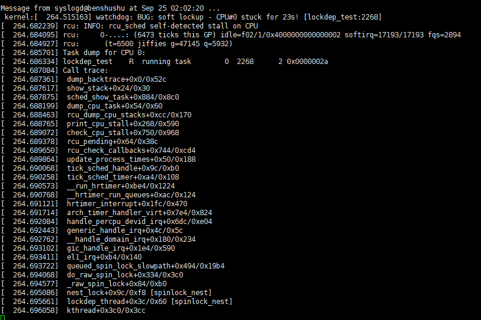

## 5．实验代码

```C
#include <linux/init.h>
#include <linux/module.h>
#include <linux/kernel.h>
#include <linux/kthread.h>
#include <linux/freezer.h>
#include <linux/delay.h>

static DEFINE_SPINLOCK(hack_spinA);
static struct page *page;
static struct task_struct *lock_thread;

static int nest_lock(void)
{
    int order = 5;

    spin_lock(&hack_spinA);
    page = alloc_pages(GFP_KERNEL, order);
    if (!page) {
        printk("cannot alloc pages\n");
        return -ENOMEM;
    }

    spin_lock(&hack_spinA); // Nested spinlock
    msleep(10);
    __free_pages(page, order);
    spin_unlock(&hack_spinA); // Unlock outer spinlock
    spin_unlock(&hack_spinA); // Unlock inner spinlock

    return 0;
}

static int lockdep_thread(void *nothing)
{
    set_freezable();
    set_user_nice(current, 0);

    while (!kthread_should_stop()) {
        msleep(10);
        nest_lock();
    }

    return 0;
}

static int __init my_init(void)
{
    lock_thread = kthread_run(lockdep_thread, NULL, "lockdep_test");
    if (IS_ERR(lock_thread)) {
        printk("create kthread fail\n");
        return PTR_ERR(lock_thread);
    }

    return 0;
}

static void __exit my_exit(void)
{
    kthread_stop(lock_thread);
}

MODULE_LICENSE("GPL");
module_init(my_init);
module_exit(my_exit);

```

------

### 详细注释和分析

```C
#include <linux/init.h>      // 内核模块初始化和退出的宏
#include <linux/module.h>    // Linux 模块相关定义
#include <linux/kernel.h>    // 内核相关常用定义
#include <linux/kthread.h>   // 内核线程的相关函数
#include <linux/freezer.h>   // 线程冻结管理相关函数
#include <linux/delay.h>     // 延时相关的内核函数

// 定义一个全局自旋锁变量 `hack_spinA`
static DEFINE_SPINLOCK(hack_spinA);

// 用于指向分配的内存页面的指针
static struct page *page;

// 用于保存创建的线程
static struct task_struct *lock_thread;

/**
 * nest_lock() - 一个模拟嵌套锁和内存分配的函数。
 * 
 * 1. 使用自旋锁保护内存分配和释放过程。
 * 2. 分配内存页面，然后释放。
 * 3. 嵌套调用自旋锁，模拟潜在的锁依赖性。
 */
static int nest_lock(void)
{
    // `order` 定义了要分配的页面块数 (2^order 个页)
    int order = 5;

    // 获取 `hack_spinA` 锁
    spin_lock(&hack_spinA);
    
    // 分配 2^order 个页面
    page = alloc_pages(GFP_KERNEL, order);
    if (!page) {
        // 如果分配失败，打印错误信息并返回 -ENOMEM
        printk("cannot alloc pages\n");
        return -ENOMEM;
    }

    // 再次加锁，模拟自旋锁的嵌套使用
    spin_lock(&hack_spinA);
    
    // 睡眠 10 毫秒，模拟耗时操作
    msleep(10);
    
    // 释放之前分配的页面
    __free_pages(page, order);
    
    // 解锁（内部锁）
    spin_unlock(&hack_spinA);
    
    // 解锁（外部锁）
    spin_unlock(&hack_spinA);

    return 0; // 返回成功
}

/**
 * lockdep_thread() - 一个线程函数，每隔 10 毫秒调用 `nest_lock` 函数。
 * 
 * 这个线程在运行过程中不断加锁和释放锁，并调用 `nest_lock` 进行内存分配与释放。
 */
static int lockdep_thread(void *nothing)
{
    // 使当前线程可被冻结
    set_freezable();

    // 设置线程优先级为 0
    set_user_nice(current, 0);

    // 线程的主要循环，直到 `kthread_should_stop` 返回 true
    while (!kthread_should_stop()) {
        // 每次循环延时 10 毫秒
        msleep(10);
        // 调用 `nest_lock` 进行锁操作
        nest_lock();
    }
    return 0; // 线程结束后返回
}

/**
 * my_init() - 模块初始化函数。
 * 
 * 1. 创建并运行一个内核线程，该线程负责反复调用 `nest_lock`。
 */
static int __init my_init(void)
{
    // 创建一个内核线程，并指定线程函数为 `lockdep_thread`
    lock_thread = kthread_run(lockdep_thread, NULL, "lockdep_test");

    // 如果线程创建失败，打印错误信息并返回错误码
    if (IS_ERR(lock_thread)) {
        printk("create kthread fail\n");
        return PTR_ERR(lock_thread);
    }

    return 0; // 模块初始化成功
}

/**
 * my_exit() - 模块卸载函数。
 * 
 * 1. 停止内核线程。
 */
static void __exit my_exit(void)
{
    // 停止之前创建的内核线程
    kthread_stop(lock_thread);
}

MODULE_LICENSE("GPL");     // 模块许可证声明为 GPL
module_init(my_init);      // 声明模块初始化函数
module_exit(my_exit);      // 声明模块卸载函数
```

### 详细分析：

#### 1. **锁与内存分配的基本逻辑**：

- 本模块通过创建一个内核线程来反复执行内存分配和释放操作，同时使用自旋锁（`spin_lock`）来保护这些操作。自旋锁是一种低开销、忙等待的锁，用于保护共享资源。
- `nest_lock` 函数通过 `alloc_pages` 分配内存页，并在成功后短暂睡眠（`msleep`），然后释放这些页。它还使用了嵌套自旋锁的方式，即在已经获取自旋锁的情况下再次获取锁，从而模拟了潜在的锁依赖问题。

#### 2. **内核线程的创建和运行**：

- 在 `my_init` 函数中，使用 `kthread_run` 创建并运行一个内核线程 `lock_thread`，该线程负责不断调用 `nest_lock` 函数进行加锁操作。这种方式常用于内核中需要后台执行的任务。
- `kthread_should_stop` 是一个用于检测线程是否应该停止的机制。线程在运行时会持续调用该函数，一旦内核发出停止信号（比如在模块卸载时），该函数将返回 true，导致线程退出循环并终止。

#### 3. **嵌套锁的作用**：

- 在 `nest_lock` 函数中，使用了两次 `spin_lock(&hack_spinA)`，这就是所谓的嵌套锁。虽然在该代码中，两个自旋锁是针对同一个锁的递归加锁，理论上在正常情况下不会导致问题，但如果锁定机制出错，可能会导致死锁等问题。
- 这个设计旨在模拟一些可能导致锁依赖性问题的场景，帮助开发者理解锁的正确使用方式，以及如何避免潜在的竞态条件和死锁问题。

#### 4. **模块初始化与卸载**：

- `my_init` 和 `my_exit` 分别是内核模块加载和卸载时调用的函数。在模块加载时，创建并启动内核线程，而在模块卸载时，使用 `kthread_stop` 停止该线程，确保资源的正确释放。

#### 5. **模块用途**：

- 该模块主要用于测试和研究内核中的锁机制、内存分配以及多线程的调度行为。通过反复嵌套加锁和释放内存，可以模拟一些复杂的锁依赖问题，供开发者分析内核中的潜在问题，如死锁或竞态条件。

#### 6. **注意事项**：

- 嵌套自旋锁通常应避免，因为它们可能会引起死锁。更好的方法是合理设计锁定顺序，并减少加锁的深度和时间，尤其是在内核代码中，因为自旋锁不会主动让出 CPU。

------

