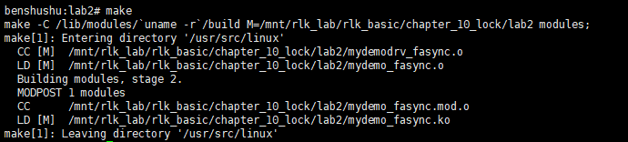
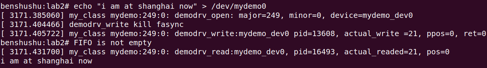

# 10.2 实验 10-2：互斥锁

## 1．实验目的

​		了解和熟悉互斥锁的使用。

## 2．实验要求

​		在第 6 章的虚拟 FIFO 设备中，我们并没有考虑多个进程同时访问设备驱动的情况，请使用互斥锁对虚拟 FIFO 设备驱动程序进行并发保护。我们首先要思考在这个虚拟 FIFO 设备驱动中有哪些资源是共享资源或者临界资源的。

## 3．实验步骤

### 下面是本实验的实验步骤。

### 启动 QEMU+runninglinuxkernel。

```
$ ./run_rlk_arm64.sh run
```

### 进入本实验的参考代码。

```
# cd /mnt/rlk_lab/rlk_basic/chapter_10_lock/lab2
```


### 编译内核模块。

```
benshushu:lab2# make
make -C /lib/modules/`uname -r`/build 
M=/mnt/rlk_lab/rlk_basic/chapter_10_lock/lab2 modules;
make[1]: Entering directory '/usr/src/linux'
 CC [M] /mnt/rlk_lab/rlk_basic/chapter_10_lock/lab2/mydemodrv_fasync.o
 LD [M] /mnt/rlk_lab/rlk_basic/chapter_10_lock/lab2/mydemo_fasync.o
 Building modules, stage 2.
 MODPOST 1 modules
 CC /mnt/rlk_lab/rlk_basic/chapter_10_lock/lab2/mydemo_fasync.mod.o
 LD [M] /mnt/rlk_lab/rlk_basic/chapter_10_lock/lab2/mydemo_fasync.ko
make[1]: Leaving directory '/usr/src/linux'
```

```
BASEINCLUDE ?= /lib/modules/`uname -r`/build

mydemo_fasync-objs := mydemodrv_fasync.o 

obj-m	:=   mydemo_fasync.o
all : 
	$(MAKE) -C $(BASEINCLUDE) M=$(PWD) modules;

clean:
	$(MAKE) -C $(BASEINCLUDE) M=$(PWD) clean;
	rm -f *.ko;
```



### 安装内核模块。

```
benshushu:lab2# insmod mydemo_fasync.ko 
[ 2835.649964] mydemo_fasync: loading out-of-tree module taints kernel.
[ 2835.745324] my_class mydemo:249:0: create device: 249:0
[ 2835.748650] mydemo_fifo=000000009a45d251
[ 2835.765567] my_class mydemo:249:1: create device: 249:1
[ 2835.768338] mydemo_fifo=0000000009209bae
[ 2835.780505] my_class mydemo:249:2: create device: 249:2
[ 2835.781704] mydemo_fifo=000000007504e367
[ 2835.793733] my_class mydemo:249:3: create device: 249:3
[ 2835.796229] mydemo_fifo=000000001ddd7c22
[ 2835.801679] my_class mydemo:249:4: create device: 249:4
[ 2835.807013] mydemo_fifo=000000005753919e
[ 2835.813912] my_class mydemo:249:5: create device: 249:5
[ 2835.820797] mydemo_fifo=00000000ba6562de
[ 2835.824803] my_class mydemo:249:6: create device: 249:6
[ 2835.826146] mydemo_fifo=00000000126c6698
[ 2835.837653] my_class mydemo:249:7: create device: 249:7
[ 2835.841038] mydemo_fifo=000000001a93c49a
[ 2835.842590] succeeded register char device: mydemo_dev
benshushu:lab2#
```


​		你会看到创建了 8 个设备。你可以到/sys/class/my_class/目录下面看到这些设备。

```
ls /sys/class/my_class
```


​		我们可以看到创建了主设备号为 249 的设备。我们再来看一下/dev/目录。


​		发现并没有主设备为 249 的设备。PS:我本机主设备是247

​		所以我们需要手工创建一个设备用来 test app。

```
#mknod /dev/mydemo0 c 249 0
```


​		切换到本实验的目录，然后编译 test 程序。

```
benshushu: # cd /mnt/rlk_lab/rlk_basic/chapter_10_lock/lab2

benshushu:lab2# gcc test.c -o test
```


​		接下来跑我们的 test 程序：

```shell
benshushu:lab2# ./test &
[1] 16493
[ 3122.697271] my_class mydemo:249:0: demodrv_open: major=249, minor=0, 
device=mydemo_dev0
[ 3122.711520] my_class mydemo:249:0: demodrv_fasync send SIGIO
```


​		然后使用 echo 命令来往/dev/mydemo0 这个设备写入字符串。

```shell
benshushu:lab2# echo "i am at shanghai now" > /dev/mydemo0 
[ 3171.385060] my_class mydemo:249:0: demodrv_open: major=249, minor=0, 
device=mydemo_dev0
[ 3171.404466] demodrv_write kill fasync
[ 3171.405722] my_class mydemo:249:0: demodrv_write:mydemo_dev0 pid=13608, 
actual_write =21, ppos=0, ret=0
benshushu:lab2# FIFO is not empty
[ 3171.431700] my_class mydemo:249:0: demodrv_read:mydemo_dev0, pid=16493, 
actual_readed=21, pos=0
i am at shanghai now
```




​		可以看到从 demodrv_read()函数把刚才写入的字符串已经读到用户空间了。

### 实验清理

```
kill -9 10410
```

```
rmmod mydemo_fasync
```

```
make clean
```


```
rm -f test
```


## 4．实验代码

​		首先我们需要在 struct mydemo_device 数据结构中添加一个 mutex 锁。

```C
struct mydemo_device {
    char name[64];
    struct device *dev;
    wait_queue_head_t read_queue;
    wait_queue_head_t write_queue;
    struct kfifo mydemo_fifo;
    struct fasync_struct *fasync;
    struct mutex lock;
};

```

​		struct mydemo_device 数据结构用来描述每一个设备，我们这个驱动中最多可以支持 8 个设备。因此这个 mutex 锁是每个设备一个锁。在使用 mutex 锁之前需要初始化。

```C
static int __init simple_char_init(void)
{
    ...
    for (i = 0; i < MYDEMO_MAX_DEVICES; i++) {
        device = kzalloc(sizeof(struct mydemo_device), GFP_KERNEL);
        if (!device) {
            ret = -ENOMEM;
            goto free_device;
        }
        sprintf(device->name, "%s%d", DEMO_NAME, i);
        mutex_init(&device->lock);
        device->dev = device_create(mydemo_class, NULL, MKDEV(dev, i), 
                                    NULL, "mydemo:%d:%d", MAJOR(dev), i);
        dev_info(device->dev, "create device: %d:%d\n", MAJOR(dev), 
                 MINOR(i));
        mydemo_device[i] = device;
        init_waitqueue_head(&device->read_queue);
        init_waitqueue_head(&device->write_queue);
        ret = kfifo_alloc(&device->mydemo_fifo,
                          MYDEMO_FIFO_SIZE,
                          GFP_KERNEL);
        if (ret) {
            ret = -ENOMEM;
            goto free_kfifo;
        }
        printk("mydemo_fifo=%p\n", &device->mydemo_fifo);
    }
    ...
}

```

​		在 simple_char_init()函数中，为每一个设备都调用 mutex_init 函数对锁进行初始化。

​		读者需要思考，究竟在什么地方需要使用 mutex 锁进行保护。

​		我们以 demodrv_read 函数为例。

```C
static int __init simple_char_init(void)
{
    ...
    for (i = 0; i < MYDEMO_MAX_DEVICES; i++) {
        device = kzalloc(sizeof(struct mydemo_device), GFP_KERNEL);
        if (!device) {
            ret = -ENOMEM;
            goto free_device;
        }
        sprintf(device->name, "%s%d", DEMO_NAME, i);
        mutex_init(&device->lock);
        device->dev = device_create(mydemo_class, NULL, MKDEV(dev, i), 
                                    NULL, "mydemo:%d:%d", MAJOR(dev), i);
        dev_info(device->dev, "create device: %d:%d\n", MAJOR(dev), MINOR(i));
        mydemo_device[i] = device;
        init_waitqueue_head(&device->read_queue);
        init_waitqueue_head(&device->write_queue);
        ret = kfifo_alloc(&device->mydemo_fifo, MYDEMO_FIFO_SIZE, GFP_KERNEL);
        if (ret) {
            ret = -ENOMEM;
            goto free_kfifo;
        }
        printk("mydemo_fifo=%p\n", &device->mydemo_fifo);
    }
    ...
}

```

​		什么地方需要加锁保护？我们需要考虑什么地方有可能是临界区，即有可能有其他进程或者内核代码路径同时进入该区域，并对数据进行改写或者破坏。我们认为对设备的 FIFO 进行读写操作时需要进行保护。


mydemodrv_fasync.c

```C
#include <linux/module.h>
#include <linux/fs.h>
#include <linux/uaccess.h>
#include <linux/init.h>
#include <linux/miscdevice.h>
#include <linux/device.h>
#include <linux/slab.h>
#include <linux/kfifo.h>
#include <linux/wait.h>
#include <linux/sched.h>
#include <linux/cdev.h>
#include <linux/poll.h>

#define DEMO_NAME "mydemo_dev"
#define MYDEMO_FIFO_SIZE 64

static dev_t dev;
static struct cdev *demo_cdev;
static struct class *mydemo_class;

struct mydemo_device {
	char name[64];
	struct device *dev;
        wait_queue_head_t read_queue;
	wait_queue_head_t write_queue;	
	struct kfifo mydemo_fifo;
	struct fasync_struct *fasync;
	struct mutex lock;
};

struct mydemo_private_data {
	struct mydemo_device *device;
	char name[64];	
};

#define MYDEMO_MAX_DEVICES  8
static struct mydemo_device *mydemo_device[MYDEMO_MAX_DEVICES]; 

static int demodrv_open(struct inode *inode, struct file *file)
{
	unsigned int minor = iminor(inode);
	struct mydemo_private_data *data;
	struct mydemo_device *device = mydemo_device[minor];

	dev_info(device->dev, "%s: major=%d, minor=%d, device=%s\n", __func__, 
			MAJOR(inode->i_rdev), MINOR(inode->i_rdev), device->name);

	data = kmalloc(sizeof(struct mydemo_private_data), GFP_KERNEL);
	if (!data)
		return -ENOMEM;

	sprintf(data->name, "private_data_%d", minor);

	data->device = device;
	file->private_data = data;

	return 0;
}

static int demodrv_release(struct inode *inode, struct file *file)
{
	struct mydemo_private_data *data = file->private_data;
	
	kfree(data);
    
	return 0;
}

static ssize_t
demodrv_read(struct file *file, char __user *buf, size_t count, loff_t *ppos)
{
	struct mydemo_private_data *data = file->private_data;
	struct mydemo_device *device = data->device;
	int actual_readed;
	int ret;


	if (kfifo_is_empty(&device->mydemo_fifo)) {
		if (file->f_flags & O_NONBLOCK)
			return -EAGAIN;

		dev_info(device->dev, "%s:%s pid=%d, going to sleep, %s\n", __func__, device->name, current->pid, data->name);
		ret = wait_event_interruptible(device->read_queue,
					!kfifo_is_empty(&device->mydemo_fifo));
		if (ret)
			return ret;
	}

	mutex_lock(&device->lock);
	ret = kfifo_to_user(&device->mydemo_fifo, buf, count, &actual_readed);
	if (ret)
		return -EIO;
	mutex_unlock(&device->lock);

	if (!kfifo_is_full(&device->mydemo_fifo)){
		wake_up_interruptible(&device->write_queue);
		kill_fasync(&device->fasync, SIGIO, POLL_OUT);
	}

	
	dev_info(device->dev, "%s:%s, pid=%d, actual_readed=%d, pos=%lld\n",__func__,
			device->name, current->pid, actual_readed, *ppos);
	return actual_readed;
}

static ssize_t
demodrv_write(struct file *file, const char __user *buf, size_t count, loff_t *ppos)
{
	struct mydemo_private_data *data = file->private_data;
	struct mydemo_device *device = data->device;

	unsigned int actual_write;
	int ret;

	if (kfifo_is_full(&device->mydemo_fifo)){
		if (file->f_flags & O_NONBLOCK)
			return -EAGAIN;

		dev_info(device->dev, "%s:%s pid=%d, going to sleep\n", __func__, device->name, current->pid);
		ret = wait_event_interruptible(device->write_queue,
				!kfifo_is_full(&device->mydemo_fifo));
		if (ret)
			return ret;
	}

	mutex_lock(&device->lock);

	ret = kfifo_from_user(&device->mydemo_fifo, buf, count, &actual_write);
	if (ret)
		return -EIO;
	mutex_unlock(&device->lock);

	if (!kfifo_is_empty(&device->mydemo_fifo)) {
		wake_up_interruptible(&device->read_queue);
		kill_fasync(&device->fasync, SIGIO, POLL_IN);
		printk("%s kill fasync\n", __func__);
	}

	dev_info(device->dev, "%s:%s pid=%d, actual_write =%d, ppos=%lld, ret=%d\n", __func__,
			device->name, current->pid, actual_write, *ppos, ret);

	return actual_write;
}

static unsigned int demodrv_poll(struct file *file, poll_table *wait)
{
	int mask = 0;
	struct mydemo_private_data *data = file->private_data;
	struct mydemo_device *device = data->device;

	mutex_lock(&device->lock);

	poll_wait(file, &device->read_queue, wait);
        poll_wait(file, &device->write_queue, wait);

	if (!kfifo_is_empty(&device->mydemo_fifo))
		mask |= POLLIN | POLLRDNORM;
	if (!kfifo_is_full(&device->mydemo_fifo))
		mask |= POLLOUT | POLLWRNORM;

	mutex_unlock(&device->lock);
	
	return mask;
}

static int demodrv_fasync(int fd, struct file *file, int on)
{
	struct mydemo_private_data *data = file->private_data;
	struct mydemo_device *device = data->device;
	int ret;

	mutex_lock(&device->lock);

	dev_info(device->dev, "%s send SIGIO\n", __func__);
	ret = fasync_helper(fd, file, on, &device->fasync);
	mutex_unlock(&device->lock);

	return ret;
}

static const struct file_operations demodrv_fops = {
	.owner = THIS_MODULE,
	.open = demodrv_open,
	.release = demodrv_release,
	.read = demodrv_read,
	.write = demodrv_write,
        .poll = demodrv_poll,
	.fasync = demodrv_fasync,
};

static int __init simple_char_init(void)
{
	int ret;
	int i;
	struct mydemo_device *device;
	
	ret = alloc_chrdev_region(&dev, 0, MYDEMO_MAX_DEVICES, DEMO_NAME);
	if (ret) {
		printk("failed to allocate char device region");
		return ret;
	}

	demo_cdev = cdev_alloc();
	if (!demo_cdev) {
		printk("cdev_alloc failed\n");
		goto unregister_chrdev;
	}

	cdev_init(demo_cdev, &demodrv_fops);
	
	ret = cdev_add(demo_cdev, dev, MYDEMO_MAX_DEVICES);
	if (ret) {
		printk("cdev_add failed\n");
		goto cdev_fail;
	}
	
	mydemo_class = class_create(THIS_MODULE, "my_class");

	for (i = 0; i < MYDEMO_MAX_DEVICES; i++) {
		device = kzalloc(sizeof(struct mydemo_device), GFP_KERNEL);
		if (!device) {
			ret = -ENOMEM;
			goto free_device;
		}

		sprintf(device->name, "%s%d", DEMO_NAME, i);
		mutex_init(&device->lock);

		device->dev = device_create(mydemo_class, NULL, MKDEV(dev, i), NULL, "mydemo:%d:%d", MAJOR(dev), i);
		dev_info(device->dev, "create device: %d:%d\n", MAJOR(dev), MINOR(i));
		mydemo_device[i] = device;
		init_waitqueue_head(&device->read_queue);
		init_waitqueue_head(&device->write_queue);

		ret = kfifo_alloc(&device->mydemo_fifo,
				MYDEMO_FIFO_SIZE,
				GFP_KERNEL);
		if (ret) {
			ret = -ENOMEM;
			goto free_kfifo;
		}

		printk("mydemo_fifo=%p\n", &device->mydemo_fifo);

	}

	printk("succeeded register char device: %s\n", DEMO_NAME);

	return 0;

free_kfifo:
	for (i =0; i < MYDEMO_MAX_DEVICES; i++)
		if (&device->mydemo_fifo)
			 kfifo_free(&device->mydemo_fifo);
free_device:
	for (i =0; i < MYDEMO_MAX_DEVICES; i++)
		if (mydemo_device[i])
			kfree(mydemo_device[i]);
cdev_fail:
	cdev_del(demo_cdev);
unregister_chrdev:
	unregister_chrdev_region(dev, MYDEMO_MAX_DEVICES);
	return ret;
}

static void __exit simple_char_exit(void)
{
	int i;
	printk("removing device\n");

	if (demo_cdev)
		cdev_del(demo_cdev);

	unregister_chrdev_region(dev, MYDEMO_MAX_DEVICES);

	for (i =0; i < MYDEMO_MAX_DEVICES; i++) {
		if (mydemo_device[i]) {
			device_destroy(mydemo_class, MKDEV(dev, i));
			kfree(mydemo_device[i]);	

		}
	}
	class_destroy(mydemo_class);
}

module_init(simple_char_init);
module_exit(simple_char_exit);

MODULE_AUTHOR("Benshushu");
MODULE_LICENSE("GPL v2");
MODULE_DESCRIPTION("simpe character device");
```

test.c

```C
#define _GNU_SOURCE
#include <stdio.h>
#include <stdlib.h>
#include <string.h>
#include <unistd.h>
#include <sys/types.h>
#include <sys/stat.h>
#include <sys/ioctl.h>
#include <fcntl.h>
#include <errno.h>
#include <poll.h>
#include <signal.h>

static int fd;

void my_signal_fun(int signum, siginfo_t *siginfo, void *act)
{
	int ret;
	char buf[64];

	if (signum == SIGIO) {
		if (siginfo->si_band & POLLIN) {
			printf("FIFO is not empty\n");
			if ((ret = read(fd, buf, sizeof(buf))) != -1) {
				buf[ret] = '\0';
				puts(buf);
			}
		}
		if (siginfo->si_band & POLLOUT)
			printf("FIFO is not full\n");
	}
}

int main(int argc, char *argv[])
{
	int ret;
	int flag;
	struct sigaction act, oldact;

	sigemptyset(&act.sa_mask);
	sigaddset(&act.sa_mask, SIGIO);
	act.sa_flags = SA_SIGINFO;
	act.sa_sigaction = my_signal_fun;
	if (sigaction(SIGIO, &act, &oldact) == -1)
		goto fail;

	fd = open("/dev/mydemo0", O_RDWR);
	if (fd < 0) 
		goto fail;

	/*设置异步IO所有权*/
	if (fcntl(fd, F_SETOWN, getpid()) == -1)
		goto fail;
	
	/*将当前进程PID设置为fd文件所对应驱动程序将要发送SIGIO,SIGUSR信号进程PID*/
	if (fcntl(fd, F_SETSIG, SIGIO) == -1)
		goto fail;
	
	/*获取文件flags*/
	if ((flag = fcntl(fd, F_GETFL)) == -1)
		goto fail;
	
	/*设置文件flags, 设置FASYNC,支持异步通知*/
	if (fcntl(fd, F_SETFL, flag | FASYNC) == -1)
		goto fail;

	while (1)
		sleep(1);

fail:
	perror("fasync test");
	exit(EXIT_FAILURE);
}

```

------

### 代码分析与注释

该代码实现了一个简单的字符设备驱动程序，提供了基本的读写、设备异步通知、设备轮询等功能。它创建了一个包含多个虚拟设备的驱动，并且为每个设备分配了 FIFO（先进先出队列）来缓存数据。该驱动使用 `fasync` 机制来处理异步通知，并实现了 `poll` 函数来支持非阻塞 I/O 操作。

#### 主要模块

1. **设备结构体 `mydemo_device`**:
   - 包含设备相关的状态信息，包括设备名、读写等待队列、FIFO 缓冲区、文件异步通知相关的结构、互斥锁等。
2. **文件操作函数 `demodrv_open`, `demodrv_release`, `demodrv_read`, `demodrv_write`, `demodrv_poll`, `demodrv_fasync`**:
   - 这些函数是文件操作的具体实现，分别用于打开设备、释放设备、读写数据、轮询设备状态以及异步通知。
3. **字符设备的注册与初始化**:
   - 使用 `cdev_add` 注册字符设备，并使用 `alloc_chrdev_region` 分配设备号。
4. **设备类创建与销毁**:
   - 使用 `class_create` 创建设备类，并为每个设备创建对应的设备节点。

------

#### 详细注释

```C
c复制代码#include <linux/module.h>
#include <linux/fs.h>
#include <linux/uaccess.h>
#include <linux/init.h>
#include <linux/miscdevice.h>
#include <linux/device.h>
#include <linux/slab.h>
#include <linux/kfifo.h>
#include <linux/wait.h>
#include <linux/sched.h>
#include <linux/cdev.h>
#include <linux/poll.h>

#define DEMO_NAME "mydemo_dev"  // 设备名
#define MYDEMO_FIFO_SIZE 64     // FIFO 缓冲区大小

static dev_t dev;               // 全局设备号
static struct cdev *demo_cdev;  // 字符设备结构
static struct class *mydemo_class;  // 设备类

// 设备结构体，包含设备相关的状态信息
struct mydemo_device {
    char name[64];                     // 设备名
    struct device *dev;                // 设备结构指针
    wait_queue_head_t read_queue;      // 读等待队列
    wait_queue_head_t write_queue;     // 写等待队列
    struct kfifo mydemo_fifo;          // FIFO 缓冲区
    struct fasync_struct *fasync;      // 异步通知结构
    struct mutex lock;                 // 设备互斥锁
};

// 每个进程的私有数据
struct mydemo_private_data {
    struct mydemo_device *device;      // 指向设备的指针
    char name[64];                     // 私有数据名称
};

#define MYDEMO_MAX_DEVICES 8           // 最大设备数量
static struct mydemo_device *mydemo_device[MYDEMO_MAX_DEVICES];  // 设备数组

// 打开设备函数
static int demodrv_open(struct inode *inode, struct file *file)
{
    unsigned int minor = iminor(inode);  // 获取次设备号
    struct mydemo_private_data *data;
    struct mydemo_device *device = mydemo_device[minor];

    dev_info(device->dev, "%s: major=%d, minor=%d, device=%s\n", 
             __func__, MAJOR(inode->i_rdev), MINOR(inode->i_rdev), device->name);

    // 为私有数据分配内存
    data = kmalloc(sizeof(struct mydemo_private_data), GFP_KERNEL);
    if (!data)
        return -ENOMEM;

    sprintf(data->name, "private_data_%d", minor);
    data->device = device;  // 关联设备
    file->private_data = data;  // 保存私有数据

    return 0;
}

// 关闭设备函数
static int demodrv_release(struct inode *inode, struct file *file)
{
    struct mydemo_private_data *data = file->private_data;
    kfree(data);  // 释放私有数据
    return 0;
}

// 读设备函数
static ssize_t demodrv_read(struct file *file, char __user *buf, size_t count, loff_t *ppos)
{
    struct mydemo_private_data *data = file->private_data;
    struct mydemo_device *device = data->device;
    int actual_readed;
    int ret;

    // 如果 FIFO 为空，进程阻塞
    if (kfifo_is_empty(&device->mydemo_fifo)) {
        if (file->f_flags & O_NONBLOCK)
            return -EAGAIN;
        
        dev_info(device->dev, "%s:%s pid=%d, going to sleep, %s\n", __func__, 
                 device->name, current->pid, data->name);
        ret = wait_event_interruptible(device->read_queue, 
                                       !kfifo_is_empty(&device->mydemo_fifo));
        if (ret)
            return ret;
    }

    // 加锁并从 FIFO 中读取数据
    mutex_lock(&device->lock);
    ret = kfifo_to_user(&device->mydemo_fifo, buf, count, &actual_readed);
    if (ret)
        return -EIO;
    mutex_unlock(&device->lock);

    // 唤醒写等待队列
    if (!kfifo_is_full(&device->mydemo_fifo)){
        wake_up_interruptible(&device->write_queue);
        kill_fasync(&device->fasync, SIGIO, POLL_OUT);
    }

    dev_info(device->dev, "%s:%s, pid=%d, actual_readed=%d, pos=%lld\n", 
             __func__, device->name, current->pid, actual_readed, *ppos);
    return actual_readed;
}

// 写设备函数
static ssize_t demodrv_write(struct file *file, const char __user *buf, size_t count, loff_t *ppos)
{
    struct mydemo_private_data *data = file->private_data;
    struct mydemo_device *device = data->device;
    unsigned int actual_write;
    int ret;

    // 如果 FIFO 已满，进程阻塞
    if (kfifo_is_full(&device->mydemo_fifo)){
        if (file->f_flags & O_NONBLOCK)
            return -EAGAIN;
        
        dev_info(device->dev, "%s:%s pid=%d, going to sleep\n", __func__, 
                 device->name, current->pid);
        ret = wait_event_interruptible(device->write_queue, 
                                       !kfifo_is_full(&device->mydemo_fifo));
        if (ret)
            return ret;
    }

    // 加锁并将数据写入 FIFO
    mutex_lock(&device->lock);
    ret = kfifo_from_user(&device->mydemo_fifo, buf, count, &actual_write);
    if (ret)
        return -EIO;
    mutex_unlock(&device->lock);

    // 唤醒读等待队列
    if (!kfifo_is_empty(&device->mydemo_fifo)) {
        wake_up_interruptible(&device->read_queue);
        kill_fasync(&device->fasync, SIGIO, POLL_IN);
    }

    dev_info(device->dev, "%s:%s pid=%d, actual_write=%d, ppos=%lld, ret=%d\n", 
             __func__, device->name, current->pid, actual_write, *ppos, ret);
    return actual_write;
}

// 轮询函数，检查是否可以读写
static unsigned int demodrv_poll(struct file *file, poll_table *wait)
{
    int mask = 0;
    struct mydemo_private_data *data = file->private_data;
    struct mydemo_device *device = data->device;

    mutex_lock(&device->lock);

    poll_wait(file, &device->read_queue, wait);
    poll_wait(file, &device->write_queue, wait);

    // 如果 FIFO 不为空，表示可读
    if (!kfifo_is_empty(&device->mydemo_fifo))
        mask |= POLLIN | POLLRDNORM;
    // 如果 FIFO 不满，表示可写
    if (!kfifo_is_full(&device->mydemo_fifo))
        mask |= POLLOUT | POLLWRNORM;

    mutex_unlock(&device->lock);
    return mask;
}

// 异步通知函数
static int demodrv_fasync(int fd, struct file *file, int on)
{
    struct mydemo_private_data *data = file->private_data;
    struct mydemo_device *device = data->device;
    int ret;

    mutex_lock(&device->lock);
    dev_info(device->dev, "%s send SIGIO\n", __func__);
    ret = fasync_helper(fd, file, on, &device->fasync);
    mutex_unlock(&device->lock);
    return ret;
}

// 文件操作结构体
static const struct file_operations demodrv_fops = {
    .owner = THIS_MODULE,
    .open = demodrv_open,
    .release = demodrv_release,
    .read = demodrv_read,
    .write = demodrv_write,
    .poll = demodrv_poll,
    .fasync = demodrv_fasync,
};

// 初始化函数，注册设备
static int __init simple_char_init(void)
```