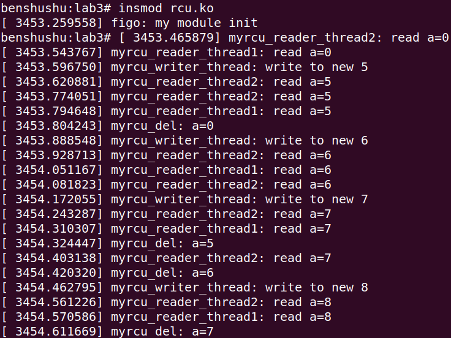
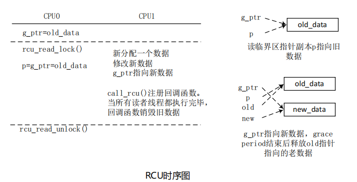

# 10.3 实验 10-3：RCU

## 1．实验目的

了解和熟悉 RCU 锁的使用。

## 2．实验要求

编写一个简单的内核模块，创建一个读者内核线程和一个写者内核线程来模拟同

步访问共享变量的情景。

## 3．实验步骤

### 下面是本实验的实验步骤。

### 启动 QEMU+runninglinuxkernel。

```
$ ./run_rlk_arm64.sh run
```


### 进入本实验的参考代码。

```
# cd /mnt/rlk_lab/rlk_basic/chapter_10_lock/lab3
```


### 编译内核模块。

```
benshushu:lab3# make
make -C /lib/modules/`uname -r`/build 
M=/mnt/rlk_lab/rlk_basic/chapter_10_lock/lab3 modules;
make[1]: Entering directory '/usr/src/linux'
 CC [M] /mnt/rlk_lab/rlk_basic/chapter_10_lock/lab3/rcu_test.o
 LD [M] /mnt/rlk_lab/rlk_basic/chapter_10_lock/lab3/rcu.o
 Building modules, stage 2.
 MODPOST 1 modules
 CC /mnt/rlk_lab/rlk_basic/chapter_10_lock/lab3/rcu.mod.o
 LD [M] /mnt/rlk_lab/rlk_basic/chapter_10_lock/lab3/rcu.ko
make[1]: Leaving directory '/usr/src/linux'
```

### 安装内核模块。

```
benshushu:lab3# insmod rcu.ko 
[ 3453.259558] figo: my module init
benshushu:lab3# [ 3453.465879] myrcu_reader_thread2: read a=0
[ 3453.543767] myrcu_reader_thread1: read a=0
[ 3453.596750] myrcu_writer_thread: write to new 5
[ 3453.620881] myrcu_reader_thread2: read a=5
[ 3453.774051] myrcu_reader_thread2: read a=5
[ 3453.794648] myrcu_reader_thread1: read a=5
[ 3453.804243] myrcu_del: a=0
[ 3453.888548] myrcu_writer_thread: write to new 6
[ 3453.928713] myrcu_reader_thread2: read a=6
[ 3454.051167] myrcu_reader_thread1: read a=6
[ 3454.081823] myrcu_reader_thread2: read a=6
[ 3454.172055] myrcu_writer_thread: write to new 7
[ 3454.243287] myrcu_reader_thread2: read a=7
[ 3454.310307] myrcu_reader_thread1: read a=7
[ 3454.324447] myrcu_del: a=5
[ 3454.403138] myrcu_reader_thread2: read a=7
[ 3454.420320] myrcu_del: a=6
```



可以看到：

该例子的目的是通过 RCU 机制保护 my_test_init()分配的共享数据结构 g_ptr，另

外创建了一个读者线程和一个写者线程来模拟同步场景。

对于读者线程 myrcu_reader_thread：

 通过 rcu_read_lock()和 rcu_read_unlock()来构建一个读者临界区。

 调用 rcu_dereference()获取被保护数据 g_ptr 指针的一个副本，即指

针 p，这时 p 和 g_ptr 都指向旧的被保护数据。

 读者线程每隔一段时间读取一次被保护数据。

对于写者线程 myrcu_writer_thread：

 分配一个新的保护数据 new_ptr，并修改相应数据。

 rcu_assign_pointer()让 g_ptr 指向新数据。

 call_rcu()注册一个回调函数，确保所有对旧数据的引用都执行完成

之后，才调用回调函数来删除旧数据 old_data。

 写者线程每隔一段时间修改被保护数据。

上述过程如图所示。



在所有的读访问完成之后，内核可以释放旧数据，对于何时释放旧数据，内核提

供了两个 API 函数：synchronize_rcu()和 call_rcu()。

## 4．实验代码

```
1 #include <linux/kernel.h>
2 #include <linux/module.h>
3 #include <linux/init.h>
4 #include <linux/slab.h>
5 #include <linux/spinlock.h>
6 #include <linux/rcupdate.h>
7 #include <linux/kthread.h>
8 #include <linux/delay.h>
9 
10 struct foo {
11 int a;
12 struct rcu_head rcu;
13 };
14 
15 static struct foo *g_ptr;
16 
17 static int myrcu_reader_thread1(void *data) //读者线程1
18 {
19 struct foo *p1 = NULL;
20 
21 while (1) {
22 if(kthread_should_stop())
23 break;
24 msleep(20);
25 rcu_read_lock();
26 mdelay(200);
27 p1 = rcu_dereference(g_ptr);
28 if (p1)
29 printk("%s: read a=%d\n", __func__, p1->a);
30 rcu_read_unlock();
31 }
32 
33 return 0;
34 }
35 
36 static int myrcu_reader_thread2(void *data) //读者线程2
37 {
38 struct foo *p2 = NULL;
39 
40 while (1) {
41 if(kthread_should_stop())
42 break;
43 msleep(30);
44 rcu_read_lock();
45 mdelay(100);
46 p2 = rcu_dereference(g_ptr);
47 if (p2)
48 printk("%s: read a=%d\n", __func__, p2->a);
49 
50 rcu_read_unlock();
51 }
52 
53 return 0;
54 }
55 
56 static void myrcu_del(struct rcu_head *rh)
57 {
58 struct foo *p = container_of(rh, struct foo, rcu);
59 printk("%s: a=%d\n", __func__, p->a);
60 kfree(p);
61 }
62 
63 static int myrcu_writer_thread(void *p) //写者线程
64 {
65 struct foo *old;
66 struct foo *new_ptr;
67 int value = (unsigned long)p;
68 
69 while (1) {
70 if(kthread_should_stop())
71 break;
72 msleep(250);
73 new_ptr = kmalloc(sizeof (struct foo), GFP_KERNEL);
74 old = g_ptr;
75 *new_ptr = *old;
76 new_ptr->a = value;
77 rcu_assign_pointer(g_ptr, new_ptr);
78 call_rcu(&old->rcu, myrcu_del);
79 printk("%s: write to new %d\n", __func__, value);
80 value++;
81 }
82 
83 return 0;
84 }
85 
86 static struct task_struct *reader_thread1;
87 static struct task_struct *reader_thread2;
88 static struct task_struct *writer_thread;
89 
90 static int __init my_test_init(void)
91 {
92 int value = 5;
93 
94 printk("figo: my module init\n");
95 g_ptr = kzalloc(sizeof (struct foo), GFP_KERNEL);
96 
97 reader_thread1 = kthread_run(myrcu_reader_thread1, NULL,
"rcu_reader1");
98 reader_thread2 = kthread_run(myrcu_reader_thread2, NULL, 
"rcu_reader2");
99 writer_thread = kthread_run(myrcu_writer_thread, (void *)(unsigned 
long)value, "rcu_writer");
100
101 return 0;
102}
103static void __exit my_test_exit(void)
104{
105 printk("goodbye\n");
106 kthread_stop(reader_thread1);
107 kthread_stop(reader_thread2);
108 kthread_stop(writer_thread);
109 if (g_ptr)
110 kfree(g_ptr);
111}
112MODULE_LICENSE("GPL");
113module_init(my_test_init);
114module_exit(my_test_exit);
```

