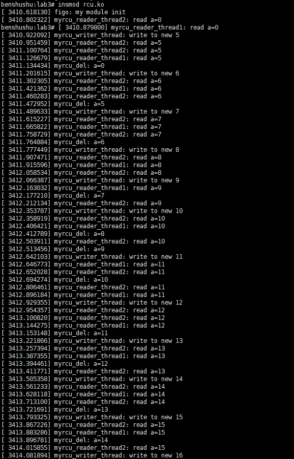

# 10.3 实验 10-3：RCU

## 1．实验目的

了解和熟悉 RCU 锁的使用。

## 2．实验要求

编写一个简单的内核模块，创建一个读者内核线程和一个写者内核线程来模拟同

步访问共享变量的情景。

## 3．实验步骤

### 下面是本实验的实验步骤。

### 启动 QEMU+runninglinuxkernel。

```
$ ./run_rlk_arm64.sh run
```

### 进入本实验的参考代码。

```
# cd /mnt/rlk_lab/rlk_basic/chapter_10_lock/lab3
```


### 编译内核模块。

```
benshushu:lab3# make
make -C /lib/modules/`uname -r`/build 
M=/mnt/rlk_lab/rlk_basic/chapter_10_lock/lab3 modules;
make[1]: Entering directory '/usr/src/linux'
 CC [M] /mnt/rlk_lab/rlk_basic/chapter_10_lock/lab3/rcu_test.o
 LD [M] /mnt/rlk_lab/rlk_basic/chapter_10_lock/lab3/rcu.o
 Building modules, stage 2.
 MODPOST 1 modules
 CC /mnt/rlk_lab/rlk_basic/chapter_10_lock/lab3/rcu.mod.o
 LD [M] /mnt/rlk_lab/rlk_basic/chapter_10_lock/lab3/rcu.ko
make[1]: Leaving directory '/usr/src/linux'
```

```makefile
BASEINCLUDE ?= /lib/modules/`uname -r`/build
ccflags-y :=-g

rcu-objs := rcu_test.o 

obj-m	:=   rcu.o
all : 
	$(MAKE) -C $(BASEINCLUDE) M=$(PWD) modules;

clean:
	$(MAKE) -C $(BASEINCLUDE) M=$(PWD) clean;
	rm -f *.ko;
```


### 安装内核模块。

```shell
benshushu:lab3# insmod rcu.ko 
[ 3453.259558] figo: my module init
benshushu:lab3# [ 3453.465879] myrcu_reader_thread2: read a=0
[ 3453.543767] myrcu_reader_thread1: read a=0
[ 3453.596750] myrcu_writer_thread: write to new 5
[ 3453.620881] myrcu_reader_thread2: read a=5
[ 3453.774051] myrcu_reader_thread2: read a=5
[ 3453.794648] myrcu_reader_thread1: read a=5
[ 3453.804243] myrcu_del: a=0
[ 3453.888548] myrcu_writer_thread: write to new 6
[ 3453.928713] myrcu_reader_thread2: read a=6
[ 3454.051167] myrcu_reader_thread1: read a=6
[ 3454.081823] myrcu_reader_thread2: read a=6
[ 3454.172055] myrcu_writer_thread: write to new 7
[ 3454.243287] myrcu_reader_thread2: read a=7
[ 3454.310307] myrcu_reader_thread1: read a=7
[ 3454.324447] myrcu_del: a=5
[ 3454.403138] myrcu_reader_thread2: read a=7
[ 3454.420320] myrcu_del: a=6
```


​		可以看到：

​		该例子的目的是通过 RCU 机制保护 my_test_init()分配的共享数据结构 g_ptr，另外创建了一个读者线程和一个写者线程来模拟同步场景。

​		对于读者线程 myrcu_reader_thread：

- 通过 rcu_read_lock()和 rcu_read_unlock()来构建一个读者临界区。


- 调用 rcu_dereference()获取被保护数据 g_ptr 指针的一个副本，即指


针 p，这时 p 和 g_ptr 都指向旧的被保护数据。

- 读者线程每隔一段时间读取一次被保护数据。


对于写者线程 myrcu_writer_thread：

- 分配一个新的保护数据 new_ptr，并修改相应数据。


- rcu_assign_pointer()让 g_ptr 指向新数据。


- call_rcu()注册一个回调函数，确保所有对旧数据的引用都执行完成


之后，才调用回调函数来删除旧数据 old_data。

- 写者线程每隔一段时间修改被保护数据。


上述过程如图所示。


​		在所有的读访问完成之后，内核可以释放旧数据，对于何时释放旧数据，内核提供了两个 API 函数：synchronize_rcu()和 call_rcu()。




PS:一直运行，无法停止，无奈关闭虚拟机，后面分析原因

## 4．实验代码

```C
#include <linux/kernel.h>
#include <linux/module.h>
#include <linux/init.h>
#include <linux/slab.h>
#include <linux/spinlock.h>
#include <linux/rcupdate.h>
#include <linux/kthread.h>
#include <linux/delay.h>

// 定义结构体 foo，包含一个整型 a 和 rcu_head 结构，用于 RCU 删除回调
struct foo {
    int a;
    struct rcu_head rcu;  // RCU 头，用于延迟释放
};

static struct foo *g_ptr;  // 全局指针，所有读写线程都会访问该指针

// 读者线程1，模拟读取共享数据
static int myrcu_reader_thread1(void *data)
{
    struct foo *p1 = NULL;

    while (1) {
        if (kthread_should_stop())  // 判断是否需要停止线程
            break;
        msleep(20);  // 休眠 20 毫秒，降低频率以示例演示
        rcu_read_lock();  // 加 RCU 读锁
        mdelay(200);  // 模拟读操作的延时
        p1 = rcu_dereference(g_ptr);  // 获取当前的 g_ptr 值
        if (p1)
            printk("%s: read a=%d\n", __func__, p1->a);  // 打印读取的值
        rcu_read_unlock();  // 解 RCU 读锁
    }

    return 0;
}

// 读者线程2，模拟另一个读取共享数据的线程，逻辑类似于 reader_thread1
static int myrcu_reader_thread2(void *data)
{
    struct foo *p2 = NULL;

    while (1) {
        if (kthread_should_stop())
            break;
        msleep(30);  // 休眠 30 毫秒，模拟不同步频率的线程
        rcu_read_lock();  // 加 RCU 读锁
        mdelay(100);  // 模拟读操作延迟
        p2 = rcu_dereference(g_ptr);  // 获取当前的 g_ptr 值
        if (p2)
            printk("%s: read a=%d\n", __func__, p2->a);  // 打印读取值
        rcu_read_unlock();  // 解 RCU 读锁
    }

    return 0;
}

// RCU 回调函数，释放旧的内存
static void myrcu_del(struct rcu_head *rh)
{
    struct foo *p = container_of(rh, struct foo, rcu);  // 获取指向 foo 的指针
    printk("%s: a=%d\n", __func__, p->a);  // 打印释放的值
    kfree(p);  // 释放内存
}

// 写者线程，模拟不断更新共享数据
static int myrcu_writer_thread(void *p)
{
    struct foo *old;  // 保存旧的 g_ptr
    struct foo *new_ptr;  // 新分配的 foo 结构体指针
    int value = (unsigned long)p;  // 初始值

    while (1) {
        if (kthread_should_stop())  // 判断是否停止
            break;
        msleep(250);  // 模拟写操作的间隔
        new_ptr = kmalloc(sizeof(struct foo), GFP_KERNEL);  // 分配新的结构体
        old = g_ptr;  // 获取旧的指针
        *new_ptr = *old;  // 复制旧数据
        new_ptr->a = value;  // 更新新数据
        rcu_assign_pointer(g_ptr, new_ptr);  // 安全地更新全局指针
        call_rcu(&old->rcu, myrcu_del);  // 延迟释放旧数据
        printk("%s: write to new %d\n", __func__, value);  // 打印写操作
        value++;  // 递增
    }

    return 0;
}

static struct task_struct *reader_thread1;  // 读线程1
static struct task_struct *reader_thread2;  // 读线程2
static struct task_struct *writer_thread;   // 写线程

// 模块初始化函数
static int __init my_test_init(void)
{
    int value = 5;

    printk("figo: my module init\n");
    g_ptr = kzalloc(sizeof(struct foo), GFP_KERNEL);  // 初始化全局数据结构

    // 创建读写线程
    reader_thread1 = kthread_run(myrcu_reader_thread1, NULL, "rcu_reader1");
    reader_thread2 = kthread_run(myrcu_reader_thread2, NULL, "rcu_reader2");
    writer_thread = kthread_run(myrcu_writer_thread, (void *)(unsigned long)value, "rcu_writer");

    return 0;
}

// 模块卸载函数
static void __exit my_test_exit(void)
{
    printk("goodbye\n");
    kthread_stop(reader_thread1);  // 停止读线程1
    kthread_stop(reader_thread2);  // 停止读线程2
    kthread_stop(writer_thread);   // 停止写线程
    if (g_ptr)
        kfree(g_ptr);  // 释放全局指针的内存
}

MODULE_LICENSE("GPL");  // 模块许可证
module_init(my_test_init);  // 指定模块初始化函数
module_exit(my_test_exit);  // 指定模块卸载函数
```

------

### 代码分析与详细注释

该代码实现了一个简单的使用 **RCU (Read-Copy-Update)** 机制的内核模块，演示了 RCU 的基本读写操作。该模块包含一个共享的全局指针 `g_ptr`，通过 `rcu_assign_pointer` 和 `rcu_dereference` 来读写该指针。代码中的 `myrcu_reader_thread1` 和 `myrcu_reader_thread2` 分别是两个读取线程，而 `myrcu_writer_thread` 是一个写入线程。

RCU 是一种常用于 Linux 内核的同步机制，主要用于在高并发场景下提供高效的读操作，同时允许写操作安全地更新数据而不阻塞读者线程。

------

#### 详细注释

```C
#include <linux/kernel.h>
#include <linux/module.h>
#include <linux/init.h>
#include <linux/slab.h>
#include <linux/spinlock.h>
#include <linux/rcupdate.h>
#include <linux/kthread.h>
#include <linux/delay.h>

// 定义结构体 foo，包含一个整型 a 和 rcu_head 结构，用于 RCU 删除回调
struct foo {
    int a;
    struct rcu_head rcu;  // RCU 头，用于延迟释放
};

static struct foo *g_ptr;  // 全局指针，所有读写线程都会访问该指针

// 读者线程1，模拟读取共享数据
static int myrcu_reader_thread1(void *data)
{
    struct foo *p1 = NULL;

    while (1) {
        if (kthread_should_stop())  // 判断是否需要停止线程
            break;
        msleep(20);  // 休眠 20 毫秒，降低频率以示例演示
        rcu_read_lock();  // 加 RCU 读锁
        mdelay(200);  // 模拟读操作的延时
        p1 = rcu_dereference(g_ptr);  // 获取当前的 g_ptr 值
        if (p1)
            printk("%s: read a=%d\n", __func__, p1->a);  // 打印读取的值
        rcu_read_unlock();  // 解 RCU 读锁
    }

    return 0;
}

// 读者线程2，模拟另一个读取共享数据的线程，逻辑类似于 reader_thread1
static int myrcu_reader_thread2(void *data)
{
    struct foo *p2 = NULL;

    while (1) {
        if (kthread_should_stop())
            break;
        msleep(30);  // 休眠 30 毫秒，模拟不同步频率的线程
        rcu_read_lock();  // 加 RCU 读锁
        mdelay(100);  // 模拟读操作延迟
        p2 = rcu_dereference(g_ptr);  // 获取当前的 g_ptr 值
        if (p2)
            printk("%s: read a=%d\n", __func__, p2->a);  // 打印读取值
        rcu_read_unlock();  // 解 RCU 读锁
    }

    return 0;
}

// RCU 回调函数，释放旧的内存
static void myrcu_del(struct rcu_head *rh)
{
    struct foo *p = container_of(rh, struct foo, rcu);  // 获取指向 foo 的指针
    printk("%s: a=%d\n", __func__, p->a);  // 打印释放的值
    kfree(p);  // 释放内存
}

// 写者线程，模拟不断更新共享数据
static int myrcu_writer_thread(void *p)
{
    struct foo *old;  // 保存旧的 g_ptr
    struct foo *new_ptr;  // 新分配的 foo 结构体指针
    int value = (unsigned long)p;  // 初始值

    while (1) {
        if (kthread_should_stop())  // 判断是否停止
            break;
        msleep(250);  // 模拟写操作的间隔
        new_ptr = kmalloc(sizeof(struct foo), GFP_KERNEL);  // 分配新的结构体
        old = g_ptr;  // 获取旧的指针
        *new_ptr = *old;  // 复制旧数据
        new_ptr->a = value;  // 更新新数据
        rcu_assign_pointer(g_ptr, new_ptr);  // 安全地更新全局指针
        call_rcu(&old->rcu, myrcu_del);  // 延迟释放旧数据
        printk("%s: write to new %d\n", __func__, value);  // 打印写操作
        value++;  // 递增
    }

    return 0;
}

static struct task_struct *reader_thread1;  // 读线程1
static struct task_struct *reader_thread2;  // 读线程2
static struct task_struct *writer_thread;   // 写线程

// 模块初始化函数
static int __init my_test_init(void)
{
    int value = 5;

    printk("figo: my module init\n");
    g_ptr = kzalloc(sizeof(struct foo), GFP_KERNEL);  // 初始化全局数据结构

    // 创建读写线程
    reader_thread1 = kthread_run(myrcu_reader_thread1, NULL, "rcu_reader1");
    reader_thread2 = kthread_run(myrcu_reader_thread2, NULL, "rcu_reader2");
    writer_thread = kthread_run(myrcu_writer_thread, (void *)(unsigned long)value, "rcu_writer");

    return 0;
}

// 模块卸载函数
static void __exit my_test_exit(void)
{
    printk("goodbye\n");
    kthread_stop(reader_thread1);  // 停止读线程1
    kthread_stop(reader_thread2);  // 停止读线程2
    kthread_stop(writer_thread);   // 停止写线程
    if (g_ptr)
        kfree(g_ptr);  // 释放全局指针的内存
}

MODULE_LICENSE("GPL");  // 模块许可证
module_init(my_test_init);  // 指定模块初始化函数
module_exit(my_test_exit);  // 指定模块卸载函数
```

------

### 代码的执行过程分析

1. **全局指针 `g_ptr` 的初始化**:
   - 在模块加载时，首先分配并初始化 `g_ptr`，用于存储共享的数据结构 `foo`。
   - 通过 `rcu_assign_pointer` 确保指针更新时的线程安全。
2. **读者线程 `myrcu_reader_thread1` 和 `myrcu_reader_thread2`**:
   - 这两个线程通过 `rcu_dereference` 读取全局指针 `g_ptr` 指向的数据，模拟了多线程读取共享数据的场景。
   - 在读取数据时，使用 `rcu_read_lock` 和 `rcu_read_unlock` 来确保读取时不会受到写操作的干扰。
3. **写者线程 `myrcu_writer_thread`**:
   - 写者线程通过 `rcu_assign_pointer` 安全地更新 `g_ptr`，并使用 `call_rcu` 延迟释放旧数据，以确保并发读操作的安全性。
   - 写操作每次都为全局指针分配一个新的数据结构，更新其内容，并通过 `call_rcu` 异步释放旧的内存。
4. **RCU 删除回调 `myrcu_del`**:
   - 该回调函数由 `call_rcu` 调用，用于释放旧的 `foo` 结构体，确保数据不会在并发读操作过程中被误释放。
5. **线程控制**:
   - 使用 `kthread_run` 创建了三个内核线程：两个读者线程和一个写者线程。
   - 在模块卸载时，使用 `kthread_stop` 终止这些线程。

### RCU 的作用与优势

- **RCU (Read-Copy-Update)** 的优势在于允许读操作始终是无锁的，写操作则通过复制、更新和延迟删除来避免与读操作的冲突。
- 在该示例中，写者线程不断地创建新数据，并将指针指向新数据，同时保证旧数据在没有读者访问时才会被释放。这种机制非常适合高并发场景下的读多写少操作。

------

### 结论

这个内核模块演示了如何使用 RCU 同步机制来实现高效的多线程读写共享数据，展示了 RCU 的强大功能，特别是在保证读操作无锁的情况下，提供了高效的并发处理模型。
