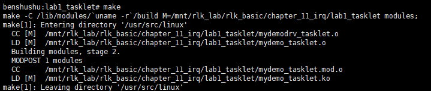

# 实验 11-1：tasklet

## 1．实验目的

​		了解和熟悉 Linux 内核的 tasklet 机制的使用。

## 2．实验要求

​		1）写一个简单的内核模块，初始化一个 tasklet，在 write()函数里调用该 tasklet 回调函数，在 tasklet 回调函数中输出用户程序写入的字符串。

​		2）写一个应用程序，测试该功能。

## 3．实验步骤

### 下面是本实验的实验步骤。

### 启动 QEMU+runninglinuxkernel。

```
$ ./run_rlk_arm64.sh run
```

### 进入本实验的参考代码。

```
# cd /mnt/rlk_lab/rlk_basic/chapter_11_irq/lab1_tasklet
```


### 编译内核模块

```shell
benshushu:lab1_tasklet# make
make -C /lib/modules/`uname -r`/build 
M=/mnt/rlk_lab/rlk_basic/chapter_11_irq/lab1_tasklet modules;
make[1]: Entering directory '/usr/src/linux'
 CC [M] 
/mnt/rlk_lab/rlk_basic/chapter_11_irq/lab1_tasklet/mydemodrv_tasklet.o
 LD [M] /mnt/rlk_lab/rlk_basic/chapter_11_irq/lab1_tasklet/mydemo_tasklet.o
 Building modules, stage 2.
 MODPOST 1 modules
 CC 
/mnt/rlk_lab/rlk_basic/chapter_11_irq/lab1_tasklet/mydemo_tasklet.mod.o
 LD [M] 
/mnt/rlk_lab/rlk_basic/chapter_11_irq/lab1_tasklet/mydemo_tasklet.ko
make[1]: Leaving directory '/usr/src/linux'
```

```makefile
BASEINCLUDE ?= /lib/modules/`uname -r`/build

mydemo_tasklet-objs := mydemodrv_tasklet.o 

obj-m	:=   mydemo_tasklet.o
all : 
	$(MAKE) -C $(BASEINCLUDE) M=$(PWD) modules;

clean:
	$(MAKE) -C $(BASEINCLUDE) M=$(PWD) clean;
	rm -f *.ko;

```



### 安装内核模块。

```shell
benshushu:lab1_tasklet# insmod mydemo_tasklet.ko 
[ 383.619826] mydemo_tasklet: loading out-of-tree module taints kernel.
[ 383.712621] my_class mydemo:249:0: create device: 249:0
[ 383.716819] mydemo_fifo=00000000269d10dc
[ 383.721161] my_class mydemo:249:1: create device: 249:1
[ 383.723529] mydemo_fifo=00000000fbad8f0d
[ 383.727757] my_class mydemo:249:2: create device: 249:2
[ 383.731065] mydemo_fifo=0000000048c9b2b6
[ 383.736842] my_class mydemo:249:3: create device: 249:3
[ 383.740202] mydemo_fifo=000000006fe64904
[ 383.744652] my_class mydemo:249:4: create device: 249:4
[ 383.747825] mydemo_fifo=0000000063e8fea8
[ 383.752936] my_class mydemo:249:5: create device: 249:5
[ 383.755937] mydemo_fifo=000000003331b2ee
[ 383.759943] my_class mydemo:249:6: create device: 249:6
[ 383.763016] mydemo_fifo=000000004c564a2f
[ 383.768806] my_class mydemo:249:7: create device: 249:7
[ 383.772046] mydemo_fifo=000000000fd8c896
[ 383.774737] succeeded register char device: mydemo_dev
```


​		你会看到创建了 8 个设备。你可以到/sys/class/my_class/目录下面看到这些设备。

```
ll /sys/class/my_class
```


​		我们可以看到创建了主设备号为 249 的设备。PS:本机为247

​		我们再来看一下/dev/目录。

```
ll /dev
```


​		发现并没有主设备为 249 的设备。

### 所以我们需要手工创建一个设备用来 test app。

```
benshushu:lab1_tasklet# mknod /dev/mydemo0 c 249 0
```


### 接下来编译和运行 test 程序：

```shell
benshushu:lab1_tasklet# gcc test.c -o test
benshushu:lab1_tasklet# ./test & #这里让test程序在后台跑
[1] 973
[ 558.834282] my_class mydemo:249:0: demodrv_open: major=249, minor=0, 
device=mydemo_dev0
[ 558.838806] my_class mydemo:249:0: demodrv_fasync send SIGIO
```


### 然后使用 echo 命令来往/dev/mydemo0 这个设备写入字符串。

```
benshushu:lab1_tasklet# echo "i am study runninglinuxkernel" > /dev/mydemo0
```


可以看到从 tasklet 的回调函数打印的一句话“do_tasklet: trigger a tasklet”


### 实验清理

```
kill -9 904 #杀死后台进程
rmmod mydemo_tasklet #卸载内核模块
make clean #clean
```


## 4．实验代码分析

​		首先在每个设备的私有数据 struct mydemo_private_data 中添加一个 tasklet。

```
struct mydemo_private_data {
 struct mydemo_device *device;
 char name[64];
 struct tasklet_struct tasklet;
};
```

​		tasklet 使用 struct tasklet_struct 来表示。在使用 tasklet 之前需要初始化，使用tasklet_init()函数进行初始化。我们选择在 demodrv_open()时初始化 tasklet。

```
static int demodrv_open(struct inode *inode, struct file *file)
{
 unsigned int minor = iminor(inode);
 struct mydemo_private_data *data;
 struct mydemo_device *device = mydemo_device[minor];
 dev_info(device->dev, "%s: major=%d, minor=%d, device=%s\n", __func__,
 MAJOR(inode->i_rdev), MINOR(inode->i_rdev), 
device->name);
 data = kmalloc(sizeof(struct mydemo_private_data), GFP_KERNEL);
 if (!data)
 return -ENOMEM;
 sprintf(data->name, "private_data_%d", minor);
 tasklet_init(&data->tasklet, do_tasklet, (unsigned long)device);
 data->device = device;
 file->private_data = data;
 return 0;
}
```

驱动关闭时需要调用 tasklet_kill()来关闭 tasklet。

```
static int demodrv_release(struct inode *inode, struct file *file)
{
 struct mydemo_private_data *data = file->private_data;
 tasklet_kill(&data->tasklet);
 kfree(data);
 return 0;
}
```

那什么时候去触发 tasklet 呢？

我们在这个例子选择在 read 函数里触发。

```
static ssize_t
demodrv_read(struct file *file, char __user *buf, size_t count, loff_t *ppos)
{
...
 mutex_lock(&device->lock);
 ret = kfifo_to_user(&device->mydemo_fifo, buf, count, &actual_readed);
 if (ret)
 return -EIO;
 tasklet_schedule(&data->tasklet);
 mutex_unlock(&device->lock);
...
 return actual_readed;
}
```

在 demodrv_read 函数中，当 FIFO 有数据可读时，我们调用 tasklet_schedule()来

触发一个 tasklet。

tasklet 的回调函数需要驱动开发人员来实现。我们在这个例子中，仅仅是添加一

句打印。

```
static void do_tasklet(unsigned long data)
{
 struct mydemo_device *device = (struct mydemo_device *)data;
 dev_info(device->dev, "%s: trigger a tasklet\n", __func__);
}
```

