# 实验 11-2：工作队列

## 1．实验目的

​		通过本实验了解和熟悉 Linux 内核的工作队列机制的使用。

## 2．实验要求

​		1）写一个简单的内核模块，初始化一个工作队列，在 write()函数里调用该工作队列回调函数，在回调函数中输出用户程序写入的字符串。

​		2）写一个应用程序，测试该功能。

## 3．实验步骤

### 下面是本实验的实验步骤。

### 启动 QEMU+runninglinuxkernel。

```
$ ./run_rlk_arm64.sh run
```

### 进入本实验的参考代码。

```
# cd /mnt/rlk_lab/rlk_basic/chapter_11_irq/lab2_workqueue/
```

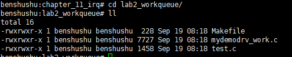

### 编译内核模块。

```shell
benshushu:lab2_workqueue# make
make -C /lib/modules/`uname -r`/build 
M=/mnt/rlk_lab/rlk_basic/chapter_11_irq/lab2_workqueue modules;
make[1]: Entering directory '/usr/src/linux'
 CC [M] 
/mnt/rlk_lab/rlk_basic/chapter_11_irq/lab2_workqueue/mydemodrv_work.o
 LD [M] /mnt/rlk_lab/rlk_basic/chapter_11_irq/lab2_workqueue/mydemo_work.o
 Building modules, stage 2.
 MODPOST 1 modules
 CC 
/mnt/rlk_lab/rlk_basic/chapter_11_irq/lab2_workqueue/mydemo_work.mod.o
 LD [M] /mnt/rlk_lab/rlk_basic/chapter_11_irq/lab2_workqueue/mydemo_work.ko
make[1]: Leaving directory '/usr/src/linux'
```

```makefile
BASEINCLUDE ?= /lib/modules/`uname -r`/build

mydemo_work-objs := mydemodrv_work.o 

obj-m	:=   mydemo_work.o
all : 
	$(MAKE) -C $(BASEINCLUDE) M=$(PWD) modules;

clean:
	$(MAKE) -C $(BASEINCLUDE) M=$(PWD) clean;
	rm -f *.ko;
```

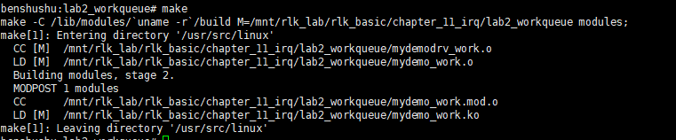


### 安装内核模块。

```
benshushu:lab2_workqueue# insmod mydemo_work.ko 
[ 1013.532010] my_class mydemo:249:0: create device: 249:0
[ 1013.541542] mydemo_fifo=0000000071b3894f
[ 1013.544941] my_class mydemo:249:1: create device: 249:1
[ 1013.546040] mydemo_fifo=000000008ce0c62e
[ 1013.551769] my_class mydemo:249:2: create device: 249:2
[ 1013.553145] mydemo_fifo=000000005a4b4071
[ 1013.557484] my_class mydemo:249:3: create device: 249:3
[ 1013.560112] mydemo_fifo=00000000be9d0d16
[ 1013.565651] my_class mydemo:249:4: create device: 249:4
[ 1013.568635] mydemo_fifo=00000000ce580a8b
[ 1013.574888] my_class mydemo:249:5: create device: 249:5
[ 1013.576445] mydemo_fifo=0000000090f4e741
[ 1013.583715] my_class mydemo:249:6: create device: 249:6
[ 1013.584832] mydemo_fifo=000000001fd8e3d0
[ 1013.589404] my_class mydemo:249:7: create device: 249:7
[ 1013.591889] mydemo_fifo=0000000055809b39
[ 1013.592697] succeeded register char device: mydemo_dev
```

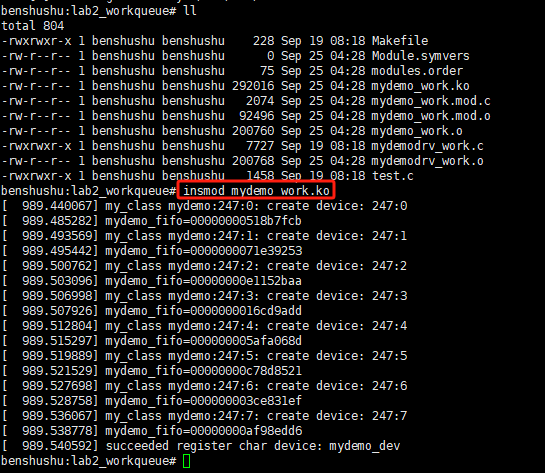

​		你会看到创建了 8 个设备。你可以到/sys/class/my_class/目录下面看到这些设备。

```
ls /sys/class/my_class/
```

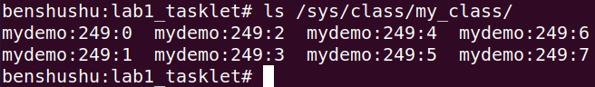


​		我们可以看到创建了主设备号为 249 的设备。

#### 		我们再来看一下/dev/目录。

```
ll /dev
```

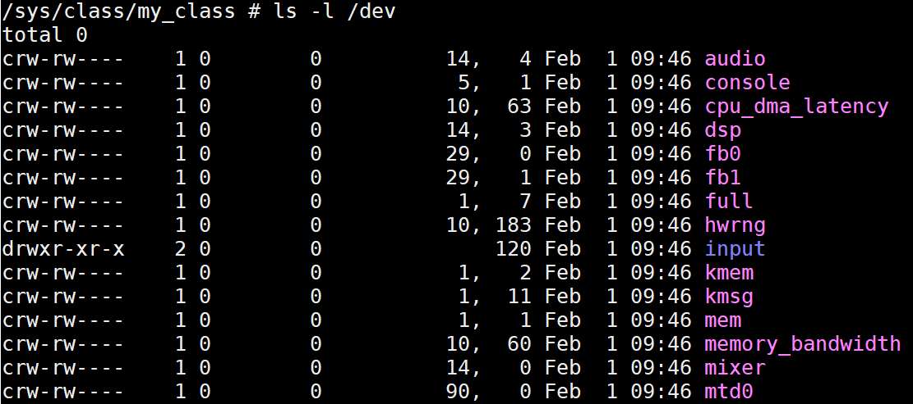

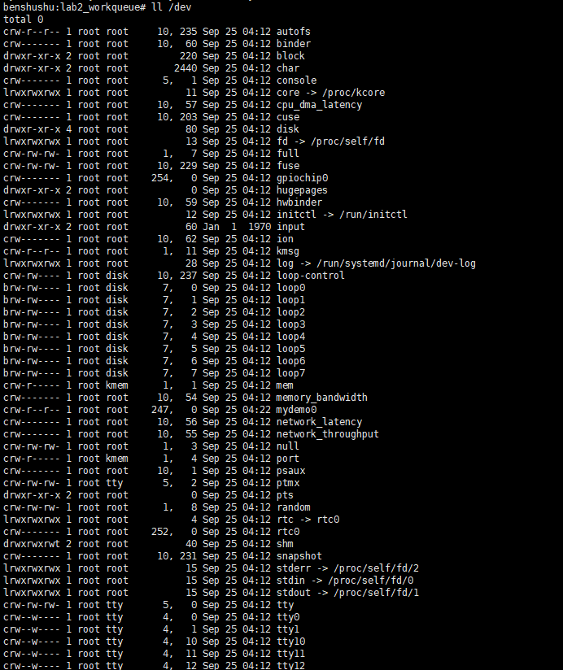

### 		所以我们需要手工创建一个设备用来 test app。

```
benshushu:lab1_tasklet# mknod /dev/mydemo0 c 249 0
```

PS:上个实验没删除，也能继续用

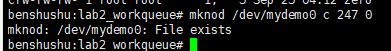

### 接下来编译和运行 test 程序：

```shell
benshushu:lab1_tasklet# gcc test.c -o test
benshushu:lab1_tasklet# ./test & #这里让test程序在后台跑
[1] 973
[ 558.834282] my_class mydemo:249:0: demodrv_open: major=249, minor=0, 
device=mydemo_dev0
[ 558.838806] my_class mydemo:249:0: demodrv_fasync send SIGIO
```

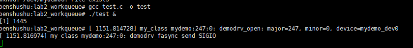

### 然后使用 echo 命令来往/dev/mydemo0 这个设备写入字符串。

```shell
benshushu:lab2_workqueue# echo "i am study runninglinuxkernel" > /dev/mydemo0
[ 1070.790856] my_class mydemo:249:0: demodrv_open: major=249, minor=0, 
device=mydemo_dev0
[ 1070.799534] demodrv_write kill fasync
[ 1070.801695] my_class mydemo:249:0: demodrv_write:mydemo_dev0 pid=550, 
actual_write =30, ppos=0, ret=0
[ 1070.807081] my_class mydemo:249:0: do_work: trigger a work
FIFO is not empty
[ 1070.817755] my_class mydemo:249:0: demodrv_read:mydemo_dev0, pid=1336, 
actual_readed=30, pos=0
benshushu:lab2_workqueue# i am study runninglinuxkernel
```

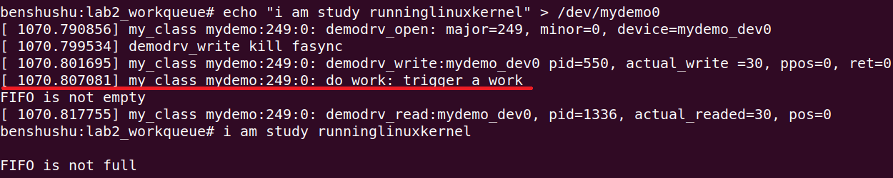

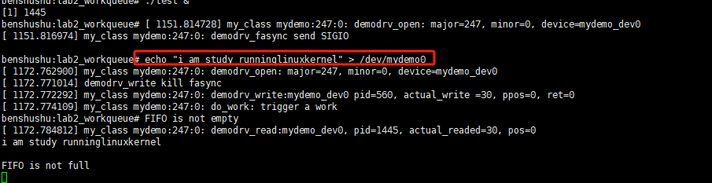

​		可以看到从 workqueue 的回调函数打印的一句话“do_work: trigger a work”。

### 实验清理

```
kill -9 1445
rmmod mydemo_work
make clean
rm -f test
```

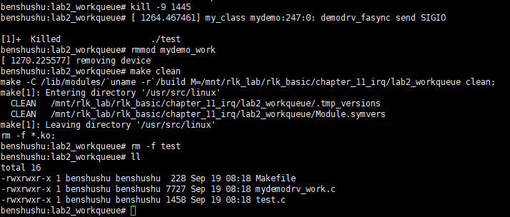

## 4．实验代码分析

​		本实验参考代码和实验 1 类似，只不过把 tasklet 机制换成了工作队列。

​		首先在每个设备的私有数据 struct mydemo_private_data 中添加一个工作队列。

```
struct mydemo_private_data {
 struct mydemo_device *device;
 char name[64];
 struct tasklet_struct tasklet;
 struct work_struct my_work;
};
```

​		工作队列使用 struct work_struct 来表示。在使用工作队列之前需要初始化，使用INIT_WORK ()函数进行初始化。我们选择在 demodrv_open()时初始化 tasklet。

```
static int demodrv_open(struct inode *inode, struct file *file)
{
 unsigned int minor = iminor(inode);
 struct mydemo_private_data *data;
 struct mydemo_device *device = mydemo_device[minor];
 dev_info(device->dev, "%s: major=%d, minor=%d, device=%s\n", __func__,
 MAJOR(inode->i_rdev), MINOR(inode->i_rdev), 
device->name);
 data = kzalloc(sizeof(struct mydemo_private_data), GFP_KERNEL);
 if (!data)
 return -ENOMEM;
 sprintf(data->name, "private_data_%d", minor);
 tasklet_init(&data->tasklet, do_tasklet, (unsigned long)device);
 INIT_WORK(&data->my_work, do_work);
 data->device = device;
 file->private_data = data;
 return 0;
}
```

​		那什么时候去触发工作队列呢？

​		我们在这个例子选择在 write 函数里触发。

```
static ssize_t
demodrv_write(struct file *file, const char __user *buf, size_t count, loff_t 
*ppos)
{
 struct mydemo_private_data *data = file->private_data;
 struct mydemo_device *device = data->device;
...
 mutex_lock(&device->lock);
 ret = kfifo_from_user(&device->mydemo_fifo, buf, count, 
&actual_write);
 if (ret)
 return -EIO;
 schedule_work(&data->my_work);
 mutex_unlock(&device->lock);
...
 return actual_write;
}
```

​		 在demodrv_write 函数中，当 FIFO 可写时，我们调用 **schedule_work** ()来触发一个工作。

​		worker 的回调函数需要驱动开发人员来实现。我们在这个例子中，仅仅是添加一句打印。

```
static void do_work(struct work_struct *work)
{
 struct mydemo_private_data *data;
 struct mydemo_device *device;
 data = container_of(work, struct mydemo_private_data, my_work);
 device = data->device;
 dev_info(device->dev, "%s: trigger a work\n", __func__);
}
```

