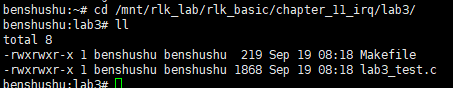
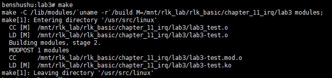
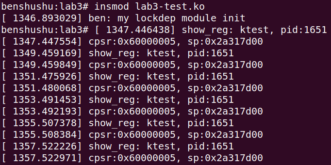
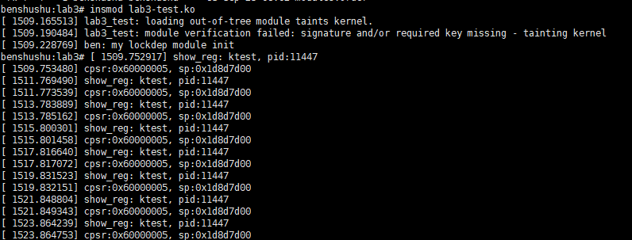

# 实验 11-3：定时器和内核线程

## 1．实验目的

​		通过本实验了解和熟悉 Linux 内核的定时器和内核线程机制的使用。

## 2．实验要求

​		写一个简单的内核模块，==首先定义一个定时器来模拟中断，再新建一个内核线程。当定时器到来时，唤醒内核线程，然后在内核线程的主程序中输出该内核线程的相关信息，如 PID、当前 jiffies 等信息。==

## 3．实验步骤

### 下面是本实验的实验步骤。

### 启动 QEMU+runninglinuxkernel。

```shell
$ ./run_rlk_arm64.sh run
```

### 进入本实验的参考代码。

```shell
# cd /mnt/rlk_lab/rlk_basic/chapter_11_irq/lab3
```



### 编译内核模块。

```sh
benshushu:lab3# make
make -C /lib/modules/`uname -r`/build 
M=/mnt/rlk_lab/rlk_basic/chapter_11_irq/lab3 modules;
make[1]: Entering directory '/usr/src/linux'
 CC [M] /mnt/rlk_lab/rlk_basic/chapter_11_irq/lab3/lab3_test.o
 LD [M] /mnt/rlk_lab/rlk_basic/chapter_11_irq/lab3/lab3-test.o
 Building modules, stage 2.
 MODPOST 1 modules
 CC /mnt/rlk_lab/rlk_basic/chapter_11_irq/lab3/lab3-test.mod.o
 LD [M] /mnt/rlk_lab/rlk_basic/chapter_11_irq/lab3/lab3-test.ko
 make[1]: Leaving directory '/usr/src/linux'
```

```makefile
BASEINCLUDE ?= /lib/modules/`uname -r`/build

lab3-test-objs := lab3_test.o 

obj-m	:=   lab3-test.o
all : 
	$(MAKE) -C $(BASEINCLUDE) M=$(PWD) modules;

clean:
	$(MAKE) -C $(BASEINCLUDE) M=$(PWD) clean;
	rm -f *.ko;
```



### 安装内核模块。

```shell
benshushu:lab3# insmod lab3-test.ko 
[ 1346.893029] ben: my lockdep module init
benshushu:lab3# [ 1347.446438] show_reg: ktest, pid:1651
[ 1347.447554] cpsr:0x60000005, sp:0x2a317d00
[ 1349.459169] show_reg: ktest, pid:1651
[ 1349.459849] cpsr:0x60000005, sp:0x2a317d00
[ 1351.475926] show_reg: ktest, pid:1651
[ 1351.480068] cpsr:0x60000005, sp:0x2a317d00
[ 1353.491453] show_reg: ktest, pid:1651
[ 1353.492193] cpsr:0x60000005, sp:0x2a317d00
[ 1355.507378] show_reg: ktest, pid:1651
[ 1355.508384] cpsr:0x60000005, sp:0x2a317d00
[ 1357.522226] show_reg: ktest, pid:1651
[ 1357.522971] cpsr:0x60000005, sp:0x2a317d00
```





PS:终端一直输出，但是也是无法暂停，除非去使用ssh登录qemu虚拟机，来中断进程

## 4．实验代码

```C
#include <linux/init.h>
#include <linux/module.h>
#include <linux/kernel.h>
#include <linux/kthread.h>
#include <linux/freezer.h>
#include <linux/mutex.h>
#include <linux/delay.h>

static void my_timefunc(unsigned long);
static DEFINE_TIMER(my_timer, my_timefunc, 0, 0);
static atomic_t flags;
wait_queue_head_t wait_head;

static void my_timefunc(unsigned long dummy)
{
    atomic_set(&flags, 1);
    // printk("%s: set flags %d\n", __func__, atomic_read(&flags));
    wake_up_interruptible(&wait_head);
    mod_timer(&my_timer, jiffies + msecs_to_jiffies(2000));
}

static void my_try_to_sleep(void)
{
    DEFINE_WAIT(wait);

    if (freezing(current) || kthread_should_stop())
        return;

    prepare_to_wait(&wait_head, &wait, TASK_INTERRUPTIBLE);

    if (!atomic_read(&flags))
        schedule();

    finish_wait(&wait_head, &wait);
}

static void show_reg(void)
{
    unsigned int cpsr, sp;
    struct task_struct *task = current;

    asm("mrs %0, cpsr" : "=r" (cpsr) : : "cc");
    asm("mov %0, sp" : "=r" (sp) : : "cc");

    printk("%s: %s, pid:%d\n", __func__, task->comm, task->pid);
    printk("cpsr:0x%x, sp:0x%x\n", cpsr, sp);
}

static int my_thread(void *nothing)
{
    set_freezable();
    set_user_nice(current, 0);

    while (!kthread_should_stop()) {
        my_try_to_sleep();
        atomic_set(&flags, 0);
        show_reg();
    }
    return 0;
}

static struct task_struct *thread;

static int __init my_init(void)
{
    printk("ben: my lockdep module init\n");

    /* 创建一个线程来处理某些事情 */
    thread = kthread_run(my_thread, NULL, "ktest");

    /* 创建一个定时器来模拟某些异步事件，比如中断等 */
    my_timer.expires = jiffies + msecs_to_jiffies(500);
    add_timer(&my_timer);

    init_waitqueue_head(&wait_head);

    return 0;
}

static void __exit my_exit(void)
{
    printk("goodbye\n");

    kthread_stop(thread);
}

MODULE_LICENSE("GPL");
module_init(my_init);
module_exit(my_exit);

```

------

### 分析和注释

此代码的目的是通过一个内核模块演示定时器和线程的使用，并且通过信号量控制线程的休眠和唤醒。模块启动时会创建一个线程，该线程每隔一段时间唤醒并显示当前寄存器的状态。定时器每 2 秒会触发一次，以模拟一些异步事件，例如中断信号。线程的休眠和唤醒通过信号量 `wait_queue_head_t` 和 `atomic_t` 控制。

下面是逐行的详细分析和注释。

```C
#include <linux/init.h>
#include <linux/module.h>
#include <linux/kernel.h>
#include <linux/kthread.h>  // 用于创建内核线程
#include <linux/freezer.h>  // 用于处理线程冻结
#include <linux/mutex.h>
#include <linux/delay.h>    // 用于延迟操作

// 定义一个定时器函数和定时器结构
static void my_timefunc(unsigned long);
static DEFINE_TIMER(my_timer, my_timefunc, 0, 0);

// 定义一个原子变量，用于控制线程的唤醒信号
static atomic_t flags;

// 定义一个等待队列，用于线程休眠和唤醒
wait_queue_head_t wait_head;

/**
 * 定时器回调函数，在定时器超时后执行。
 * 每次执行后，会设置 `flags`，唤醒休眠的线程，并重新启动定时器。
 */
static void my_timefunc(unsigned long dummy)
{
    atomic_set(&flags, 1);  // 将 `flags` 置为 1，表示有事件触发
    wake_up_interruptible(&wait_head);  // 唤醒休眠的线程
    mod_timer(&my_timer, jiffies + msecs_to_jiffies(2000));  // 重置定时器，2 秒后再次触发
}

/**
 * 线程休眠函数，检查是否有事件触发或者线程是否应该停止，如果没有事件触发则休眠。
 */
static void my_try_to_sleep(void)
{
    DEFINE_WAIT(wait);  // 定义一个 `wait` 结构，用于挂起线程

    if (freezing(current) || kthread_should_stop())
        return;  // 如果线程被冻结或需要停止，直接返回

    // 将当前线程设置为可中断的休眠状态
    prepare_to_wait(&wait_head, &wait, TASK_INTERRUPTIBLE);

    if (!atomic_read(&flags))  // 如果 `flags` 为 0，则没有事件触发
        schedule();  // 线程进入休眠状态，直到有事件触发

    finish_wait(&wait_head, &wait);  // 线程唤醒后，结束等待
}

/**
 * 打印当前线程的寄存器信息，主要包括 cpsr 和 sp 寄存器。
 */
static void show_reg(void)
{
    unsigned int cpsr, sp;
    struct task_struct *task = current;  // 获取当前线程的任务结构

    asm("mrs %0, cpsr" : "=r" (cpsr) : : "cc");  // 获取当前程序状态寄存器的值
    asm("mov %0, sp" : "=r" (sp) : : "cc");  // 获取当前栈指针的值

    printk("%s: %s, pid:%d\n", __func__, task->comm, task->pid);  // 输出当前线程信息
    printk("cpsr:0x%x, sp:0x%x\n", cpsr, sp);  // 输出寄存器信息
}

/**
 * 内核线程的主循环，定期进入休眠并显示寄存器状态。
 */
static int my_thread(void *nothing)
{
    set_freezable();  // 允许该线程在某些情况下被冻结
    set_user_nice(current, 0);  // 设置线程的优先级为 0

    while (!kthread_should_stop()) {  // 当线程未被停止时持续运行
        my_try_to_sleep();  // 调用休眠函数
        atomic_set(&flags, 0);  // 重置 `flags` 为 0
        show_reg();  // 显示当前线程的寄存器信息
    }
    return 0;
}

// 定义一个线程的结构体，用于保存线程对象
static struct task_struct *thread;

/**
 * 模块初始化函数，当模块被加载时执行，创建线程和定时器。
 */
static int __init my_init(void)
{
    printk("ben: my lockdep module init\n");

    // 创建一个线程来处理某些事情，调用 `my_thread` 函数
    thread = kthread_run(my_thread, NULL, "ktest");

    // 创建一个定时器，500 毫秒后触发
    my_timer.expires = jiffies + msecs_to_jiffies(500);
    add_timer(&my_timer);  // 注册并启动定时器

    init_waitqueue_head(&wait_head);  // 初始化等待队列

    return 0;
}

/**
 * 模块卸载函数，当模块被卸载时执行，停止线程并清理资源。
 */
static void __exit my_exit(void)
{
    printk("goodbye\n");

    kthread_stop(thread);  // 停止线程
}

MODULE_LICENSE("GPL");
module_init(my_init);
module_exit(my_exit);
```

### 详细分析

1. **定时器 (`my_timer`)**
   - 通过 `DEFINE_TIMER` 定义了一个定时器 `my_timer`，当定时器到期时，会调用 `my_timefunc` 函数。
   - 定时器的初始值为 500 毫秒，之后每隔 2 秒会再次触发一次，模拟异步事件，比如中断。
2. **线程休眠与唤醒**
   - `my_try_to_sleep()` 函数用于让线程在没有事件触发时进入休眠。它使用 `prepare_to_wait` 函数将当前线程设置为可中断的状态，然后通过 `schedule()` 让线程进入休眠，直到有事件发生。
   - 当定时器回调函数 `my_timefunc` 被触发时，它会唤醒线程，使其从休眠中恢复执行。
3. **线程的运行逻辑**
   - 线程 `my_thread` 的主要逻辑是进入休眠并等待定时器事件。每次定时器触发，线程会被唤醒并调用 `show_reg()` 输出当前寄存器状态。之后重置 `flags` 标志位，再次进入休眠。
   - 线程通过 `kthread_should_stop()` 判断是否需要停止。当模块被卸载时，调用 `kthread_stop()` 停止线程。
4. **模块的初始化与清理**
   - `my_init()` 是模块加载时执行的初始化函数，负责创建线程并启动定时器。
   - `my_exit()` 是模块卸载时执行的清理函数，负责停止线程并取消定时器。
5. **内核同步机制**
   - `wait_queue_head_t wait_head`：这是一个等待队列，用于控制线程休眠和唤醒。
   - `atomic_t flags`：用于在定时器和线程之间进行简单的同步，表示是否有事件触发。

这个模块演示了如何在内核中使用定时器和线程，并且通过等待队列和原子变量来同步定时器事件与线程执行。

------

