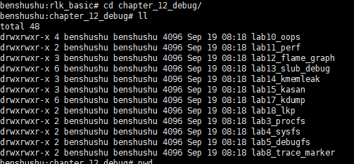

# 实验 12-1：printk 

## 1．实验目的

- 了解如何使用 Linux 内核中的 `printk` 函数进行输出调试。
- 掌握 `printk` 的工作原理、使用方法及如何通过 `dmesg` 命令查看输出结果。
- 了解如何在内核模块或驱动程序中插入 `printk` 以调试代码。

## 2．实验步骤

​		1）编写一个简单的内核模块，使用 printk 函数来进行输出。

​		2）在内核中选择一个驱动程序或者内核代码，使用 printk 函数进行输出调试。

------

### `printk` 介绍

`printk` 是 Linux 内核中最常用的调试工具，用于向内核日志缓冲区输出信息。它的功能类似于用户态的 `printf`，但 `printk` 主要在内核态使用。内核开发人员通过 `printk` 输出重要的调试信息、错误消息、警告等，以便在调试和运行内核模块时了解代码的执行情况。

内核中所有由 `printk` 输出的信息会被记录在环形缓冲区中，可以通过 `dmesg` 命令读取。

### `printk` 输出级别

`printk` 使用不同的级别前缀来标识信息的严重性。常用的级别包括：

| 级别宏         | 含义                       | 数值 |
| -------------- | -------------------------- | ---- |
| `KERN_EMERG`   | 紧急情况，需要立即采取行动 | `0`  |
| `KERN_ALERT`   | 必须立即修复的问题         | `1`  |
| `KERN_CRIT`    | 严重错误                   | `2`  |
| `KERN_ERR`     | 错误条件                   | `3`  |
| `KERN_WARNING` | 警告条件                   | `4`  |
| `KERN_NOTICE`  | 正常但重要的信息           | `5`  |
| `KERN_INFO`    | 一般信息                   | `6`  |
| `KERN_DEBUG`   | 调试信息                   | `7`  |

每个级别都有不同的优先级，级别越低，优先级越高。

#### 示例：

```
printk(KERN_INFO "This is an informational message.\n");
printk(KERN_WARNING "This is a warning message.\n");
printk(KERN_ERR "This is an error message.\n");
```

### `printk` 的使用方法

#### 1. 基本用法

`printk` 的使用方式与标准 C 函数 `printf` 类似，接受格式化字符串和可变参数。典型的调用格式如下：

```
printk(KERN_INFO "Device opened: major=%d, minor=%d\n", major, minor);
```

#### 2. 常用日志级别

你可以在不同的场合使用不同的日志级别：

- **`KERN_DEBUG`**：用于输出调试信息，开发和测试期间经常使用。
- **`KERN_INFO`**：用于输出一般信息，表示模块正常的运行状态。
- **`KERN_WARNING`**：当有潜在的问题或风险时，可以使用这个级别。
- **`KERN_ERR`**：用于输出错误信息，表示代码执行出现问题。

#### 3. `dmesg` 查看输出

所有使用 `printk` 输出的信息都会被存储在内核日志缓冲区中，可以通过以下命令查看：

```
dmesg | tail
```

输出示例：

```
[ 1234.567890] Device opened: major=250, minor=0
[ 1234.567891] Device write operation performed successfully.
[ 1234.567892] Warning: potential issue detected in device operation.
```

#### 4. 延迟调试信息

由于 `printk` 在有些情况下会延迟输出，所以你可能不会立即在 `dmesg` 中看到信息。使用 `dmesg -w` 可以动态实时查看内核日志输出。

### `printk` 详细示例

以下是一个简单的内核模块例子，展示如何使用 `printk`：

```
#include <linux/module.h>
#include <linux/init.h>

MODULE_LICENSE("GPL");
MODULE_AUTHOR("Student");
MODULE_DESCRIPTION("A simple example of using printk for debugging.");

static int __init my_module_init(void)
{
    printk(KERN_INFO "My module has been loaded.\n");
    printk(KERN_DEBUG "This is a debug message.\n");
    printk(KERN_WARNING "This is a warning message.\n");
    return 0;
}

static void __exit my_module_exit(void)
{
    printk(KERN_INFO "My module has been unloaded.\n");
}

module_init(my_module_init);
module_exit(my_module_exit);
```

### 编译和加载模块

1. 编写 `Makefile`：

```
obj-m += my_printk_module.o

all:
    make -C /lib/modules/$(shell uname -r)/build M=$(PWD) modules

clean:
    make -C /lib/modules/$(shell uname -r)/build M=$(PWD) clean
```

1. 编译模块：

```
make
```

1. 加载模块：

```
sudo insmod my_printk_module.ko
```

1. 查看 `printk` 输出：

```
dmesg | tail
```

输出示例：

```
[ 1234.567890] My module has been loaded.
[ 1234.567891] This is a debug message.
[ 1234.567892] This is a warning message.
```

1. 卸载模块：

```
sudo rmmod my_printk_module
```

### 总结

`printk` 是内核中最基础的调试工具，通过不同的级别，可以灵活输出调试、错误、信息日志。搭配 `dmesg`，可以实时查看内核的运行状态，便于开发和调试。

------

### 3. 实验详情

启动 QEMU+runninglinuxkernel

```
$ ./run_rlk_arm64.sh run
```

进入本实验的参考代码。

```
cd /mnt/rlk_lab/rlk_basic/chapter_12_debug
```

发现没有前2章的实验代码




### 实验环境

- Linux 操作系统（推荐内核版本为 4.x 或 5.x）。
- 已配置好开发工具链和内核模块编译环境。
- `dmesg` 工具和必要的权限来查看内核日志。

#### 3.1 步骤 1：编写一个简单的内核模块，使用 `printk` 输出信息

##### 3.1.1 编写内核模块代码

编写一个简单的内核模块，使用 `printk` 在模块加载和卸载时输出信息。

代码如下：

```C
#include <linux/init.h>
#include <linux/module.h>
#include <linux/kernel.h>

MODULE_LICENSE("GPL");
MODULE_AUTHOR("Student");
MODULE_DESCRIPTION("A simple example of using printk for debugging.");
MODULE_VERSION("1.0");

static int __init my_module_init(void)
{
    printk(KERN_INFO "Hello, world! My module has been loaded.\n");
    printk(KERN_DEBUG "This is a debug message from my module.\n");
    printk(KERN_WARNING "This is a warning message from my module.\n");
    return 0;  // 0 表示加载成功
}

static void __exit my_module_exit(void)
{
    printk(KERN_INFO "Goodbye, world! My module is being unloaded.\n");
}

module_init(my_module_init);
module_exit(my_module_exit);
```

- ```
  printk
  ```

   的使用说明：

  - `KERN_INFO`：表示信息级别，显示模块的加载和卸载信息。
  - `KERN_DEBUG`：表示调试级别，输出调试信息。
  - `KERN_WARNING`：表示警告级别，用于输出模块中警告信息。

##### 3.1.2 编译内核模块

创建一个名为 `Makefile` 的文件，编写如下内容以编译内核模块：

```
obj-m += my_printk_module.o

all:
    make -C /lib/modules/$(shell uname -r)/build M=$(PWD) modules

clean:
    make -C /lib/modules/$(shell uname -r)/build M=$(PWD) clean
```

在终端中执行以下命令编译内核模块：

```
make
```

##### 3.1.3 加载内核模块

执行以下命令加载模块：

```
sudo insmod my_printk_module.ko
```

加载成功后，可以使用 `dmesg` 查看 `printk` 输出信息：

```
dmesg | tail
```

输出示例：

```
[ 1234.567890] Hello, world! My module has been loaded.
[ 1234.567891] This is a debug message from my module.
[ 1234.567892] This is a warning message from my module.
```

##### 3.1.4 卸载内核模块

执行以下命令卸载模块：

```
sudo rmmod my_printk_module
```

再次使用 `dmesg` 查看模块卸载时的输出信息：

```
dmesg | tail
```

输出示例：

```
[ 1256.567890] Goodbye, world! My module is being unloaded.
```

------

#### 3.2 步骤 2：修改现有驱动程序或内核代码，使用 `printk` 进行调试

##### 3.2.1 选择内核驱动程序

选择内核中一个简单的驱动程序进行调试，例如 `simple_char_driver` 或者已有的 `my_demo_device` 驱动程序。在合适的地方插入 `printk`，调试代码的执行流程。

##### 3.2.2 在驱动中插入 `printk`

示例：假设我们在字符设备驱动程序中的 `open` 函数插入调试信息。

修改 `open` 函数如下：

```
static int my_device_open(struct inode *inode, struct file *file)
{
    printk(KERN_INFO "Device open function called, major=%d, minor=%d\n", 
            imajor(inode), iminor(inode));

    return 0;
}
```

##### 3.2.3 编译并重新加载驱动程序

按照之前的步骤编译驱动程序并加载。执行操作后，通过 `dmesg` 查看 `open` 函数执行时输出的信息。

例如：

```
dmesg | tail
```

输出：

```
[ 1300.123456] Device open function called, major=250, minor=0
```

##### 3.2.4 测试其他函数

可以在其他关键函数中插入更多的 `printk`，例如 `write`、`read` 等，跟踪程序的执行流程，验证代码的逻辑是否正确。

------

### 4. 实验结果分析

- **结果 1：**
  - 成功编写并加载了简单的内核模块，通过 `printk` 输出模块的加载和卸载信息。
  - 使用 `dmesg` 可以查看内核日志输出，验证 `printk` 信息输出正确。
- **结果 2：**
  - 修改驱动程序中的关键函数，使用 `printk` 输出调试信息，可以帮助理解驱动程序的执行流程。
  - 通过插入 `printk`，可以有效调试并验证内核代码的正确性，捕捉异常行为。

------

### 5. 结论

- `printk` 是 Linux 内核中最常用的调试工具，通过它可以输出不同级别的日志信息，方便开发人员跟踪代码执行和调试问题。
- 通过 `dmesg` 命令可以轻松查看内核日志输出，有助于分析和解决问题。
- 在内核模块或驱动程序开发中，适当使用 `printk` 可以大大提高开发和调试效率。

------

