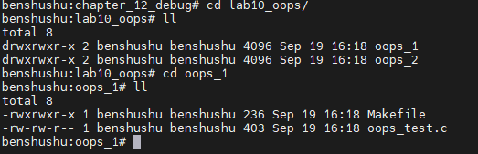
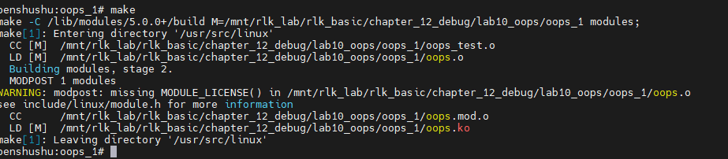
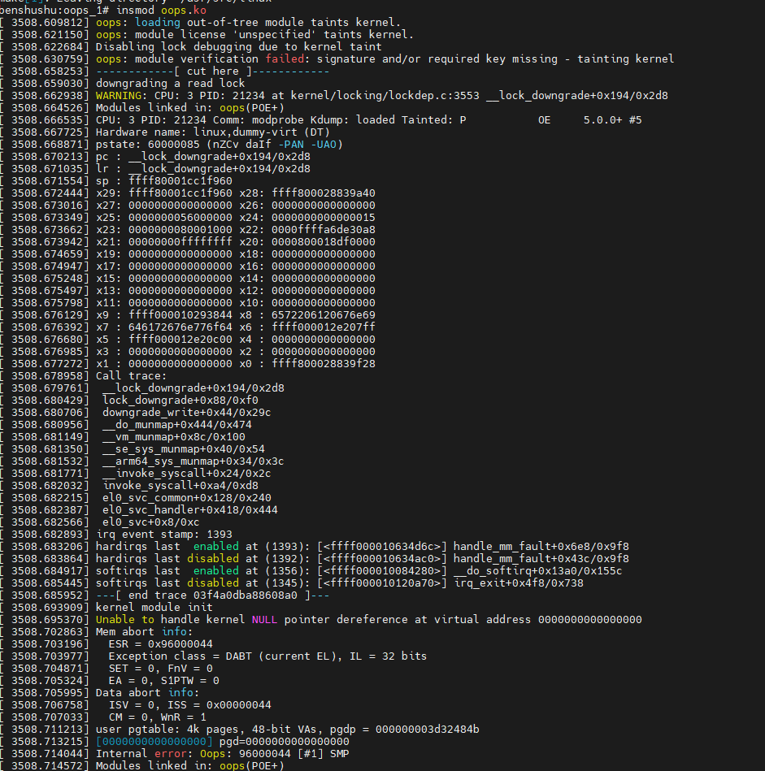

# 实验 12-10：分析 oops 错误

​		在编写驱动程序或内核模块时，常常会显式或隐式地对指针进行非法取值或使用不正确的指针，导致内核发生一个 oops 错误。当处理器在内核空间访问一个非法指针时，因为虚拟地址到物理地址的映射关系没有建立，从而触发一个缺页中断。因为在缺页中断中该地址是非法的，内核无法正确地为该地址建立映射关系，因此内核触发了一个 oops 错误。

​		本章通过一个实验讲解如何分析一个 oops 错误。

## 1．实验目的

编写一个简单的模块，并且人为编造一个空指针访问错误来引发 oops 错误。

### 2．实验详解

下面写一个简单的内核模块来验证如何分析一个内核 oops 错误。

```C
#include <linux/kernel.h>
#include <linux/module.h>
#include <linux/init.h>

static void create_oops(void)
{
    *(int *)0 = 0; // 人为编造一个空指针访问
}

static int __init my_oops_init(void)
{
    printk("oops module init\n");
    create_oops();
    return 0;
}

static void __exit my_oops_exit(void)
{
    printk("goodbye\n");
}

module_init(my_oops_init);
module_exit(my_oops_exit);
MODULE_LICENSE("GPL");

```

把 oops_test.c 文件编译成内核模块。对应的 Makefile 文件如下。

```
BASEINCLUDE ?= /lib/modules/$(shell uname -r)/build

oops-objs := oops_test.o
KBUILD_CFLAGS +=-g


obj-m   :=   oops.o
all :
        $(MAKE) -C $(BASEINCLUDE) M=$(PWD) modules;

clean:
        $(MAKE) -C $(BASEINCLUDE) M=$(PWD) clean;
        rm -f *.ko;
```

------

### 代码注释与分析

这段代码是一个 Linux 内核模块，它通过故意制造一个空指针引用来触发内核错误（Oops）。Oops 是一种内核错误信息，可以帮助开发者调试问题。以下是对代码的详细注释和分析：

```C
#include <linux/kernel.h>   // 包含内核的头文件，提供内核相关的API
#include <linux/module.h>   // 包含模块开发所需的头文件
#include <linux/init.h>     // 包含模块初始化和退出的宏定义

// create_oops 函数会引发一个空指针错误
static void create_oops(void)
{
    *(int *)0 = 0; // 人为编造一个空指针访问，将值写入空指针地址0
}

// 模块的初始化函数
static int __init my_oops_init(void)
{
    printk("oops module init\n");  // 使用 printk 输出信息到内核日志中，表示模块正在初始化
    create_oops();                 // 调用 create_oops 函数，触发内核错误（Oops）
    return 0;                      // 返回 0 表示初始化成功（尽管这行代码不会执行，因为上面已经触发了Oops）
}

// 模块的退出函数
static void __exit my_oops_exit(void)
{
    printk("goodbye\n");  // 使用 printk 输出信息到内核日志中，表示模块正在卸载
}

// 宏定义，将 my_oops_init 函数设为模块加载时的初始化函数
module_init(my_oops_init);
// 宏定义，将 my_oops_exit 函数设为模块卸载时的清理函数
module_exit(my_oops_exit);

// 声明模块的许可证，GPL 是一种开源许可证
MODULE_LICENSE("GPL");
```

### 代码分析

1. **包含头文件**：代码首先包含了一些内核开发所需的头文件，包括 `kernel.h`、`module.h` 和 `init.h`。这些头文件为模块编写提供必要的内核 API 和宏定义。
2. **create_oops 函数**：
   - 该函数中有一行 `*(int *)0 = 0;`，这是一个典型的空指针引用错误。它试图将值写入内存地址 `0`，这在内核中会导致错误。因为内核空间中地址 `0` 是未映射的，访问它将引发内核异常（Oops）。
   - 此函数的目的是演示如何通过空指针访问来触发内核 Oops，从而可以观察内核对异常的处理。
3. **模块初始化函数 `my_oops_init`**：
   - 使用 `printk` 输出 "oops module init" 到内核日志，方便调试与查看模块加载状态。
   - 调用 `create_oops`，这将导致触发内核的 Oops。由于 Oops 通常会中断模块的执行，程序在调用 `create_oops` 后不会继续执行下一行的 `return 0;`。
   - `my_oops_init` 被 `module_init` 宏设置为模块加载时自动调用的初始化函数。
4. **模块退出函数 `my_oops_exit`**：
   - 使用 `printk` 输出 "goodbye" 到内核日志，表示模块正在被卸载。
   - `my_oops_exit` 被 `module_exit` 宏设置为模块卸载时自动调用的清理函数。由于空指针错误（Oops）通常会导致内核不稳定，因此这部分代码可能不会执行。
5. **模块加载与卸载**：
   - `module_init(my_oops_init);` 和 `module_exit(my_oops_exit);` 这两行使用了内核模块编写的宏，将 `my_oops_init` 函数设为模块加载时的入口点，将 `my_oops_exit` 函数设为模块卸载时的出口点。
   - `MODULE_LICENSE("GPL");` 用于声明模块的许可证类型为 GPL（GNU General Public License），表明该模块遵循 GPL 许可协议。这对于内核模块的开发和发布是必要的。

### 运行过程

1. 当模块被加载时，`my_oops_init` 函数被调用，打印 "oops module init"。
2. 接下来，`create_oops` 被调用，试图访问一个空指针地址 `0`。这将导致内核触发一个 Oops 错误，并在内核日志中输出相关的错误信息。由于 Oops 是一个严重错误，内核可能会采取一些自我保护措施，比如停止运行当前的模块，这意味着后续的 `return 0;` 以及 `my_oops_exit` 函数不会被执行。
3. 如果 `create_oops` 没有被调用，或者发生了其他未引发 Oops 的情况，当卸载模块时，`my_oops_exit` 会被调用，打印 "goodbye"。

### 注意事项

- 这段代码会故意引发内核错误（Oops），这可能会导致系统不稳定或崩溃。因此，在测试环境中运行，并确保测试数据和系统已经备份。
- 为了安全起见，避免在生产环境中运行类似的代码。


### 在 QEMU 上编译并加载上述内核模块。

### 1.启动 QEMU+runninglinuxkernel。

```
$ ./run_rlk_arm64.sh run
```

### 2.进入本实验的参考代码。

```
# cd /mnt/rlk_lab/rlk_basic/chapter_12_debug/lab10_oops/oops_1
```



### 3.编译内核模块。

```
# make
```



### 4.加载内核模块。

```
root@benshushu: oops_test# insmod oops.ko
[ 301.409060] oops module init
[ 301.410313] Unable to handle kernel NULL pointer dereference at virtual 
 address 0000000000000000 
[ 301.411145] Mem abort info:
[ 301.411551] ESR = 0x96000044
[ 301.412105] Exception class = DABT (current EL), IL = 32 bits
[ 301.413535] SET = 0, FnV = 0
[ 301.413954] EA = 0, S1PTW = 0
[ 301.414404] Data abort info:
[ 301.414792] ISV = 0, ISS = 0x00000044
[ 301.415256] CM = 0, WnR = 1
[ 301.416995] user pgtable: 4k pages, 48-bit VAs, pgdp = 
00000000c8c3b9bc
[ 301.418260] [0000000000000000] pgd=0000000000000000
[ 301.419559] Internal error: Oops: 96000044 [#1] SMP
[ 301.420485] Modules linked in: oops(POE+)
[ 301.421806] CPU: 1 PID: 907 Comm: insmod Kdump: loaded Tainted: P OE 
5.0.0+ #4
[ 301.422985] Hardware name: linux,dummy-virt (DT)
[ 301.423733] pstate: 60000005 (nZCv daif -PAN -UAO)
[ 301.425089] pc : create_oops+0x14/0x24 [oops]
[ 301.425740] lr : my_oops_init+0x20/0x1000 [oops]
[ 301.426265] sp : ffff8000233f75e0
[ 301.426759] x29: ffff8000233f75e0 x28: ffff800023370000
[ 301.427366] x27: 0000000000000000 x26: 0000000000000000
[ 301.427971] x25: 0000000056000000 x24: 0000000000000015
[ 301.428704] x23: 0000000040001000 x22: 0000ffffa7384fc4
[ 301.429293] x21: 00000000ffffffff x20: 0000800018af4000
[ 301.429888] x19: 0000000000000000 x18: 0000000000000000
[ 301.430454] x17: 0000000000000000 x16: 0000000000000000
[ 301.431029] x15: 5400160b13131717 x14: 0000000000000000
[ 301.431596] x13: 0000000000000000 x12: 0000000000000020
[ 301.432240] x11: 0101010101010101 x10: 7f7f7f7f7f7f7f7f
[ 301.432925] x9 : 0000000000000000 x8 : ffff000012d0e7b4
[ 301.433488] x7 : ffff000010276f60 x6 : 0000000000000000
[ 301.434062] x5 : 0000000000000080 x4 : ffff80002a809a08
[ 301.437944] x3 : ffff80002a809a08 x2 : 8b3a82b84c3ddd00
[ 301.438691] x1 : 0000000000000000 x0 : 0000000000000000
[ 301.439428] Process insmod (pid: 907, stack limit = 
0x00000000f39a4b44)
[ 301.440492] Call trace:
[ 301.441068] create_oops+0x14/0x24 [oops]
[ 301.441622] my_oops_init+0x20/0x1000 [oops]
[ 301.442770] do_one_initcall+0x5d4/0xd30
[ 301.443364] do_init_module+0xb8/0x2fc
[ 301.443858] load_module+0xa94/0xd94
[ 301.444328] __se_sys_finit_module+0x14c/0x180
[ 301.444986] __arm64_sys_finit_module+0x44/0x4c
[ 301.445637] __invoke_syscall+0x28/0x30
[ 301.446129] invoke_syscall+0xa8/0xdc
[ 301.446588] el0_svc_common+0x120/0x220
[ 301.447146] el0_svc_handler+0x3b0/0x3dc
[ 301.447668] el0_svc+0x8/0xc
[ 301.449011] Code: 910003fd aa1e03e0 d503201f d2800000 (b900001f)
```



​		PC 指针指向出错的地址，另外“Call trace”也展示了出错时程序的调用关系。首先观察出错信息 create_oops+0x14/0x24，其中，0x14 表示指令指针在 create_oops()函数的第 0x14 字节处，create_oops()函数本身共 0x24 字节。

​		继续分析这个问题，假设两种情况：一是有出错模块的源代码，二是没有源代码。在某些实际工作场景中，可能需要调试和分析没有源代码的 Oops 错误。

​		先看有源代码的情况，通常在编译时添加到符号信息表中。在 Makefile 中添加如下语句，并重新编译内核模块。

```
KBUILD_CFLAGS +=-g
```

下面用两种方法来分析。

首先，使用 objdump 工具反汇编。

```
$ aarch64-linux-gnu-objdump -Sd oops.o //使用ARM版本的objdump工具
0000000000000000 <create_oops>:
0: a9bf7bfd stp x29, x30, [sp, #-16]!
 4: 910003fd mov x29, sp
 8: aa1e03e0 mov x0, x30
 c: 94000000 bl 0 <_mcount>
 10: d2800000 mov x0, #0x0 // #0
 14: b900001f str wzr, [x0]
 18: d503201f nop
 1c: a8c17bfd ldp x29, x30, [sp], #16
 20: d65f03c0 ret
```

​		通过反汇编工具 objdump 可以看到出错函数 create_oops()的汇编情况，第 0x10～0x14 字节的指令用于把 0 赋值给 x0 寄存器，然后往 x0 寄存器里写入 0。wzr 是一种特殊寄存器，值为 0，所以这里发生了写空指针错误。

​		然后，使用 gdb 工具。为了快捷地定位到出错的具体位置，使用 gdb 中的“list”指令加上出错函数和偏移量即可。

```
$ aarch64-linux-gnu-gdb oops.o
(gdb) list *create_oops+0x14
0x14 is in create_oops 
(/mnt/rlk_senior/chapter_6/oops_test/oops_test.c:7).
2 #include <linux/module.h>
3 #include <linux/init.h>
4
5 static void create_oops(void)
6 {
7 *(int *)0 = 0;
8 }
9
10 static int __init my_oops_init(void)
11 {
(gdb)
```

​		如果出错的是内核函数，那么可以使用 vmlinux 文件。

​		下面来看没有源代码的情况。对于没有编译符号表的二进制文件，可以使用objdump 工具来转储汇编代码，例如使用“aarch64-linux-gnu-objdump -d oops.o”命令来转储 oops.o 文件。内核提供了一个非常好用的脚本，可以快速定位问题，该脚本位于 Linux 内核源代码目录的 scripts/decodecode 文件夹中。我们首先把出错日志保存到一个.txt 文件中。

```
$ export ARCH=arm64
$ export CROSS_COMPILE=aarch64-linux-gnu-
$ ./scripts/decodecode < oops.txt 
Code: 910003fd aa1e03e0 d503201f d2800000 (b900001f)
All code
========
 0: 910003fd mov x29, sp
 4: aa1e03e0 mov x0, x30
 8: d503201f nop
 c: d2800000 mov x0, #0x0 // #0
 10:* b900001f str wzr, [x0] <-- trapping 
instruction
Code starting with the faulting instruction
===========================================
 0: b900001f str wzr, [x0]
```

​		decodecode 脚本会把出错的 Oops 日志信息转换成直观有用的汇编代码，并且告知具体是哪个汇编语句出错了，这对于分析没有源代码的 Oops 错误非常有用。
