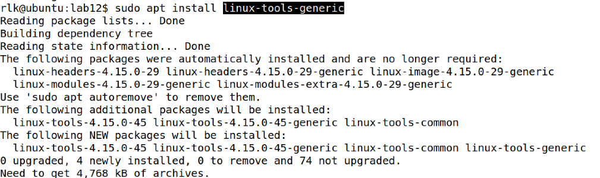
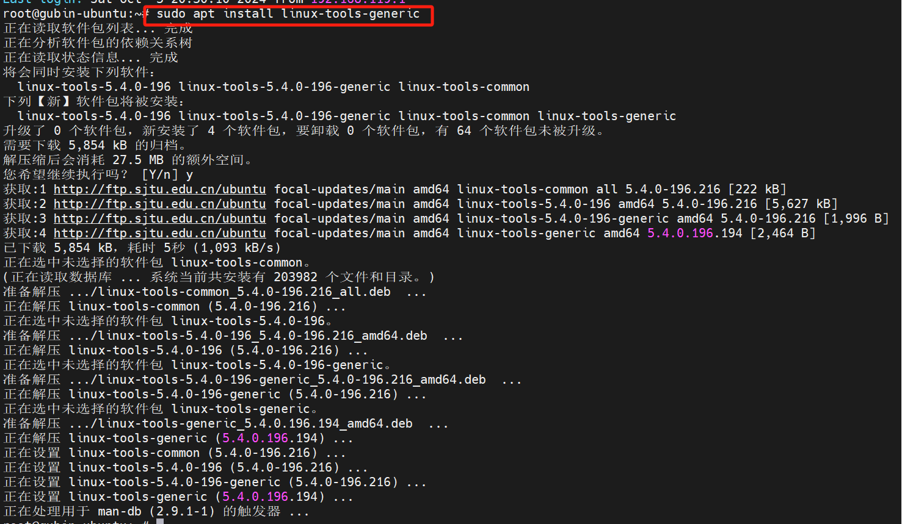
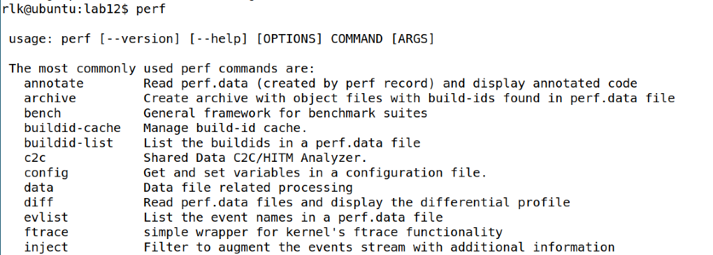
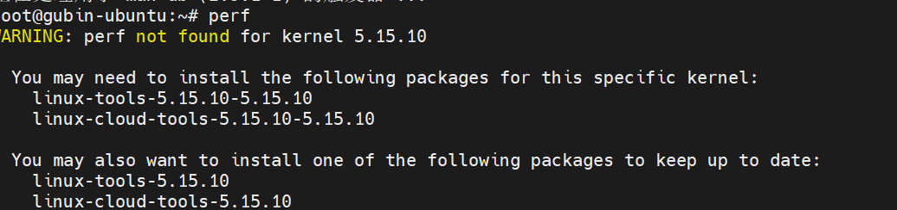
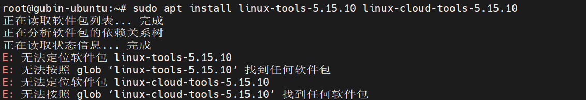

# 实验 12-11：使用 perf 工具来进行性能分析

## 1．实验目的

通过一个例子来熟悉如何使用 perf 工具来进行性能分析。

## 2．实验要求

1）写一个 for 循环的测试程序例子。

```
// test.c
#include <stdio.h>
#include <stdlib.h>

void foo() 
{
    int i, j = 0;
    for (i = 0; i < 10; i++) 
        j += 2;
}

int main(void) 
{
    int i;
    for (i = 0; i < 100000000; i++) 
        foo();
    
    return 0;
}
```

使用以下命令进行编译：

```
$ gcc -o test -O0 test.c
```

2）使用 perf stat 工具进行分析。

3）使用 perf top 工具进行分析。

4）使用 perf record 和 report 工具进行分析。

## 3．实验步骤

本实验可以在 Ubuntu Linux 主机上做。那首先要安装 perf 工具。

直接安装 perf 会提示找不到安装包。


可以安装 linux-tools-generic 包。

```
sudo apt install linux-tools-generic
```





然后就可以运行 perf 工具了。



------

==PS:但是在我这没有安装好==



从输出信息可以看出，系统当前运行的内核版本为 `5.15.10`，而你安装的 `linux-tools` 是针对内核版本 `5.4.0-196` 的。因此，当你尝试运行 `perf` 时，系统警告说找不到与当前内核版本匹配的 `perf` 工具。

### **问题分析**

`perf` 是一个内核性能分析工具，需要与当前正在运行的内核版本匹配。因此，为了正常运行 `perf`，需要安装对应版本的 `linux-tools`。

### **解决方法**

1. **安装与当前内核匹配的 `linux-tools` 包：** 根据提示，运行以下命令来安装与当前内核版本 `5.15.10` 相匹配的 `linux-tools` 和 `linux-cloud-tools`：

   ```
   sudo apt install linux-tools-5.15.10-5.15.10 linux-cloud-tools-5.15.10
   ```

2. **安装通用 `linux-tools` 包：** 还可以安装与系统内核自动匹配的 `linux-tools` 包。这个包会自动安装与当前内核版本对应的工具：

   ```
   sudo apt install linux-tools-generic
   ```

3. **确保当前系统源有相关的工具包：**

   - 如果安装时提示找不到包，请先运行以下命令来更新软件包列表：

     ```
     sudo apt update
     ```

   - 如果系统无法找到相应的 `linux-tools` 版本，可能需要检查并启用适当的源仓库，例如 `universe` 或 `main`。

安装完成后，运行 `perf` 命令来确认工具已成功配置。

依然不行



------

```
sudo apt install linux-tools-$(uname -r) linux-cloud-tools-$(uname -r)
```

需要修改/etc/apt/sources.list文件