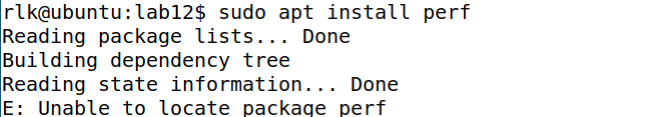

# 实验 12-11：使用 perf 工具来进行性能分析

## 1．实验目的

通过一个例子来熟悉如何使用 perf 工具来进行性能分析。

## 2．实验要求

1）写一个 for 循环的测试程序例子。

```
//test.c 
#include <stdio.h> 
#include <stdlib.h> 
void foo() 
{ 
 int i,j; 
 for(i=0; i< 10; i++) 
 j+=2; 
} 
int main(void) 
{ 
 int i; 
 for(i = 0; i< 100000000; i++) 
 foo(); 
 return 0; 
}
```

使用以下命令进行编译：

```
$ gcc -o test -O0 test.c
```

2）使用 perf stat 工具进行分析。

3）使用 perf top 工具进行分析。

4）使用 perf record 和 report 工具进行分析。

## 3．实验步骤

本实验可以在 Ubuntu Linux 主机上做。那首先要安装 perf 工具。

直接安装 perf 会提示找不到安装包。



可以安装 linux-tools-generic 包。


然后就可以运行 perf 工具了。

