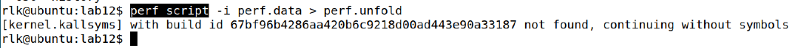

# 实验 12-12：采集 perf 数据生成火焰图

## 1．实验目的

学会把 perf 采集的数据生成火焰图，并进行性能分析。

## 2．实验要求

火焰图是性能大师 Brendang Gregg 开发的一个开源项目。

下面基于实验 12-11 介绍如何利用 perf 采集的数据生成一幅火焰图。

首先使用 perf record 命令收集测试程序的数据。

```
$sudo perf record -e cpu-clock -g ./test1
$sudo chmod 777 perf.data
```

然后使用 perf script 命令对 perf 数据进行解析。

```
# perf script > out.perf
```

对将 perf.unfold 中的符号进行折叠。

```
# cd FlameGraph #进入FlameGraph目录
# ./stackcollapse-perf.pl out.perf > out.folded
```

最后生成火焰图，如图 12.6 所示。

```
# ./flamegraph.pl out.folded > kernel.svg
```


图12.6 生成的火焰图

## 3．实验步骤

​		由于出版社不让在书上放 网络地址，所以大家可以到下面地址下载火焰图项目。

​		火焰图（Flame Graph）是性能大师 Brendang Gregg 的一个开源项目，项目地址

是在 https://github.com/brendangregg/FlameGraph

​		我们 runninglinuxkernel 代码里已经提前下载好了这个项目代码。

​		本实验在 ubuntu linux 主机上完成。

​		首先进入参考实验代码目录。

```
/home/rlk/rlk/runninglinuxkernel_5.0/kmodules/rlk_lab/rlk_basic/chapter_12_debug/l
ab12_flame_graph
```

​		编译 test 测试程序。

```
rlk@rlk:rlk$ cd
/home/rlk/rlk/runninglinuxkernel_5.0/kmodules/rlk_lab/rlk_basic/chapter_12_de
bug/lab12_flame_graph
rlk@rlk:lab12_flame_graph$ gcc test.c -o test
```

运行 perf record 来收集数据 test 测试程序的数据。注意这里需要 root 权限。收集

一小段时间即可，按“ctrl+c”键终止收集数据。

```
rlk@rlk:lab12_flame_graph$ sudo perf record -e cpu-clock -g ./test
^C[ perf record: Woken up 1 times to write data ]
[ perf record: Captured and wrote 0.024 MB perf.data (111 samples) ]
```

使用 perf script 命令对 perf 数据进行解析。

```
rlk@rlk:lab12_flame_graph$ sudo chmod 777 perf.data
rlk@rlk:lab12_flame_graph$ perf script > out.perf
```

将 perf.unfold 中的符号进行折叠：

```
rlk@rlk:lab12_flame_graph$ cd FlameGraph-master/
rlk@rlk:FlameGraph-master$ ./stackcollapse-perf.pl ../out.perf > out.folded
```

最后生成 svg 图；

```
rlk@rlk:FlameGraph-master$ ./flamegraph.pl out.folded > kernel.svg
```

生成的火焰图如下图所示：


**注意：**

1. 书上列出的步骤，最好都在 root 权限下执行，比如 perf script 命令，不在 root 权

限下执行的话，会报如下警告。



2. 项目的下载地址为：https://github.com/brendangregg/FlameGraph