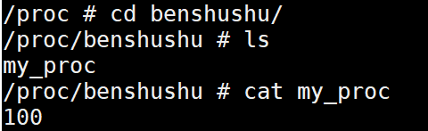
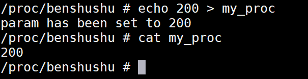
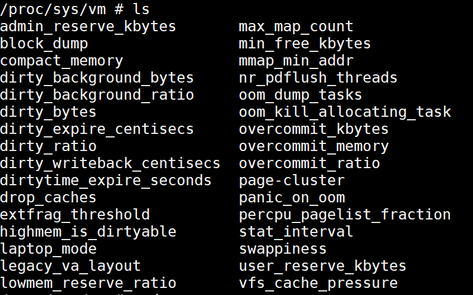

# 实验 12-3：procfs 

## 1．实验目的

1）写一个内核模块，在/proc 中创建一个名为“test”的目录。

2）在 test 目录下面创建两个节点，分别是“read”和“write”。从“read”节点中可以读取内核模块的某个全局变量的值，往“write”节点写数据可以修改某个全局变量的值。

## 2．实验要求

procfs 文件系统提供了一些常用的 API，这些 API 函数定义在 fs/proc/internal.h 文

件中。

proc_mkdir()可以在 parent 父目录中创建一个名字为 name 的目录，如果 parent 指

定为 NULL，则在/proc 的根目录下面创建一个目录。

```
struct proc_dir_entry *proc_mkdir(const char *name,
 struct proc_dir_entry *parent)
```

proc_create()函数会创建一个新的文件节点。

```
struct proc_dir_entry *proc_create(
 const char *name, umode_t mode, struct proc_dir_entry *parent,
 const struct file_operations *proc_fops)
```

其中，name 是该节点的名称，mode 是该节点的访问权限，以 UGO 的模式来表

示；parent 和 proc_mkdir()函数中的 parent 类型，指向父进程的 proc_dir_entry 对象；

proc_fops 指向该文件的操作函数。

比如 misc 驱动在初始化时就创建了一个名为“misc”的文件。

```
<driver/char/misc.c>
static int __init misc_init(void)
{
 int err;
#ifdef CONFIG_PROC_FS
 proc_create("misc", 0, NULL, &misc_proc_fops);
#endif
…
}
```

proc_fops 会指向该文件的操作函数集，比如 misc 驱动中会定义 misc_proc_fops

函数集，里面有 open、read、llseek、release 等文件操作函数。

```
static const struct file_operations misc_proc_fops = {
 .owner = THIS_MODULE,
 .open = misc_seq_open,
 .read = seq_read,
 .llseek = seq_lseek,
 .release = seq_release,
};
```

下面是读取/proc/misc 这个文件的相关信息，这里列出了系统中 misc 设备的信息。

```
/proc # cat misc 
59 ubi_ctrl
60 memory_bandwidth
61 network_throughput
62 network_latency
63 cpu_dma_latency
 1 psaux
 183 hw_random
```

读者可以参照 Linux 内核中的例子来完成本实验。

## 3．实验步骤

### 下面是本实验的实验步骤。

## 启动 QEMU+runninglinuxkernel。

```
$ ./run_rlk_arm64.sh run
```


### 进入本实验的参考代码。

```
# cd /mnt/rlk_lab/rlk_basic/chapter_12_debug/lab3_procfs
```

编译内核模块。

```
benshushu:lab3_procfs# make
make -C /lib/modules/`uname -r`/build 
M=/mnt/rlk_lab/rlk_basic/chapter_12_debug/lab3_procfs modules;
make[1]: Entering directory '/usr/src/linux'
 CC [M] /mnt/rlk_lab/rlk_basic/chapter_12_debug/lab3_procfs/proc_test.o
 LD [M] /mnt/rlk_lab/rlk_basic/chapter_12_debug/lab3_procfs/proc-test.o
 Building modules, stage 2.
 MODPOST 1 modules
 CC /mnt/rlk_lab/rlk_basic/chapter_12_debug/lab3_procfs/proc-test.mod.o
 LD [M] /mnt/rlk_lab/rlk_basic/chapter_12_debug/lab3_procfs/proc-test.ko
make[1]: Leaving directory '/usr/src/linux'
```

安装内核模块。

```
benshushu:lab3_procfs# insmod proc-test.ko 

[ 272.813515] I created benshushu/my_proc
```

​		在proc目录下面创建了一个名为benshushu的新的目录，然后新建了一个my_proc的节点。

​		my_proc 节点有一个默认值。



​		通过 echo 命令来往这个节点里写入新的值。



## 4．实验代码分析

```
1 #include <linux/module.h>
2 #include <linux/proc_fs.h>
3 #include <linux/uaccess.h>
4 #include <linux/init.h>
5 
6 #define NODE "benshushu/my_proc"
7 
8 static int param = 100;
9 static struct proc_dir_entry *my_proc;
10static struct proc_dir_entry *my_root;
11
12#define KS 32
13static char kstring[KS]; /* should be less sloppy about overflows :) 
*/
14
15static ssize_t
16my_read(struct file *file, char __user *buf, size_t lbuf, loff_t *ppos)
17{
18 int nbytes = sprintf(kstring, "%d\n", param);
19 return simple_read_from_buffer(buf, lbuf, ppos, kstring, nbytes);
20}
21
22static ssize_t my_write(struct file *file, const char __user *buf, size_t 
lbuf,
23 loff_t *ppos)
24{
25 ssize_t rc;
26 rc = simple_write_to_buffer(kstring, lbuf, ppos, buf, lbuf);
27 sscanf(kstring, "%d", &param);
28 pr_info("param has been set to %d\n", param);
29 return rc;
30}
31
32static const struct file_operations my_proc_fops = {
33 .owner = THIS_MODULE,
34 .read = my_read,
35 .write = my_write,
36};
37
38static int __init my_init(void)
39{
40 my_root = proc_mkdir("benshushu", NULL);
41 if (IS_ERR(my_root)){
42 pr_err("I failed to make benshushu dir\n");
43 return -1;
44 }
45
46 my_proc = proc_create(NODE, 0, NULL, &my_proc_fops);
47 if (IS_ERR(my_proc)){
48 pr_err("I failed to make %s\n", NODE);
49 return -1;
50 }
51 pr_info("I created %s\n", NODE);
52 return 0;
53}
54
55static void __exit my_exit(void)
56{
57 if (my_proc) {
58 proc_remove(my_proc);
59 proc_remove(my_root);
60 pr_info("Removed %s\n", NODE);
61 }
62}
63
64module_init(my_init);
65module_exit(my_exit);
66MODULE_LICENSE("GPL");
```

5．进阶思考

创建 procfs 是内核调试或者说内核空间和用户空间进行交换的一个重要的手段。

内核里有不少全局的变量值，存放在 procfs 里面，有三个目录的节点，是值得我

们去学习和研究的，特别是做运维和系统调优的朋友们。

1. /proc/sys/kernel 目录，里面存放了内核核心的调优参数

2. /proc/sys/vm 目录，里面存放了内核内存管理相关的调优参数

3. /proc/pid/目录，这里 pid 指的是具体的进程的 pid，这里面存放的是每个进程相关的调优参数。

