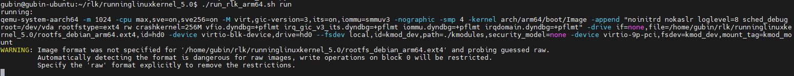
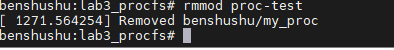

# 实验 12-3：procfs 

## 1．实验目的

​		1）写一个内核模块，在/proc 中创建一个名为“test”的目录。

​		2）在 test 目录下面创建两个节点，分别是“read”和“write”。从“read”节点中可以读取内核模块的某个全局变量的值，往“write”节点写数据可以修改某个全局变量的值。

## 2．实验要求

​		procfs 文件系统提供了一些常用的 API，这些 API 函数定义在 fs/proc/internal.h 文件中。

​		proc_mkdir()可以在 parent 父目录中创建一个名字为 name 的目录，如果 parent 指定为 NULL，则在/proc 的根目录下面创建一个目录。

```C
struct proc_dir_entry *proc_mkdir(const char *name,
 struct proc_dir_entry *parent)
```

​		proc_create()函数会创建一个新的文件节点。

```C
struct proc_dir_entry *proc_create(
 const char *name, umode_t mode, struct proc_dir_entry *parent,
 const struct file_operations *proc_fops)
```

​		其中，name 是该节点的名称，mode 是该节点的访问权限，以 UGO 的模式来表示；parent 和 proc_mkdir()函数中的 parent 类型，指向父进程的 proc_dir_entry 对象；proc_fops 指向该文件的操作函数。比如 misc 驱动在初始化时就创建了一个名为“misc”的文件。

```C
<driver/char/misc.c>
static int __init misc_init(void)
{
 int err;
#ifdef CONFIG_PROC_FS
 proc_create("misc", 0, NULL, &misc_proc_fops);
#endif
…
}
```

​		proc_fops 会指向该文件的操作函数集，比如 misc 驱动中会定义 misc_proc_fops函数集，里面有 open、read、llseek、release 等文件操作函数。

```C
static const struct file_operations misc_proc_fops = {
 .owner = THIS_MODULE,
 .open = misc_seq_open,
 .read = seq_read,
 .llseek = seq_lseek,
 .release = seq_release,
};
```

​		下面是读取/proc/misc 这个文件的相关信息，这里列出了系统中 misc 设备的信息。

```C
/proc # cat misc 
59 ubi_ctrl
60 memory_bandwidth
61 network_throughput
62 network_latency
63 cpu_dma_latency
 1 psaux
 183 hw_random
```

​		读者可以参照 Linux 内核中的例子来完成本实验。

## 3．实验步骤

### 下面是本实验的实验步骤。

## 启动 QEMU+runninglinuxkernel。

```
$ ./run_rlk_arm64.sh run
```


### 进入本实验的参考代码。

```
# cd /mnt/rlk_lab/rlk_basic/chapter_12_debug/lab3_procfs
```



### 编译内核模块。

```shell
benshushu:lab3_procfs# make
make -C /lib/modules/`uname -r`/build 
M=/mnt/rlk_lab/rlk_basic/chapter_12_debug/lab3_procfs modules;
make[1]: Entering directory '/usr/src/linux'
 CC [M] /mnt/rlk_lab/rlk_basic/chapter_12_debug/lab3_procfs/proc_test.o
 LD [M] /mnt/rlk_lab/rlk_basic/chapter_12_debug/lab3_procfs/proc-test.o
 Building modules, stage 2.
 MODPOST 1 modules
 CC /mnt/rlk_lab/rlk_basic/chapter_12_debug/lab3_procfs/proc-test.mod.o
 LD [M] /mnt/rlk_lab/rlk_basic/chapter_12_debug/lab3_procfs/proc-test.ko
make[1]: Leaving directory '/usr/src/linux'
```

```makefile
BASEINCLUDE ?= /lib/modules/`uname -r`/build

proc-test-objs := proc_test.o

obj-m   :=   proc-test.o
all :
        $(MAKE) -C $(BASEINCLUDE) M=$(PWD) modules;

clean:
        $(MAKE) -C $(BASEINCLUDE) M=$(PWD) clean;
        rm -f *.ko;

```


### 安装内核模块。

```shell
benshushu:lab3_procfs# insmod proc-test.ko 

[ 272.813515] I created benshushu/my_proc
```


​		在proc目录下面创建了一个名为benshushu的新的目录，然后新建了一个my_proc的节点。

​		my_proc 节点有一个默认值。


​		通过 echo 命令来往这个节点里写入新的值。


### 实验结束清理

卸载内核模块，会将自己操作的删掉（具体实现查看代码）

```
rmmod proc-test
```



```
make clean
```


## 4．实验代码分析

```C
#include <linux/module.h>
#include <linux/proc_fs.h>
#include <linux/uaccess.h>
#include <linux/init.h>

#define NODE "benshushu/my_proc"

static int param = 100;
static struct proc_dir_entry *my_proc;
static struct proc_dir_entry *my_root;

#define KS 32
static char kstring[KS]; /* should be less sloppy about overflows :) */

static ssize_t my_read(struct file *file, char __user *buf, size_t lbuf, loff_t *ppos)
{
    int nbytes = sprintf(kstring, "%d\n", param);
    return simple_read_from_buffer(buf, lbuf, ppos, kstring, nbytes);
}

static ssize_t my_write(struct file *file, const char __user *buf, size_t lbuf, loff_t *ppos)
{
    ssize_t rc;
    rc = simple_write_to_buffer(kstring, lbuf, ppos, buf, lbuf);
    sscanf(kstring, "%d", &param);
    pr_info("param has been set to %d\n", param);
    return rc;
}

static const struct file_operations my_proc_fops = {
    .owner = THIS_MODULE,
    .read = my_read,
    .write = my_write,
};

static int __init my_init(void)
{
    my_root = proc_mkdir("benshushu", NULL);
    if (IS_ERR(my_root)) {
        pr_err("I failed to make benshushu dir\n");
        return -1;
    }

    my_proc = proc_create(NODE, 0, NULL, &my_proc_fops);
    if (IS_ERR(my_proc)) {
        pr_err("I failed to make %s\n", NODE);
        return -1;
    }
    pr_info("I created %s\n", NODE);
    return 0;
}

static void __exit my_exit(void)
{
    if (my_proc) {
        proc_remove(my_proc);
        proc_remove(my_root);
        pr_info("Removed %s\n", NODE);
    }
}

module_init(my_init);
module_exit(my_exit);
MODULE_LICENSE("GPL");

```

------

### 代码分析和详细注释

这个内核模块使用了 `/proc` 文件系统来创建自定义的文件夹和文件，并通过这些文件进行数据的读写。`/proc` 是 Linux 内核提供的一种文件系统接口，通常用于获取和设置内核的运行时参数。这个模块创建了一个 `/proc/benshushu/my_proc` 文件，可以通过该文件读取或修改 `param` 变量的值。下面是对该代码的详细注释和分析。

```C
c复制代码#include <linux/module.h>
#include <linux/proc_fs.h>
#include <linux/uaccess.h>
#include <linux/init.h>

// 定义文件路径名称
#define NODE "benshushu/my_proc"

static int param = 100; // 模块中的一个参数，可以通过/proc文件进行读取和修改
static struct proc_dir_entry *my_proc; // 用于存储/proc/my_proc的入口指针
static struct proc_dir_entry *my_root; // 用于存储/proc/benshushu目录的入口指针

#define KS 32
static char kstring[KS]; // 用于存储读写的字符串

// 自定义的读取函数，用于从/proc文件读取数据
static ssize_t my_read(struct file *file, char __user *buf, size_t lbuf, loff_t *ppos)
{
    // 将param的值转换成字符串，并存储在kstring中
    int nbytes = sprintf(kstring, "%d\n", param);

    // 使用simple_read_from_buffer函数从内核缓冲区中读取数据到用户空间
    return simple_read_from_buffer(buf, lbuf, ppos, kstring, nbytes);
}

// 自定义的写入函数，用于将数据写入到/proc文件中
static ssize_t my_write(struct file *file, const char __user *buf, size_t lbuf, loff_t *ppos)
{
    ssize_t rc;

    // 将用户空间的数据写入到内核缓冲区kstring
    rc = simple_write_to_buffer(kstring, lbuf, ppos, buf, lbuf);
    
    // 使用sscanf从kstring中读取整数，并赋值给param
    sscanf(kstring, "%d", &param);
    
    // 打印信息，显示param的新值
    pr_info("param has been set to %d\n", param);
    return rc;
}

// 定义文件操作函数表
static const struct file_operations my_proc_fops = {
    .owner = THIS_MODULE,
    .read = my_read,  // 关联读取函数
    .write = my_write, // 关联写入函数
};

// 模块初始化函数
static int __init my_init(void)
{
    // 创建/proc/benshushu目录
    my_root = proc_mkdir("benshushu", NULL);
    if (IS_ERR(my_root)) {
        pr_err("I failed to make benshushu dir\n");
        return -1;
    }

    // 在benshushu目录下创建my_proc文件
    my_proc = proc_create(NODE, 0, NULL, &my_proc_fops);
    if (IS_ERR(my_proc)) {
        pr_err("I failed to make %s\n", NODE);
        return -1;
    }

    // 打印信息，表示创建成功
    pr_info("I created %s\n", NODE);
    return 0;
}

// 模块退出函数
static void __exit my_exit(void)
{
    if (my_proc) {
        // 移除/proc/benshushu/my_proc文件
        proc_remove(my_proc);
        
        // 移除/proc/benshushu目录
        proc_remove(my_root);
        
        // 打印信息，表示移除成功
        pr_info("Removed %s\n", NODE);
    }
}

// 模块入口和出口
module_init(my_init);
module_exit(my_exit);
MODULE_LICENSE("GPL");
```

### 代码分析

1. **模块初始化和退出函数：**
   - `my_init`：这是模块的初始化函数，在模块加载时被调用。它首先创建一个 `/proc/benshushu` 目录，然后在该目录下创建一个 `my_proc` 文件，用于后续的读写操作。
   - `my_exit`：模块退出函数，在模块卸载时调用。该函数会删除先前创建的 `/proc/benshushu/my_proc` 文件和 `benshushu` 目录。
2. **文件读写操作：**
   - `my_read`：这是一个读取操作的实现，通过 `simple_read_from_buffer` 将内核中的字符串 `kstring` 复制到用户空间。`kstring` 中存储了 `param` 的当前值，格式为字符串。例如，如果 `param` 为 100，`kstring` 的内容将是 `"100\n"`。
   - `my_write`：这是一个写入操作的实现，通过 `simple_write_to_buffer` 从用户空间读取字符串数据，并存储到 `kstring` 中，然后使用 `sscanf` 将字符串转换为整数并存储到 `param` 中。
3. **文件操作表：**
   - 定义了 `my_proc_fops`，包含 `.read` 和 `.write` 两个操作函数，用于关联文件的读和写操作。
4. **宏定义和全局变量：**
   - `NODE` 定义了 `/proc` 文件的路径。
   - `param` 是一个全局整型变量，初始值为 100，可以通过 `/proc/benshushu/my_proc` 进行读取和修改。
   - `kstring` 是一个字符缓冲区，用于在内核和用户空间之间传递数据。
   - `my_proc` 和 `my_root` 是指向 `/proc` 文件和目录的指针，用于创建和删除操作。

### 使用流程

1. **加载模块：**
   - 使用 `insmod` 命令加载该模块。
   - 模块加载后，将在 `/proc/benshushu/` 目录下创建 `my_proc` 文件，可以通过它读取和写入 `param` 的值。
2. **读取值：**
   - 使用 `cat /proc/benshushu/my_proc` 命令读取 `param` 的值，将会显示当前 `param` 的值。
3. **修改值：**
   - 使用 `echo 200 > /proc/benshushu/my_proc` 命令修改 `param` 的值。
4. **卸载模块：**
   - 使用 `rmmod` 命令卸载模块，`my_exit` 函数将被调用，删除 `/proc/benshushu/my_proc` 文件和 `benshushu` 目录。

### 注意事项

1. `proc_mkdir` 和 `proc_create` 用于创建 `/proc` 文件和目录。创建文件时需要指定文件的操作函数，以便在用户进行读写操作时可以调用相应的回调函数。
2. `simple_read_from_buffer` 和 `simple_write_to_buffer` 是用于处理从用户空间到内核空间的简单读写操作的内核提供的 API。
3. 使用 `/proc` 文件系统时要注意权限和错误处理，以防止可能的越界和非法访问。

### 总结

该内核模块展示了如何使用 `/proc` 文件系统在内核空间与用户空间之间传递数据。通过 `my_read` 和 `my_write` 函数的实现，可以实现数据的读取和修改，提供了一个简单的内核参数调试接口。

------

## 5．进阶思考

​		创建 procfs 是内核调试或者说内核空间和用户空间进行交换的一个重要的手段。内核里有不少全局的变量值，存放在 procfs 里面，有三个目录的节点，是值得我们去学习和研究的，特别是做运维和系统调优的朋友们。

1. /proc/sys/kernel 目录，里面存放了内核核心的调优参数

2. /proc/sys/vm 目录，里面存放了内核内存管理相关的调优参数

3. /proc/pid/目录，这里 pid 指的是具体的进程的 pid，这里面存放的是每个进程相关的调优参数。


