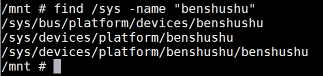
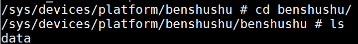
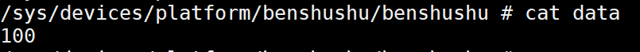
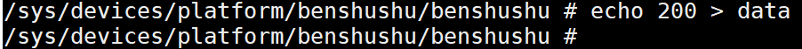
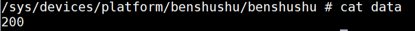

# 实验 12-4：sysfs 

## 1．实验目的

1）写一个内核模块，在/sys/目录下面创建一个名为“test”的目录。

2）在 test 目录下面创建两个节点，分别是“read”和“write”。从“read”节点中

可以读取内核模块的某个全局变量的值，往“write”节点写数据可以修改某个全局变

量的值。

## 2．实验要求

下面介绍本实验会用到的一些 API 函数。

kobject_create_and_add()函数会动态生成一个 struct kobject 数据结构，然后将其

注册到 sysfs 文件系统中。其中，name 就是要创建的文件或者目录的名称，parent 指

向父目录的 kobject 数据结构，若 parent 为 NULL，说明父目录就是/sys 目录。

```
struct kobject *kobject_create_and_add(const char *name, struct kobject 
*parent)
```

sysfs_create_group()函数会在参数 1 的 kobj 目录下面创建一个属性集合，并且显

示该集合的文件。

```
static inline int sysfs_create_group(struct kobject *kobj,
 const struct attribute_group *grp)
```

参数 2 中描述的是一组属性类型，其数据结构定义如下。

```
<include/linux/sysfs.h>
struct attribute_group {
 const char *name;
 umode_t (*is_visible)(struct kobject *,
 struct attribute *, int);
 struct attribute **attrs;
 struct bin_attribute **bin_attrs;
};
```

其中，struct attribute 数据结构用于描述文件的属性。

下面以/sys/kernel/目录下面的文件为例来说明它们是如何建立的。

```
/sys/kernel # ls -l
total 0
drwx------ 17 0 0 0 Jan 1 1970 debug
-r--r--r-- 1 0 0 4096 Apr 29 07:08 fscaps
-r--r--r-- 1 0 0 4096 Apr 29 07:08 kexec_crash_loaded
-rw-r--r-- 1 0 0 4096 Apr 29 07:08 kexec_crash_size
-r--r--r-- 1 0 0 4096 Apr 29 07:08 kexec_loaded
drwxr-xr-x 2 0 0 0 Apr 29 07:08 mm
-r--r--r-- 1 0 0 36 Apr 29 07:08 notes
-rw-r--r-- 1 0 0 4096 Apr 29 07:08 profiling
-rw-r--r-- 1 0 0 4096 Apr 29 07:08 rcu_expedited
drwxr-xr-x 70 0 0 0 Apr 29 07:08 slab
-rw-r--r-- 1 0 0 4096 Apr 29 07:08 uevent_helper
-r--r--r-- 1 0 0 4096 Apr 29 07:08 uevent_seqnum
-r--r--r-- 1 0 0 4096 Apr 29 07:08 vmcoreinfo
```

/sys/kernel 目录建立在内核源代码的 kernel/ksysfs.c 文件中。

```
static int __init ksysfs_init(void)
{
 kernel_kobj = kobject_create_and_add("kernel", NULL);
 …
 error = sysfs_create_group(kernel_kobj, &kernel_attr_group);
 return 0;
}
```

这里 kobject_create_and_add()在/sys 目录下建立一个名为“kernel”的目录，然后sysfs_create_group()函数在该目录下面创建一些属性集合。

```
static struct attribute * kernel_attrs[] = {
 &fscaps_attr.attr,
 &uevent_seqnum_attr.attr,
&profiling_attr.attr,
 NULL
};
static struct attribute_group kernel_attr_group = {
 .attrs = kernel_attrs,
};
```

以 profiling 文件为例，这里实现 profiling_show()和 profiling_store()两个函数，分

别对应读和写操作。

```
static ssize_t profiling_show(struct kobject *kobj,
 struct kobj_attribute *attr, char *buf)
{
 return sprintf(buf, "%d\n", prof_on);
}
static ssize_t profiling_store(struct kobject *kobj,
 struct kobj_attribute *attr,
 const char *buf, size_t count)
{
 int ret;
 profile_setup((char *)buf);
 ret = profile_init();
 return count;
}
KERNEL_ATTR_RW(profiling);
```

其中 KERNEL_ATTR_RW 宏定义如下。

```
#define KERNEL_ATTR_RO(_name) \
static struct kobj_attribute _name##_attr = __ATTR_RO(_name)
#define KERNEL_ATTR_RW(_name) \
static struct kobj_attribute _name##_attr = \
 __ATTR(_name, 0644, _name##_show, _name##_store)
```

上面是/sys/kernel 的一个例子，Linux 内核源代码里还有很多设备驱动的例子，读

者可以参考这些例子来完成本实验。

## 3．实验步骤

### 下面是本实验的实验步骤。

### 启动 QEMU+runninglinuxkernel。

```
$ ./run_rlk_arm64.sh run
```


### 进入本实验的参考代码。

```
# cd /mnt/rlk_lab/rlk_basic/chapter_12_debug/lab4_sysfs
```

### 编译内核模块。

```
benshushu:lab4_sysfs# make
make -C /lib/modules/`uname -r`/build 
M=/mnt/rlk_lab/rlk_basic/chapter_12_debug/lab4_sysfs modules;
make[1]: Entering directory '/usr/src/linux'
 CC [M] /mnt/rlk_lab/rlk_basic/chapter_12_debug/lab4_sysfs/sysfs_test.o
 LD [M] /mnt/rlk_lab/rlk_basic/chapter_12_debug/lab4_sysfs/sysfs-test.o
 Building modules, stage 2.
 MODPOST 1 modules
 CC /mnt/rlk_lab/rlk_basic/chapter_12_debug/lab4_sysfs/sysfs-test.mod.o
 LD [M] /mnt/rlk_lab/rlk_basic/chapter_12_debug/lab4_sysfs/sysfs-test.ko
make[1]: Leaving directory '/usr/src/linux'
```

安装内核模块。注意安装本实验的内核模块之前，请确保上一个实验的内核模块

已经卸载。

```
benshushu:lab4_sysfs# rmmod proc_test
benshushu:lab4_sysfs# insmod sysfs-test.ko 
[ 604.377514] I created benshushu/my_proc on procfs
[ 604.383013] create sysfs node done
benshushu:lab4_sysfs#
```

那这个 sysfs 目录创建到哪里呢？我们可以通过 find 命令来查找。



那我们看到在 /sys/bus/platform/devices/benshushu 和/sys/devices/platform/benshushu 目录下面创建了“benshushu”的文件夹。



进入到/sys/devices/platform/benshushu/benshushu这个目录就可以看到data这个节点。

然后通过 cat 和 echo 命令来读写这个节点。







## 4．实验代码分析

```
1 #include <linux/module.h>
2 #include <linux/proc_fs.h>
3 #include <linux/uaccess.h>
4 #include <linux/init.h>
5 #include <linux/device.h>
6 #include <linux/platform_device.h>
7 #include <linux/sysfs.h>
8 
9 #define NODE "benshushu/my_proc"
10 
11 static int param = 100;
12 static struct proc_dir_entry *my_proc;
13 static struct proc_dir_entry *my_root;
14 static struct platform_device *my_device;
15 
16 #define KS 32
17 static char kstring[KS]; /* should be less sloppy about overflows :) 
*/
18 
19 static ssize_t
20 my_read(struct file *file, char __user *buf, size_t lbuf, loff_t *ppos)
21 {
22 int nbytes = sprintf(kstring, "%d\n", param);
23 return simple_read_from_buffer(buf, lbuf, ppos, kstring, nbytes);
24 }
25 
26 static ssize_t my_write(struct file *file, const char __user *buf, size_t 
lbuf,
27 loff_t *ppos)
28 {
29 ssize_t rc;
30 rc = simple_write_to_buffer(kstring, lbuf, ppos, buf, lbuf);
31 sscanf(kstring, "%d", &param);
32 pr_info("param has been set to %d\n", param);
33 return rc;
34 }
35 
36 static const struct file_operations my_proc_fops = {
37 .owner = THIS_MODULE,
38 .read = my_read,
39 .write = my_write,
40 };
41 
42 static ssize_t data_show(struct device *d,
43 struct device_attribute *attr, char *buf)
44 {
45 return sprintf(buf, "%d\n", param);
46 }
47 
48 static ssize_t data_store(struct device *d,
49 struct device_attribute *attr,
50 const char *buf, size_t count)
51 {
52 sscanf(buf, "%d", &param);
53 dev_dbg(d, ": write %d into data\n", param);
54 
55 return strnlen(buf, count);
56 }
57 
58 static DEVICE_ATTR_RW(data);
59 
60 static struct attribute *ben_sysfs_entries[] = {
61 &dev_attr_data.attr,
62 NULL
63 };
64 
65 static struct attribute_group mydevice_attr_group = {
66 .name = "benshushu",
67 .attrs = ben_sysfs_entries,
68 };
69 
70 static int __init my_init(void)
71 {
72 int ret;
73 
74 my_root = proc_mkdir("benshushu", NULL);
75 my_proc = proc_create(NODE, 0, NULL, &my_proc_fops);
76 if (IS_ERR(my_proc)) {
77 pr_err("I failed to make %s\n", NODE);
78 return PTR_ERR(my_proc);
79 }
80 pr_info("I created %s on procfs\n", NODE);
81 
82 my_device = platform_device_register_simple("benshushu", -1, NULL, 
0);
83 if (IS_ERR(my_device)) {
84 printk("platfrom device register fail\n");
85 ret = PTR_ERR(my_device);
86 goto proc_fail;
87 }
88 
89 ret = sysfs_create_group(&my_device->dev.kobj, 
&mydevice_attr_group);
90 if (ret) {
91 printk("create sysfs group fail\n");
92 goto register_fail;
93 }
94 
95 pr_info("create sysfs node done\n");
96 
97 return 0;
98 
99 register_fail:
100 platform_device_unregister(my_device);
101proc_fail:
102 return ret;
103}
104
105static void __exit my_exit(void)
106{
107 if (my_proc) {
108 proc_remove(my_proc);
109 proc_remove(my_root);
110 pr_info("Removed %s\n", NODE);
111 }
112
113 sysfs_remove_group(&my_device->dev.kobj, &mydevice_attr_group);
114
115 platform_device_unregister(my_device);
116}
117
118module_init(my_init);
119module_exit(my_exit);
120MODULE_LICENSE("GPL");
```

