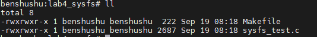

# 实验 12-4：sysfs 

## 1．实验目的

​		1）写一个内核模块，在/sys/目录下面创建一个名为“test”的目录。

​		2）在 test 目录下面创建两个节点，分别是“read”和“write”。从“read”节点中可以读取内核模块的某个全局变量的值，往“write”节点写数据可以修改某个全局变量的值。

## 2．实验要求

​		下面介绍本实验会用到的一些 API 函数。

​		kobject_create_and_add()函数会动态生成一个 struct kobject 数据结构，然后将其注册到 sysfs 文件系统中。其中，name 就是要创建的文件或者目录的名称，parent 指向父目录的 kobject 数据结构，若 parent 为 NULL，说明父目录就是/sys 目录。

```C
struct kobject *kobject_create_and_add(const char *name, struct kobject 
*parent)
```

sysfs_create_group()函数会在参数 1 的 kobj 目录下面创建一个属性集合，并且显

示该集合的文件。

```C
static inline int sysfs_create_group(struct kobject *kobj,
 const struct attribute_group *grp)
```

参数 2 中描述的是一组属性类型，其数据结构定义如下。

```C
<include/linux/sysfs.h>
struct attribute_group {
 const char *name;
 umode_t (*is_visible)(struct kobject *,
 struct attribute *, int);
 struct attribute **attrs;
 struct bin_attribute **bin_attrs;
};
```

其中，struct attribute 数据结构用于描述文件的属性。

下面以/sys/kernel/目录下面的文件为例来说明它们是如何建立的。

```C
/sys/kernel # ls -l
total 0
drwx------ 17 0 0 0 Jan 1 1970 debug
-r--r--r-- 1 0 0 4096 Apr 29 07:08 fscaps
-r--r--r-- 1 0 0 4096 Apr 29 07:08 kexec_crash_loaded
-rw-r--r-- 1 0 0 4096 Apr 29 07:08 kexec_crash_size
-r--r--r-- 1 0 0 4096 Apr 29 07:08 kexec_loaded
drwxr-xr-x 2 0 0 0 Apr 29 07:08 mm
-r--r--r-- 1 0 0 36 Apr 29 07:08 notes
-rw-r--r-- 1 0 0 4096 Apr 29 07:08 profiling
-rw-r--r-- 1 0 0 4096 Apr 29 07:08 rcu_expedited
drwxr-xr-x 70 0 0 0 Apr 29 07:08 slab
-rw-r--r-- 1 0 0 4096 Apr 29 07:08 uevent_helper
-r--r--r-- 1 0 0 4096 Apr 29 07:08 uevent_seqnum
-r--r--r-- 1 0 0 4096 Apr 29 07:08 vmcoreinfo
```

/sys/kernel 目录建立在内核源代码的 kernel/ksysfs.c 文件中。

```C
static int __init ksysfs_init(void)
{
 kernel_kobj = kobject_create_and_add("kernel", NULL);
 …
 error = sysfs_create_group(kernel_kobj, &kernel_attr_group);
 return 0;
}
```

这里 kobject_create_and_add()在/sys 目录下建立一个名为“kernel”的目录，然后sysfs_create_group()函数在该目录下面创建一些属性集合。

```C
static struct attribute * kernel_attrs[] = {
 &fscaps_attr.attr,
 &uevent_seqnum_attr.attr,
&profiling_attr.attr,
 NULL
};
static struct attribute_group kernel_attr_group = {
 .attrs = kernel_attrs,
};
```

以 profiling 文件为例，这里实现 profiling_show()和 profiling_store()两个函数，分

别对应读和写操作。

```C
static ssize_t profiling_show(struct kobject *kobj,
 struct kobj_attribute *attr, char *buf)
{
 return sprintf(buf, "%d\n", prof_on);
}
static ssize_t profiling_store(struct kobject *kobj,
 struct kobj_attribute *attr,
 const char *buf, size_t count)
{
 int ret;
 profile_setup((char *)buf);
 ret = profile_init();
 return count;
}
KERNEL_ATTR_RW(profiling);
```

其中 KERNEL_ATTR_RW 宏定义如下。

```C
#define KERNEL_ATTR_RO(_name) \
static struct kobj_attribute _name##_attr = __ATTR_RO(_name)
#define KERNEL_ATTR_RW(_name) \
static struct kobj_attribute _name##_attr = \
 __ATTR(_name, 0644, _name##_show, _name##_store)
```

上面是/sys/kernel 的一个例子，Linux 内核源代码里还有很多设备驱动的例子，读

者可以参考这些例子来完成本实验。

## 3．实验步骤

### 下面是本实验的实验步骤。

### 启动 QEMU+runninglinuxkernel。

```
$ ./run_rlk_arm64.sh run
```

### 进入本实验的参考代码。

```
# cd /mnt/rlk_lab/rlk_basic/chapter_12_debug/lab4_sysfs
```



### 编译内核模块。

```shell
benshushu:lab4_sysfs# make
make -C /lib/modules/`uname -r`/build 
M=/mnt/rlk_lab/rlk_basic/chapter_12_debug/lab4_sysfs modules;
make[1]: Entering directory '/usr/src/linux'
 CC [M] /mnt/rlk_lab/rlk_basic/chapter_12_debug/lab4_sysfs/sysfs_test.o
 LD [M] /mnt/rlk_lab/rlk_basic/chapter_12_debug/lab4_sysfs/sysfs-test.o
 Building modules, stage 2.
 MODPOST 1 modules
 CC /mnt/rlk_lab/rlk_basic/chapter_12_debug/lab4_sysfs/sysfs-test.mod.o
 LD [M] /mnt/rlk_lab/rlk_basic/chapter_12_debug/lab4_sysfs/sysfs-test.ko
make[1]: Leaving directory '/usr/src/linux'
```

```makefile
BASEINCLUDE ?= /lib/modules/`uname -r`/build

sysfs-test-objs := sysfs_test.o

obj-m   :=   sysfs-test.o
all :
        $(MAKE) -C $(BASEINCLUDE) M=$(PWD) modules;

clean:
        $(MAKE) -C $(BASEINCLUDE) M=$(PWD) clean;
        rm -f *.ko;
```


### 安装内核模块。注意安装本实验的内核模块之前，请确保上一个实验的内核模块

​		已经卸载。

```
benshushu:lab4_sysfs# rmmod proc_test
benshushu:lab4_sysfs# insmod sysfs-test.ko 
[ 604.377514] I created benshushu/my_proc on procfs
[ 604.383013] create sysfs node done
benshushu:lab4_sysfs#
```


​		那这个 sysfs 目录创建到哪里呢？我们可以通过 find 命令来查找。

```shell
find /sys -name "benshushu"
```


​		那我们看到在 /sys/bus/platform/devices/benshushu 和/sys/devices/platform/benshushu 目录下面创建了“benshushu”的文件夹。


​		进入到/sys/devices/platform/benshushu/benshushu这个目录就可以看到data这个节点。


​		然后通过 cat 和 echo 命令来读写这个节点。

```
cat data
echo 200 > data
cat data
```


## 实验结束清理

```
cd /mnt/rlk_lab/rlk_basic/chapter_12_debug/lab4_sysfs
rmmod sysfs-test
make clean
```


## 4．实验代码分析

```C
#include <linux/module.h>
#include <linux/proc_fs.h>
#include <linux/uaccess.h>
#include <linux/init.h>
#include <linux/device.h>
#include <linux/platform_device.h>
#include <linux/sysfs.h>

#define NODE "benshushu/my_proc"

static int param = 100;
static struct proc_dir_entry *my_proc;
static struct proc_dir_entry *my_root;
static struct platform_device *my_device;

#define KS 32
static char kstring[KS]; /* should be less sloppy about overflows :) */

static ssize_t my_read(struct file *file, char __user *buf, size_t lbuf, loff_t *ppos) {
    int nbytes = sprintf(kstring, "%d\n", param);
    return simple_read_from_buffer(buf, lbuf, ppos, kstring, nbytes);
}

static ssize_t my_write(struct file *file, const char __user *buf, size_t lbuf, loff_t *ppos) {
    ssize_t rc;
    rc = simple_write_to_buffer(kstring, lbuf, ppos, buf, lbuf);
    sscanf(kstring, "%d", &param);
    pr_info("param has been set to %d\n", param);
    return rc;
}

static const struct file_operations my_proc_fops = {
    .owner = THIS_MODULE,
    .read = my_read,
    .write = my_write,
};

static ssize_t data_show(struct device *d, struct device_attribute *attr, char *buf) {
    return sprintf(buf, "%d\n", param);
}

static ssize_t data_store(struct device *d, struct device_attribute *attr, const char *buf, size_t count) {
    sscanf(buf, "%d", &param);
    dev_dbg(d, ": write %d into data\n", param);
    return strnlen(buf, count);
}

static DEVICE_ATTR_RW(data);

static struct attribute *ben_sysfs_entries[] = {
    &dev_attr_data.attr,
    NULL
};

static struct attribute_group mydevice_attr_group = {
    .name = "benshushu",
    .attrs = ben_sysfs_entries,
};

static int __init my_init(void) {
    int ret;

    my_root = proc_mkdir("benshushu", NULL);
    my_proc = proc_create(NODE, 0, NULL, &my_proc_fops);
    if (IS_ERR(my_proc)) {
        pr_err("I failed to make %s\n", NODE);
        return PTR_ERR(my_proc);
    }
    pr_info("I created %s on procfs\n", NODE);

    my_device = platform_device_register_simple("benshushu", -1, NULL, 0);
    if (IS_ERR(my_device)) {
        printk("platform device register fail\n");
        ret = PTR_ERR(my_device);
        goto proc_fail;
    }

    ret = sysfs_create_group(&my_device->dev.kobj, &mydevice_attr_group);
    if (ret) {
        printk("create sysfs group fail\n");
        goto register_fail;
    }

    pr_info("create sysfs node done\n");
    return 0;

register_fail:
    platform_device_unregister(my_device);
proc_fail:
    return ret;
}

static void __exit my_exit(void) {
    if (my_proc) {
        proc_remove(my_proc);
        proc_remove(my_root);
        pr_info("Removed %s\n", NODE);
    }

    sysfs_remove_group(&my_device->dev.kobj, &mydevice_attr_group);
    platform_device_unregister(my_device);
}

module_init(my_init);
module_exit(my_exit);
MODULE_LICENSE("GPL");

```

### 代码详细注释和分析

这段代码创建了一个内核模块，通过 `/proc` 文件系统和 `sysfs` 文件系统实现与用户空间的交互。它提供了一个接口，允许用户读取和修改模块的参数。

#### 代码详解和注释

```C
#include <linux/module.h>      // 包含内核模块相关的宏、函数
#include <linux/proc_fs.h>     // 包含 /proc 文件系统操作相关的定义
#include <linux/uaccess.h>     // 用于在内核和用户空间之间复制数据
#include <linux/init.h>        // 包含模块初始化和清理相关的宏
#include <linux/device.h>      // 包含设备模型的相关定义
#include <linux/platform_device.h> // 包含平台设备相关的定义
#include <linux/sysfs.h>       // 用于 sysfs 文件系统接口

#define NODE "benshushu/my_proc" // 在 /proc 文件系统中的节点路径

static int param = 100; // 一个全局参数，默认值为 100
static struct proc_dir_entry *my_proc; // 指向 /proc 文件系统中的入口
static struct proc_dir_entry *my_root; // 指向 /proc 文件系统中的根目录
static struct platform_device *my_device; // 平台设备对象

#define KS 32
static char kstring[KS]; // 用于存储数据的缓冲区

// `my_read` 函数用于读取 `param` 值到用户空间
static ssize_t my_read(struct file *file, char __user *buf, size_t lbuf, loff_t *ppos) {
    int nbytes = sprintf(kstring, "%d\n", param); // 将 `param` 值格式化为字符串并存储到 `kstring`
    // 使用 `simple_read_from_buffer` 将 `kstring` 中的数据复制到用户空间
    return simple_read_from_buffer(buf, lbuf, ppos, kstring, nbytes);
}

// `my_write` 函数用于从用户空间写入数据并更新 `param`
static ssize_t my_write(struct file *file, const char __user *buf, size_t lbuf, loff_t *ppos) {
    ssize_t rc;
    // 从用户空间缓冲区 `buf` 中读取数据并存储到 `kstring`
    rc = simple_write_to_buffer(kstring, lbuf, ppos, buf, lbuf);
    sscanf(kstring, "%d", &param); // 将 `kstring` 中的数据解析为整数并赋值给 `param`
    pr_info("param has been set to %d\n", param); // 打印更新后的 `param` 值
    return rc; // 返回读取的字节数
}

// 定义文件操作结构体，绑定读写函数
static const struct file_operations my_proc_fops = {
    .owner = THIS_MODULE,
    .read = my_read,
    .write = my_write,
};

// `data_show` 函数用于通过 sysfs 读取 `param`
static ssize_t data_show(struct device *d, struct device_attribute *attr, char *buf) {
    return sprintf(buf, "%d\n", param); // 将 `param` 转换为字符串并复制到 `buf`
}

// `data_store` 函数用于通过 sysfs 写入数据并更新 `param`
static ssize_t data_store(struct device *d, struct device_attribute *attr, const char *buf, size_t count) {
    sscanf(buf, "%d", &param); // 从 `buf` 中读取整数并赋值给 `param`
    dev_dbg(d, ": write %d into data\n", param); // 打印写入操作信息
    return strnlen(buf, count); // 返回写入的字节数
}

// 创建一个 `data` 属性，用于绑定 `data_show` 和 `data_store` 函数
static DEVICE_ATTR_RW(data);

// 定义属性组，包含 `data` 属性
static struct attribute *ben_sysfs_entries[] = {
    &dev_attr_data.attr,
    NULL
};

// 创建属性组，组名为 "benshushu"
static struct attribute_group mydevice_attr_group = {
    .name = "benshushu",
    .attrs = ben_sysfs_entries,
};

// 模块初始化函数
static int __init my_init(void) {
    int ret;

    // 在 `/proc` 文件系统中创建 "benshushu" 目录
    my_root = proc_mkdir("benshushu", NULL);
    // 在 "benshushu" 目录下创建 "my_proc" 文件，并绑定读写操作
    my_proc = proc_create(NODE, 0, NULL, &my_proc_fops);
    if (IS_ERR(my_proc)) {
        pr_err("I failed to make %s\n", NODE);
        return PTR_ERR(my_proc); // 返回错误码
    }
    pr_info("I created %s on procfs\n", NODE);

    // 注册一个简单的平台设备
    my_device = platform_device_register_simple("benshushu", -1, NULL, 0);
    if (IS_ERR(my_device)) {
        printk("platform device register fail\n");
        ret = PTR_ERR(my_device);
        goto proc_fail; // 处理失败情况
    }

    // 创建 sysfs 属性组，挂载到平台设备上
    ret = sysfs_create_group(&my_device->dev.kobj, &mydevice_attr_group);
    if (ret) {
        printk("create sysfs group fail\n");
        goto register_fail; // 处理失败情况
    }

    pr_info("create sysfs node done\n");
    return 0; // 成功返回 0

register_fail:
    platform_device_unregister(my_device);
proc_fail:
    return ret; // 返回错误码
}

// 模块退出函数
static void __exit my_exit(void) {
    // 删除 /proc 文件系统中的节点
    if (my_proc) {
        proc_remove(my_proc);
        proc_remove(my_root);
        pr_info("Removed %s\n", NODE);
    }

    // 移除 sysfs 属性组
    sysfs_remove_group(&my_device->dev.kobj, &mydevice_attr_group);

    // 注销平台设备
    platform_device_unregister(my_device);
}

// 注册模块的初始化和退出函数
module_init(my_init);
module_exit(my_exit);
MODULE_LICENSE("GPL");
```

### 代码分析

1. **模块加载：**

   - ```
     my_init
     ```

      是模块的初始化函数，执行以下操作：

     - 在 `/proc` 文件系统中创建 "benshushu" 目录和一个文件 "my_proc"，并绑定自定义的读写函数，使用户可以通过 `/proc/benshushu/my_proc` 来读取和修改 `param` 值。
     - 注册一个平台设备 "benshushu"，并在 `sysfs` 文件系统中创建一个节点，用于读取和修改 `param`。

   - `sysfs_create_group` 函数在平台设备的 `sysfs` 目录下创建属性组，包含一个名为 "data" 的属性，可以通过该属性与用户空间进行交互。

2. **读取和写入操作：**

   - `my_read` 和 `my_write` 函数提供 `/proc` 文件系统中的读写操作，用于读取和修改 `param`。
   - `data_show` 和 `data_store` 函数提供 `sysfs` 文件系统中的接口，实现与用户空间的交互。

3. **模块卸载：**

   - ```
     my_exit
     ```

      是模块的退出函数，执行以下操作：

     - 删除 `/proc` 文件系统中的 "benshushu/my_proc" 文件和 "benshushu" 目录。
     - 移除 `sysfs` 属性组，并注销平台设备。

4. **总体分析：**

   - 该模块通过 `/proc` 文件系统和 `sysfs` 文件系统向用户空间提供接口，允许用户读取和修改内核中的 `param` 变量。
   - 通过 `proc_create` 和 `sysfs_create_group` 函数，可以方便地创建与用户空间交互的接口，适用于调试、设备管理等场景。

### 改进建议

- **错误处理**：在处理内核资源（如分配内存、创建节点）时，添加错误检查和适当的资源释放，以避免内核泄露。
- **安全性**：当前使用 `sscanf` 解析用户输入数据，可能存在输入溢出风险。可以考虑使用更安全的输入处理方法，如 `kstrtoint`。
