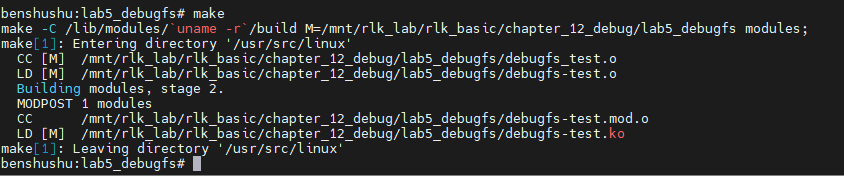
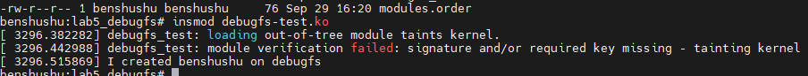
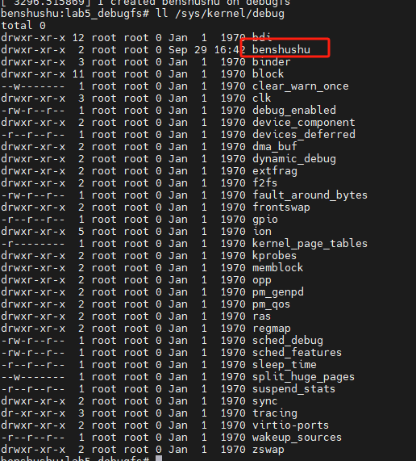
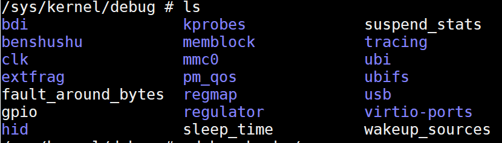
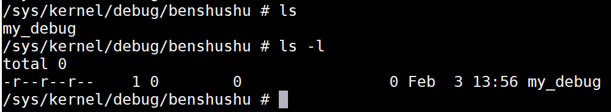
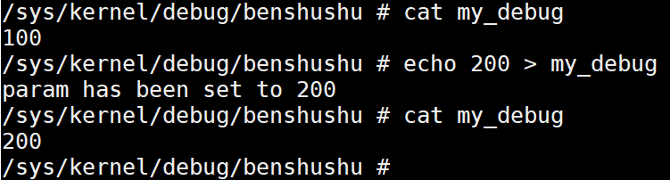
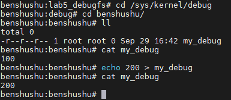
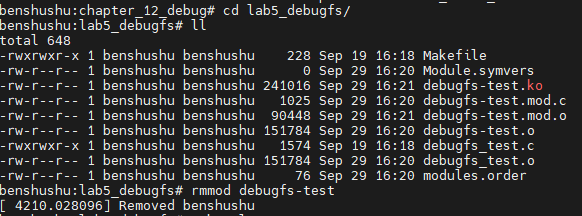
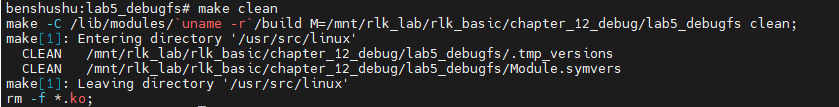

# 实验 12-5：debugfs 

## 1．实验目的

1）写一个内核模块，在 debugfs 文件系统中创建一个名为“test”的目录。

2）在 test 目录下面创建两个节点，分别是“read”和“write”。从“read”节点中

可以读取内核模块的某个全局变量的值，向“write”节点写数据可以修改某个全局变

量的值。

## 2．实验要求

debufs文件系统中有不少API函数可以使用，它们定义在include/linux/debugfs.h头文件中。

```
struct dentry *debugfs_create_dir(const char *name,
 struct dentry *parent)
void debugfs_remove(struct dentry *dentry)
struct dentry *debugfs_create_blob(const char *name, umode_t mode,
 struct dentry *parent,
 struct debugfs_blob_wrapper *blob)
struct dentry *debugfs_create_file(const char *name, umode_t mode,
 struct dentry *parent, void *data,
 const struct file_operations *fops)
```

读者可以参照 Linux 内核中的例子来完成本实验。

## 3．实验步骤

### 下面是本实验的实验步骤。

### 启动 QEMU+runninglinuxkernel。

```
$ ./run_rlk_arm64.sh run
```

### 进入本实验的参考代码。

```
# cd /mnt/rlk_lab/rlk_basic/chapter_12_debug/lab5
```

### 编译内核模块。

```
benshushu:lab5_debugfs# make
make -C /lib/modules/`uname -r`/build 
M=/mnt/rlk_lab/rlk_basic/chapter_12_debug/lab5_debugfs modules;
make[1]: Entering directory '/usr/src/linux'
 CC [M] /mnt/rlk_lab/rlk_basic/chapter_12_debug/lab5_debugfs/debugfs_test.o
[ 890.252504] hrtimer: interrupt took 16687528 ns
 LD [M] /mnt/rlk_lab/rlk_basic/chapter_12_debug/lab5_debugfs/debugfs-test.o
 Building modules, stage 2.
 MODPOST 1 modules
make[2]: Warning: File 
'/mnt/rlk_lab/rlk_basic/chapter_12_debug/lab5_debugfs/debugfs-test.mod.c' has 
modification time 0.023 s in the future
 CC /mnt/rlk_lab/rlk_basic/chapter_12_debug/lab5_debugfs/debugfstest.mod.o
 LD [M] /mnt/rlk_lab/rlk_basic/chapter_12_debug/lab5_debugfs/debugfstest.ko
make[2]: warning: Clock skew detected. Your build may be incomplete.
make[1]: Leaving directory '/usr/src/linux'
```

```makefile
BASEINCLUDE ?= /lib/modules/`uname -r`/build

debugfs-test-objs := debugfs_test.o

obj-m   :=   debugfs-test.o
all :
        $(MAKE) -C $(BASEINCLUDE) M=$(PWD) modules;

clean:
        $(MAKE) -C $(BASEINCLUDE) M=$(PWD) clean;
        rm -f *.ko;
```



### 安装内核模块。

```
benshushu:lab5_debugfs# insmod debugfs-test.ko 
[ 1003.631638] I created benshushu on debugfs
```



​		==创建的目录会在哪里呢？debugfs 一般会 mount 到/sys/kernel/debug/这个目录。==

```
ll /sys/kernel/debug
```



​		如果大家发现这个目录不存在，或者里面没有东西，说明 debugfs 没有挂载，或者输入“df”命令来查看。那么可以手工挂载。

```
# mount -t debugfs none /sys/kernel/debug/
```

------

### ==补充：==

`mount -t debugfs none /sys/kernel/debug/` 这条命令在 Linux 系统中用于挂载 `debugfs` 文件系统。以下是对该命令的详细解释：

#### 指令各部分解析

1. **mount**：挂载文件系统的命令，用于将不同的文件系统挂载到某个目录上，使其内容可以被访问。
2. **-t debugfs**：指定要挂载的文件系统类型。`-t` 选项后跟文件系统的类型，这里是 `debugfs`，它是一种虚拟文件系统，专门用于调试和获取内核的运行信息。
3. **none**：通常用于挂载不需要设备的虚拟文件系统。`debugfs` 是一种内存中的虚拟文件系统，所以不需要指定具体的设备，使用 `none` 即可。
4. **/sys/kernel/debug/**：这是挂载点，即 `debugfs` 文件系统的挂载位置。挂载之后，你可以在 `/sys/kernel/debug/` 目录下查看和访问 `debugfs` 提供的调试信息。

#### `debugfs` 文件系统

- `debugfs` 是 Linux 内核提供的一种特殊的文件系统，供开发者、调试者和管理员用来调试内核。它提供了许多内核和驱动程序的调试信息，比如内核中的日志、状态信息、配置参数等等。
- 通常情况下，`/sys/kernel/debug` 目录默认是空的，只有在 `debugfs` 挂载后才能访问到各种调试信息。

#### 示例

执行此命令后，你可以通过以下方式查看挂载的 `debugfs` 内容：

```
ls /sys/kernel/debug/
```

这个命令会列出内核的调试信息，包括一些子目录，如 `tracing`、`bpf`、`drm` 等，具体内容取决于内核和驱动模块的配置。

#### 总结

`mount -t debugfs none /sys/kernel/debug/` 的作用是挂载 `debugfs` 虚拟文件系统到 `/sys/kernel/debug/`，以便你可以查看和获取内核的各种调试信息。

------

### 如果你希望在 `/sys/kernel/debug/` 目录下创建一个名为 `benshushu` 的文件夹

你可以通过在 `debugfs` 中创建自定义的调试入口。下面是如何实现这一目标的步骤：

#### 1. 挂载 `debugfs`

首先，确保 `debugfs` 文件系统已经挂载到 `/sys/kernel/debug`，如果没有，请运行以下命令：

```
mount -t debugfs none /sys/kernel/debug/
```

#### 2. 编写内核模块来创建 `benshushu` 目录

由于 `/sys/kernel/debug` 是一个特殊的文件系统，你需要通过内核代码（例如一个内核模块）来创建这个目录。下面是一个示例内核模块，演示如何在 `debugfs` 中创建一个名为 `benshushu` 的目录：

```
#include <linux/module.h>
#include <linux/debugfs.h>
#include <linux/init.h>

#define NODE "benshushu"

static struct dentry *debugfs_dir;

static int __init my_init(void)
{
    // 创建 /sys/kernel/debug/benshushu 目录
    debugfs_dir = debugfs_create_dir(NODE, NULL);
    if (!debugfs_dir) {
        pr_err("Failed to create /sys/kernel/debug/%s\n", NODE);
        return -ENOMEM;
    }
    pr_info("Created /sys/kernel/debug/%s\n", NODE);
    return 0;
}

static void __exit my_exit(void)
{
    // 移除 /sys/kernel/debug/benshushu 目录
    if (debugfs_dir) {
        debugfs_remove_recursive(debugfs_dir);
        pr_info("Removed /sys/kernel/debug/%s\n", NODE);
    }
}

module_init(my_init);
module_exit(my_exit);

MODULE_LICENSE("GPL");
MODULE_AUTHOR("Your Name");
MODULE_DESCRIPTION("Create a custom directory in debugfs");
```

#### 3. 编译并插入内核模块

- 将上面的代码保存为 `benshushu_debugfs.c`。

- 编译这个内核模块：

  ```
  make -C /lib/modules/$(uname -r)/build M=$(pwd) modules
  ```

- 插入模块：

  ```
  sudo insmod benshushu_debugfs.ko
  ```

#### 4. 验证

插入模块后，你可以检查 `/sys/kernel/debug/` 目录，看看是否有 `benshushu` 目录：

```
ls /sys/kernel/debug/benshushu
```

#### 5. 卸载模块

如果不再需要，可以卸载模块并移除 `benshushu` 目录：

```
sudo rmmod benshushu_debugfs
```

#### 总结

通过编写内核模块并使用 `debugfs_create_dir()` 函数，可以在 `/sys/kernel/debug/` 中创建自定义的目录。这个例子中，我们创建了一个名为 `benshushu` 的目录。

------

### 继续

进入到/sys/kernel/debug/目录后，你会发现有一个 benshushu 的目录。



进入 benshushu 目录之后，你发发现有一个 my_debug 的节点。



接下来就可以对这个节点进行读写操作了。





### 实验结束清理

```
cd /mnt/rlk_lab/rlk_basic/chapter_12_debug/lab5_debugfs/
rmmod 
make clean
```





## 4．实验代码分析

```C
#include <linux/module.h>
#include <linux/proc_fs.h>
#include <linux/uaccess.h>
#include <linux/init.h>
#include <linux/debugfs.h>

#define NODE "benshushu"

static int param = 100;
struct dentry *debugfs_dir;

#define KS 32
static char kstring[KS]; /* Should be less sloppy about overflows :) */

static ssize_t my_read(struct file *file, char __user *buf, size_t lbuf, loff_t *ppos)
{
    int nbytes = sprintf(kstring, "%d\n", param);
    return simple_read_from_buffer(buf, lbuf, ppos, kstring, nbytes);
}

static ssize_t my_write(struct file *file, const char __user *buf, size_t lbuf, loff_t *ppos)
{
    ssize_t rc;
    rc = simple_write_to_buffer(kstring, lbuf, ppos, buf, lbuf);
    sscanf(kstring, "%d", &param);
    return rc;
}

static const struct file_operations mydebugfs_ops = {
    .owner = THIS_MODULE,
    .read = my_read,
    .write = my_write,
};

static int __init my_init(void)
{
    struct dentry *debug_file;

    debugfs_dir = debugfs_create_dir(NODE, NULL);
    if (IS_ERR(debugfs_dir)) {
        printk("create debugfs dir fail\n");
        return -EFAULT;
    }

    debug_file = debugfs_create_file("my_debug", 0444, debugfs_dir, NULL, &mydebugfs_ops);
    if (IS_ERR(debug_file)) {
        printk("create debugfs file fail\n");
        debugfs_remove_recursive(debugfs_dir);
        return -EFAULT;
    }

    pr_info("I created %s on debugfs\n", NODE);
    return 0;
}

static void __exit my_exit(void)
{
    if (debugfs_dir) {
        debugfs_remove_recursive(debugfs_dir);
        pr_info("Removed %s\n", NODE);
    }
}

module_init(my_init);
module_exit(my_exit);
MODULE_LICENSE("GPL");

```

------

### 代码注释与详细分析

#### 引入头文件

```
#include <linux/module.h>    // 包含基本的内核模块宏定义
#include <linux/proc_fs.h>   // 用于 `proc` 文件系统接口
#include <linux/uaccess.h>   // 用户空间与内核空间数据拷贝
#include <linux/init.h>      // 用于模块初始化和退出宏
#include <linux/debugfs.h>   // 用于 `debugfs` 文件系统接口
```

这些头文件提供了内核模块开发所需的函数和宏，包括创建文件系统节点、读写用户空间数据，以及模块的初始化与清理。

#### 宏定义与全局变量

```
#define NODE "benshushu"  // 定义了在 debugfs 中的目录名称

static int param = 100;  // 用于记录参数值的全局变量
struct dentry *debugfs_dir;  // 用于存储 debugfs 目录节点指针

#define KS 32
static char kstring[KS]; // 用于存储传输数据的缓冲区，大小为 32 字节
```

- `NODE` 定义了在 `debugfs` 文件系统中的目录名称。
- `param` 是将要读写的全局参数，初始值为 100。
- `debugfs_dir` 用于保存 `debugfs` 目录的指针，以便在清理时使用。
- `kstring` 是数据缓冲区，用于读写操作时临时存储数据。

#### `my_read` 函数 - 读取文件操作

```
static ssize_t my_read(struct file *file, char __user *buf, size_t lbuf, loff_t *ppos)
{
    int nbytes = sprintf(kstring, "%d\n", param);  // 将 `param` 转换为字符串并存储在 `kstring` 中
    return simple_read_from_buffer(buf, lbuf, ppos, kstring, nbytes);  // 使用 `simple_read_from_buffer` 将 `kstring` 中的数据复制到用户空间
}
```

- `my_read` 是一个文件读取操作的回调函数。
- `sprintf` 将全局变量 `param` 转换为字符串，并存储在 `kstring` 中。
- `simple_read_from_buffer` 是一个内核提供的简单方法，将 `kstring` 中的数据读取到用户空间缓冲区 `buf` 中。
- `ppos` 是文件指针位置，用于跟踪读取的位置。
- 返回值是读取的字节数，或错误码。

#### `my_write` 函数 - 写文件操作

```
static ssize_t my_write(struct file *file, const char __user *buf, size_t lbuf, loff_t *ppos)
{
    ssize_t rc;
    rc = simple_write_to_buffer(kstring, lbuf, ppos, buf, lbuf);  // 将用户空间的 `buf` 数据写入到 `kstring`
    sscanf(kstring, "%d", &param);  // 将 `kstring` 中的数据转换为整数并存储在 `param`
    return rc;  // 返回写入的字节数
}
```

- `my_write` 是一个文件写操作的回调函数。
- `simple_write_to_buffer` 将用户空间的 `buf` 数据写入到 `kstring`。
- `sscanf` 从 `kstring` 中读取数据并将其解析为整数，更新全局变量 `param`。
- 返回值是写入的字节数，或错误码。

#### `mydebugfs_ops` 文件操作结构

```
static const struct file_operations mydebugfs_ops = {
    .owner = THIS_MODULE,
    .read = my_read,
    .write = my_write,
};
```

- 定义文件操作结构 `mydebugfs_ops`，包含 `read` 和 `write` 函数指针。
- 将 `my_read` 和 `my_write` 作为对应的文件操作接口。

#### 模块初始化函数

```
static int __init my_init(void)
{
    struct dentry *debug_file;

    // 在 debugfs 中创建目录
    debugfs_dir = debugfs_create_dir(NODE, NULL);
    if (IS_ERR(debugfs_dir)) {
        printk("create debugfs dir fail\n");
        return -EFAULT;
    }

    // 在创建的目录下创建文件，并关联文件操作
    debug_file = debugfs_create_file("my_debug", 0444, debugfs_dir, NULL, &mydebugfs_ops);
    if (IS_ERR(debug_file)) {
        printk("create debugfs file fail\n");
        debugfs_remove_recursive(debugfs_dir);  // 失败时删除已创建的目录
        return -EFAULT;
    }

    pr_info("I created %s on debugfs\n", NODE);
    return 0;
}
```

- `my_init` 是模块的初始化函数，在模块加载时执行。
- `debugfs_create_dir` 在 `debugfs` 文件系统中创建一个名为 `NODE` 的目录。
- `debugfs_create_file` 在创建的目录下创建一个名为 `my_debug` 的文件，并指定文件操作为 `mydebugfs_ops`。
- 如果创建文件或目录失败，则输出错误信息并进行清理。
- 返回 `0` 表示成功，否则返回错误码。

#### 模块退出函数

```
static void __exit my_exit(void)
{
    if (debugfs_dir) {
        debugfs_remove_recursive(debugfs_dir);  // 递归删除目录和文件
        pr_info("Removed %s\n", NODE);
    }
}
```

- `my_exit` 是模块的退出函数，在模块卸载时执行。
- 使用 `debugfs_remove_recursive` 删除在 `debugfs` 中创建的目录及其内容。

#### 模块入口和出口

```
module_init(my_init);
module_exit(my_exit);
MODULE_LICENSE("GPL");
```

- `module_init` 和 `module_exit` 宏分别指定模块的初始化和退出函数。
- `MODULE_LICENSE` 宏声明模块的许可证信息，这里使用 GPL。

### 代码分析

1. **功能简介**：该模块通过 `debugfs` 文件系统创建一个目录和文件，以允许用户空间与内核空间进行数据交互。用户可以通过 `read` 和 `write` 操作查看和修改内核参数 `param`。
2. **文件读写操作**：`my_read` 函数将内核中的 `param` 值转换为字符串，并通过 `simple_read_from_buffer` 将其复制到用户空间。`my_write` 函数则接受用户空间的输入，将其转换为整数并更新 `param`。
3. **`debugfs` 创建和删除**：在模块初始化时，`my_init` 函数创建 `debugfs` 目录和文件，使用 `mydebugfs_ops` 作为文件操作接口。模块卸载时，`my_exit` 函数负责清理创建的 `debugfs` 目录及文件。
4. **错误处理**：在 `my_init` 函数中，检查创建目录和文件的结果，若发生错误则清理已创建的内容并返回错误码。
5. **数据交互**：通过 `debugfs` 提供的接口，用户空间可以通过读取和写入 `my_debug` 文件来查看和修改 `param` 的值。

------

