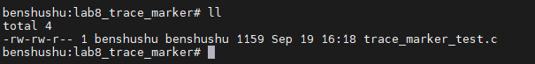
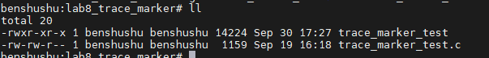

# 实验 12-8：使用示踪标志

## 1．实验目的

学习如何使用示踪标志（trace marker）来跟踪应用程序。

## 2．实验详解

​		有时需要跟踪用户程序和内核空间的运行情况，示踪标志可以很方便地跟踪用户程序。trace_marker 是一个文件节点，允许用户程序写入字符串。ftrace 会记录该写入动作的时间戳。

下面是一个简单实用的示踪标志例子。

```c
#include <stdlib.h>
#include <stdio.h>
#include <string.h>
#include <time.h>
#include <sys/types.h>
#include <sys/stat.h>
#include <fcntl.h>
#include <sys/time.h>
#include <linux/unistd.h>
#include <stdarg.h>
#include <unistd.h>
#include <ctype.h>

static int mark_fd = -1;
static __thread char buff[BUFSIZ+1];

static void setup_ftrace_marker(void)
{
        struct stat st;
        char *files[] = {
                "/sys/kernel/debug/tracing/trace_marker",
                "/debug/tracing/trace_marker",
                "/debugfs/tracing/trace_marker",
        };
        int ret;
        int i;

        for (i = 0; i < (sizeof(files) / sizeof(char *)); i++) {
                ret = stat(files[i], &st);
                if (ret >= 0)
                        goto found;
        }
        /* todo, check mounts system */
        printf("canot found the sys tracing\n");
        return;
found:
        mark_fd = open(files[i], O_WRONLY);
}

static void ftrace_write(const char *fmt, ...)
{
        va_list ap;
        int n;

        if (mark_fd < 0)
                return;

        va_start(ap, fmt);
        n = vsnprintf(buff, BUFSIZ, fmt, ap);
        va_end(ap);

        write(mark_fd, buff, n);
}

int main()
{
        int count = 0;
        setup_ftrace_marker();
        ftrace_write("rlk start program\n");
        while (1) {
                usleep(100*1000);
                count++;
                ftrace_write("rlk count=%d\n", count);
        }
}

```

------

这段代码的主要功能是将用户程序中的调试信息写入 Linux 内核的 `ftrace` 系统中，用于跟踪和调试。`ftrace` 是 Linux 内核中的一个强大的跟踪工具，可以记录内核中的各种事件。通过在代码中调用 `ftrace_write` 函数，可以将自定义信息写入内核的跟踪日志中。下面是对这段代码的详细注释和分析。

### 代码分解与注释

#### 头文件包含部分

```C
#include <stdlib.h>
#include <stdio.h>
#include <string.h>
#include <time.h>
#include <sys/types.h>
#include <sys/stat.h>
#include <fcntl.h>
#include <sys/time.h>
#include <linux/unistd.h>
#include <stdarg.h>
#include <unistd.h>
#include <ctype.h>
```

- 包含了标准 C 库和系统调用的相关头文件，为文件操作、字符串处理、格式化输出、时间操作等功能提供支持。

#### 全局变量和线程局部存储

```C
static int mark_fd = -1;
static __thread char buff[BUFSIZ + 1];
```

- `mark_fd`：用于保存打开的 `trace_marker` 文件的文件描述符。如果没有找到 `trace_marker` 文件，保持为 `-1`。
- `buff`：线程局部变量，用于存储格式化后的字符串。`BUFSIZ` 是系统定义的缓冲区大小。

#### `setup_ftrace_marker` 函数

```C
static void setup_ftrace_marker(void)
{
    struct stat st;
    char *files[] = {
        "/sys/kernel/debug/tracing/trace_marker",
        "/debug/tracing/trace_marker",
        "/debugfs/tracing/trace_marker",
    };
    int ret;
    int i;

    for (i = 0; i < (sizeof(files) / sizeof(char *)); i++) {
        ret = stat(files[i], &st);
        if (ret >= 0)
            goto found;
    }

    /* todo, check mounts system */
    printf("cannot found the sys tracing\n");
    return;

found:
    mark_fd = open(files[i], O_WRONLY);
}
```

- 该函数尝试打开 `ftrace` 系统中的 `trace_marker` 文件，以便在用户空间将信息写入内核跟踪中。
- `files` 数组中列出了几个可能的 `trace_marker` 文件路径，这些路径取决于系统的配置。
- 使用 `stat` 函数检查这些文件是否存在。若找到其中一个文件，则跳转到 `found` 标签，打开该文件并保存其文件描述符到 `mark_fd` 中。
- 如果没有找到可用的文件路径，打印错误信息 `"cannot found the sys tracing"`，并返回。
- `found` 标签：打开找到的 `trace_marker` 文件，并将其文件描述符赋值给 `mark_fd`。

#### `ftrace_write` 函数

```C
static void ftrace_write(const char *fmt, ...)
{
    va_list ap;
    int n;

    if (mark_fd < 0)
        return;

    va_start(ap, fmt);
    n = vsnprintf(buff, BUFSIZ, fmt, ap);
    va_end(ap);

    write(mark_fd, buff, n);
}
```

- 该函数将格式化的字符串写入 `ftrace` 系统。
- 使用可变参数列表实现通用的格式化输出。`fmt` 是格式化字符串，`...` 表示可变参数。
- 检查 `mark_fd` 是否有效，如果无效，直接返回，不执行写操作。
- 使用 `vsnprintf` 将格式化后的输出存储到 `buff` 中，并返回实际写入的字节数。
- 使用 `write` 函数将格式化后的字符串写入到 `mark_fd` 所指向的 `trace_marker` 文件中。

#### `main` 函数

```C
int main()
{
    int count = 0;
    setup_ftrace_marker();          // 初始化 ftrace，找到 trace_marker 文件并打开
    ftrace_write("rlk start program\n"); // 写入一条初始消息

    while (1) {
        usleep(100 * 1000);         // 休眠 100 毫秒
        count++;
        ftrace_write("rlk count=%d\n", count); // 写入计数信息
    }
}
```

- 调用 `setup_ftrace_marker` 函数尝试打开 `trace_marker` 文件。如果打开成功，则可以通过 `ftrace_write` 将信息写入 `ftrace` 系统。
- 写入初始消息 `"rlk start program\n"`。
- 进入一个无限循环，每次循环休眠 100 毫秒，然后将计数器 `count` 加 1，并将当前计数写入到 `ftrace` 中。
- 这些信息会被写入到内核的 `ftrace` 系统中，可以使用 `cat /sys/kernel/debug/tracing/trace` 查看跟踪日志。

### 分析与执行流程

1. **程序初始化**：调用 `setup_ftrace_marker`，试图找到并打开 `trace_marker` 文件。如果找不到，则打印错误信息并结束初始化。
2. **写入日志**：若 `trace_marker` 文件打开成功，`ftrace_write` 将日志信息写入内核跟踪文件。`vsnprintf` 格式化日志信息，`write` 将其写入 `mark_fd`。
3. **进入循环**：在主函数中进入无限循环，每隔 100 毫秒写入当前的计数值到内核跟踪日志中。这些信息可以在 `ftrace` 跟踪文件中查看。
4. **实时调试**：利用 `ftrace` 的追踪能力，开发者可以在不修改内核的情况下查看程序运行状态，为程序调试提供支持。

### 总结

- 该程序利用 `ftrace` 系统来实现内核级别的跟踪和调试。
- `setup_ftrace_marker` 函数负责打开 `trace_marker` 文件，为后续写入操作做好准备。
- `ftrace_write` 函数格式化并将信息写入到 `trace_marker` 文件中，以供内核调试使用。
- 主函数通过一个循环，不断地写入计数信息，为开发者提供实时追踪信息。
- 需要在启用了 `ftrace` 的系统上运行，并且需要有访问 `/sys/kernel/debug/tracing/` 的权限。

这种方法常用于性能调优和调试内核模块，可以动态地在运行中的系统中插入日志跟踪。

------

## 3. 实验步骤

### 下面是本实验的实验步骤。

### 启动 QEMU+runninglinuxkernel。

```
$ ./run_rlk_arm64.sh run
```

### 进入本实验的参考代码。

```
# cd /mnt/rlk_lab/rlk_basic/chapter_12_debug/lab8
```



### 编译程序。

```
benshushu:lab8_trace_marker# gcc trace_marker_test.c -o trace_marker_test
```



### 接下来使用 ftrace 来跟踪用户程序的 trace marker。

```
//设置function跟踪器是不能捕捉到示踪标志的
# echo nop > /sys/kernel/debug/tracing/current_tracer

//打开ftrace才能捕捉到示踪标志
# echo 1 > /sys/kernel/debug/tracing/tracing_on

# ./trace_marker_test //运行trace_marker_test测试程序
[…] //停顿一小会儿
# echo 0 > /sys/kernel/debug/tracing/tracing_on

# cat /sys/kernel/debug/tracing/trace
```

这边卡了太久，先不做了

### 下面是捕捉到的 trace_marker_test 测试程序写入 ftrace 的信息。

```
root@rlk:lab8_trace_marker# cat /sys/kernel/debug/tracing/trace
# tracer: nop
#
# entries-in-buffer/entries-written: 62/62 #P:10
#
# _-----=> irqs-off
# / _----=> need-resched
# | / _---=> hardirq/softirq
# || / _--=> preempt-depth
# ||| / delay
# TASK-PID CPU# |||| TIMESTAMP FUNCTION
# | | | |||| | |
 <...>-80365 [001] .... 52257.453910: tracing_mark_write: rlk start 
program
 <...>-80365 [001] .... 52257.554125: tracing_mark_write: rlk 
count=1
 <...>-80365 [001] .... 52257.655205: tracing_mark_write: rlk 
count=2
 <...>-80365 [001] .... 52257.756190: tracing_mark_write: rlk
 count=3
 <...>-80365 [001] .... 52257.856598: tracing_mark_write: rlk 
count=4
 <...>-80365 [001] .... 52257.957567: tracing_mark_write: rlk
 count=5
```

​		读者可以在捕捉示踪标志时打开其他一些示踪事件，例如调度方面的事件，这样可以观察用户程序在两个示踪标志之间的内核空间发生了什么事情。