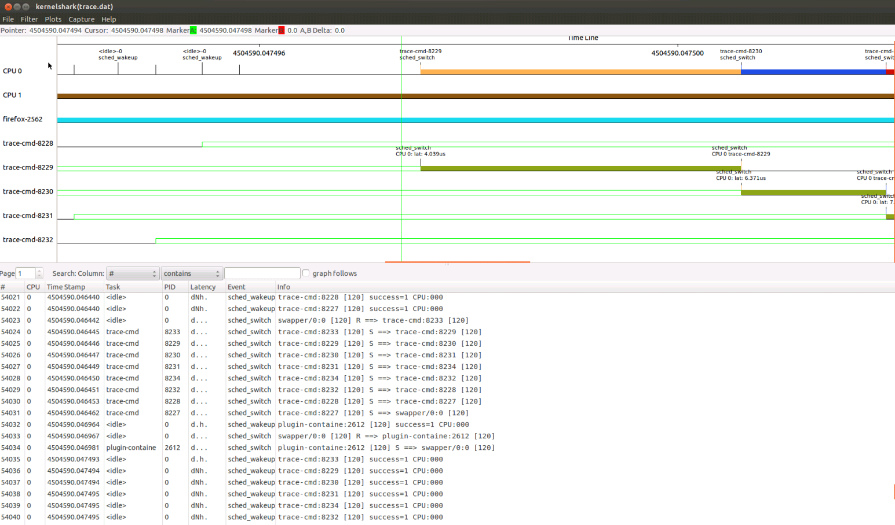
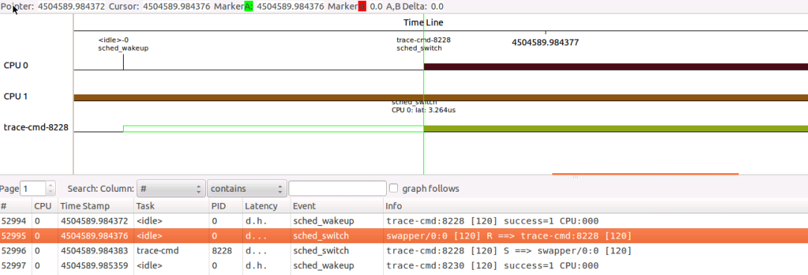

实验 12-9：使用 kernelshark 来分析数据

1．实验目的

学会使用 trace-cm 和 kernelshark 工具来抓取和分析 ftrace 数据。

2．实验详解

前面介绍了 ftrace 的常用方法。有些人希望有一些图形化的工具，trace-cmd 和

kernelshark 工具就是为此而生。

在 Ubuntu 上安装 trace-cmd 和 kernelshark 工具。

```
#sudo apt-get install trace-cmd kernelshark
```

trace-cmd 的使用方式遵循 reset->record->stop->report 模式，要用 record 命令收集

数据，按“Ctrl+c”组合键可以停止收集动作，在当前目录下生产 trace.dat 文件。使

用 trace-cmd report 解析 trace.dat 文件，这是文字形式的，kernelshark 是图形化的，更

方便开发者观察和分析 数据。

```
figo@figo-OptiPlex-9020:~/work/test1$ trace-cmd record -h
trace-cmd version 1.0.3
usage:
trace-cmd record [-v][-e event [-f filter]][-p plugin][-F][-d][-o file] \
[-s usecs][-O option ][-l func][-g func][-n func] \
[-P pid][-N host:port][-t][-r prio][-b size][command ...]
-e run command with event enabled
-f filter for previous -e event
-p run command with plugin enabled
-F filter only on the given process
-P trace the given pid like -F for the command
-l filter function name
-g set graph function
-n do not trace function
-v will negate all -e after it (disable those events)
-d disable function tracer when running
-o data output file [default trace.dat]
-O option to enable (or disable)
-r real time priority to run the capture threads
-s sleep interval between recording (in usecs) [default: 1000]
-N host:port to connect to (see listen)
-t used with -N, forces use of tcp in live trace
-b change kernel buffersize (in kilobytes per CPU)
```

常用的参数如下。

 -p plugin：指定一个跟踪器，可以通过 trace-cmd list 来获取系统支持的跟踪

器。常见的跟踪器有 function_graph、function、nop 等。

 –e event：指定一个跟踪事件。

 –f filter：指定一个过滤器，这个参数必须紧跟着“-e”参数。

 –P pid：指定一个进程进行跟踪。

 –l func：指定跟踪的函数，可以是一个或多个。

 –n func：不跟踪某个函数。

以跟踪系统进程切换的情况为例。

\#trace-cmd record -e 'sched_wakeup*' -e sched_switch -e 'sched_migrate*'

\#kernelshark trace.dat

通过 kernelshark 可以图形化地查看需要的信息，直观、方便，如图 11.2 所示。

打开菜单中的“Plots”→“CPUs”选项，可以选择要观察的 CPU。选择“Plots”

→“Tasks”，可以选择要观察的进程。如图 11.3 所示，选择要观察的进程是 PID 为

“8228”的进程，该进程名称为“trace-cmd”。



图11.2 kernelshark



图11.3 用kernelshark查看进程切换

​		在时间戳 4504589.984372 中，trace-cmd-8228 进程在 CPU0 中被唤醒，发生了sched_wakeup 事件。在下一个时间戳中，该进程被调度器调度执行，在 sched_switch事件中捕捉到该信息。