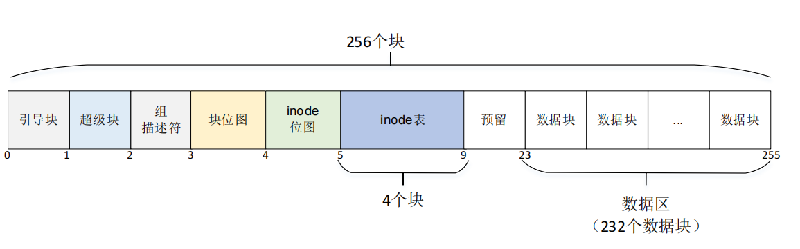
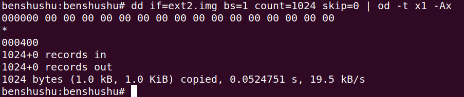
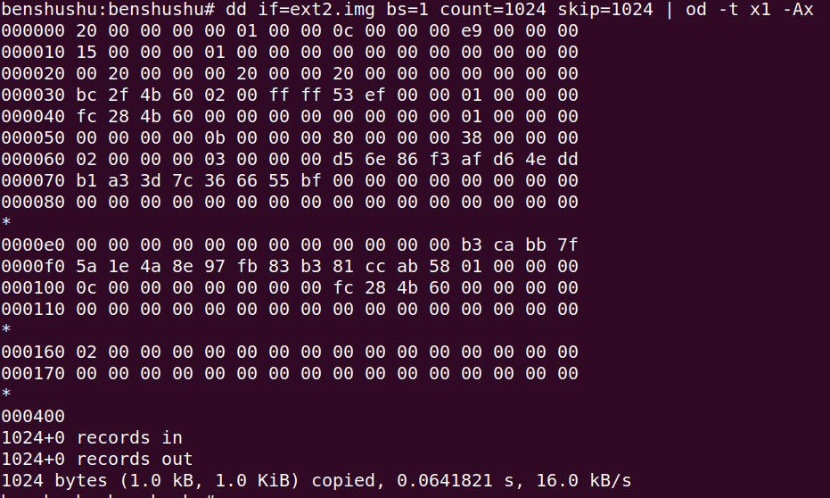
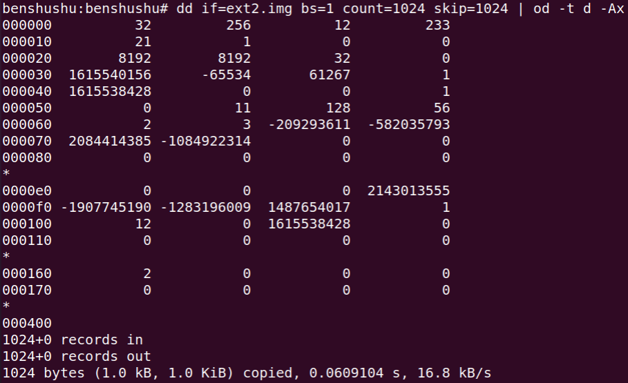
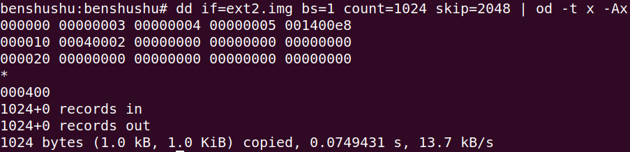
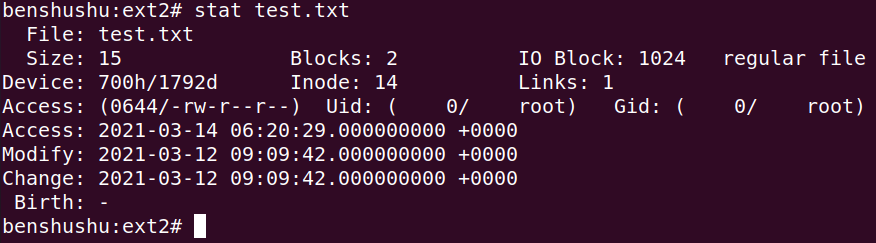
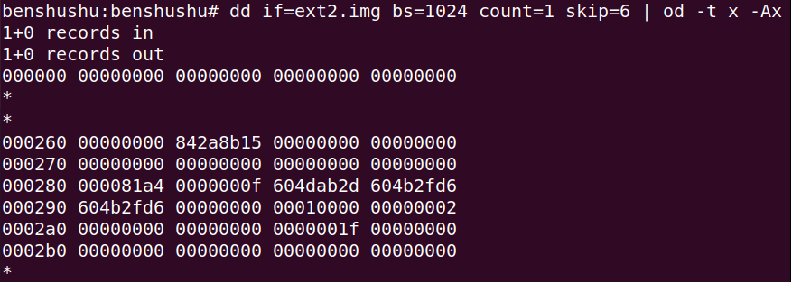
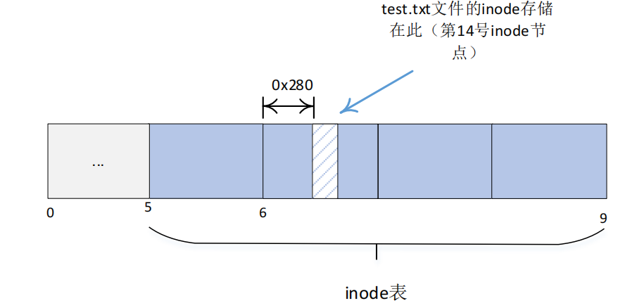
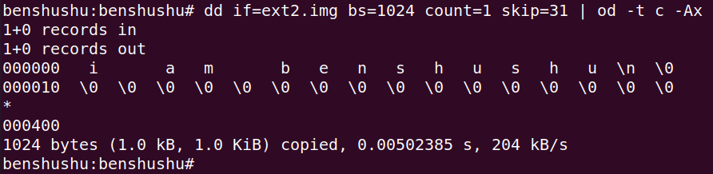
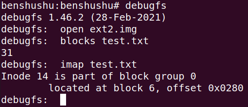

# 实验 14-1：查看文件系统

## 1．实验目的

​		熟悉文件系统中的 inode、块号等概念。

## 2．实验要求

​		使用 dd 命令创建磁盘文件 file.img 并格式化为 ext2 文件系统，然后通过 mout 命令挂载到 Linux 主机文件系统。

​		（1）查看文件系统的信息，比如数据块的数量、数据块的大小、inode 个数、空闲数据块的数量等信息，并画出文件系统的布局图。

​		（2）在文件系统中创建文件 a.txt，写入一些数据。查看 a.txt 文件的 inode 编号，统计 a.txt 文件占用了哪几个数据块。

​		（3）使用 dd 或 hexdump 命令导出 file.img 磁盘文件的二进制数据并且分析超级块。读者可以对照 Linux 内核中的 ext2_super_block 数据结构来分析磁盘文件的二进制数据。

## 3．实验详解

​		我们在 QEMU+runninglinuxkernel 平台上做实验。我们首先保证 RLK 系统能支持 ext2 文件系统。

​		修改 arch/arm64/configs/debian_defconfig 文件支持 ext2 文件系统。

```
CONFIG_BLK_DEV_LOOP=y
CONFIG_EXT2_FS=y
```

然后重新编译内核，并运行。

```
$ ./run_rlk_arm64.sh build_kernel
$ ./run_rlk_arm64.sh run
```

使用 dd 命令来创建一个 ext2.img 文件。

```
benshushu:benshushu# dd if=/dev/zero of=ext2.img bs=4K count=64
64+0 records in
64+0 records out
262144 bytes (262 kB, 256 KiB) copied, 0.0176809 s, 14.8 MB/s
```

格式化。

```
benshushu:benshushu# mkfs.ext2 ext2.img 
mke2fs 1.45.0 (6-Mar-2019)
Discarding device blocks: done 
Creating filesystem with 256 1k blocks and 32 inodes

Allocating group tables: done 
Writing inode tables: done 
Writing superblocks and filesystem accounting information: done
```

我们先挂载该文件系统。

```
benshushu:#mkdir /home/benshushu/ext2
benshushu:ext2# mount -t ext2 -o loop ext2.img /home/benshushu/ext2
```

​		我们在 ext2 文件系统中新建一个 test.txt 文件，然后在该文件里输入一个字符串

```
“I am benshushu”
```

​		上面准备工作完成之后，我们来开始分析这个文件系统了。首先使用 dumpe2fs 命令来查看这个 ext2.img 文件系统的布局情况。

```
benshushu:benshushu# dumpe2fs ext2.img 
dumpe2fs 1.45.0 (6-Mar-2019)
Filesystem volume name: <none>
Last mounted on: <not available>
Filesystem UUID: d56e86f3-afd6-4edd-b1a3-3d7c366655bf
Filesystem magic number: 0xEF53
Filesystem revision #: 1 (dynamic)
Filesystem features: ext_attr resize_inode dir_index filetype 
sparse_super large_file
Filesystem flags: unsigned_directory_hash 
Default mount options: user_xattr acl
Filesystem state: not clean
Errors behavior: Continue
Filesystem OS type: Linux
Inode count: 32
Block count: 256
Reserved block count: 12
Free blocks: 233
Free inodes: 21
First block: 1
Block size: 1024
Fragment size: 1024
Blocks per group: 8192
Fragments per group: 8192
Inodes per group: 32
Inode blocks per group: 4
Filesystem created: Fri Mar 12 08:40:28 2021
Last mount time: n/a
Last write time: Fri Mar 12 09:09:16 2021
Mount count: 2
Maximum mount count: -1
Last checked: Fri Mar 12 08:40:28 2021
Check interval: 0 (<none>)
Reserved blocks uid: 0 (user root)
Reserved blocks gid: 0 (group root)
First inode: 11
Inode size: 128
Default directory hash: half_md4
Directory Hash Seed: b3cabb7f-5a1e-4a8e-97fb-83b381ccab58
Group 0: (Blocks 1-255)
 Primary superblock at 1, Group descriptors at 2-2
 Block bitmap at 3 (+2)
 Inode bitmap at 4 (+3)
 Inode table at 5-8 (+4)
 232 free blocks, 20 free inodes, 2 directories
 Free blocks: 23-30, 32-255
 Free inodes: 12-13, 15-32
```

从上述日志可以知道这个迷你型的空闲分区的如下信息。

 一共有 256 个数据块。

 每个数据块的大小为 1KB。

 最多支持 32 个 inode。

 第 1 个数据块开始存储数据。

 空闲的 inode 为 21 个。

 空闲的数据块为 233 个。

 预留的数据块为 12 个。

 每一组（group）可以有 8192 个空闲块。

ext2 文件系统还把分区分成了组（Group），这个 ext.img 中只有一个组，这个组

包含了非常重要的文件系统布局信息，如图 14.4 所示。

 超级块（superblock）在第 1 个块。

 组描述符（Group descriptors）在第 2 个块。

 块位图（Block bitmap）在第 3 个块。

 inode 位图（Inode bitmap）在第 4 个块。

 inode 表（Inode table）在第 5～8 个块，一共占用 4 个块。

 第 8～10 个块为预留的块。

 第 23~255 个块为空闲的数据块，可组成数据区。（中间第 31、32 个数据块

是被使用了）

 第 12~31 个 inode 节点为空闲的。（第 14 个 inode 节点被使用了）



3.1 分析超级块的信息

第 0 个数据块通常是引导块，暂时没有用来存储数据，里面全是 0 的数据，我们

可以使用 dd 命令来查看。

```
dd if=ext2.img bs=1 count=1024 skip=0 | od -t x1 -Ax
```

这里首先使用 dd 命令来读取 ext2.img 的内容，其中

 bs：设置读入/输出的块大小为 bytes 个字节

 count：读取多少个块数据

 skip：从输入文件开头跳过多少个块后再开始读取数据。

另外 od 命令用来显示数据的内容，其格式为：

```
od [-A 地址进制] [-t 显示格式] 文件名
```

\- A ：按指定的进制来显示地址：

 d 十进制

 八进制（系统默认值）

 x 十六进制

 n 不打印位移值

\- t 指定数据的显示格式，主要的参数有：

 c ASCII 字符或反斜杠序列

 d 有符号十进制数

 f 浮点数

 八进制（系统默认值为 02）

 u 无符号十进制数

 x 十六进制数



接下来分析超级块的内容。

```
dd if=ext2.img bs=1 count=1024 skip=1024 | od -t x1 -Ax
```



对照 struct ext2_super_block 数据结构，我们可以知道：

 s_inodes_count 的值为 0x20，即 32，表示 inode 节点的个数

 s_blocks_count 的值为 0x100，即 256，一共有多少个块

 s_r_blocks_count 的值为 0xc，即 12，保留的块有多少个。

 s_free_blocks_count 的值为 0xe9，即空dd if=ext2.img bs=1 count=

1024 skip=1024 | od -t x1 -Ax闲的数据块，233 个。

 s_free_inodes_count 的值为 0x15，即 21，表示空闲的 inode 节点个数。

 s_first_data_block 的值为 0x1，即有效数据是从第 1 个数据块开始。

 s_log_block_size 的值为 0，那么计算方法为：2^0 * 1024 = 1024 字节

 s_log_frag_size 的值为 0，计算方法和 s_log_block_size。

 剩下的成员，大家可以继续来分析。 s_blocks_per_group 的值为 8192，表示每个组有多少个数据块。

​		按照上面的方法，大家可以对照来找到 struct ext2_super_block 数据结构每个成员的值。如果看十六进制比较不方便，可以让 od 命令显示十进制。



3.2 分析组描述符

组描述符位于在超级块后面的数据块。组描述符的数据结构如下。

```
/*
* Structure of a blocks group descriptor
*/
struct ext2_group_desc
{
__le32 bg_block_bitmap; /* Blocks bitmap block */
__le32 bg_inode_bitmap; /* Inodes bitmap block */
__le32 bg_inode_table; /* Inodes table block */
__le16 bg_free_blocks_count; /* Free blocks count */
__le16 bg_free_inodes_count; /* Free inodes count */
__le16 bg_used_dirs_count; /* Directories count */
__le16 bg_pad;
__le32 bg_reserved[3];
};
```

接下来分析组描述符的内容。

```
dd if=ext2.img bs=1 count=1024 skip=2048 | od -t d -Ax
```



 

dd 打印的内容可知：

 bg_block_bitmap 的值为 3，表示块位图（Block bitmap）在第 3 个块。

 bg_inode_bitmap 的值为 4，表示 inode 位图（Inode bitmap）在第 4 个块。

 bg_inode_table 的值为 5，表示 inode 表（Inode table）在第 5 块。

 bg_free_blocks_count 成员是 16 位，它的值为 0xe8，即 232 个空闲数据块。

 bg_free_inodes_count 成员也是 16 位数据，它的值为 0x14，即 20 个空闲的 inode节点。

 bg_used_dirs_count 表示已经存在的目录，目前为 0。

3.3 分析 inode 表

Inode 表是在第 5 个数据块，一共有 4 个数据块存储 inode 表。Ext2 文件系统使

用 struct ext2_inode 数据结构来表示一个 inode 节点，其中 struct ext2_inode 数据结构

的大小为 128 字节。

那为啥要使用 4 个数据块来存储 inode 表呢？

从 3.1 节分析超级块可知，这个 ext2 文件系统最多支持 32 个 inode 节点，那么

 

128 * 32 = 4096

正好是 4 个数据块。

接下来我们需要通过 stat 命令来确定 test.txt 的 inode 节点号。

进入 ext2 目录，使用 stat 命令来查看。



从 stat 命令可以看出 test.txt 使用的 inode 节点号为 14。

那么，我们需要读取第 14 个 inode 节点的 struct ext2_inode 数据结构的内容。

那么第 14 个 inode 节点在 inode 表的位置，计算公式如下：

（14 – 1） * 128 = 1664

 

 

1664 – 1024 = 640 = 0x280

所以，第 14 个 inode 节点，位于 inode 表中第二个数据块的 0x280 地址处。使用

dd 命令来读取第 6 个数据块的内容。



那么地址 0x280 处开始的数据就是第 14 号 inode 节点的内容了。



​		Ext2 文件系统采用直接和间接索引的方式来索引数据块，详见《奔跑吧 linux 内核 入门篇》第二版第 14.2.2 章内容。

```
/*
* Structure of an inode on the disk
*/
struct ext2_inode {
 …
__le32 i_block[EXT2_N_BLOCKS];/* Pointers to blocks */
… 
}
```

i_block 数组是位于 struct ext2_inode 数据结构中第 40 个字节开始的地方。

从上图可知，0x280 + 40 = 0x2A8，也就是说 i_block 数组存储在 0x2ab 地址处，

这个值为 0x1f，就 31，也就是 test.txt 数据存储在第 31 个数据块里。

我们马上使用 dd 命令来查看，发现“I am benshushu”字符串果然存储在第 31 个

数据块里。



总结，我们从这个实验完成了对 ext2 文件系统的静态分析和动态分析，相信会对

大家理解文件系统有帮助。

### 3.4 e2fsprogs 工具

e2fsprogs 是一个 Ext2（及 Ext3/4）文件系统工具（Ext2Filesystems Utilities），它

包含了诸如创建、修复、配置、调试 ext2 文件系统等的标准工具。我们可以使用这个

工具来分析某个文件是占用的哪些数据块，不过我们还是建议大家学习前面的分析方

法。

首先在 QEMU+runninglinuxkernel 里安装 e2fsprogs 工具。

```
benshushu:benshushu# apt update
benshushu:benshushu# apt install e2fsprogs
```

e2fsprogs 工具里内置了很多有用的工具，我们接下来使用叫做 debugfs 的小工具。直接输入 debugfs 打开这个小工具。

```
benshushu:benshushu# debugfs 
debugfs 1.46.2 (28-Feb-2021)
```

然后使用 open 子命令来打开文件系统。

```
debugfs: open ext2.img
```

使用 block 子命令来查看 test.txt 文件占用了哪些数据块。

```
debugfs: blocks test.txt
31
```

Debugfs 命令很快找出 test.txt 文件占用的是第 31 个数据块，和我们前面的分析

结论一样。

另外，我们还可以使用 imap 子命令来查看 test.txt 文件的 inode 节点情况。

```
debugfs: imap test.txt
Inode 14 is part of block group 0
located at block 6, offset 0x0280
```

从上述信息可知，test.txt 文件使用的是第 14 个 inode 节点，位于 Group 0 中的第

6 个数据块，偏移为 0x280，和我们前面的分析结论一样。

