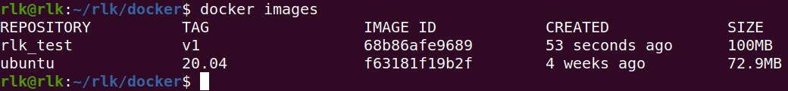
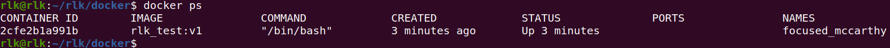
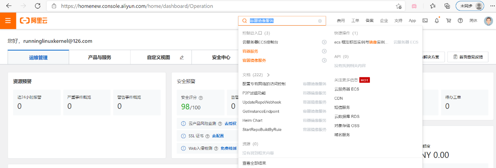
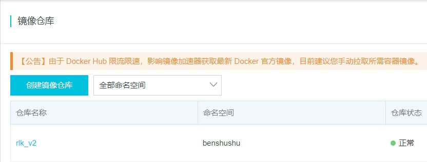
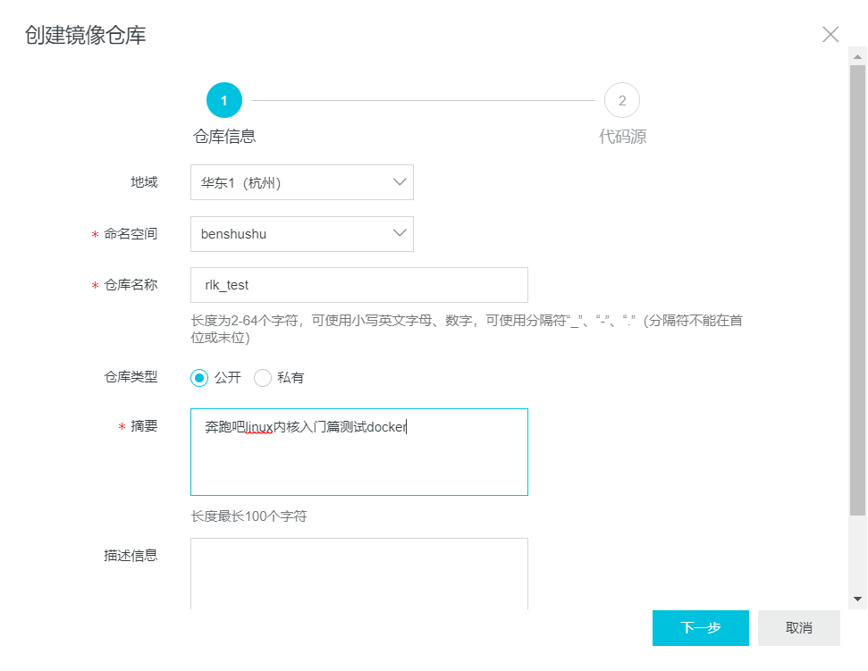
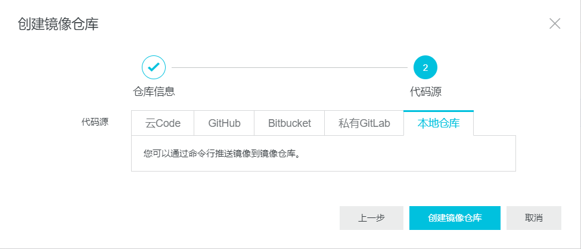
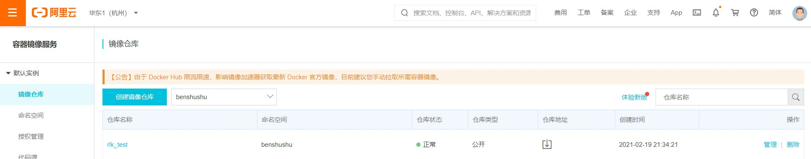
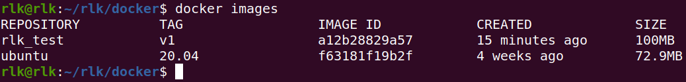
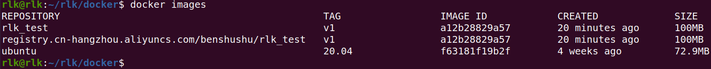
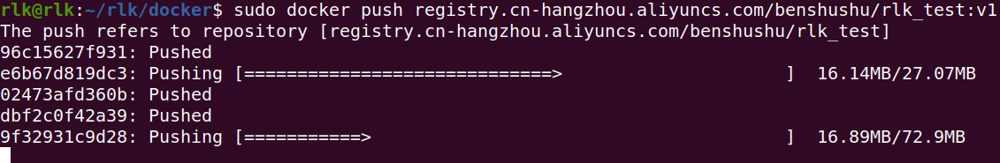

# 实验 15-1：制作 Docker 镜像并发布

## 1．实验目的

熟悉如何制作 Docker 镜像并发布到 Docker 市场 ①，以供其他人部署和使用。

## 2．实验详解

读者可以制作 Ubuntu Linux 20.04 Docker 镜像，其中包含本书的实验环境，比如

配置 Vim、aarch64 的 GCC 工具链、Eclipse 调试环境等，并且把制作的上述 Docker

镜像发布到 Docker 市场以供其他读者部署和使用。

## 3．实验步骤

本实验会使用 dockerfile 来构建一个 docker。Dockerfile 是一个用来构建镜像的

文本文件，文本内容包含了一条条构建镜像所需的指令和说明。

本实验在 Ubuntu Linux 20.04 主机上完成。

首先安装 docker 软件。

```
$ sudo apt install docker docker.io
```

创建 docker 组

```
 sudo groupadd docker
```

将当前用户加入 docker 组

```
$ sudo gpasswd -a ${USER} docker
```

重启 docker 

```
$ sudo systemctl enable docker.service
```

刷新 docker 组

```
$ newgrp docker
```

这样普通用户也可以使用 docker 命令。

### 3.1 新建 dockerfile

Dockerfile 最常见的两个命令为 FROM 和 RUN。

 FROM：定制的镜像都是基于 FROM 的镜像，它必须为 dockerfile 中的第一个

命令。

 RUN：用于执行后面跟着的命令行命令。一个文件中可以包含多个 RUN 命令。

RUN 命令有两种格式。

shell 执行，即/bin/sh

```
shell 执行，即/bin/sh 
shell格式：
 RUN <command>
```

Exec 执行。

```
格式：
 RUN ["executable", "param1", "param2"]
要注意的是，executable是命令，后面的param是参数
例子： RUN yum install -y nginx 
 RUN ["yum", "install", "-y", "nginx"]
```

下面我们基于 ubuntu 20.04 来创建一个 dockerfile。在 Ubuntu 主机上输入：

```
下面我们基于 ubuntu 20.04 来创建一个 dockerfile。在 Ubuntu 主机上输入：
rlk@rlk:~$ cd /home/rlk/rlk
rlk@rlk:rlk$ mkdir -p docker
rlk@rlk:docker$vim Dockerfile
```

Dockerfile 文件的内容如下：

```
FROM ubuntu:20.04
MAINTAINER Benshushu <runninglinuxkernel@126.com>
RUN apt-get -qq update
```

3.2 构建镜像

我们可以在 Dockerfile 的目录下来构建 docker 了。

```
rlk@rlk:docker$ docker build -t rlk_test:v1 .
```

上述命令会构建一个名为 rlk_test:v1 的镜像（镜像名称:镜像标签）。构建完成可以

通过 docker images 命令来查看。



然后我们可以通过 docker run 命令来运行这个镜像（rlk_test:v1）。

```
rlk@rlk:~/rlk/docker$ docker run -ti rlk_test:v1

root@329f07b1b2d9:/#
```

3.4 修改并保存镜像

刚才我们新创建的镜像，在 home 目录下面是空的，并没有用户。我们想创建一个

名为 rlk 的用户。我们可以使用 adduser 命令来创建一个用户。

```
root@329f07b1b2d9:/home# adduser rlk
Adding user `rlk' ...
Adding new group `rlk' (1000) ...
Adding new user `rlk' (1000) with group `rlk' ...
Creating home directory `/home/rlk' ...
Copying files from `/etc/skel' ...
New password: 
Retype new password:
```

这时候，如果我们输入 exit 命令退出 docker，然后再使用 docker run 命令来进入

镜像会发现刚才创建的 rlk 用户消失了。所以，如果我们在 docker 里做了一些修改，

想保存下来，那么就需要使用下面的方法来 commit 到镜像里。

1. 进入 docker 镜像。

```
rlk@rlk:docker$ docker build -t rlk_test:v1 .
```

2. 使用 adduser 命令来创建一个用户。

```
root@329f07b1b2d9:/home# adduser rlk
```

3. 在 Ubuntu Linux 主机上新建一个 ，使用 docker ps 命令来查看当前 commit id。



可以看到 commit id 为 2cfe2b1a991b。

4. 通过 docker commit 命令来提交改动

```
rlk@rlk:~/rlk/docker$ docker commit -m "add rlk user" 2cfe2b1a991b 
rlk_test:v1
sha256:a12b28829a57527fdeff173f06fcfd67f3e93e4644b855a185f68b5b1b90cb0f
```

上述命令，将容器 2cfe2b1a991b 保存为新的镜像,并添加提交人信息和说明信息。

5. 退出当前 docker，重新登录，就会看到改动已经在了。

### 3.5 把镜像推送到 docker 云服务

最常见的 docker 云服务器是 dockerhub，不过国内访问 dockerhub 的速度很慢。

我们可以使用阿里云提供的 docker 云服务。

注册阿里云的账户（https://www.aliyun.com/），然后在控制台里搜索：容器镜像服

务



首先我们选择“”。



输入命令空间，仓库类型，摘要等内容，然后点击下一步。



在代码源里选择“本地仓库”，最后点击“创建镜像仓库”。



创建完成之后，在控制台里就可以看到我们创建的镜像了。



点击我们创建的“rlk_test”仓库右边的“管理”按钮，会显示一些有用的帮助信

息。

接下来，我们可以把本地的仓库上传到阿里云的 docker 仓库了。

首先通过如下命令来登陆到阿里云服务器，这里显示的是笔者的账号，读者请使

用自己的阿里云账号。

```
rlk@rlk:~/rlk/docker$ sudo docker login --username=runninglinuxkernel@126.com 
registry.cn-hangzhou.aliyuncs.com
[sudo] password for rlk: 
Password: 
WARNING! Your password will be stored unencrypted in 
/root/.docker/config.json.
Configure a credential helper to remove this warning. See
https://docs.docker.com/engine/reference/commandline/login/#credentials-store
Login Succeeded
```

使用"docker tag"命令重命名镜像。

```
sudo docker tag [ImageId] registry.cn-hangzhou.aliyuncs.com/benshushu/rlk_test:[镜像版本号]
```

使用 docker images 命令来查看“ImageId”和“镜像版本号”



可以看到 Image ID 为：a12b28829a57，镜像版本号为：v1所以，上面命令变成：

```
$ sudo docker tag a12b28829a57 registry.cn-hangzhou.aliyuncs.com/benshushu/rlk_test:v1
```

上述命令执行完之后，使用 docker images 来查看，发现多了一个镜像：registry.cn

hangzhou.aliyuncs.com/benshushu/rlk_test



最后，使用 docker push 命令来上传。

```
sudo docker push registry.cn-hangzhou.aliyuncs.com/benshushu/rlk_test:v1
```



上传完成之后，其他小伙伴就可以通过如下命令来使用这个 docker image 了。

```
$ docker run -ti registry.cn-hangzhou.aliyuncs.com/benshushu/rlk_test:v1
```

