# 实验 15-2：部署 Kubernetes 服务

## 1．实验目的

熟悉如何在本地部署 Kubernetes 服务。

## 2．实验详解

读者可以在本地部署 Kubernetes 服务。具体做法是使用 VMware Player 创建两个

虚拟机，这两个虚拟机使用的都是 Ubuntu Linux 20.04 系统，把其中一个虚拟机当作

Kubernetes 的控制节点（master），而把另一个虚拟机当作计算节点。

读者可以通过实验熟悉如何安装和部署 Kubernetes，熟悉 Kubernetes 中的集群、

节点、容器集（pod）、服务等概念。

## 3．实验步骤

本实验需要使用两个虚拟机，例如 VMware Player。

首先在 VMware Player 的 Virtual Machine Settings 中配置网络的桥接方式。

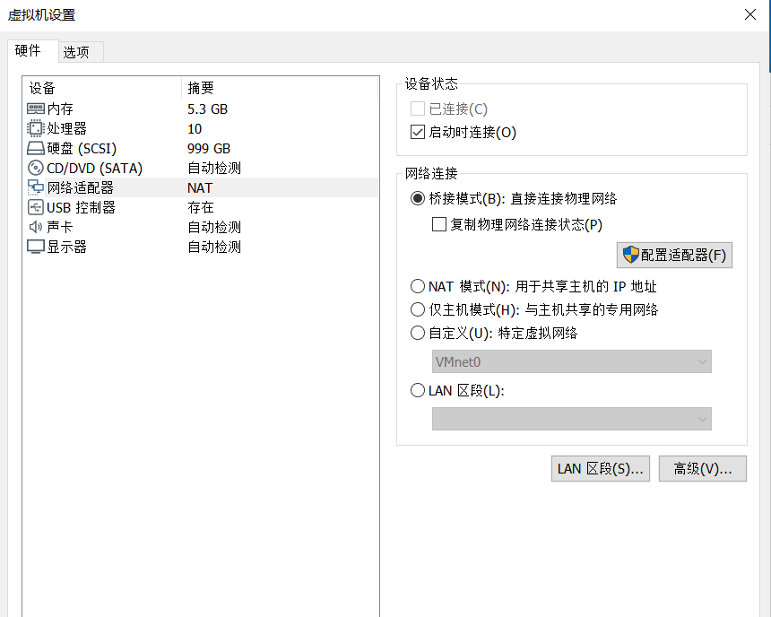

之前的配置是默认选择了“NAT： Used to share the host’s IP address”，我们这里

要重新选择“桥接模式：直接连接物理网络”，然后点击“配置适配器”，选择物理机

上的网卡。

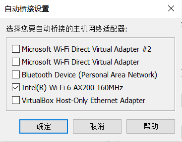

例如，我的笔记本的网卡为：Intel WI-FI 6 AX200，那么就只勾选这个网卡。然后

重新启动 VMware Player。

Master 主机：192.168.1.16，主机名：master

节点电脑：192.168.1.18，主机名：node1

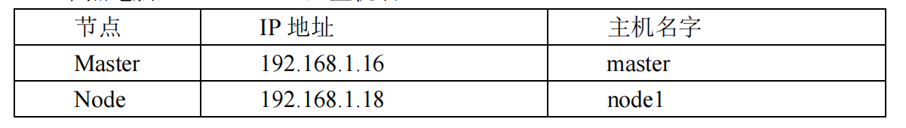

3.1 配置 master 节点

1. 先安装 docker。

```
$ apt install docker.io
```

创建 docker 组

```
sudo groupadd docker
```

将当前用户加入 docker 组

```
 sudo gpasswd -a ${USER} docker
```

重启 docker

```
 sudo systemctl enable docker.service
```

刷新 docker 组

```
 newgrp docker
```

这样普通用户也可以使用 docker 命令。

\2. 安装 k8s

在/etc/apt/sources.list.d/kubernetes.list 添加：

```
deb https://mirrors.aliyun.com/kubernetes/apt kubernetes-xenial main
```

添加 key：

```
curl https://mirrors.aliyun.com/kubernetes/apt/doc/apt-key.gpg | sudo apt-key 
add –
```

然后安装如下软件包：

```
 sudo apt update
$ sudo apt-get install -y kubelet kubeadm kubectl
$ sudo apt-mark hold kubelet kubeadm kubectl
```

\3. 关闭 swap 和防火墙

```
 sudo ufw disable
$ sudo swapoff -a
```

\4. 主节点（控制节点）

先查看 ip route

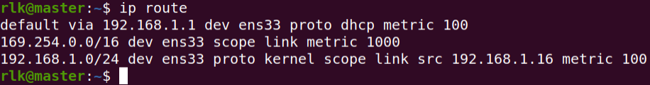

执行初始化操作。

```
$ sudo kubeadm init --image-repository 
registry.aliyuncs.com/google_containers --kubernetes-version v1.20.0 --podnetwork-cidr=192.168.0.0/16 --apiserver-advertise-address 192.168.1.16
```

其中：

apiserver-advertise-address 指定 master 的 interface

pod-network-cidr 指定 Pod 网络的范围

执行完了会看到如下日志信息：

```
Your Kubernetes control-plane has initialized successfully!
To start using your cluster, you need to run the following as a regular user:
 mkdir -p $HOME/.kube
 sudo cp -i /etc/kubernetes/admin.conf $HOME/.kube/config
 sudo chown $(id -u):$(id -g) $HOME/.kube/config
Alternatively, if you are the root user, you can run:
 export KUBECONFIG=/etc/kubernetes/admin.conf
You should now deploy a pod network to the cluster.
Run "kubectl apply -f [podnetwork].yaml" with one of the options listed at:
 https://kubernetes.io/docs/concepts/cluster-administration/addons/
Then you can join any number of worker nodes by running the following on each 
as root:
kubeadm join 192.168.1.16:6443 --token ohel1t.eqv6m53kq9np5tlx \
 --discovery-token-ca-cert-hash 
sha256:303d82a3dfb55396705a8807b8b95fe546affd47eab7424ef2ca62a0634be3ac
```

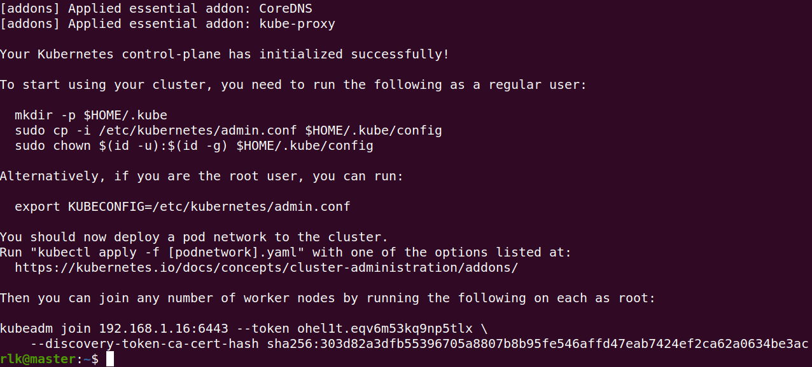

上面的日志告诉了我们两个重要的信息。

a) 如果我们想在非 root 用户下操作 kubectl 命令, 可以这样配置，执行如下命

令：

```
$ mkdir -p $HOME/.kube
sudo cp -i /etc/kubernetes/admin.conf $HOME/.kube/config
sudo chown $(id -u):$(id -g) $HOME/.kube/config
```

b) 其他节点想要加入到 master 集群里，可以通过如下命令，下面的 token 和哈

希值是每次创建 master 的时候随机生成的。

```
kubeadm join 192.168.1.16:6443 --token ohel1t.eqv6m53kq9np5tlx \
 --discovery-token-ca-cert-hash 
sha256:303d82a3dfb55396705a8807b8b95fe546affd47eab7424ef2ca62a0634be3ac
```

\5. 安装网络插件。

现在主节点还是没法用，需要搭建一个网络给集群用安装网络插件：

kubectl apply 

-f https://raw.githubusercontent.com/coreos/flannel/master/Documentation/kube-flannel.yml

由于国内网络问题，可以这样操作。

$ wget https://raw.githubusercontent.com/coreos/flannel/master/Documentation/kube

flannel.yml

然后替换了所有 quay.io 为 quay-mirror.qiniu.com

$ kubectl apply -f kube-flannel.yml

然后使用 kubectl get pods -n kube-system 查看 kube-flannel 是否处于 running 状

态。

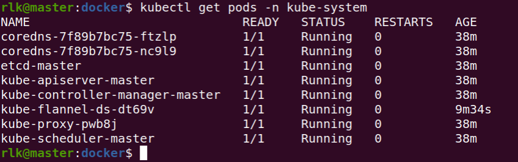

\6. Master 节点配置

taint：污点的意思。如果一个节点被打上了污点，那么 pod 是不允许运行在这个

节点上面的。

默认情况下集群不会在 master 上调度 pod，如果偏想在 master 上调度 Pod，可以

执行如下操作：

查看污点：

rlk@master:docker$ kubectl describe node master | grep -i taints

Taints: node-role.kubernetes.io/master:NoSchedule

删除默认污点：

```
rlk@master:docker$ kubectl taint node master node-role.kubernetes.io/master-
```

3.2 配置 node1 节点

\1. 请先安装 docker 和 k8s。参考 3.1 节中 master 节点的设置。

\2. 关闭 swap 和防火墙

```
 sudo ufw disable
$ sudo swapoff -a
```

\3. 运行 join 命令添加到 master 节点。注意：

 下面的命令是在配置 master 节点里提供的。

 需要使用 root 权限来运行下面的命令。

```
rlk@node1:~$ sudo kubeadm join 192.168.1.16:6443 --token 
ohel1t.eqv6m53kq9np5tlx --discovery-token-ca-cert-hash 
sha256:303d82a3dfb55396705a8807b8b95fe546affd47eab7424ef2ca62a0634be3ac
```

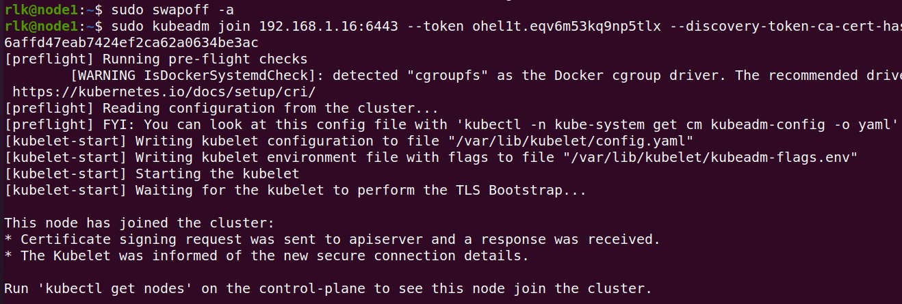

出现如下信息，说明已经加入 master 集群。

\4. 这时候可以在master主机上查看，这时候看到集群里有两台集群，一个master

节点，另外一个 node1 节点。

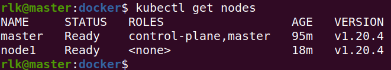

如果在 node1 节点出现下面的 log 信息，然后导致 node1 的运行状态为

NotReady。

```
The connection to the server localhost:8080 was refused - did you specify the 
right host or port?
```

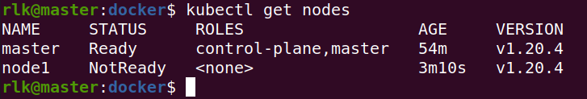

那么可以通过如下方法来修复。

 拷贝 master 节点中的/etc/kubernetes/admin.conf 到 node1 节点的相同目录

中。

 在 node1 中配置环境变量

```
echo "export KUBECONFIG=/etc/kubernetes/admin.conf" >> ~/.bashrc
source ~/.bashrc
```

3.3 测试 POD

Pod 封装了一个或多个应用程序的容器(比如 nginx 等)，包含存储资源、唯一的

网络 IP 以及管理容器的的一些配置选项等。Pod 是一个部署单元,可以理解为

Kubernetes 中的应用程序的单个实例,它可能由单个容器组成，也可能由少量紧密耦合

并共享资源的容器组成。

下面通过一个 yaml 文件来创建一个 POD。

我们在 node1 节点的机器上，新建一个 rlk-pod.yaml 文件。

```
apiVersion: v1
kind: Pod
metadata:
 name: rlk-test
spec:
 NodeName:
 containers:
 - name: rlk-container
 image: registry.cn-hangzhou.aliyuncs.com/benshushu/rlk_test:v1
 command: ["/bin/bash","-c","while true; do sleep 1000; done"]
 imagePullPolicy: IfNotPresent
```

然后使用 kubectl create 命令来创建。

```
rlk@master:k8s$ kubectl create -f rlk-pod.yaml 
pod/rlk-test created
```

然后使用 kubectl get pods 命令来查看 rlk-test 是否处于 running 状态。


运行 pod：

```
$ kubectl exec -it rlk-test bash
```

3.4 测试 deployment

Deployment 通常用来管理 pod 的多个副本，并确保 pod 按照期望的状态运行。

下面我们来创建一个基于 rlk 容器的 deployment。我们在 node1 节点的机器上，

新建一个名为：rlk-deployment.yaml 的文件，这个文件的内容如下。

```
apiVersion: apps/v1
kind: Deployment
metadata:
 name: rlk-deploy
 namespace: default
spec:
 replicas: 10
 selector:
 matchLabels:
 app: rlk-app
 release: canary
 template:
 metadata:
 labels:
 app: rlk-app
 release: canary
 spec:
 containers:
 - name: rlk-app
 image: registry.cn-hangzhou.aliyuncs.com/benshushu/rlk_test:v1
 command: ["/bin/bash","-c","while true; do sleep 1000; done"]
 imagePullPolicy: IfNotPresent\
 ports:
 - name: http
 containerPort: 80
```

使用如下命令来创建 deployment。

```
rlk@node1:~/rlk/docker$ kubectl apply -f rlk-deployment.yaml 
deployment.apps/rlk-deploy created
```

然后使用“kubectl get deployment”命令来查看 depolyment 的状态。

```
rlk@node1:~/rlk/docker$ kubectl get deployment
NAME READY UP-TO-DATE AVAILABLE AGE
rlk-deploy 10/10 10 10 8m54s
```

接着，使用“kubectl get pod -o wide”命令来查看 pod 的部署情况。

```
rlk@node1:~/rlk/docker$ kubectl get pod -o wide
NAME READY STATUS RESTARTS AGE IP NODE 
NOMINATED NODE READINESS GATES
rlk-deploy-c96d67c7b-264zj 1/1 Running 0 6m45s 192.168.2.28 
node1 <none> <none>
rlk-deploy-c96d67c7b-48hmp 1/1 Running 0 6m45s 192.168.2.32 
node1 <none> <none>
rlk-deploy-c96d67c7b-5f5mj 1/1 Running 0 6m45s 192.168.2.27 
node1 <none> <none>
rlk-deploy-c96d67c7b-6nmcq 1/1 Running 0 6m45s 192.168.2.31 
node1 <none> <none>
rlk-deploy-c96d67c7b-78skg 1/1 Running 0 6m45s 192.168.2.30 
node1 <none> <none>
rlk-deploy-c96d67c7b-gk8rz 1/1 Running 0 6m45s 192.168.2.25 
node1 <none> <none>
rlk-deploy-c96d67c7b-p7fzf 1/1 Running 0 6m45s 192.168.2.29 
node1 <none> <none>
rlk-deploy-c96d67c7b-vvcwd 1/1 Running 0 6m45s 192.168.2.24 
node1 <none> <none>
rlk-deploy-c96d67c7b-x7wqx 1/1 Running 0 6m45s 192.168.0.7 
master <none> <none>
rlk-deploy-c96d67c7b-zwhr2 1/1 Running 0 6m45s 192.168.2.26 
node1 <none> <none>
```

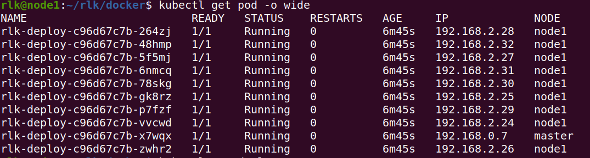

我们发现已经创建了 10 个 rlk-deploy 的 pod 容器，其中有一个（名为 rlk-deploy

c96d67c7b-x7wqx 的 POD）被调度到了 master 节点上了。

我们来运行这个 POD。

```
rlk@node1:~/rlk/docker$ kubectl exec -it rlk-deploy-c96d67c7b-x7wqx bash
```

我们在这个 POD 里编译内核。

```
root@rlk-deploy-c96d67c7b-x7wqx:/# cd /home/rlk/runninglinuxkernel_5.0/
root@rlk-deploy-c96d67c7b-x7wqx:runninglinuxkernel_5.0#./run_debian_arm64.sh 
build_kernel
```

然后打开 master 和 node1 两台机器的 top 命令，我们会发现编译的任务都迁移到

master 那台机器上了。

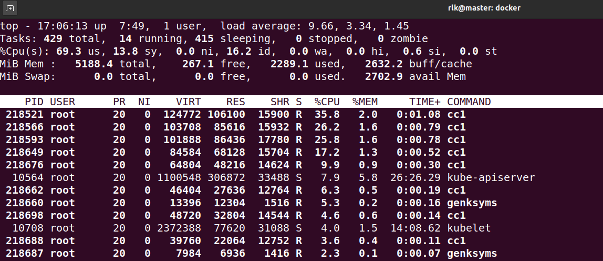

3.5 故障修复

如果发现 node 的状态处于 NotReady，那么可以通过如下命令来查看。

```
rlk@node1:~$ kubectl describe node node1
```

里面会显示 node1 的状态。

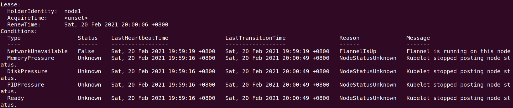

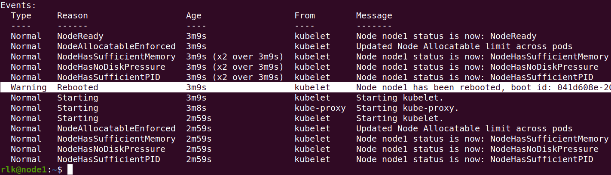

从上面 log 可以看出 node1 发生了 reboot。那么有可能是因为 swap 分区没有关闭

和防火墙没有关闭的原因。

```
rlk@node1:~$ sudo ufw disable
rlk@node1:~$ sudo swapoff -a
rlk@node1:~$ sudo systemctl restart kubelet
```

