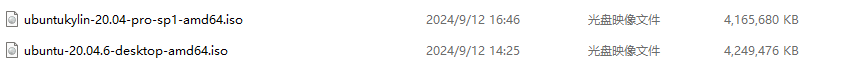

暂时没有安装优麒麟20.04 还是安装的原版 ubuntu 20.04

但是镜像都是下载了

[阿里巴巴开源镜像站-OPSX镜像站-阿里云开发者社区 (aliyun.com)](https://developer.aliyun.com/mirror/?spm=a2c6h.13651102.0.0.59e31b11Wvyu6s&serviceType=mirror)

[清华大学开源软件镜像站 | Tsinghua Open Source Mirror](https://mirrors.tuna.tsinghua.edu.cn/)

ubuntu 20.04安装过程见 remote\Linux-Kernel-Debug\VMware安装Ubuntu20.04\

