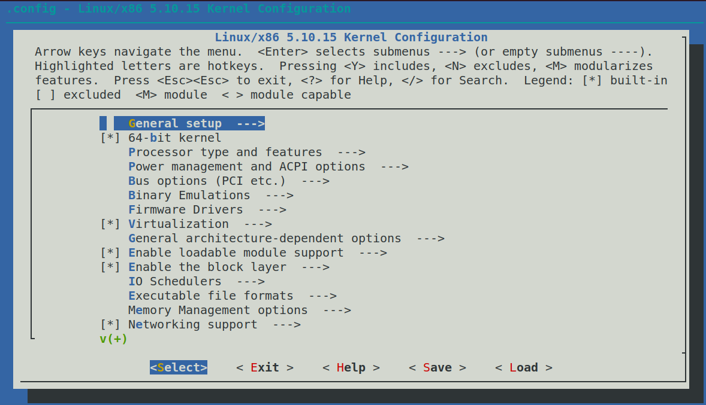
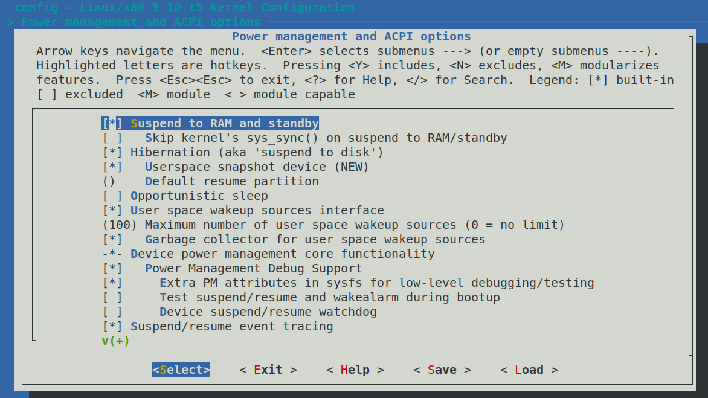

# 1.2 实验 1-2：给 Ubuntu Linux 系统更换心脏

## 1. 实验目的

1) 通过本实验学会如何给 Linux 系统更换最新版本的 Linux 内核。

2) 如何编译和安装 Linux 内核。

## 2. 实验步骤

​		在编译 Linux 内核之前，需要通过命令安装相关软件包。

```
sudo apt-get install libncurses5-dev libssl-dev build-essential openssl
```

​		当然你可以使用如下命令来安装编译内核需要的所有依赖包。

```
sudo apt build-dep linux-image-generic
```

​		到 linux 内核的官方网站（https://www.kernel.org/）上下载最新的版本，比如现在最新的稳定的内核版本是 Linux 5.10.15。Linux 内核的版本号分成三部分，第一个数字表示主版本号，第二个数字表示次版本号，第三个数字表示修正版本号。


读者可以到中国的开源镜像中下载Linux内核源代码，例如清华开源软件镜像站。

https://mirrors.tuna.tsinghua.edu.cn/kernel/v5.x/linux-5.10.15.tar.xz

可以通过如下命令进行解压。

```sh
#tar-Jxflinux-5.10.15.tar.xz
```

​		解压完之后，可以通过make menuconfig进行内核的配置，如图1.15所示。

​		除了手动配置Linux内核的选项之外，还可以直接复制UbuntuLinux系统中自带的配置文件。例如，UbuntuLinux机器上的内核版本是5.4.0-26-generic，因而内核配置文件为config-5.4.0-26-generic。

```sh
#cd linux-5.10.15
#cp/boot/config-5.4.0-26-generic .config 
#make olddefconfig
```



​																				图1.15配置内核

​		下面开始编译内核，其中-jn中的“n”表示使用多少个CPU核心来并行编译内核。

```
#make –jn
```

​		为了查看系统中有多少个CPU核心，可以执行如下命令。

```
#cat /proc/cpuinfo
…
processor   : 7
vendor_id   : GenuineIntel
cpu family  : 6
model        : 60
model name  : Intel(R) Core(TM) i7-4770 CPU @ 3.40GHz stepping    : 3
```

​		processor这一项等于7，说明系统中有8个CPU核心，因为是从0开始计数的，所以刚才的make -jn命令就可以写成make-j8了。

​		编译内核是一个漫长的过程，可能需要几十分钟时间，这取决于计算机的运算速度和配置的内核选项。通过make编译完之后，下一步需要编译和安装内核模块。

```
#sudo make modules_install
```

​		最后一步就是把编译好的内核镜像安装到UbuntuLinux系统中。

```
#sudo make install
```

​		完成之后就可以重启计算机，登录最新的系统了。

## 3 Linux内核配置菜单补充说明

​		下面对Linux内核配置一些主要的配置选项做一些说明。make menuconfig菜单下面有Select，Exit，Help，Save，Load等五个菜单。读者可以使用键盘的光标键可以左右选择。


- Select：表示选择光标高亮显示的子菜单。

- Exit：退出当前子菜单

- Help：进入帮助模式

- Save：保存当前设置到Linux内核源代码根目录下的.config文件中

- Load：表示加载一个配置文件。

​		Linux内核的模块有两种编译方法，一个是静态编译，另外一个是动态编译成模块。

- 在菜单中选择“Y”，这时在菜单前面的中括号[]里显示“*”，表示该模块会静态编译进vmlinux。

- 在菜单中选择“N”，这时在菜单前面的中括号[]里显示空白，表示该模块不会编译进vmlinux。

- 在菜单中选择“M”，这时在菜单前面的中括号[]里显示“M”，表示该模块编译成模块。


​		当选择和配置完内核模块，可以选择界面最下面的“”菜单，保存到Linux 内核源代码根目录的.config文件中。


​		最后，选择“”菜单退出内核配置。

​		下面对Linux内置内核主要菜单做一个简单介绍。读者不必对这些菜单死记硬背，实际工作中需要用到在认真阅读帮助文件。

（1）General setup

​		General setup选项为常规安装选项，包括版本信息、虚拟内存、进程间通信、系统调用、审计支持等基本内核配置选项。


（2）Enable loadable module support


​		打开可加载模块支持，如果打开它则必须通过make modules_install把内核模块安装在/lib/modules/中。模块是一小段代码，编译后可在系统内核运行时动态地加入内核，从而为内核增加一些特性或是对某种硬件进行支持。一般一些不常用到的驱动或特性可以编译为模块以减少内核的体积。在运行时可以使用modprobe命令来加载它到内核中去（在不需要时还可以移除它）。一些特性是否编译为模块的原则有不常使用的，或是在系统启动时不需要的驱动可以将其编译为模块，如果是一些在系统启动时就要用到的驱动，比如说文件系统，系统总线的支持就不要编为模块，否则无法启动系统。在启动时不用到的功能编成模块是最有效的方式。可以查看MAN手册来了解modprobe、lsmod、modinfo、insmod和rmmod。

（3）Enable the block layer


​		打开块设备的支持。

（4）Processor type and features


​		Processortypeandfeatures即处理器类型及特性，该模块包括处理器系列、内核抢占模式、抢占式大内核锁、内存模式、使用寄存器参数等处理器配置相关信息。

​		选择支持的处理器型号以及处理器相关的特性。在本实验中，我们选择“Generic-x86-64”。


（5）Power management andACPI options



​		选择和电源相关的属性，比如是否支持睡眠时候把内容存放在 RAM 中（Suspend to RAM and standby），是否支持深度睡眠，即睡眠时候把内存存放在磁盘中（Hibernation (aka 'suspend to disk')）。

（6）Bus options (PCI etc.)


​		选择对 PCIe 等总线的支持。

（7）Binary Emulations


​		对可执行文件 ELF 相关支持选项。

（8）Networking support


​		对网络协议栈比如 TCP/IP，WIFI 无线协议的支持等。

（9）Device Drivers


​		设备驱动支持。这里支持的驱动很多，包括 PCI 驱动，网卡驱动，声卡驱动，显卡驱动，I2C 驱动，SPI 驱动等等。

（10）Firmware Drivers


​		内核对固件的支持。

（11）File systems


​		内核对文件系统的支持，包括 ext4，xfs 等常见的文件系统。还包括 Linux 内核支持的 sysfs，proc 等虚拟文件系统。

（12）Kernel hacking


​		内核对调试相关的支持选项，比如设置printk的等级，是否编译带符号表的image，打开 slab 调试功能等。

（13）Security options


​		和系统安全相关的配置选项。

（14）Cryptographic API


​		内核加解密相关的配置选项。

（15）Virtualization


​		虚拟化相关的配置选项，比如 KVM 的支持等。

（16）Library routines


​		内核支持的相关库，比如 CRC 算法，xz 解压缩算法。