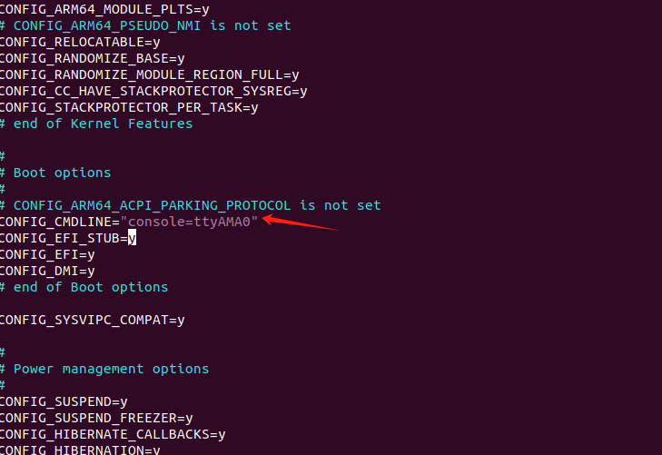

# 实验1-3 使用QEMU虚拟机来运行

## 一、实验目的

通过本实验学习如何编译ARM64版本的内核映像，并且在QEMU虚拟机中运行。

（难点好像是编译ARM架构，但是我们本身及其是X86）.

## 二、实验详解

## 1.环境准备

### 1.安装所需依赖

```shell
sudo apt update
sudo apt install flex bison libssl-dev build-essential libncurses5-dev qemu-system-arm gcc-aarch64-linux-gnu vim 
```


### 2、下载buildroot工具

使用 busybox 构建文件系统的时候，busybox 仅仅只是帮我们构建好了一些常用的命令和文件，像 lib 库、/etc目录下的一些文件都需要我们自己手动创建，而且 busybox构建的根文件系统默认没有用户名和密码设置。buildroot 比 busybox 更上一层楼，buildroot不仅集成了busybox，而且还集成了各种常见的第三方库和软件，需要什么就选择什么，buildroot 极大的方便了我们嵌入式Linux开发人员构建实用的根文件系统。

下载网址：https://buildroot.org/download.html  


进入目录解压到/root/qemudebug

```shell
tar -xzvf buildroot-2024.02.6.tar.gz -C /root/qemudebug
```


### 3、下载Linux内核

下载网址：https://mirrors.edge.kernel.org/pub/linux/kernel/v5.x/

我这里选择下载的是linux-5.15.10,之前我做实验用过的

```shell
tar -xvf linux-5.15.10.tar -C /root/qemudebug
```


补充：解压自定义名称

```shell
sudo tar -xzvf buildroot-2024.02.6.tar.gz --strip-components=1 -C /root/qemudebug/buildroot_custom_name
```

重命名mv最好使用绝对路径，当你在相同目录中更改文件或文件夹的名称时，这是一个“重命名”操作。


**buildroot和Linux内核都放在里面**


## 2.编译根文件

```shell
cd buildroot-2021.02.4
make menuconfig
```

在弹出的配置界面中，设置：

-    Target option —> Target Architecture为AArch64 (little endian)
-    Toolchain —> Toolchain type为External toolchain
-    System configuration —> Enable root login with password开启  
     System configuration —>Root password 设置你的密码  
     System configuration —>Run a getty (login prompt) after boot —> TTY port的值为ttyAMA0
-    Target packages —> Show packages that are also provided by busybox开启  
     Target packages —> Debugging, profiling and benchmark —> strace开启
-    Filesystem images —> cpio the root filesystem开启

1.


按空格Enter选择


2.


3.


4.


5.


保存


在配置完成之后，执行

    make -j4


编译成功后，目录`buildroot-2024.02.6/output/images`下面会生成`rootfs.cpio`。  


## 3\. 编译内核

回到`qemudebug`目录下，执行：

```shell
cd linux-5.15.10
ARCH=arm64 CROSS_COMPILE=aarch64-linux-gnu- make defconfig
```


```shell
vim .config
```

编辑选项 ：

-    CONFIG\_CMDLINE=“console=ttyAMA0”



-    CONFIG\_INITRAMFS\_SOURCE=“XXX/new/buildroot-2021.02.4/output/images/rootfs.cpio”(注意这里XXX要设置为你自己的路径)

```shell
CONFIG\_INITRAMFS\_SOURCE="~/qemudebug/buildroot-2024.02.6/output/images/rootfs.cpio"
```


-    CONFIG\_DEBUG\_INFO=y


配置结束后，执行以下命令

```shell
ARCH=arm64 CROSS_COMPILE=aarch64-linux-gnu- make -j4
```

按了一些回车，默认


内核编译成功后，在`linux-5.0.2/`目录下会生成`vmlinux`以及在`linux-5.0.2/arch/arm64/boot/`目录下会生成`Image`。


## 4\. 创建虚拟机

在linux-5.15.10目录下，执行以下命令创建虚拟机。(创建好后，下次启动虚拟机依然使用这条命令)

    qemu-system-aarch64 -machine virt -cpu cortex-a57 -machine type=virt -nographic -smp 1  -m 2048 -kernel ./arch/arm64/boot/Image -append "console=ttyAMA0" $1 $2

这个命令用于启动QEMU虚拟机，并加载ARM64架构的Linux内核映像。以下是对各个参数的详细解释：

### 命令及参数解释：

1. **`qemu-system-aarch64`**
   - 这是QEMU的可执行文件，用于模拟ARM64架构的系统。QEMU是一个开源的虚拟化工具，可以模拟不同的处理器和硬件架构。
2. **`-machine virt`**
   - 指定虚拟机的机器类型为`virt`。这个类型是一个通用的、与硬件无关的虚拟平台，专为虚拟化环境设计，适用于ARM架构的开发和测试。
3. **`-cpu cortex-a57`**
   - 指定虚拟机使用的CPU型号为`Cortex-A57`，这是一个ARMv8架构的64位处理器模型，常用于模拟和测试64位ARM系统。
4. **`-machine type=virt`**
   - 这与前面的`-machine virt`是相同的参数，只是冗余出现。`type=virt`指定了虚拟机的类型。
5. **`-nographic`**
   - 禁用图形输出。虚拟机将不使用图形界面，而是通过终端界面进行交互，适合在没有图形界面的环境中运行虚拟机（如服务器或远程SSH会话）。
6. **`-smp 1`**
   - 设置虚拟机的CPU数量为1。`smp`代表对称多处理（Symmetric Multiprocessing），在这个配置中，只启动一个CPU核。
7. **`-m 2048`**
   - 为虚拟机分配2048 MB（即2 GB）的内存。这个参数指定虚拟机的内存大小，确保操作系统和应用程序有足够的内存运行。
8. **`-kernel ./arch/arm64/boot/Image`**
   - 指定要加载的Linux内核映像的路径。这里的路径是`./arch/arm64/boot/Image`，这通常是内核编译后的输出路径，包含了启动虚拟机所需的内核。
9. **`-append "console=ttyAMA0"`**
   - 向内核传递启动参数。`console=ttyAMA0`指定内核的控制台输出为`ttyAMA0`，这是一个常见的ARM平台上的串行控制台设备。它确保虚拟机启动后，控制台输出会显示在终端上，而不是需要图形界面。
10. **`$1 $2`**
    - 这两个是脚本中的变量，代表用户传递给脚本的额外参数。`$1`和`$2`是从命令行传递到脚本中的第一个和第二个参数，它们会被插入到QEMU命令的最后，用于自定义启动选项或参数。

### 总结：

​		这个命令用于启动一个基于QEMU的ARM64虚拟机，配置了一个虚拟的Cortex-A57处理器，分配了2GB的内存，并加载指定的Linux内核映像。控制台输出被配置为通过串行终端显示，因此不需要图形界面。这个命令非常适合嵌入式Linux系统开发、调试和测试ARM64架构的内核和应用。


然后就会提示我们登录：


之前设置的密码BgXXXXX


```
cd /
ls -al
```


现在我们要退出qemu界面，有以下两种方法

-   #### kill命令退出
    
    1.  新建打开另外一个终端窗口，在命令行中输入`$ ps -elf | grep qemu`可以得到进程号，第一行是原终端（左边）中的qemu进程，第二行是右边QEMU这个进程，所以我们只要kill掉2403这个进程就可以了。  
        
    2.  终端命令行中输入`kill -9 2403`即可杀死进程，退出qemu。
    
-   #### 快捷键退出
    
    1.  快捷键是先按住Crtl+a，然后松开，然后按x（不能是大写的！）。
    2.  需要注意的是，在QEMU的窗口中使用快捷键只会键入一些奇怪的字符，是无效的；我们需要**回到终端中去使用快捷键**，才能正常退出。
    
    

## 5.

为了能在 QEMU 里面使用网络功能，这里使用 tap 作为后端网络设备。在主机中，创建`tap_linux`设备，命令如下：

    $ sudo ip tuntap add dev tap_linux mod tap
    $ sudo ifconfig tap_linux up
    $ sudo ifconfig tap_linux 192.168.10.10 netmask 255.255.255.0


在当前目录创建一个`shell`脚本，避免重复输入指令。其文件名为`start.sh`，其内容为

    qemu-system-aarch64 -machine virt -cpu cortex-a57 \
    	-machine type=virt -nographic -smp 1 \
    	-m 2048 \
    	-kernel ./arch/arm64/boot/Image \
    	--apend "console=ttyAMA0" \
            -netdev tap,id=mynet1,script=no,downscript=no,ifname=tap_linux \
            -device virtio-net-device,netdev=mynet1,mrg_rxbuf=off,csum=off,guest_csum=off,gso=off,guest_tso4=off,guest_tso6=off,guest_ecn=off,guest_ufo=off \
    	$1 $2


执行`./startup.sh`，这是可以用`qemu`启动`linux`内核。在进入命令行之前，需要输入`buildroot login:` 的值，其值为`root`，然后需要输入`Password:` ，这是前文构建`rootfs.cpio`的时候，配置项`System configuration ---> Root password`的值。然后就可以进入命令行执行以下常用命令了。（注意，需要先`cd /`）。使用网络功能需要先给网卡配置 ip，例如`ifconfig eth0 192.168.10.11`。

如果要退出`qemu`，可以先按`Ctrl + A`，然后按`X`。

为了在主机和`qemu`虚拟机之间共享文件，我们可以创建一个目录，其绝对路径为`SHARED_FILE_PATH`。然后执行以下命令

    cd $BUILD_ROOT_PATH
    vim .config


修改`BR2_ROOTFS_OVERLAY`配置项的值为`$SHARED_FILE_PATH`（注意，自行展开变量）。

保存后执行以下命令重新创建 `rootfs.cpio`。

    rm $BUILD_ROOT_PATH/output/images/rootfs.*
    make


然后需要重新编译内核，即

    cd $LINUX_KERNEL_PATH
    ARCH=arm64 CROSS_COMPILE=aarch64-linux-gnu- make -j16


依然通过`./start.sh`启动虚拟机跑`linux`内核，进入命令行后，执行`cd /; ls`，我们可以看到`$SHARED_FILE_PATH`目录下的文件。

重新执行`./start.sh -s -S`进入`qemu`的调试状态，然后开一个新的`shell`，输入命令

    cd $LINUX_KERNEL_PATH
    aarch64-linux-gnu-gdb ./vmlinux -ex "target remote :1234"


现在，可以像以往一样使用`gdb`进行调试了……

下面介绍如何编译一个`linux`内核模块。

    cd $SHARED_FILE_PATH
    vim hello.c


`hello.c`的内容为

    #include <linux/module.h>
    #include <linux/kernel.h>
    #include <linux/init.h>
    #include <linux/seq_file.h>
    #include <linux/proc_fs.h>
    #include <linux/sched.h>
    
    int helloinit(void)
    {
    	printk(KERN_DEBUG "hello world !!\n");
    	return 0;
    }
    
    void helloexit(void)
    {
    	printk(KERN_DEBUG "goodbye world !!\n");
    }
    
    module_init(helloinit);
    module_exit(helloexit);
    
    MODULE_LICENSE("GPL");


然后在当前目录创建`Makefile`内容如下

    ifneq (${KERNELRELEASE},)
    obj-m := hello.o
    else
    KERNEL_SOURCE := $LINUX_KERNEL_PATH # 注意自行展开变量LINUX_KERNEL_PATH
    PWD := $(shell pwd)
    
    default:
    	${MAKE} -C ${KERNEL_SOURCE} M=${PWD} modules
    
    clean:
    	${MAKE} -C ${KERNEL_SOURCE} M=${PWD} clean
    endif


然后执行交叉编译命令

    ARCH=arm64 CROSS_COMPILE=aarch64-linux-gnu- make


OK，重新编译`rootfs.cpio`和`linux`内核，然后运行`qemu`。在进入`linux`命令行后，执行以下命令

    cd /
    insmod hello.ko
    dmesg | tail      # 可以看到打印信息 hello world !!
    rmmod hello.ko
    dmesg | tail      # 可以看到打印信息 goodbye world !!


# 相关经验

## Linux Kernel

-   使用`qemu`并开启`gdb server`功能之后，在`gdb`窗口输入`b start_kernel`，进入最初的内核初始化函数。

# 平台工具

-   [buildroot](https://buildroot.org/download.html)
-   [Linux kernel](https://www.kernel.org/)

# 参考

-   [Starting Linux kernel exploration](https://www.youtube.com/watch?v=zK2Agg3U2cU)
-   [Debugging an ARM64 linux kernel using QEMU](https://www.youtube.com/watch?v=swniLhXg-3U)
-   [Writing kernel modules](https://www.youtube.com/watch?v=1kmWC6c-sMU)
-   [Debugging Kernel and Modules using GDB](https://www.kernel.org/doc/html/latest/dev-tools/gdb-kernel-debugging.html)

本文来自博客园，作者：[Legend\_Lone](https://www.cnblogs.com/sun-ye/)，转载请注明原文链接：[https://www.cnblogs.com/sun-ye/p/14992084.html](https://www.cnblogs.com/sun-ye/p/14992084.html)


## 补充：AI

这篇文章的目的是通过实验指导如何编译ARM64架构的Linux内核，并在QEMU虚拟机中运行，以学习和理解嵌入式Linux系统的开发过程。整个过程包括以下几个主要步骤：

### 1. **环境准备**

- **目的：** 安装必要的开发工具和依赖，确保可以进行ARM64架构的编译和模拟环境搭建。
- **步骤：** 使用包管理工具安装如`flex`、`bison`、`qemu-system-arm`、`gcc-aarch64-linux-gnu`等工具，准备好交叉编译和虚拟机运行环境。

### 2. **下载和配置 Buildroot 工具**

- **目的：** 使用Buildroot工具构建一个完整的根文件系统，比BusyBox更全面，集成了更多的库和软件。
- **步骤：** 下载Buildroot并解压，配置Buildroot以生成适用于ARM64的根文件系统。

### 3. **下载和编译 Linux 内核**

- **目的：** 获取并编译适用于ARM64架构的Linux内核映像，为虚拟机运行提供核心文件。
- **步骤：** 下载指定版本的Linux内核源码，配置内核选项（如启动参数和文件系统路径），并使用交叉编译工具生成ARM64的内核映像。

### 4. **编译根文件系统**

- **目的：** 配置并编译根文件系统，确保虚拟机启动时有完整的文件系统支持。
- **步骤：** 使用Buildroot的`menuconfig`工具配置系统目标架构、工具链、登录设置等选项，生成rootfs.cpio文件。

### 5. **创建和运行 QEMU 虚拟机**

- **目的：** 利用QEMU模拟ARM64架构，加载编译好的内核和文件系统，以验证内核和文件系统的运行效果。
- **步骤：** 通过命令行创建QEMU虚拟机，指定虚拟机配置参数（如CPU类型、内存大小、内核路径等），并使用root账户登录虚拟机。

### 6. **编译和调试 Linux 内核模块**

- **目的：** 通过编写和加载自定义内核模块，学习Linux内核模块的开发流程和在内核中扩展功能的实践。
- **步骤：** 编写一个简单的内核模块（hello.c），编写对应的Makefile，使用交叉编译工具编译模块，然后在虚拟机中加载和卸载模块，并查看模块的输出。

### 7. **使用 GDB 调试内核**

- **目的：** 学习使用GDB调试内核和内核模块的技术，以深入了解内核启动过程和模块运行状态。
- **步骤：** 启动QEMU时开启GDB server功能，在GDB中连接虚拟机，设置断点（如`start_kernel`），并进行逐步调试。

### **总结：**

整个实验的目的是通过实践学习如何构建和运行ARM64架构的Linux系统，涉及到编译内核、构建文件系统、使用虚拟机模拟硬件运行环境，以及进行内核模块的开发和调试。这个过程帮助理解嵌入式Linux系统的开发流程，并为实际开发ARM64架构下的系统奠定基础。