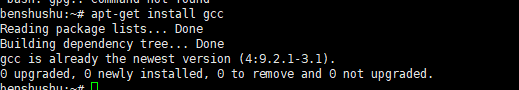
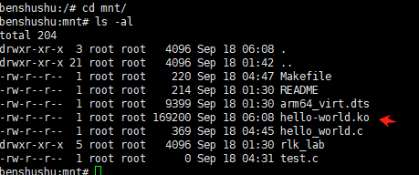

# 实验 1-3：使用 QEMU 虚拟机来运行 Linux 系统

## 一.实验目的

通过本实验学习如何编译一个 ARM64 版本的内核 image，并且在 QEMU 上运行起来。

## 二.实验详解

市面上有不少基于ARM64架构的开发版，


在Linux主机的另一个超级终端输入killall qemu-system-aarch64,即可关闭QEMU虚拟机。也可以按Ctrl+A组合键，然后按X键来关闭QEMU虚拟机。


### 1.安装linux主机相关工具（01-3-1已完成）

    sudo apt-get install qemu-system-arm libncurses5-dev gcc-aarch64-linux-gnu build-essential git bison flex libssl-dev


上面执行后，默认安装 的arm64 gcc 版本是9.3版本，并检查是否如下

```
$aarch64-linux-gnu-gcc -v
Using built-in specs.
COLLECT_GCC=aarch64-linux-gnu-gcc
COLLECT_LTO_WRAPPER=/usr/lib/gcc-cross/aarch64-linux-gnu/9/lto-wrapper
Target: aarch64-linux-gnu
Configured with: ../src/configure -v --with-pkgversion='Ubuntu 9.3.0-17ubuntu1~20.04' --with-bugurl=file:///usr/share/doc/gcc-9/README.Bugs --enable-languages=c,ada,c++,go,d,fortran,objc,obj-c++,gm2 --prefix=/usr --with-gcc-major-version-only --program-suffix=-9 --enable-shared --enable-linker-build-id --libexecdir=/usr/lib --without-included-gettext --enable-threads=posix --libdir=/usr/lib --enable-nls --with-sysroot=/ --enable-clocale=gnu --enable-libstdcxx-debug --enable-libstdcxx-time=yes --with-default-libstdcxx-abi=new --enable-gnu-unique-object --disable-libquadmath --disable-libquadmath-support --enable-plugin --enable-default-pie --with-system-zlib --without-target-system-zlib --enable-libpth-m2 --enable-multiarch --enable-fix-cortex-a53-843419 --disable-werror --enable-checking=release --build=x86_64-linux-gnu --host=x86_64-linux-gnu --target=aarch64-linux-gnu --program-prefix=aarch64-linux-gnu- --includedir=/usr/aarch64-linux-gnu/include
Thread model: posix
gcc version 9.3.0 (Ubuntu 9.3.0-17ubuntu1~20.04) 
```

ps:我默认安装的是9.4


qemu虚拟机的版本是 并检查是否如下

    $qemu-system-aarch64  --version
    QEMU emulator version 4.2.1 (Debian 1:4.2-3ubuntu6.14)
    Copyright (c) 2003-2019 Fabrice Bellard and the QEMU Project developers


### 2.下载代码仓库

下载runninglinuxkernel_5.0的git仓库并却切换到runninglinuxkernel_5.0分支

PS:我直接下载了，因为git clone后面卡住了，不具备git功能


PS：第二次用git clone下来


可以看到这次clone下来的文件属性和之前不一样，有可执行权限


### 3.编译内核以及创建文件系统

#### 编译内核

    sudo ./run_debian_arm64.sh  build_kernel


一开始遇到权限问题，加可执行权限


```
chmod +x run_debian_arm64.sh
./run_debian_arm64.sh build_kernel
```


但是依然运行脚本会出现权限错误


决定给这个文件目录一些权限

要为 `/root/remote/runninglinuxkernel_5.0-rlk_5.0` 文件夹及其所有子文件夹和文件赋予适当的权限，你可以使用以下命令：

##### 赋予权限

运行以下命令，将权限设置为对文件所有者有读、写、执行权限，对组用户和其他用户有读和执行权限：

```
chmod -R 755 /root/remote/runninglinuxkernel_5.0-rlk_5.0
```

##### 权限解释

- 755

   权限表示：

  - **7** (rwx)：文件所有者有读、写、执行权限。
  - **5** (r-x)：所属组用户有读和执行权限，没有写权限。
  - **5** (r-x)：其他用户有读和执行权限，没有写权限。

这个设置适用于大多数场景，允许脚本和可执行文件运行的同时，保持一定的安全性。

##### 执行步骤

1. 打开终端并切换到 root 用户，如果还未在 root 用户下：

   ```
   sudo -i
   ```

2. 赋予权限：

   ```
   chmod -R 755 /root/remote/runninglinuxkernel_5.0-rlk_5.0
   ```

3. 重新运行脚本：

   ```
   cd /root/remote/runninglinuxkernel_5.0-rlk_5.0
   ./run_debian_arm64.sh build_kernel
   ```

这样设置后，所有的脚本和必要的文件都应该有足够的权限执行，确保编译过程顺利进行。

但是还是遇到问题


明天再git clone吧，这次直接下载的可能有些错误，比如是windows下环境

#### 第二次编译内核

```
./run_debian_arm64.sh  build_kernel
```


会报一些小警告，但是还是在编译内核的


撑着编译时，我们看看这个run_debian_arm64.sh讲了什么

```shell
#!/bin/bash

LROOT=$PWD
JOBCOUNT=${JOBCOUNT=$(nproc)}
export ARCH=arm64
export CROSS_COMPILE=aarch64-linux-gnu-
export INSTALL_PATH=$LROOT/rootfs_debian_arm64/boot/
export INSTALL_MOD_PATH=$LROOT/rootfs_debian_arm64/
export INSTALL_HDR_PATH=$LROOT/rootfs_debian_arm64/usr/

kernel_build=$PWD/rootfs_debian_arm64/usr/src/linux/
rootfs_path=$PWD/rootfs_debian_arm64
rootfs_image=$PWD/rootfs_debian_arm64.ext4

rootfs_size=2048
SMP="-smp 4"

QEMU=qemu-system-aarch64

rootfs_arg="root=/dev/vda rootfstype=ext4 rw"
kernel_arg="noinitrd nokaslr"
crash_arg="crashkernel=256M"
dyn_arg="vfio.dyndbg=+pflmt irq_gic_v3_its.dyndbg=+pflmt iommu.dyndbg=+pflmt irqdomain.dyndbg=+pflmt"
debug_arg="loglevel=8 sched_debug"

if [ $# -lt 1 ]; then
	echo "Usage: $0 [arg]"
	echo "menuconfig: reconfig the kernel"
	echo "build_kernel: build the kernel image."
	echo "build_rootfs: build the rootfs image, need root privilege"
	echo "update_rootfs: update kernel modules for rootfs image, need root privilege."
	echo "run: run debian system."
	echo "run debug: enable gdb debug server."
fi

if [ $# -eq 2 ] && [ $2 == "debug" ]; then
	echo "Enable qemu debug server"
	DBG="-s -S"
	SMP=""
fi

make_kernel_image(){
		echo "start build kernel image..."
		make debian_defconfig
		make -j $JOBCOUNT
}

make_menuconfig(){
               echo "start re-config kernel"
               make debian_defconfig
               make menuconfig
               cp .config $PWD/arch/arm64/configs/debian_defconfig
}

prepare_rootfs(){
		if [ ! -d $rootfs_path ]; then
			echo "decompressing rootfs..."
			# split -d -b 80m rootfs_debian_arm64.tar.xz -- rootfs_debian_arm64.part 
			cat rootfs_debian_arm64.part0* > rootfs_debian_arm64.tar.xz
			tar -Jxf rootfs_debian_arm64.tar.xz
		fi
}

build_kernel_devel(){
	kernver="$(cat include/config/kernel.release)"
	echo "kernel version: $kernver"

	mkdir -p $kernel_build
	rm rootfs_debian_arm64/lib/modules/$kernver/build
	cp -a include $kernel_build
	cp Makefile .config Module.symvers System.map vmlinux $kernel_build
	mkdir -p $kernel_build/arch/arm64/
	mkdir -p $kernel_build/arch/arm64/kernel/

	cp -a arch/arm64/include $kernel_build/arch/arm64/
	cp -a arch/arm64/Makefile $kernel_build/arch/arm64/
	cp arch/arm64/kernel/module.lds $kernel_build/arch/arm64/kernel/

	ln -s /usr/src/linux rootfs_debian_arm64/lib/modules/$kernver/build

	# ln to debian linux-5.0/scripts
	ln -s /usr/src/linux-kbuild/scripts rootfs_debian_arm64/usr/src/linux/scripts
	#ln -s /usr/src/linux-kbuild/tools rootfs_debian_arm64/usr/src/linux/tools
}

check_root(){
		if [ "$(id -u)" != "0" ];then
			echo "superuser privileges are required to run"
			echo "sudo ./run_debian_arm64.sh build_rootfs"
			exit 1
		fi
}

update_rootfs(){
		if [ ! -f $rootfs_image ]; then
			echo "rootfs image is not present..., pls run build_rootfs"
		else
			echo "update rootfs ..."

			mkdir -p $rootfs_path
			echo "mount ext4 image into rootfs_debian_arm64"
			mount -t ext4 $rootfs_image $rootfs_path -o loop

			make install
			make modules_install -j $JOBCOUNT
			#make headers_install

			build_kernel_devel

			umount $rootfs_path
			chmod 777 $rootfs_image

			rm -rf $rootfs_path
		fi

}

build_rootfs(){
		if [ ! -f $rootfs_image ]; then
			make install
			make modules_install -j $JOBCOUNT
			# make headers_install

			build_kernel_devel

			echo "making image..."
			dd if=/dev/zero of=$rootfs_image bs=1M count=$rootfs_size
			mkfs.ext4 $rootfs_image
			mkdir -p tmpfs
			echo "copy data into rootfs..."
			mount -t ext4 $rootfs_image tmpfs/ -o loop
			cp -af $rootfs_path/* tmpfs/
			umount tmpfs
			chmod 777 $rootfs_image

			rm -rf $rootfs_path
		fi

}

run_qemu_debian(){
		cmd="$QEMU -m 1024 -cpu max,sve=on,sve256=on -M virt,gic-version=3,its=on,iommu=smmuv3\
			-nographic $SMP -kernel arch/arm64/boot/Image \
			-append \"$kernel_arg $debug_arg $rootfs_arg $crash_arg $dyn_arg\"\
			-drive if=none,file=$rootfs_image,id=hd0\
			-device virtio-blk-device,drive=hd0\
			--fsdev local,id=kmod_dev,path=./kmodules,security_model=none\
			-device virtio-9p-pci,fsdev=kmod_dev,mount_tag=kmod_mount\
			$DBG"
		echo "running:"
		echo $cmd
		eval $cmd

}

case $1 in
	build_kernel)
		make_kernel_image
		#prepare_rootfs
		#build_rootfs
		;;
	
	menuconfig)
		make_menuconfig
		;;

	build_rootfs)
		#make_kernel_image
		check_root
		prepare_rootfs
		build_rootfs
		;;

	update_rootfs)
		update_rootfs
		;;
	run)

		if [ ! -f $LROOT/arch/arm64/boot/Image ]; then
			echo "canot find kernel image, pls run build_kernel command firstly!!"
			exit 1
		fi

		if [ ! -f $rootfs_image ]; then
			echo "canot find rootfs image, pls run build_rootfs command firstly!!"
			exit 1
		fi

		#prepare_rootfs
		#build_rootfs
		run_qemu_debian
		;;
esac

```

编译完成


在 Linux 中，`./` 和 `.` 是两个不同的命令，它们有不同的用途：

1. **`./` (dot-slash):**
   - 用于执行当前目录中的可执行文件或脚本。
   - 当你使用 `./run_debian_arm64.sh` 时，`./` 表示在当前目录下查找并执行 `run_debian_arm64.sh` 脚本。
   - 这是最常见的方式来运行一个脚本或程序，因为系统默认不会在当前目录中查找可执行文件，直接输入文件名是不够的，所以需要 `./` 来指示。
2. **`.` (dot):**
   - 是一个 Shell 内建命令，作用是 **source** 一个脚本。
   - 使用 `.` 会在当前 shell 环境中执行脚本，而不会启动一个新的子 shell。
   - 例如，`. script.sh` 或 `source script.sh` 会在当前 shell 中执行 `script.sh`，任何对环境的修改（如变量设置、函数定义）都会影响当前 shell。

**为什么不能用 `.` 来执行 `run_debian_arm64.sh build_kernel`？**

- `run_debian_arm64.sh` 是一个独立的脚本，通常需要用一个新的 shell 环境来运行，`./` 方式正是用来做这个的。
- 如果用 `.`（即 source），这会将脚本的所有内容和环境变量加载到当前 shell 中执行。如果脚本中有 exit、cd、设置变量等操作，都会直接影响当前 shell 的状态，这通常不是我们希望的行为，尤其是当脚本是用来编译或运行较大任务时。

因此，`./` 是用于启动一个新进程来执行脚本，而 `.` 则是将脚本的内容引入到当前 shell 中。这也是为什么 `./run_debian_arm64.sh build_kernel` 不能用 `.` 来替代。


#### 编译根文件系统

    sudo ./run_debian_arm64.sh  build_rootfs


生成rootfs\_debian\_arm64.ext4的根文件系统。

编译根文件需要管理员权限，而编译内核则不需要。

### 4.运行刚编译好的arm64版本的linux系统

要运行run_rlk_arm64.sh脚本，输入run参数即可

```
sudo ./run_debian_arm64.sh  run
```

或

```
qemu-system-aarch64 -m 1024 -cpu max,sve=on,sve256=on -M virt,gic-version=3,its=on,iommu=smmuv3 -nographic -smp 4 -kernel arch/arm64/boot/Image -append "noinitrd nokaslr loglevel=8 sched_debug root=/dev/vda rootfstype=ext4 rw crashkernel=256M vfio.dyndbg=+pflmt irq_gic_v3_its.dyndbg=+pflmt iommu.dyndbg=+pflmt irqdomain.dyndbg=+pflmt" -drive if=none,file=/root/runninglinuxkernel_5.0/rootfs_debian_arm64.ext4,id=hd0 -device virtio-blk-device,drive=hd0 --fsdev local,id=kmod_dev,path=./kmodules,security_model=none -device virtio-9p-pci,fsdev=kmod_dev,mount_tag=kmod_mount
```


用户名：root

密码：123

#### 如果遇到此磁盘已经被其他进程占用


```
ps -aux |grep " image(创建的磁盘名称)"
ps -aux |grep "/root/runninglinuxkernel_5.0/rootfs_debian_arm64.ext4"
//通过上述命令找到相关进程杀死（该磁盘可能被别人占用，建议询问后在杀）
```


```
kill -9 “上述命令查出的进程号”
kill -9 2479
```

重新拉虚拟机

### 5.在线安装软件包

qemu虚拟机通过virtIO-net技术生成虚拟的网卡，并通过网络桥接技术和主机进行网络共享。下面使用ifconfig命令检查网络配置

    benshushu:~# ifconfig 
    enp0s1: flags=4163<UP,BROADCAST,RUNNING,MULTICAST>  mtu 1500
            inet 10.0.2.15  netmask 255.255.255.0  broadcast 10.0.2.255
            inet6 fec0::ce16:adb:3e70:3e71  prefixlen 64  scopeid 0x40<site>
            inet6 fe80::c86e:28c4:625b:2767  prefixlen 64  scopeid 0x20<link>
            ether 52:54:00:12:34:56  txqueuelen 1000  (Ethernet)
            RX packets 19  bytes 3799 (3.7 KiB)
            RX errors 0  dropped 0  overruns 0  frame 0
            TX packets 55  bytes 6862 (6.7 KiB)
            TX errors 0  dropped 0 overruns 0  carrier 0  collisions 0
    
    lo: flags=73<UP,LOOPBACK,RUNNING>  mtu 65536
            inet 127.0.0.1  netmask 255.0.0.0
            inet6 ::1  prefixlen 128  scopeid 0x10<host>
            loop  txqueuelen 1000  (Local Loopback)
            RX packets 2  bytes 78 (78.0 B)
            RX errors 0  dropped 0  overruns 0  frame 0
            TX packets 2  bytes 78 (78.0 B)
            TX errors 0  dropped 0 overruns 0  carrier 0  collisions 0


可以看到这生成了enp0s1的网卡，ip 等信息，这里可以通过 apt-get update命令更新debian系统的软件仓库  
如果不能更新可能是系统时间比较老，可以使用date命令来设置日期, 这里可以更新

    hushu:~# apt-get update
    Get:1 http://mirrors.ustc.edu.cn/debian unstable InRelease [154 kB]
    Get:2 http://mirrors.ustc.edu.cn/debian unstable/non-free Sources [86.7 kB]    
    Get:3 http://mirrors.ustc.edu.cn/debian unstable/main Sources [9143 kB]        
    Get:4 http://mirrors.ustc.edu.cn/debian unstable/contrib Sources [50.8 kB]     
    Get:5 http://mirrors.ustc.edu.cn/debian unstable/main arm64 Packages [8483 kB] 
    Get:6 http://mirrors.ustc.edu.cn/debian unstable/main armhf Packages [8344 kB] 
    Get:7 http://mirrors.ustc.edu.cn/debian unstable/main Translation-en [6489 kB] 
    Get:8 http://mirrors.ustc.edu.cn/debian unstable/non-free arm64 Packages [71.8 kB]
    Get:9 http://mirrors.ustc.edu.cn/debian unstable/non-free armhf Packages [61.9 kB]
    Get:10 http://mirrors.ustc.edu.cn/debian unstable/non-free Translation-en [101 kB]
    Get:11 http://mirrors.ustc.edu.cn/debian unstable/contrib armhf Packages [48.5 kB]
    Get:12 http://mirrors.ustc.edu.cn/debian unstable/contrib arm64 Packages [49.0 kB]
    Get:13 http://mirrors.ustc.edu.cn/debian unstable/contrib Translation-en [53.1 kB]
    Fetched 33.1 MB in 59s (566 kB/s)                                              
    Reading package lists... Done


    

    sudo date -s "2024-09-18 12:15:00"

发现不是日期问题，而是缺少公钥，那么添加即可


```
sudo apt-key adv --keyserver keyserver.ubuntu.com --recv-keys 0E98404D386FA1D9
sudo apt-key adv --keyserver keyserver.ubuntu.com --recv-keys 6ED0E7B82643E131
```

上述命令后一直卡住，暂不更新


可以使用apt-get install 命令安装软件包，如gcc

```
apt-get install gcc 
```



### 6.在主机与qemu虚拟机中共享文件

通过 NET\_9P技术，需要QEMU虚拟机中内核 与主机linux内核都使能 NET\_9P模块，本实验已支持，可测试一下  

创建一个文件

    $ cd /root/runninglinuxkernel_5.0/kmodules
    $ touch test.c


启动QEMU虚拟机后，首先检查一下/mnt 目录中是否有test.c文件。


我们在后续的实验中会经常利用这个特性，比如把主机上交叉编译的内核 模块放在qemu的虚拟内核中调试，也可以直接在qemu虚拟机中编译调试。

#### 补充：要在主机与 QEMU 虚拟机之间共享文件，可以使用 9P 网络文件系统（NET_9P）技术。以下是具体步骤，帮助你在主机与 QEMU 虚拟机之间共享文件并测试创建文件的过程：

##### 步骤 1：准备主机上的共享目录

在主机上创建一个共享目录，例如 `/shared`：

```
mkdir /shared
```

##### 步骤 2：启动 QEMU 虚拟机并挂载共享目录

在启动 QEMU 虚拟机时，使用以下命令行参数来挂载主机上的共享目录到虚拟机中：

```
qemu-system-x86_64 -hda your-vm-image.qcow2 -m 2048 -net nic -net user \
    -virtfs local,path=/shared,mount_tag=hostshare,security_model=passthrough,id=hostshare
```

- `-virtfs` 参数用于启用 9P 文件系统共享。
- `path=/shared` 指定主机上要共享的目录路径。
- `mount_tag=hostshare` 用于在虚拟机中标识共享。
- `security_model=passthrough` 使虚拟机对文件拥有相同的权限。
- `id=hostshare` 用于标识挂载实例。

##### 步骤 3：在虚拟机中挂载共享目录

在虚拟机中，你需要挂载这个共享目录。在虚拟机启动后，执行以下命令：

```
sudo mount -t 9p -o trans=virtio,version=9p2000.L hostshare /mnt
```

- `hostshare` 是在 QEMU 启动时指定的 `mount_tag`。
- `/mnt` 是虚拟机中要挂载的目标目录。

##### 步骤 4：测试在虚拟机中创建文件

进入虚拟机的挂载目录 `/mnt`，创建一个文件来测试共享是否正常工作：

```
cd /mnt
touch testfile.txt
```

##### 步骤 5：验证文件共享

在主机上检查 `/shared` 目录，看看是否可以看到虚拟机中创建的文件 `testfile.txt`：

```
ls /shared
```

你应该能够看到 `testfile.txt`，这表明主机和虚拟机之间的文件共享已经成功。

##### 注意事项

- 确保 QEMU 和虚拟机内核都已启用 `NET_9P` 支持。你可以通过以下命令检查：

  ```
  grep 9P /boot/config-$(uname -r)
  ```

- 如果共享目录在虚拟机中无法正常挂载，请检查虚拟机的日志或主机的 QEMU 启动日志来排除可能的错误。

通过以上步骤，你应该可以成功实现主机与 QEMU 虚拟机之间的文件共享并创建文件进行测试。


#### 更新内核配置修改的路径

    ls arch/arm64/configs/
    busybox_defconfig         debian_default_defconfig  debian_defconfig


​		重新编译内核

    sudo ./run_debian_arm64.sh build_kernel


​		更新根文件系统

    sudo ./run_debian_arm64.sh  update_rootfs


​		要在run起来 的内核中编译测试代码，将代码放在

    runninglinuxkernel_5.0/kmodules

​		下面便是 helloworld.c

```C
#include <linux/module.h>
#include <linux/init.h>

static int __init my_test_init(void)
{
    printk("hello world, I am benshushu\n");
    return 0;
}

static void __exit my_test_exit(void)
{
    printk("goodbye\n");
}

module_init(my_test_init);
module_exit(my_test_exit);

MODULE_LICENSE("GPL");
MODULE_AUTHOR("rlk");
MODULE_DESCRIPTION("hello world module");
```


```
BASEINCLUDE ?= /lib/modules/`uname -r`/build
hello-world-objs := helloworld.o
obj-m := hello-world.o

all:
	$(MAKE) -C $(BASEINCLUDE) M=$(PWD) modules;

clean:
	$(MAKE) -C $(BASEINCLUDE) M=$(PWD) clean;
	rm -f *.ko;
```


#### 补充：这个 Makefile 是用于编译一个 Linux 内核模块的，以下是对其内容的逐步解释：

##### 1. 变量定义

```
BASEINCLUDE ?= /lib/modules/`uname -r`/build
```

- `BASEINCLUDE`：定义了内核源代码的构建目录路径。`/lib/modules/$(uname -r)/build` 是当前运行内核的构建目录路径，其中 `uname -r` 用于获取当前内核版本。`?=` 表示如果没有定义 `BASEINCLUDE`，则使用等号右边的默认值。

```
hello-world-objs := helloworld.o
obj-m := hello-world.o
```

- `hello-world-objs`：指定模块编译所需的对象文件（即 `helloworld.o`）。
- `obj-m`：指定要构建的模块文件（即 `hello-world.o`），它将被编译成内核模块（`.ko` 文件）。

##### 2. 目标定义

```
all:
	$(MAKE) -C $(BASEINCLUDE) M=$(PWD) modules;
```

- **`all`**：这个目标是默认的构建目标，用于编译内核模块。
- `$(MAKE)`：调用 Make 工具来进行编译。
- `-C $(BASEINCLUDE)`：切换到内核源代码的构建目录。
- `M=$(PWD)`：指定当前目录为模块源码所在目录。
- `modules`：告诉内核构建系统编译模块。

这个命令让内核构建系统知道从 `$(PWD)`（当前目录）中寻找模块的源码文件并进行编译。

```
clean:
	$(MAKE) -C $(BASEINCLUDE) M=$(PWD) clean;
	rm -f *.ko;
```

- **`clean`**：这个目标用于清理编译生成的文件。
- `$(MAKE) -C $(BASEINCLUDE) M=$(PWD) clean;`：调用内核构建系统的清理命令，它会删除构建过程中产生的中间文件（如 `.o` 文件）。
- `rm -f *.ko;`：删除当前目录中的内核模块文件（`.ko`），确保彻底清理。

##### 整体工作流程

1. 当你运行 `make` 或 `make all` 时，它会调用内核构建系统，编译当前目录中的模块源代码（`helloworld.c`），生成一个 `.ko` 文件（如 `hello-world.ko`）。
2. 当你运行 `make clean` 时，它会清理编译过程中产生的所有中间文件和生成的模块文件（`.ko`），恢复到干净状态。

此 Makefile 的设计让编译和清理内核模块变得简单且易于管理，通过内核的构建系统处理所有依赖和链接工作。


目录如下


​		一般linux系统的内核模块都会安装到/lib/modules目录下，通过uname -r命令可以找到对应的内核版本


```
uname -r
```


​		在本书中，读者常常需要编译内核模块，然后放入 QEMU 虚拟机中。这里提供两种编译内核模块的方法：一种方法是在主机上进行交叉编译，然后共享到 QEMU 虚拟机中；另外一种方法是在 QEMU 虚拟机中进行本地编译。

### （1） 方法一：在主机上交叉编译内核模块

​		参考代码是在kmodules/rlk_lab/rlk_basic/chapter_1_quick_start/lab3_hello_world目录下面。(==所以上面我在kmodules建立的.c和makefile文件可以删除了，或者留着吧==)


```
$ cd lab3_hello_world #进入内核模块代码目录
$ export ARCH=arm64
$ export CROSS_COMPILE=aarch64-linux-gnu-
$ export BASEINCLUDE=/home/rlk/rlk/runninglinuxkernel_5.0 #修改为我自己的吧
export BASEINCLUDE=/root/runninglinuxkernel_5.0
```

​		然后直接输入 make 命令即可。

```
$ make
make
make -C /home/rlk/rlk/runninglinuxkernel_5.0 
M=/home/rlk/rlk/runninglinuxkernel_5.0/kmodules/rlk_lab/rlk_basic/chapter_1_q
uick_start/lab3_hello_world modules;
make[1]: Entering directory '/home/rlk/rlk/runninglinuxkernel_5.0'
 CC [M] 
/home/rlk/rlk/runninglinuxkernel_5.0/kmodules/rlk_lab/rlk_basic/chapter_1_qui
ck_start/lab3_hello_world/hello_world.o
 LD [M] 
/home/rlk/rlk/runninglinuxkernel_5.0/kmodules/rlk_lab/rlk_basic/chapter_1_qui
ck_start/lab3_hello_world/hello-world.o
 Building modules, stage 2.
 MODPOST 1 modules
 CC 
/home/rlk/rlk/runninglinuxkernel_5.0/kmodules/rlk_lab/rlk_basic/chapter_1_qui
ck_start/lab3_hello_world/hello-world.mod.o
 LD [M] 
/home/rlk/rlk/runninglinuxkernel_5.0/kmodules/rlk_lab/rlk_basic/chapter_1_qui
ck_start/lab3_hello_world/hello-world.ko
make[1]: Leaving directory '/home/rlk/rlk/runninglinuxkernel_5.0'
```


​		把内核模块文件 hello-world.ko 复制到 runninglinuxkernel_5.0/kmodules 目录中。

```
$cp hello-world.ko runninglinuxkernel_5.0/kmodules#建议使用绝对路径
cp hello-world.ko /root/runninglinuxkernel_5.0/kmodules
```


​		QEMU 虚拟机的 mnt 目录中可以看到 hello-world.ko 模块，加载该内核模块。

```
$ insmod hello-world.ko
```




### （2） 方法二：在 QEMU 虚拟机中本地编译内核模块

​		在 QEMU 虚拟机中安装必要的软件包。

```
root@ubuntu: # apt install build-essential
```


​		在我们提供的 rootfs 中已经安装了必要的 gcc 工具。在 QEMU 虚拟机中编译内核模块时需要指定 QEMU 虚拟机的本地内核路径，例如 BASEINCLUDE 变量指定了本地内核路径。“/lib/modules/$(shell uname -r)/build”是链接文件，用来指向具体的内核源代码路径，通常指向已经编译过的内核路径。

```
BASEINCLUDE ?= /lib/modules/$(shell uname -r)/build #makefile文件中已指定
```

​		编译内核模块，下面以最简单的 hello_world 内核模块程序为例。在 QEMU 虚拟机中，首先进入参考代码目录：

```
cd /mnt/rlk_lab/rlk_basic/chapter_1_quick_start/lab3_hello_world
```

```
benshushu:lab3_hello_world# make
make -C /lib/modules/`uname -r`/build 
M=/mnt/rlk_lab/rlk_basic/chapter_1_quick_start/lab3_hello_world modules;
make[1]: Entering directory '/usr/src/linux'
 CC [M] 
/mnt/rlk_lab/rlk_basic/chapter_1_quick_start/lab3_hello_world/hello_world.o
 LD [M] 
/mnt/rlk_lab/rlk_basic/chapter_1_quick_start/lab3_hello_world/hello-world.o
 Building modules, stage 2.
 MODPOST 1 modules
make[2]: Warning: File 
'/mnt/rlk_lab/rlk_basic/chapter_1_quick_start/lab3_hello_world/helloworld.mod.c' has modification time 0.005 s in the future
 CC /mnt/rlk_lab/rlk_basic/chapter_1_quick_start/lab3_hello_world/helloworld.mod.o
 LD [M] 
/mnt/rlk_lab/rlk_basic/chapter_1_quick_start/lab3_hello_world/hello-world.ko
make[2]: warning: Clock skew detected. Your build may be incomplete.
make[1]: Leaving directory '/usr/src/linux'
```


​		加载内核模块

```
insmod hello-world.ko
```

​		报这个错，是因为我们在方法一中已经加载了


​		卸载内核模块：

```
rmmod hello_world
```


​		重新加载内核模块


​		实验结束。

### 拓展

模块加载成功后，系统会在/sys/modules目录下新建一个目录，这里为hello\_world\_modules

```
benshushu:5-module# ls /sys/module/
8250	     crc_t10dif		  ipv6	       random	  virtio_blk
8250_core    cryptomgr		  kernel       rcupdate   virtio_net
acpi	     dynamic_debug	  keyboard     rcutree	  virtio_pci
acpiphp      efi_pstore		  loop	       sbsa_gwdt  vt
arm_ccn      efivars		  module       shpchp	  watchdog
arm_smmu     fb			  mousedev     sit	  workqueue
arm_smmu_v3  firmware_class	  pci_hotplug  spurious   xilinx_uartps
blk_cgroup   hello_world_modules  pcie_aspm    srcutree   xz_dec
block	     ip6_gre		  pciehp       suspend	  zswap
button	     ip6_tunnel		  printk       sysrq
cpufreq      ip_gre		  processor    tcp_cubic
cpuidle      ipip		  pstore       thermal
benshushu:5-module# ls /sys/module/hello_world_modules/
coresize  holders  initsize  initstate	notes  refcnt  sections  taint	uevent
benshushu:5-module# 
```

PS：我这里是hellow_world


