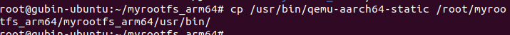
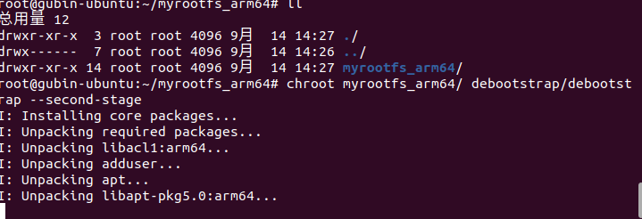
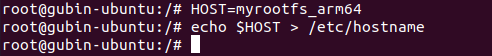

# 实验1-4 基于debootstrap创建基于Ubuntu Linux的根文件系统

## 1 实验目的

通过本实验学习如何创建基于 Ubuntu 发行版的根文件系统。

## 2 实验步骤

​		Ubuntu 系统提供的 debootstrap 工具可以帮助我们快速创建指定架构的根文件系统。本实验要求使用 debootstrap 工具来创建基于 Ubuntu Linux 20.04 系统的根文件系统，并且要求能够在 QEMU + ARM 实验平台上正确挂载和引导系统。

​		注意：本实验需要连接互联网。

​		本实验的主机是安装了 Ubuntu 20.04 系统主机或者虚拟机。

​		在 Ubuntu 系统里有一个 debootstrap 的工具，可以帮助我们快速制作指定架构的根文件系统。debootstrap 命令最早源自 debian 系统，用来引导一个基础 Debian 系统（一种符合 Linux 文件系统标准(FHS)的根文件系统）。

### 1. 安装所需依赖

```sh
sudo apt-get install debian-archive-keyring gcc-aarch64-linux-gnu bison flex bc build-essential libncurses* libssl-dev
```


#### 安装debootstrap工具

```sh
sudo apt-get install qemu qemu-user-static binfmt-support debootstrap
```


### 2. 使用debootstrap命令创建文件系统

使用debootstrap制作根文件系统会分成两个阶段。第一阶段是，使用debootstrap命令来下载软件包。

debootstrap命令基本格式：

    $ sudo debootstrap --arch [平台] [发行版本代号] [构建目录] [镜像地址]


> 当前debootstrap支持的发行版本可以在`/usr/share/debootstrap/scripts`查看。

在自己创建的工作目录下执行以下命令：

    $ sudo su
    $ debootstrap --arch=arm64 --foreign buster myrootfs_arm64 http://mirrors.ustc.edu.cn/debian/


-   –arch：指定要制作文件系统的处理器体系结构，比如arm64
-   buster：：指定Debian的版本。buster是Debian 10系统。
-   myrootfs_arm64 ：本地目录，最后制作好的文件系统会在此目录。本实验使用“linux\_rootfs”目录作为根文件系统目录。
-   –foreign：只执行引导的初始解包阶段，仅仅下载和解压
-   http://mirrors.ustc.edu.cn/debian/： 国内debian镜像源地址 


第二阶段，需要安装软件包。

因为主机跑在[x86架构](https://so.csdn.net/so/search?q=x86%E6%9E%B6%E6%9E%84&spm=1001.2101.3001.7020)上，而我们要制作的文件系统是跑在ARM64上，因此可以使用qemu-aarche64-static来模拟成arm64环境的执行环境。

    cp /usr/bin/qemu-aarch64-static /root/myrootfs_arm64/myrootfs_arm64/usr/bin/

(目录我这里创多了，请自行创建)




下面使用debootstrap命令进行软件包的安装和配置

进入到/root/myrootfs_arm64

    chroot myrootfs_arm64/ debootstrap/debootstrap --second-stage

–second-stage表示执行第二阶段的安装  




显示“I：Base system installed successfully.”说明第二阶段完成。

使用chroot命令切换到刚才制作的根文件系统

```
chroot myrootfs_arm64/
```


配置root用户密码

    # 先设置root用户的密码
    $ passwd root


添加用户及设置密码

    $ USER= xx  #设置你想要的用户名 
    $ useradd -G sudo -m -s /bin/bash $USER 
    $ passwd $USER


设置主机名

    $ HOST= xxxxx  #设置你想要的主机名
    $ echo $HOST > /etc/hostname



设置网络

    $ echo "auto lo" > /etc/network/interfaces
    $ echo "iface lo inet loopback" >> /etc/network/interfaces
    $ echo "allow-hotplug enp0s1" > /etc/network/interfaces
    $ echo "iface enp0s1 inet dhcp" >> /etc/network/interfaces


按照需求安装一些依赖

    $ apt update
    $ apt install net-tools 


以上全部完成后，我们的根文件系统就制作好了，输入exit退出。

    $ exit


### 3. 制作ext4文件系统

首先使用dd命令来创建一个image文件，bs=1M表示block大小，count=2048，表示该image大小为2GB，读者可以根据主机磁盘空间，适当调整该大小，建议不小于2GB。

```
dd if=/dev/zero of=myrootfs_arm64.ext4 bs=1M count=2048
```


使用mkfs.ext4命令来格式化

```
mkfs.ext4 myrootfs_arm64.ext4
```


#### 挂载ext4文件系统并拷贝内容

    $ mkdir -p tmpfs

`mkdir -p` 是一个非常有用的选项，用于一次性创建多层目录结构，并确保没有因为目录已经存在而产生错误。


```
$ mount -t ext4 myrootfs_arm64.ext4 tmpfs/ -o loop
$ cp -af myrootfs_arm64/* tmpfs/
$ umount tmpfs
$ chmod 777 myrootfs_arm64.ext4
```


### 4、编译Linux内核

在官网(https://mirrors.edge.kernel.org/pub/linux/kernel/v5.x/)下载Linux内核文件，我下载的版本是5.15.10，

```
xz linux-5.15.10.tar.xz
tar -xf linux-5.15.10.tar -C /root/myrootfs_arm64
```


解压后执行以下命令：

    $ cd linux-5.15.10/
    $ export ARCH=arm64
    $ export CROSS_COMPILE=aarch64-linux-gnu-
    $ make defconfig
    $ make -j4


编译成功会在`linux-5.15.10`目录下生成`vmlinux`，在`arch/arm64/boot/`目录下生成`Image`文件。


### 5、使用[qemu](https://so.csdn.net/so/search?q=qemu&spm=1001.2101.3001.7020)运行我们刚刚制作的Debian系统

以上步骤执行完毕，工作目录下的文件如图所示： 


在工作目录下执行：

```
$ qemu-system-aarch64 -m 1024 -cpu cortex-a57 -M virt -nographic -smp 4 -kernel linux-5.15.10/arch/arm64/boot/Image -append "noinintrd sched_debug root=/dev/vda rootfstype=ext4 rw crashkernel=256M loglevel=8" -drive if=none,file=myrootfs_arm64.ext4,id=hd0 -device virtio-blk-device,drive=hd0
```

实验手册中是下面这个

    $ qemu-system-aarch64 -m 1024 -cpu cortex-a57 -M virt -nographic -smp 4 -kernel linux-5.15.10/arch/arm64/boot/Image -append "noinintrd sched_debug root=/dev/vda rootfstype=ext4 rw crashkernel=256M loglevel=8" -drive if=none,file=myrootfs_arm64.ext4,id=hd0 -device virtio-blk-device,drive=hd0  -
    -fsdev local,id=kmod_dev,path=./kmodules,security_model=none -device virtio-
    9p-pci,fsdev=kmod_dev,mount_tag=kmod_mount


其中，“-drive if=none,file=myrootfs\_arm64.ext4,id=hd0 -device virtio-blk-device,drive=hd0”添加根文件系统支持。


成功进入系统，我们使用root登录 

密码是之前创建文件系统的root密码


检查网络链接，正常：


使用apt可以正常安装一些软件：


参考链接：  
1、[debootstrap 制作arm64位根文件系统](https://blog.csdn.net/qq_36956154/article/details/100606619)  
2、[debootstrap 制作根文件系统](https://www.cnblogs.com/huaibovip/p/debootstrap-fs.html)  
3、[ubuntu根文件系统构造](https://www.jianshu.com/p/9f51411ca624)  
4、实验指导手册-奔跑吧Linux内核入门篇第二版


## 参考

[Ubuntu 20.04使用qemu搭建ARM64 Linux系统_ubuntu20.04 qemu搭建开发环境arm64-CSDN博客](