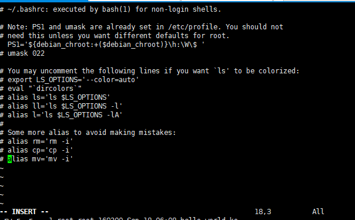
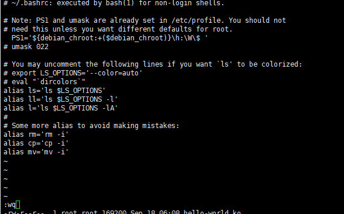
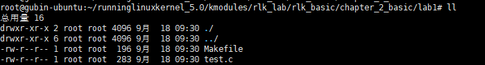
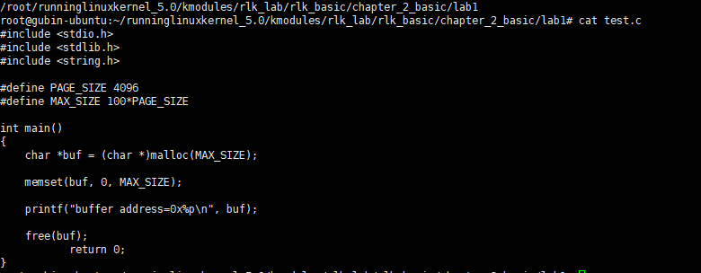
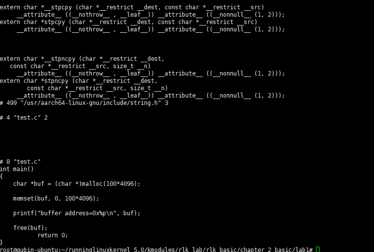
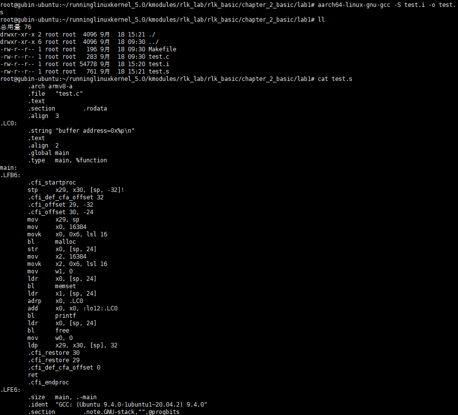
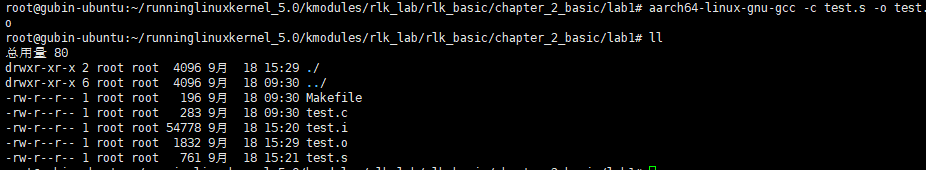
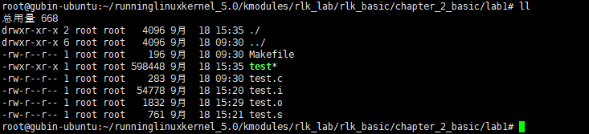
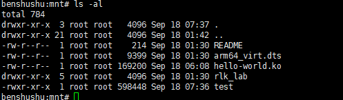
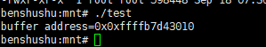

# 2.1 实验 2-1：GCC 编译

## 1．实验目的

1）熟悉 GCC 的编译过程，学会使用 ARM GCC 交叉工具链编译应用程序并放入QEMU 上运行。

2）学会写简单的 Makefile。

## 2．实验详解

​		本实验通过一个简单的 C 语言程序代码演示 GCC 的编译过程。下面是一个简单的 test.c 的程序代码。

```C
#include <stdio.h>
#include <stdlib.h>
#include <string.h>
#define PAGE_SIZE 4096
#define MAX_SIZE 100*PAGE_SIZE
int main()
{
	char *buf = (char *)malloc(MAX_SIZE);
 	memset(buf, 0, MAX_SIZE);
 	printf("buffer address=0x%p\n", buf);
 	free(buf);
 	return 0;
}
```

PS:我将在qemu虚拟机中 /mnt/rlk_lab/rlk_basic/chapter_2_basic进行快速实验

准备：ll并不是linux下一个基本的命令，它实际上是ls -l的一个别名。

Ubuntu默认不支持命令ll，必须用 ls -l，这样使用起来不是很方便。

如果要使用此命令，可以作如下修改：
打开 ~/.bashrc
找到 #alias ll=’ls -l’，去掉前面的#就可以了。（关闭原来的终端才能使命令生效）
这样个人用户可以使用ll命令，当切换成超级用户后，使用ll命令时提示找不到命令，那是因为你只是修改了个人用户的配置，所以，切换成root后做相同的操作即可解决问题。

启示：我们可以通过修改~/.bashrc添加任何其他的命令别名。

操作如下：

vim ~/.bashrc 编辑文件   加入

```
alias ll='ls -l'
```





```
source ~/.bashrc
```


开始





1）预处理。

​		GCC 的“-E”选项可以让编译器在预处理阶段就结束，选项“-o”可以指定输出的文件格式。

```sh
aarch64-linux-gnu-gcc -E test.c -o test.i
```

​		之前创建的qemu虚拟机是基于arm64架构的，但我们现在是在x86的ubuntu中运行的，使用交叉编译。		

​		补充：**aarch64-linux-gnu-gcc是一个交叉编译器**，它属于GNU Compiler Collection (GCC) 的一部分，专门用于在aarch64架构的Linux系统上编译C代码。aarch64是随ARMv8指令集架构（ISA）一起引入的64位架构，用于执行A64指令的计算机。在AArch64状态下执行的代码只能使用A64指令集，而不能执行A32或T32指令。不过，与AArch32中不同，在64位状态下，指令可以访问64位和32位寄存器。

##### 主要特点和用途

- **交叉编译**：aarch64-linux-gnu-gcc是一个交叉编译工具链，这意味着它可以在其他架构（如x86）的系统中编译出针对aarch64架构的可执行文件和库文件。这种特性使得它特别适用于嵌入式代码的移植和开发。
- **广泛支持**：它可用于交叉编译ARMv8 64位目标中的多种程序，包括裸机程序、u-boot、Linux kernel、filesystem以及App应用程序。
- **安装要求**：aarch64-linux-gnu-gcc交叉编译器必须安装在64位主机上，才能编译目标代码。

##### 安装方式

安装aarch64-linux-gnu-gcc的方式有多种，以下是一些常见的安装方法：

1. **从源代码编译**：用户可以从GCC的官方网站下载源代码，然后按照特定的步骤进行编译和安装。这种方法需要用户具备一定的编译和安装经验。
2. **使用预编译的二进制包**：许多Linux发行版提供了预编译的aarch64-linux-gnu-gcc二进制包，用户可以通过包管理器（如apt、yum等）直接安装。这种方法相对简单快捷，适合大多数用户。
3. **从Linaro或ARM官网下载**：Linaro和ARM公司都提供了针对aarch64架构的交叉编译工具链，用户可以从它们的官方网站下载并安装。这些工具链通常包含了aarch64-linux-gnu-gcc以及其他相关的编译和调试工具。

##### 注意事项

- 在安装过程中，用户需要确保下载的版本与硬件架构、系统版本相符。
- 如果在安装过程中遇到问题，建议查看官方文档或相关论坛以获取更多帮助。

综上所述，aarch64-linux-gnu-gcc是一个功能强大的交叉编译器，它为用户提供了在不同架构之间编译和移植代码的能力。通过合理的安装和使用，用户可以充分发挥其优势，提高开发效率。


​		预处理阶段会把 C 标准库的头文件中的代码包含到这段程序中。test.i 文件的内容如下所示。

```
extern void *malloc (size_t __size) __attribute__ ((__nothrow__ , __leaf__)) 
__attribute__ ((__malloc__)) ;
…
int main()
{
char *buf = (char *)malloc(100*4096);
memset(buf, 0, 100*4096);
printf("buffer address=0x%p\n", buf);
free(buf);
 return 0;
}
```



下面是您提供的代码的整理版，包括了一些格式上的改进和注释的添加，以提高代码的可读性：

```C
#include <stdio.h>  
#include <stdlib.h>  
#include <string.h> // 引入memset函数所需的头文件  
  
// 注意：这里的外部声明通常不需要在用户的源文件中定义，除非有特定的理由。  
// 它通常在stdlib.h中定义。但为了与您的示例保持一致，这里保留了声明。  
extern void *malloc(size_t __size) __attribute__((__nothrow__, __leaf__)) __attribute__((__malloc__));  
  
int main() {  
    // 分配一块足够大的内存区域，大小为100个4096字节的块（即400KB）  
    char *buf = (char *)malloc(100 * 4096);  
      
    // 检查malloc是否成功分配内存  
    if (buf == NULL) {  
        fprintf(stderr, "Failed to allocate memory\n");  
        return 1; // 如果分配失败，则返回1  
    }  
  
    // 使用memset将分配的内存区域全部初始化为0  
    memset(buf, 0, 100 * 4096);  
  
    // 打印分配的内存区域的地址  
    printf("buffer address=0x%p\n", (void*)buf); // 使用%p打印指针时，应将其强制转换为(void*)  
  
    // 释放之前分配的内存  
    free(buf);  
  
    return 0;  
}
```

2）编译。

​		编译阶段主要是对预处理好的.i 文件进行编译，并生成汇编代码。GCC 首先检查代码是否有语法错误等，然后把代码编译成汇编代码。我们这里使用“-S”选项来编译。

```sh
$ aarch64-linux-gnu-gcc -S test.i -o test.s
```

​		编译阶段生成的汇编代码如下。

```
.arch armv8-a
.file "test.c"
.text
.section .rodata
.align 3
.LC0:
    .string "buffer address=0x%p\n"
.text
.align 2
.global main
.type main, %function
main:
.LFB6:
    .cfi_startproc
    stp     x29, x30, [sp, -32]!       // 保存 x29 和 x30 寄存器到栈
    .cfi_def_cfa_offset 32
    .cfi_offset 29, -32
    .cfi_offset 30, -24
    mov     x29, sp                    // 设置栈帧指针
    mov     x0, 16384                  // 设置 x0 为 16384
    movk    x0, 0x6, lsl 16            // 将 x0 移位并设置高位值
    bl      malloc                     // 调用 malloc 分配内存
    str     x0, [sp, 24]               // 保存返回的指针到栈
    mov     x2, 16384                  // 设置 x2 为 16384
    movk    x2, 0x6, lsl 16            // 将 x2 移位并设置高位值
    mov     w1, 0                      // 设置 w1 为 0
    ldr     x0, [sp, 24]               // 从栈中读取指针
    bl      memset                     // 调用 memset 初始化内存
    ldr     x1, [sp, 24]               // 从栈中读取指针到 x1
    adrp    x0, .LC0                   // 加载字符串地址到 x0
    add     x0, x0, :lo12:.LC0         // 加载字符串的低 12 位地址到 x0
    bl      printf                     // 调用 printf 打印内存地址
    ldr     x0, [sp, 24]               // 从栈中读取指针
    bl      free                       // 调用 free 释放内存
    mov     w0, 0                      // 设置返回值 w0 为 0
    ldp     x29, x30, [sp], 32         // 恢复 x29 和 x30 寄存器
    .cfi_restore 30
    .cfi_restore 29
    .cfi_def_cfa_offset 0
    ret                                // 返回
    .cfi_endproc
.LFE6:
    .size main, .-main
.ident "GCC: (Ubuntu 9.3.0-10ubuntu1) 9.3.0"
.section .note.GNU-stack,"",@progbits

```



3）汇编。

​		汇编阶段是将汇编文件转化成二进制文件，利用“-c”选项就可以生成二进制文件。

```
$ aarch64-linux-gnu-gcc -c test.s -o test.o
```



二进制文件，不好用cat查看

4）链接。

​		链接阶段会对编译好的二进制文件进行链接，这里会默认链接 C 语言标准库（libc）。我们的代码里调用的 malloc()、memset()以及 printf()等函数都由 C 语言标准库提供，链接过程会把程序的目标文件和所需的库文件链接起来，最终生成可执行文件。

​		Linux 的库文件分成两大类：一类是动态链接库（通常以.so 结尾），另一类是静态链接库（通常以.a 结尾）。在默认情况下，GCC 在链接时优先使用动态链接库，只有当动态链接库不存在时才使用静态链接库。下面使用“--static”来让 test 程序静态链接 C 语言标准库，原因是交叉工具链使用的 libc 的动态库和 QEMU 中使用的库可能不一样。如果使用动态链接，可能导致运行报错。

```
$ aarch64-linux-gnu-gcc test.o -o test --static
```

​		

​		以 ARM64 GCC 交叉工具链为例，C 函数库动态库的目录在/usr/aarch64-linux-gnu/lib 里，最终的库文件是 libc-2.23.so 文件。

```
$ ls -l /usr/aarch64-linux-gnu/lib/libc.so.6
lrwxrwxrwx 1 root root 12 4月 3 2020 /usr/aarch64-linux-gnu/lib/libc.so.6 
-> libc-2.31.so
```

​		C 语言标准库的静态库地址如下。

```
$ ls -l /usr/aarch64-linux-gnu/lib/libc.a
-rw-r--r-- 1 root root 4576436 4月 3 2020 /usr/aarch64-linux-gnu/lib/libc.a
```

5）放到 QEMU 上运行。

​		把 test 程序放入 runninglinuxkernel_5.0/kmodules 目录里，启动 QEMU 并运行 test程序。

```
cp test /root/runninglinuxkernel_5.0/kmodules/
```



```
benshushu: mnt# ./test
buffer address=0x0xffff8ca45010
```



6）编写一个简单的 Makefile 文件来编译。

```makefile
cc = aarch64-linux-gnu-gcc
prom = test
obj = test.o
CFLAGS = -static

$(prom): $(obj)
	$(cc) -o $(prom) $(obj) $(CFLAGS)

%.o: %.c 
	$(cc) -c $< -o $@

clean:
	rm -rf $(obj) $(prom)

```

实验结束
