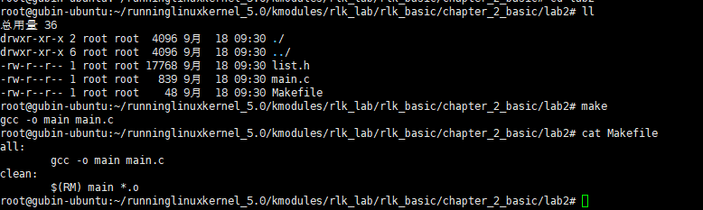
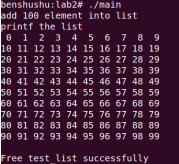
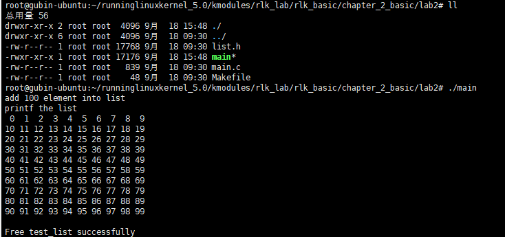

# 实验 2-2：内核链表

## 一．实验目的

1）学会和研究 Linux 内核提供的链表机制。

2）编写一个应用程序，利用内核提供的链表机制创建一个链表，把 100 个数字

添加到链表中，循环该链表输出所有成员的数值。

## 二．实验详解

​		Linux 内核链表提供的函数接口定义在 include/linux/list.h 文件中。本实验把这些

接口函数移植到用户空间中，并使用它们完成链表的操作。

### 1.启动 QEMU+runninglinuxkernel

```
./run_rlk_arm64.sh run
```

### 2.进入本实验的参考代码。

```
# /mnt/rlk_lab/rlk_basic/chapter_2_basic/lab2
```

#### lish.h

```C
#ifndef _LINUX_LIST_H
#define _LINUX_LIST_H

#define POISON_POINTER_DELTA  0xdead000000000000
#define LIST_POISON1  ((void *) 0x100 + POISON_POINTER_DELTA)
#define LIST_POISON2  ((void *) 0x200 + POISON_POINTER_DELTA)

struct list_head {
	struct list_head *next, *prev;
};

#define offsetof(TYPE, MEMBER) ((size_t) &((TYPE *)0)->MEMBER)

#define container_of(ptr, type, member) ({                      \
        const typeof( ((type *)0)->member ) *__mptr = (ptr);    \
        (type *)( (char *)__mptr - offsetof(type,member) );})

/*
 * Simple doubly linked list implementation.
 *
 * Some of the internal functions ("__xxx") are useful when
 * manipulating whole lists rather than single entries, as
 * sometimes we already know the next/prev entries and we can
 * generate better code by using them directly rather than
 * using the generic single-entry routines.
 */

#define LIST_HEAD_INIT(name) { &(name), &(name) }

#define LIST_HEAD(name) \
	struct list_head name = LIST_HEAD_INIT(name)

static inline void INIT_LIST_HEAD(struct list_head *list)
{
	list->next = list;
	list->prev = list;
}

/*
 * Insert a new entry between two known consecutive entries.
 *
 * This is only for internal list manipulation where we know
 * the prev/next entries already!
 */
#ifndef CONFIG_DEBUG_LIST
static inline void __list_add(struct list_head *new,
			      struct list_head *prev,
			      struct list_head *next)
{
	next->prev = new;
	new->next = next;
	new->prev = prev;
	prev->next = new;
}
#else
extern void __list_add(struct list_head *new,
			      struct list_head *prev,
			      struct list_head *next);
#endif

/**
 * list_add - add a new entry
 * @new: new entry to be added
 * @head: list head to add it after
 *
 * Insert a new entry after the specified head.
 * This is good for implementing stacks.
 */
static inline void list_add(struct list_head *new, struct list_head *head)
{
	__list_add(new, head, head->next);
}


/**
 * list_add_tail - add a new entry
 * @new: new entry to be added
 * @head: list head to add it before
 *
 * Insert a new entry before the specified head.
 * This is useful for implementing queues.
 */
static inline void list_add_tail(struct list_head *new, struct list_head *head)
{
	__list_add(new, head->prev, head);
}

/*
 * Delete a list entry by making the prev/next entries
 * point to each other.
 *
 * This is only for internal list manipulation where we know
 * the prev/next entries already!
 */
static inline void __list_del(struct list_head * prev, struct list_head * next)
{
	next->prev = prev;
	prev->next = next;
}

/**
 * list_del - deletes entry from list.
 * @entry: the element to delete from the list.
 * Note: list_empty() on entry does not return true after this, the entry is
 * in an undefined state.
 */
#ifndef CONFIG_DEBUG_LIST
static inline void __list_del_entry(struct list_head *entry)
{
	__list_del(entry->prev, entry->next);
}

static inline void list_del(struct list_head *entry)
{
	__list_del(entry->prev, entry->next);
	entry->next = LIST_POISON1;
	entry->prev = LIST_POISON2;
}
#else
extern void __list_del_entry(struct list_head *entry);
extern void list_del(struct list_head *entry);
#endif

/**
 * list_replace - replace old entry by new one
 * @old : the element to be replaced
 * @new : the new element to insert
 *
 * If @old was empty, it will be overwritten.
 */
static inline void list_replace(struct list_head *old,
				struct list_head *new)
{
	new->next = old->next;
	new->next->prev = new;
	new->prev = old->prev;
	new->prev->next = new;
}

static inline void list_replace_init(struct list_head *old,
					struct list_head *new)
{
	list_replace(old, new);
	INIT_LIST_HEAD(old);
}

/**
 * list_del_init - deletes entry from list and reinitialize it.
 * @entry: the element to delete from the list.
 */
static inline void list_del_init(struct list_head *entry)
{
	__list_del_entry(entry);
	INIT_LIST_HEAD(entry);
}

/**
 * list_move - delete from one list and add as another's head
 * @list: the entry to move
 * @head: the head that will precede our entry
 */
static inline void list_move(struct list_head *list, struct list_head *head)
{
	__list_del_entry(list);
	list_add(list, head);
}

/**
 * list_move_tail - delete from one list and add as another's tail
 * @list: the entry to move
 * @head: the head that will follow our entry
 */
static inline void list_move_tail(struct list_head *list,
				  struct list_head *head)
{
	__list_del_entry(list);
	list_add_tail(list, head);
}

/**
 * list_is_last - tests whether @list is the last entry in list @head
 * @list: the entry to test
 * @head: the head of the list
 */
static inline int list_is_last(const struct list_head *list,
				const struct list_head *head)
{
	return list->next == head;
}

/**
 * list_empty - tests whether a list is empty
 * @head: the list to test.
 */
static inline int list_empty(const struct list_head *head)
{
	return head->next == head;
}

/**
 * list_empty_careful - tests whether a list is empty and not being modified
 * @head: the list to test
 *
 * Description:
 * tests whether a list is empty _and_ checks that no other CPU might be
 * in the process of modifying either member (next or prev)
 *
 * NOTE: using list_empty_careful() without synchronization
 * can only be safe if the only activity that can happen
 * to the list entry is list_del_init(). Eg. it cannot be used
 * if another CPU could re-list_add() it.
 */
static inline int list_empty_careful(const struct list_head *head)
{
	struct list_head *next = head->next;
	return (next == head) && (next == head->prev);
}

/**
 * list_rotate_left - rotate the list to the left
 * @head: the head of the list
 */
static inline void list_rotate_left(struct list_head *head)
{
	struct list_head *first;

	if (!list_empty(head)) {
		first = head->next;
		list_move_tail(first, head);
	}
}

/**
 * list_is_singular - tests whether a list has just one entry.
 * @head: the list to test.
 */
static inline int list_is_singular(const struct list_head *head)
{
	return !list_empty(head) && (head->next == head->prev);
}

static inline void __list_cut_position(struct list_head *list,
		struct list_head *head, struct list_head *entry)
{
	struct list_head *new_first = entry->next;
	list->next = head->next;
	list->next->prev = list;
	list->prev = entry;
	entry->next = list;
	head->next = new_first;
	new_first->prev = head;
}

/**
 * list_cut_position - cut a list into two
 * @list: a new list to add all removed entries
 * @head: a list with entries
 * @entry: an entry within head, could be the head itself
 *	and if so we won't cut the list
 *
 * This helper moves the initial part of @head, up to and
 * including @entry, from @head to @list. You should
 * pass on @entry an element you know is on @head. @list
 * should be an empty list or a list you do not care about
 * losing its data.
 *
 */
static inline void list_cut_position(struct list_head *list,
		struct list_head *head, struct list_head *entry)
{
	if (list_empty(head))
		return;
	if (list_is_singular(head) &&
		(head->next != entry && head != entry))
		return;
	if (entry == head)
		INIT_LIST_HEAD(list);
	else
		__list_cut_position(list, head, entry);
}

static inline void __list_splice(const struct list_head *list,
				 struct list_head *prev,
				 struct list_head *next)
{
	struct list_head *first = list->next;
	struct list_head *last = list->prev;

	first->prev = prev;
	prev->next = first;

	last->next = next;
	next->prev = last;
}

/**
 * list_splice - join two lists, this is designed for stacks
 * @list: the new list to add.
 * @head: the place to add it in the first list.
 */
static inline void list_splice(const struct list_head *list,
				struct list_head *head)
{
	if (!list_empty(list))
		__list_splice(list, head, head->next);
}

/**
 * list_splice_tail - join two lists, each list being a queue
 * @list: the new list to add.
 * @head: the place to add it in the first list.
 */
static inline void list_splice_tail(struct list_head *list,
				struct list_head *head)
{
	if (!list_empty(list))
		__list_splice(list, head->prev, head);
}

/**
 * list_splice_init - join two lists and reinitialise the emptied list.
 * @list: the new list to add.
 * @head: the place to add it in the first list.
 *
 * The list at @list is reinitialised
 */
static inline void list_splice_init(struct list_head *list,
				    struct list_head *head)
{
	if (!list_empty(list)) {
		__list_splice(list, head, head->next);
		INIT_LIST_HEAD(list);
	}
}

/**
 * list_splice_tail_init - join two lists and reinitialise the emptied list
 * @list: the new list to add.
 * @head: the place to add it in the first list.
 *
 * Each of the lists is a queue.
 * The list at @list is reinitialised
 */
static inline void list_splice_tail_init(struct list_head *list,
					 struct list_head *head)
{
	if (!list_empty(list)) {
		__list_splice(list, head->prev, head);
		INIT_LIST_HEAD(list);
	}
}

/**
 * list_entry - get the struct for this entry
 * @ptr:	the &struct list_head pointer.
 * @type:	the type of the struct this is embedded in.
 * @member:	the name of the list_head within the struct.
 */
#define list_entry(ptr, type, member) \
	container_of(ptr, type, member)

/**
 * list_first_entry - get the first element from a list
 * @ptr:	the list head to take the element from.
 * @type:	the type of the struct this is embedded in.
 * @member:	the name of the list_head within the struct.
 *
 * Note, that list is expected to be not empty.
 */
#define list_first_entry(ptr, type, member) \
	list_entry((ptr)->next, type, member)

/**
 * list_last_entry - get the last element from a list
 * @ptr:	the list head to take the element from.
 * @type:	the type of the struct this is embedded in.
 * @member:	the name of the list_head within the struct.
 *
 * Note, that list is expected to be not empty.
 */
#define list_last_entry(ptr, type, member) \
	list_entry((ptr)->prev, type, member)

/**
 * list_first_entry_or_null - get the first element from a list
 * @ptr:	the list head to take the element from.
 * @type:	the type of the struct this is embedded in.
 * @member:	the name of the list_head within the struct.
 *
 * Note that if the list is empty, it returns NULL.
 */
#define list_first_entry_or_null(ptr, type, member) \
	(!list_empty(ptr) ? list_first_entry(ptr, type, member) : NULL)

/**
 * list_next_entry - get the next element in list
 * @pos:	the type * to cursor
 * @member:	the name of the list_head within the struct.
 */
#define list_next_entry(pos, member) \
	list_entry((pos)->member.next, typeof(*(pos)), member)

/**
 * list_prev_entry - get the prev element in list
 * @pos:	the type * to cursor
 * @member:	the name of the list_head within the struct.
 */
#define list_prev_entry(pos, member) \
	list_entry((pos)->member.prev, typeof(*(pos)), member)

/**
 * list_for_each	-	iterate over a list
 * @pos:	the &struct list_head to use as a loop cursor.
 * @head:	the head for your list.
 */
#define list_for_each(pos, head) \
	for (pos = (head)->next; pos != (head); pos = pos->next)

/**
 * list_for_each_prev	-	iterate over a list backwards
 * @pos:	the &struct list_head to use as a loop cursor.
 * @head:	the head for your list.
 */
#define list_for_each_prev(pos, head) \
	for (pos = (head)->prev; pos != (head); pos = pos->prev)

/**
 * list_for_each_safe - iterate over a list safe against removal of list entry
 * @pos:	the &struct list_head to use as a loop cursor.
 * @n:		another &struct list_head to use as temporary storage
 * @head:	the head for your list.
 */
#define list_for_each_safe(pos, n, head) \
	for (pos = (head)->next, n = pos->next; pos != (head); \
		pos = n, n = pos->next)

/**
 * list_for_each_prev_safe - iterate over a list backwards safe against removal of list entry
 * @pos:	the &struct list_head to use as a loop cursor.
 * @n:		another &struct list_head to use as temporary storage
 * @head:	the head for your list.
 */
#define list_for_each_prev_safe(pos, n, head) \
	for (pos = (head)->prev, n = pos->prev; \
	     pos != (head); \
	     pos = n, n = pos->prev)

/**
 * list_for_each_entry	-	iterate over list of given type
 * @pos:	the type * to use as a loop cursor.
 * @head:	the head for your list.
 * @member:	the name of the list_head within the struct.
 */
#define list_for_each_entry(pos, head, member)				\
	for (pos = list_first_entry(head, typeof(*pos), member);	\
	     &pos->member != (head);					\
	     pos = list_next_entry(pos, member))

/**
 * list_for_each_entry_reverse - iterate backwards over list of given type.
 * @pos:	the type * to use as a loop cursor.
 * @head:	the head for your list.
 * @member:	the name of the list_head within the struct.
 */
#define list_for_each_entry_reverse(pos, head, member)			\
	for (pos = list_last_entry(head, typeof(*pos), member);		\
	     &pos->member != (head); 					\
	     pos = list_prev_entry(pos, member))

/**
 * list_prepare_entry - prepare a pos entry for use in list_for_each_entry_continue()
 * @pos:	the type * to use as a start point
 * @head:	the head of the list
 * @member:	the name of the list_head within the struct.
 *
 * Prepares a pos entry for use as a start point in list_for_each_entry_continue().
 */
#define list_prepare_entry(pos, head, member) \
	((pos) ? : list_entry(head, typeof(*pos), member))

/**
 * list_for_each_entry_continue - continue iteration over list of given type
 * @pos:	the type * to use as a loop cursor.
 * @head:	the head for your list.
 * @member:	the name of the list_head within the struct.
 *
 * Continue to iterate over list of given type, continuing after
 * the current position.
 */
#define list_for_each_entry_continue(pos, head, member) 		\
	for (pos = list_next_entry(pos, member);			\
	     &pos->member != (head);					\
	     pos = list_next_entry(pos, member))

/**
 * list_for_each_entry_continue_reverse - iterate backwards from the given point
 * @pos:	the type * to use as a loop cursor.
 * @head:	the head for your list.
 * @member:	the name of the list_head within the struct.
 *
 * Start to iterate over list of given type backwards, continuing after
 * the current position.
 */
#define list_for_each_entry_continue_reverse(pos, head, member)		\
	for (pos = list_prev_entry(pos, member);			\
	     &pos->member != (head);					\
	     pos = list_prev_entry(pos, member))

/**
 * list_for_each_entry_from - iterate over list of given type from the current point
 * @pos:	the type * to use as a loop cursor.
 * @head:	the head for your list.
 * @member:	the name of the list_head within the struct.
 *
 * Iterate over list of given type, continuing from current position.
 */
#define list_for_each_entry_from(pos, head, member) 			\
	for (; &pos->member != (head);					\
	     pos = list_next_entry(pos, member))

/**
 * list_for_each_entry_safe - iterate over list of given type safe against removal of list entry
 * @pos:	the type * to use as a loop cursor.
 * @n:		another type * to use as temporary storage
 * @head:	the head for your list.
 * @member:	the name of the list_head within the struct.
 */
#define list_for_each_entry_safe(pos, n, head, member)			\
	for (pos = list_first_entry(head, typeof(*pos), member),	\
		n = list_next_entry(pos, member);			\
	     &pos->member != (head); 					\
	     pos = n, n = list_next_entry(n, member))

/**
 * list_for_each_entry_safe_continue - continue list iteration safe against removal
 * @pos:	the type * to use as a loop cursor.
 * @n:		another type * to use as temporary storage
 * @head:	the head for your list.
 * @member:	the name of the list_head within the struct.
 *
 * Iterate over list of given type, continuing after current point,
 * safe against removal of list entry.
 */
#define list_for_each_entry_safe_continue(pos, n, head, member) 		\
	for (pos = list_next_entry(pos, member), 				\
		n = list_next_entry(pos, member);				\
	     &pos->member != (head);						\
	     pos = n, n = list_next_entry(n, member))

/**
 * list_for_each_entry_safe_from - iterate over list from current point safe against removal
 * @pos:	the type * to use as a loop cursor.
 * @n:		another type * to use as temporary storage
 * @head:	the head for your list.
 * @member:	the name of the list_head within the struct.
 *
 * Iterate over list of given type from current point, safe against
 * removal of list entry.
 */
#define list_for_each_entry_safe_from(pos, n, head, member) 			\
	for (n = list_next_entry(pos, member);					\
	     &pos->member != (head);						\
	     pos = n, n = list_next_entry(n, member))

/**
 * list_for_each_entry_safe_reverse - iterate backwards over list safe against removal
 * @pos:	the type * to use as a loop cursor.
 * @n:		another type * to use as temporary storage
 * @head:	the head for your list.
 * @member:	the name of the list_head within the struct.
 *
 * Iterate backwards over list of given type, safe against removal
 * of list entry.
 */
#define list_for_each_entry_safe_reverse(pos, n, head, member)		\
	for (pos = list_last_entry(head, typeof(*pos), member),		\
		n = list_prev_entry(pos, member);			\
	     &pos->member != (head); 					\
	     pos = n, n = list_prev_entry(n, member))

/**
 * list_safe_reset_next - reset a stale list_for_each_entry_safe loop
 * @pos:	the loop cursor used in the list_for_each_entry_safe loop
 * @n:		temporary storage used in list_for_each_entry_safe
 * @member:	the name of the list_head within the struct.
 *
 * list_safe_reset_next is not safe to use in general if the list may be
 * modified concurrently (eg. the lock is dropped in the loop body). An
 * exception to this is if the cursor element (pos) is pinned in the list,
 * and list_safe_reset_next is called after re-taking the lock and before
 * completing the current iteration of the loop body.
 */
#define list_safe_reset_next(pos, n, member)				\
	n = list_next_entry(pos, member)

#endif

```

#### main.c

```C
#include <stdio.h>
#include <stdlib.h>
#include <time.h>

#include "list.h"

struct num {
	int i;
	struct list_head list;
};

int main(int argc, char **argv) {
	LIST_HEAD(test_list);
	int i;
	struct num *num;
	struct num *num1;

	srand((unsigned)time(NULL));

	/* Add */	
	printf("add 100 element into list\n");
	for (i = 0; i < 100; i++) {
		num = (struct num*)malloc(sizeof(struct num));
		num->i = i;
		list_add_tail(&num->list, &test_list);
	}

	i = 0;
	/* print list */
	printf("printf the list\n");
	list_for_each_entry(num, &test_list, list) {
		printf("%2d ", num->i);
		if ((i+1)%10 == 0)
			printf("\n");
		i++;
	}
	printf("\n");

	/* Delete */
	list_for_each_entry_safe(num, num1, &test_list, list) {
		list_del(&num->list);
		free(num);
	}

	if (list_empty(&test_list))
		printf("Free test_list successfully\n");

	return 0;
}

```


### 3.编译代码

```
 make
```




#### 补充：

​		当你输入`make`时，`make`工具会在当前目录下查找名为`Makefile`（或者`makefile`，不区分大小写）的文件，并根据该文件中的指令来执行构建过程。

​		在你的`Makefile`中，定义了两个目标（target）：`all`和`clean`。不过，`Makefile`中并没有明确指定默认目标（虽然通常习惯上将第一个目标作为默认目标，但在没有明确使用`.DEFAULT_GOAL`伪目标指定的情况下，这个行为可能会根据`make`的版本和配置有所不同）。然而，按照惯例和大多数`make`工具的实现，如果没有明确指定目标，`make`会尝试构建名为`all`的第一个目标（如果它存在的话），因此在这个例子中，`make`会执行`all`目标下的指令。

`all`目标下的指令是：

```bash
gcc -o main main.c
```

​		这条指令的作用是使用`gcc`（GNU Compiler Collection，GNU编译器套件）编译器编译`main.c`源文件，并将生成的可执行文件命名为`main`。如果没有错误发生，这条指令会生成一个名为`main`的可执行文件。

​		总结来说，当你输入`make`时，它会在你的`Makefile`中找到并执行`all`目标下的指令，即编译`main.c`源文件并生成`main`可执行文件。

​		如果你想要执行`clean`目标下的指令（删除`main`可执行文件和所有的`.o`文件），你需要明确指定`clean`作为目标，即输入：

```bash
make clean
```

## 4.运行

```
./main
```



