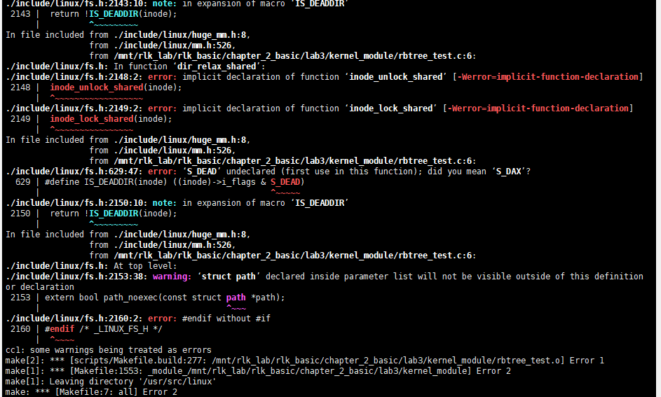

# 实验 2-3：红黑树

## 1．实验目的

1）学习和研究 Linux 内核提供的红黑树机制。

2）编写一个应用程序，利用内核提供的红黑树机制创建一棵树，把 10 000 个随机数添加到红黑树中。

3）实现一个查找函数，快速在这棵红黑树中查找到相应的数字。

## 2．实验详解

​		Linux 内核提供的红黑树机制实现在 lib/rbtree.c 和 include/linux/rbtree.h 文件中。本实验要求把 Linux 内核实现的红黑树机制移植到用户空间，并且实现 10 000 个随机数的插入和查找功能。

本实验有两个参考代码，一个是运行在用户空间的参考代码，另外一个是运行在内核空间的参考代码。

下面是用户空间的参考代码示例。

1.启动 QEMU+runninglinuxkernel

```
$./run_rlk_arm64.sh run
```

2.进入本实验的参考代码。

```
#/mnt/rlk_lab/rlk_basic/chapter_2_basic/lab3/user_app
```


3.编译代码

```
#make
```

4.运行。我们输入“7”来查找“7”是否在红黑树中。


下面是内核空间参考代码的示例。

1.启动QEMU+runninglinuxkernel

```
$./run_rlk_arm64.sh run
```

2.进入本实验的参考代码。

```
#/mnt/rlk_lab/rlk_basic/chapter_2_basic/lab3/kernel_module
```

3.编译代码

```
#make
```


4.运行。我们输入“7”来查找“7”是否在红黑树中。


## 第二部分实验

下面是内核空间参考代码的示例。

1.启动QEMU+runninglinuxkernel

```
$./run_rlk_arm64.sh run
```

2.进入本实验的参考代码。

```
#/mnt/rlk_lab/rlk_basic/chapter_2_basic/lab3/kernel_module
```


3.编译代码

```
#make
```

#### rbtree_test.c

```
#include <linux/init.h>
#include <linux/list.h>
#include <linux/module.h>
#include <linux/kernel.h>
#include <linux/slab.h>
#include <linux/mm.h>
#include <linux/rbtree.h>

MODULE_AUTHOR("Benshushu");
MODULE_DESCRIPTION(" ");
MODULE_LICENSE("GPL");

struct mytype { 
  	struct rb_node node;
  	int key; 
};

 struct rb_root mytree = RB_ROOT;

struct mytype *my_search(struct rb_root *root, int new)
  {
  	struct rb_node *node = root->rb_node;

  	while (node) {
  		struct mytype *data = container_of(node, struct mytype, node);

		if (data->key > new)
  			node = node->rb_left;
		else if (data->key < new)
  			node = node->rb_right;
		else
  			return data;
	}
	return NULL;
  }
  
  int my_insert(struct rb_root *root, struct mytype *data)
  {
  	struct rb_node **new = &(root->rb_node), *parent=NULL;
	
  	/* Figure out where to put new node */
  	while (*new) {
  		struct mytype *this = container_of(*new, struct mytype, node);
		
		parent = *new;
  		if (this->key > data->key)
  			new = &((*new)->rb_left);
  		else if (this->key < data->key) {
  			new = &((*new)->rb_right);
		} else
  			return -1;
  	}
	
  	/* Add new node and rebalance tree. */
  	rb_link_node(&data->node, parent, new);
  	rb_insert_color(&data->node, root);

	return 0;
  }


static int __init my_init(void)
{
	int i;
	struct mytype *data;
	struct rb_node *node;
	for (i =0; i < 20; i+=2) {
		data = kmalloc(sizeof(struct mytype), GFP_KERNEL);
		data->key = i;
		my_insert(&mytree, data);
	}
	
	/*list all tree*/
     for (node = rb_first(&mytree); node; node = rb_next(node)) 
		printk("key=%d\n", rb_entry(node, struct mytype, node)->key);
		
	return 0;
}

static void __exit my_exit(void)
{
	struct mytype *data;
	struct rb_node *node;
	for (node = rb_first(&mytree); node; ) {
		data = rb_entry(node, struct mytype, node);
		node = rb_next(node);
		if (data) {
		  	rb_erase(&data->node, &mytree);
			printk("erase key=%d\n", data->key);
			kfree(data);
		}
	}
}
module_init(my_init);
module_exit(my_exit);

```

### Makefile

```
BASEINCLUDE ?= /lib/modules/`uname -r`/build

rb_test-objs := rbtree_test.o 

obj-m	:=   rb_test.o
all : 
	$(MAKE) -C $(BASEINCLUDE) M=$(PWD) modules;

clean:
	$(MAKE) -C $(BASEINCLUDE) M=$(PWD) clean;
	rm -f *.ko;

```

产生了很多后缀为.mod和.c的文件，以及rb_test.ko


但是在qemu中实验出现很多错误




4.运行。

```
#insmod rb_test.ko
```


实验时发现没有出现一些东西

==实验失败==


## 问题

经常出现崩溃的事情


暂时回到git仓库去进行实验。