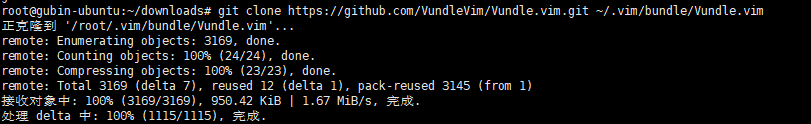
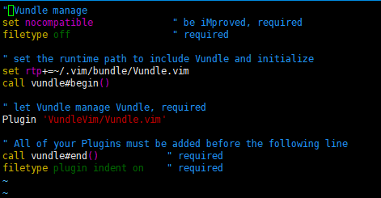
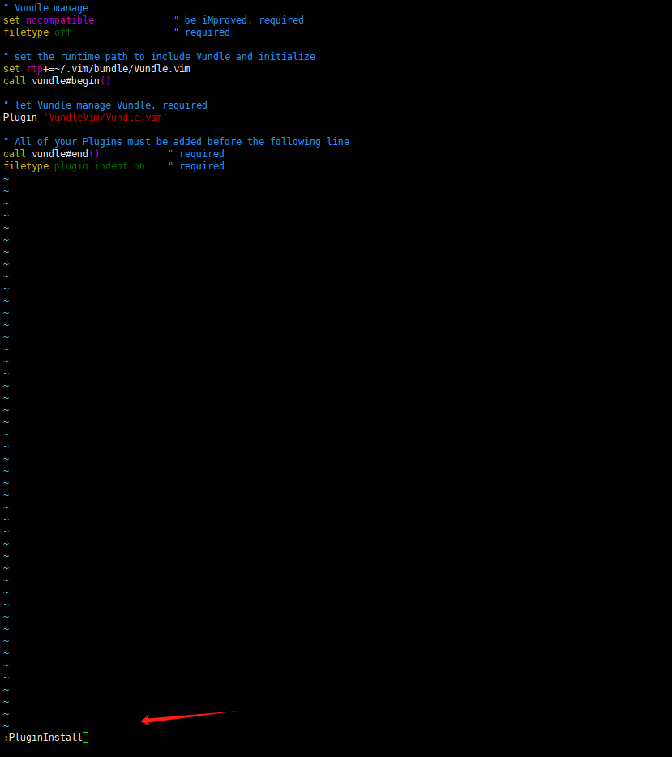
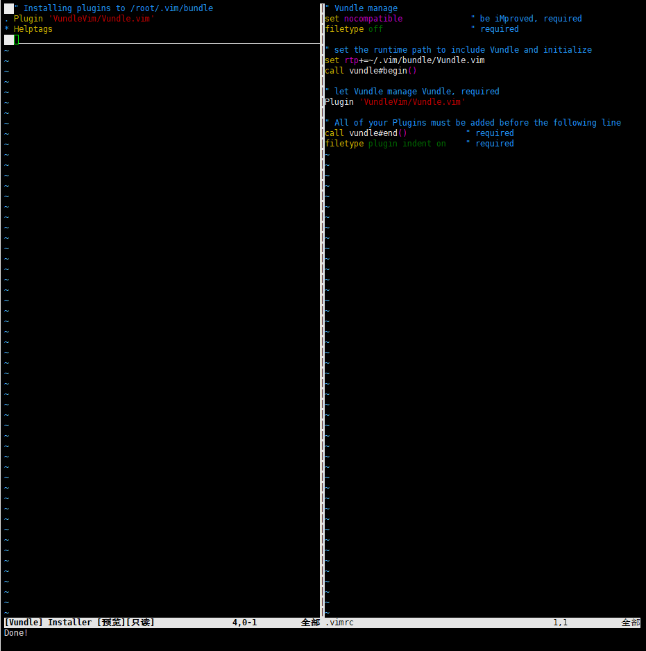
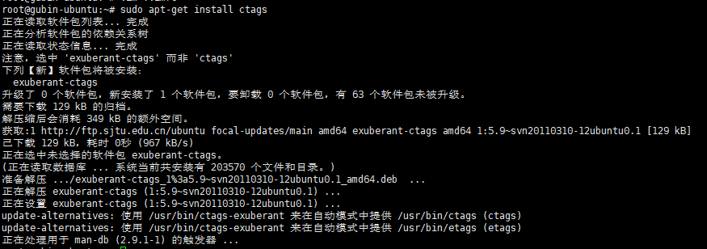
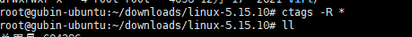
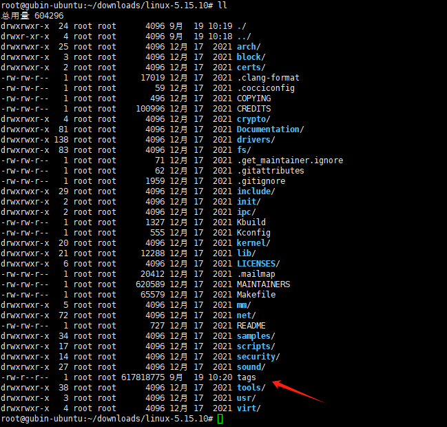
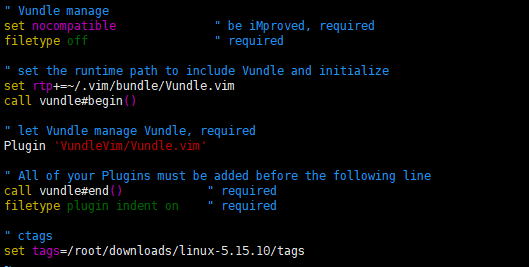
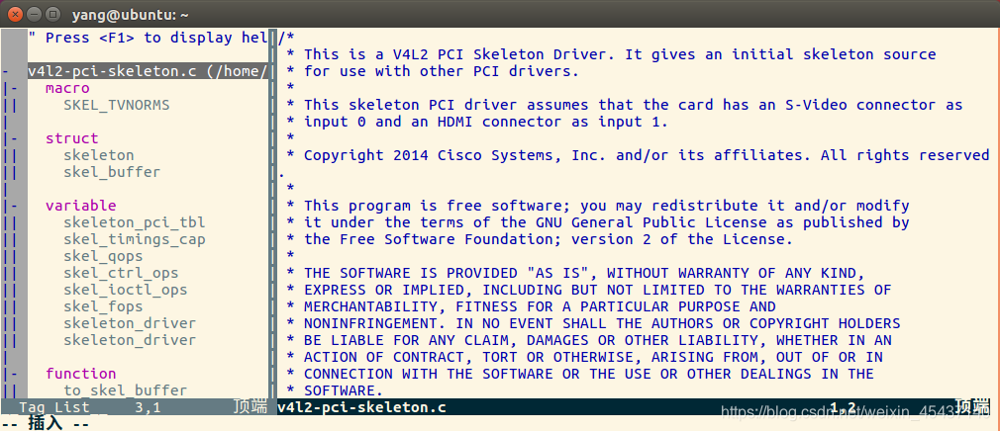
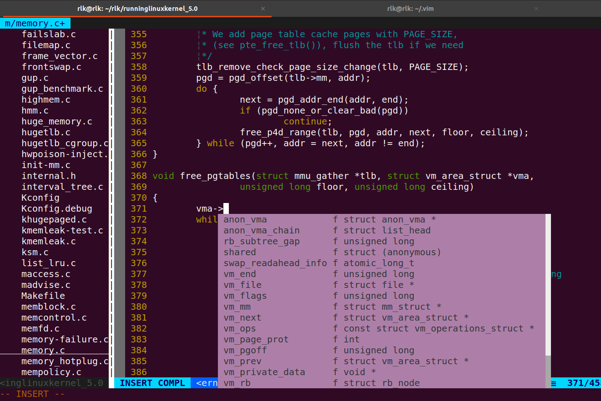

# 实验2-5：把Vim打造成一个强大的IDE编辑工具

## 一．实验目的

通过配置把Vim打造成一个和Source Insight相媲美的IDE工具。

## 二．实验步骤

请参考《奔跑吧Linux内核入门篇》第二版第2.6.5节相关内容。

首先我们先明确下一个优秀的编译器（Source Insight）会有哪些功能

1. 自动列出当前文件中的变量，函数名等

2. 查找当前文件或整个工程的函数调用

3. 查找函数或者变量的定义

4. 自动补全

5.  函数高亮

    以上等等

    其实通过适当的配置vim也可以有这些作用，那么接下来我们就言归正传，看看如何来配置一个专属于自己的编辑工具

### 1 插件管理工具Vundle

​		 vim支持很多插件，早期需要到每个网站上下载插件，然后复制到home目录下.vim中才能使用。现在Vim社区有很多插件管理工具，其中Vundle就是很出色的一个，他可以在.vimrc中跟踪、管理和自动更新插件等

安装Vundle需要使用git

    sudo apt-get install git	#安装 git 工具
    $ git clone https://github.com/VundleVim/Vundle.vim.git ~/.vim/bundle/Vundle.vim

指定了clone的目录为~/.vim/bundle/Vundle.vim



​		接下来需要在 home 主目录下的 .vimrc 配置文件中配置 Vundle，如下操作：
​		<.vimrc 文件中添加如下配置>

```
vim .vimrc
```


```
" Vundle manage
set nocompatible              " be iMproved, required
filetype off                  " required

" set the runtime path to include Vundle and initialize
set rtp+=~/.vim/bundle/Vundle.vim
call vundle#begin()

" let Vundle manage Vundle, required
Plugin 'VundleVim/Vundle.vim'

" All of your Plugins must be added before the following line
call vundle#end()            " required
filetype plugin indent on    " required

```



​		只需要在该配置文件中添加 “`Plugin xxx`”，即安装名为 “xxx” 的插件。
​		接下来就是在线安装插件，启动 Vim，然后运行命令 “`:PluginInstall`”，就会从网络上下载插件并安装，如下所示：





### 2、ctags 工具及辅助软件 taglist

ctags工具全称Generate tag files for source code。扫描指定的源文件，找出其中包含的语法元素，并把找到的相关的内容记录下来，这样在代码浏览和查找时就可以利用这些记录实现查找和跳转的功能。

#### 1）ctags 工具

##### **1、安装 ctags 工具**

    sudo apt-get install ctags

在Ubuntu Linux中可使用如下命令安装ctags

```
sudo apt-get install universal-ctags
```



##### **2、建立索引文件**  

在想要建立索引文件的文件夹目录下执行：

    sudo ctags -R *


然后会发现当前目录下生成了一个索引文件：`tags`


我专门找了一个kernel源代码





##### **3、在 `.vimrc` 配置文件中添加生成的索引文件（注意路径）**

```bash
" ctags
set tags=/root/downloads/linux-5.15.10/tags
```

```
" Vundle manage
set nocompatible              " be iMproved, required
filetype off                  " required

" set the runtime path to include Vundle and initialize
set rtp+=~/.vim/bundle/Vundle.vim
call vundle#begin()

" let Vundle manage Vundle, required
Plugin 'VundleVim/Vundle.vim'

" All of your Plugins must be added before the following line
call vundle#end()            " required
filetype plugin indent on    " required

" ctags
set tags=/root/downloads/linux-5.15.10/tags

```



上述指令会在当前目录下生成tags文件。启动vim之后需要加载这个tags文件

> : set tags = tags   //我实际使用的时候并没有这个操作，貌似也可以使用

4、ctags 常用的快捷键：

| 快捷键   | 用法                       |
| -------- | -------------------------- |
| ctrl + ] | 跳转至光标所在对象定义之处 |
| ctrl +t  | 返回跳转前位置             |

注意：如果不设置索引文件位置，然后执行 ctrl+] 则会出现错误：
E433: 没有 tag 文件
E426: 找不到 tag: XXXXX


##### 2）辅助软件 taglist（无需安装，后面的Tabbar 插件功能更全面）

安装taglist前，一定要安装ctags

1、taglist下载地址（[https://www.vim.org/scripts/script.php?script\_id=273](https://www.vim.org/scripts/script.php?script_id=273)）

2、下载好后直接将其放在 `.vim/` 目录下解压即可：

    unzip  taglist_46.zip


3、直接使用：

使用vim打开一个文件，然后`在命令模式下输入Tlist`，可以看到如下的界面。  
  
关闭界面，同样是`在命令模式下输入Tlist`。  
`ctrl+ww` 切换左右窗口。

4、在 .vimrc 脚本下可以添加相应设置：

    " 启动vim后自动打开taglist窗口
    let Tlist_Auto_Open = 1
     
    " 不同时显示多个文件的tag，仅显示一个
    let Tlist_Show_One_File = 1
     
    " taglist窗口显示在右侧，缺省为左侧
    let Tlist_Use_Right_Window =1
    
    " 设置taglist窗口大小
    let Tlist_WinHeight = 100
    let Tlist_WinWidth = 40


### 3 cscope工具

​        ctags可以跳转到定义的地方，但是如果我们想查找哪里调用了这个函数，ctags似乎就无能为力了。cscope工具就可以实现这个功能，这也是Source Insight强大的功能之一

```
$ sudo apt-get install cscope
```

1）生成 cscope 索引文件

类似ctags，在使用cscope之前也要先生成索引库

```
$ cscope -Rbq
```

上述的命令会生成3个文件：cscope.in.out ，cscope.out ，cscope.po.out。其中 cscope.out 是基本符合的索引，cscope.in.out，cscope.po.out两个文件是使用-q的选项生成的，用于加快 cscope 索引的速度。

2）加载 cscope 索引文件  
在 vim 打开代码文件之后，添加 cscope 索引，如下命令：

    :cscope add cscope.out

**注意：对于 cscope 工具的使用较为麻烦，所以可以在 **.vimrc** 配置文件下添加快捷键的配置。**


## 三．Problem

有读者在使用vim查看linuxkernel代码的时候遇到：无法补全一些数据结构的问题，可以尝试如下办法：

### 1.安装python-is-python3。YCM默认使用python3

```
$ sudo apt install python-is-python3
```

### 2.重新编译YCM。

```
$ cd /home/rlk/.vim/bundle/YouCompleteMe/
$ python3 install.py --clangd-completer
```

### 3.使 用 YCM-Generator 来为runninglinuxkernel_5.0 目录生成一个.ycm_extra_conf.py 配置文件，这个配置文件已经上传到 git 上，大家只要git pull 一下 runninglinuxkernel_5.0 即可。

如果读者想自己重新生成.ycm_extra_conf.py 文件，可以通过如下方法。

```
$sudo apt install clang exuberant-ctags
$ git clone https://github.com/rdnetto/YCM-Generator.git
$ cd YCM-Generator
$ ./config_gen.py /home/rlk/rlk/runninglinuxkernel_5.0
```

测试 YCM。打开 vim，然后打开 mm/memory.c 文件，在第 370 行，输入 vma->

