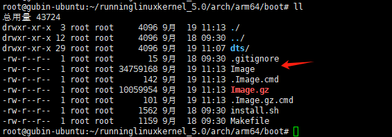

# 实验 4-1：通过 QEMU 调试 ARM64 Linux 内核

## 一．实验目的

熟悉如何使用 QEMU 调试 Linux 内核。

本实验调试 ARM64 的处理器。

## 二．实验步骤

​		首先，确保在 Linux 主机上安装了 aarch64-linux-gnu-gcc 和 QEMU 工具包。

```
$sudo apt-get install qemu qemu-system-arm gcc-aarch64-linux-gnu build-essential bison flex bc
```

​		然后，安装 gdb-multiarch 工具包。

```
$sudo apt-get install gdb-multiarch
```


​		接下来，运行 run_rlk_arm64.sh 脚本以启动 QEMU 虚拟机和 GDB 服务。

```
./run_rlk_arm64.sh run debug
```

​		上述脚本会运行如下命令，不过建议读者直接使用 run_rlk_arm64.sh 脚本。

```
$ qemu-system-aarch64 -m 1024 -cpu max,sve=on,sve256=on -M virt,gic-version=3,its=on,iommu=smmuv3 -nographic -kernel arch/arm64/boot/Image -append "noinitrd nokaslr loglevel=8 sched_debug root=/dev/vda rootfstype=ext4 rw crashkernel=256M vfio.dyndbg=+pflmt irq_gic_v3_its.dyndbg=+pflmt iommu.dyndbg=+pflmt irqdomain.dyndbg=+pflmt" -drive if=none,file=/root/runninglinuxkernel_5.0/rootfs_debian_arm64.ext4,id=hd0 -device virtio-blk-device,drive=hd0 --fsdev local,id=kmod_dev,path=./kmodules,security_model=none -device virtio-9p-pci,fsdev=kmod_dev,mount_tag=kmod_mount -s -S
```

- -S：表示 QEMU 虚拟机会冻结 CPU，直到远程的 GDB 输入相应的控制命

令。

- -s：表示在 1234 端口接收 GDB 的调试连接。

#### 补充：这条QEMU命令是用于启动一个模拟的ARM64虚拟机，具体参数的含义如下：

1. **内存与CPU选项**：

   - `-m 1024`：为虚拟机分配1024 MB的内存。
   - `-cpu max,sve=on,sve256=on`：使用`max`类型的CPU，并启用了SVE（可伸缩向量扩展）指令集，其中包含256位宽度的向量支持。

2. **机器配置选项**：

   - `-M virt,gic-version=3,its=on,iommu=smmuv3`：指定虚拟机的架构为`virt`，使用版本3的GIC（通用中断控制器），启用ITS（中断翻译服务），并启用了SMMUv3（系统内存管理单元）。

3. **图形与输出选项**：

   - `-nographic`：禁止使用图形界面，所有的输出都通过控制台（命令行）进行。

4. **内核与启动选项**：

   - `-kernel arch/arm64/boot/Image`：**指定虚拟机内核的路径，这里使用的是ARM64架构的内核镜像**。

   

   - ```
     -append "noinitrd nokaslr loglevel=8 sched_debug root=/dev/vda rootfstype=ext4 rw crashkernel=256M vfio.dyndbg=+pflmt irq_gic_v3_its.dyndbg=+pflmt iommu.dyndbg=+pflmt irqdomain.dyndbg=+pflmt"
     ```

     这些是传递给内核的参数：

     - `noinitrd`：不使用initrd（初始化内存盘）。
     - `nokaslr`：禁用内核地址空间布局随机化（KASLR）。
     - `loglevel=8`：设置日志输出级别为最大。
     - `sched_debug`：启用调度程序的调试输出。
     - `root=/dev/vda rootfstype=ext4 rw`：指定根文件系统在`/dev/vda`，使用`ext4`文件系统并以读写模式挂载。
     - `crashkernel=256M`：预留256MB内存用于崩溃内核。
     - `vfio.dyndbg=+pflmt irq_gic_v3_its.dyndbg=+pflmt iommu.dyndbg=+pflmt irqdomain.dyndbg=+pflmt`：启用VFIO、GICv3、SMMU和中断域的动态调试输出。

5. **磁盘配置选项**：

   - `-drive if=none,file=/root/runninglinuxkernel_5.0/rootfs_debian_arm64.ext4,id=hd0`：为虚拟机指定**根文件系统，使用一个Debian ARM64的根文件系统镜像**。
   - `-device virtio-blk-device,drive=hd0`：将该文件系统镜像作为Virtio块设备挂载。

6. **文件系统设备映射**：

   - `--fsdev local,id=kmod_dev,path=./kmodules,security_model=none`：将本地路径`./kmodules`映射到虚拟机中，ID为`kmod_dev`，不使用安全模型。
   - `-device virtio-9p-pci,fsdev=kmod_dev,mount_tag=kmod_mount`：将映射的路径通过Virtio 9p PCI设备挂载到虚拟机中，挂载标签为`kmod_mount`。

7. **调试选项**：

   - `-s`：开启调试端口，默认使用TCP端口1234，可用于GDB连接进行调试。
   - `-S`：启动虚拟机后立即暂停，等待调试器连接后再继续运行。

##### 关于`./run_rlk_arm64.sh run debug`：

从命令来看，这个脚本`run_rlk_arm64.sh`很可能是你专门用于运行QEMU虚拟机的脚本。`run debug`应该是这个脚本的命令参数，用于执行虚拟机的调试模式。通常，这意味着该脚本会将调试相关的参数（如`-s`和`-S`）传递给QEMU，方便通过GDB等工具进行调试。

如果你想要更深入了解脚本的运行逻辑，可以检查`run_rlk_arm64.sh`脚本的内容，看看`run debug`这个选项是如何处理的。


终端好像是暂停了


接下来，在另外一个超级终端中启动 GDB。

```
$ cd runninglinuxkernel_5.0
$ gdb-multiarch --tui vmlinux
(gdb) set architecture aarch64 <= 设置Aarch64架构
(gdb) target remote localhost:1234 <= 通过1234端口远程连接到QEMU虚拟机
(gdb) b start_kernel <= 在内核的start_kernel处设置断点
(gdb) c
```

如图 4.5 所示，GDB 开始接管 Linux 内核的运行，并且在断点处暂停，这时即可使用 GDB 命令来调试内核。


实操：

```
cd runninglinuxkernel_5.0
gdb-multiarch --tui vmlinux
```


```
(gdb) set architecture aarch64
(gdb) target remote localhost:1234
```


```
b start_kernel
```


```
c
```


再按n


离开gdb


另一个终端开始运行


