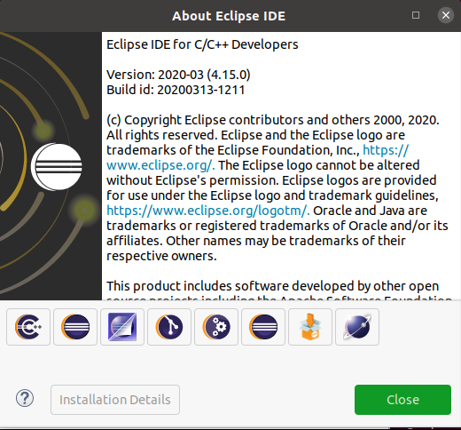
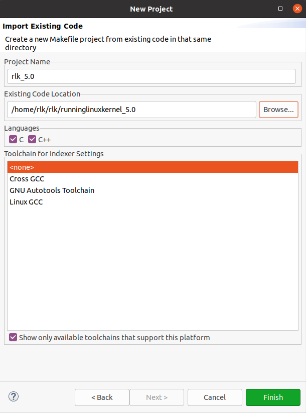
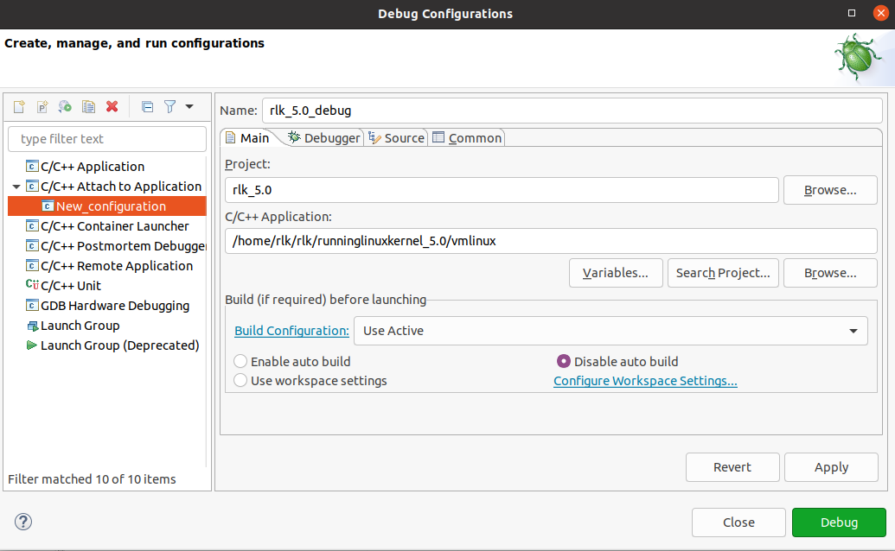
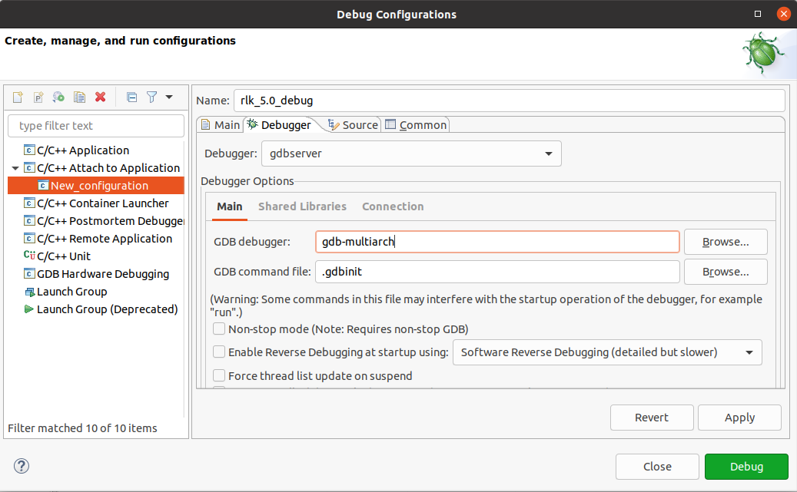
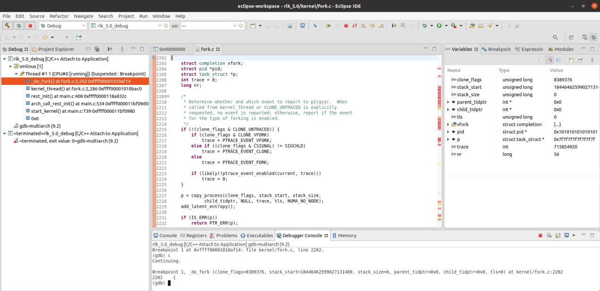

# 实验 4-2：通过 Eclipse+QEMU 单步调试内核

## 一．实验目的

熟悉如何使用 Eclipse+QEMU 以图形方式单步调试 Linux 内核。

## 二．实验详解

​		4.1 节介绍了如何使用 GDB 和 QEMU 虚拟机调试 Linux 内核源代码。由于 GDB 使用的是命令行方式，因此有些读者可能希望在 Linux 中能有类似于 Virtual C++的图形化开发工具。这里介绍使用 Eclipse 工具来调试内核的方式。Eclipse 是著名的跨平台的开源集成开发环境（IDE），最初主要用于 Java 语言开发，目前可以支持 C/C++、Python 等多种开发语言。Eclipse 最初由 IBM 公司开发，2001 年被贡献给开源社区，目前很多集成开发环境是基于 Eclipse 完成的。

​		1）安装 Eclipse-CDT 软件

​		Eclipse-CDT 是 Eclipse 的一个插件，可以提供强大的 C/C++编译和编辑功能。读者可以从 Eclipse-CDT 官网直接下载对应最新版本 x86_64 的 Linux 压缩包，解压并打开二进制文件即可，不过需要提前安装 Java 的运行环境。

```
$ sudo apt install openjdk-13-jre
```

​		Eclipse 的启动界面如图 4.6 所示。

​		打开 Eclipse，从菜单栏中选择 Help→About Eclipse，可以看到当前软件的版本，如

图 4.7 所示。


​																				图4.6 Eclipse的启动界面

​		2）创建工程

​		从 Eclipse 菜单栏中选择 Window→Open Perspective→C/C++。从菜单栏中选择 File→New→Project，再选择 Makefile Project with Exiting Code，即可创建一个新的工程，如图 4.8所示。

​		接下来配置调试选项。选择 Eclipse 菜单栏中的 Run→Debug Configurations，弹出 Debug Configurations 对话框，在其中完成 C/C++ Attach to Application 的调试配置。

​		在 Main 选项卡中，完成以下配置。

- Project：选择刚才创建的工程。



​																		图4.7 查看Eclipse-版本 



​																				图4.8 创建工程

-  C/C++ Appliction：选择编译 Linux 内核带符号表信息的 vmlinux。

-  Build<if required>before launching：选中 Disable auto build，如图 4.9所示。



​																			图4.9 调试配置选项（一）

在 Debugger 选项卡中，完成以下配置。

-  Debugger：选择 gdbserver。

-  GDB debugger：填入 gdb-multiarch，如图 4.10 所示。

- 在 Debugger Options 选项区域中，单击 Connection 选项卡，完成以下配

置。

-  Host name or IP addrss：填入 localhost。

-  Port number：填入 1234。



​																			图4.10 调试配置选项（二）

​		调试选项设置完毕后，单击 Debug 按钮。

​		在 Linux 主机的另一个终端中使用 run_rlk_arm64.sh 脚本来运行 QEMU 虚拟机以及gdbserver。

```
$ ./run_rlk_arm64.sh run debug
```

 

​		在Eclipse 菜单栏中选择 Run→Debug History，单击刚才创建的调试配置，或在快捷菜单中单击小昆虫图标，如图 4.11 所示，打开调试功能。


​		在 Eclipse 的 Debugger Console 选项卡（见图 4.12）中输入 file vmlinux 命令，导入调试文件的符号表；输入 set architecture aarch64命令，选择 GDB 支持的 ARM64 架构，如图 4.12 所示。

​		在 Debugger Console 选项卡中输入 b _do_fork，在_do_fork()函数中设置一个断点。输入 c 命令，开始运行 QEMU 虚拟机中的 Linux 内核，程序会停在_do_fork()函数中，如图 4.13 所示。


图4.12 Debugger Console选项卡



图4.13 使用Eclipse调试内核

​		使用 Eclipse 调试内核比使用 GDB 命令要直观很多，例如参数、局部变量和数据结构的值都会自动显示在 Variables 标签卡上，不需要每次都使用 GDB 的输出命令才能看到变量的值。读者可以单步并且直观地调试内核。