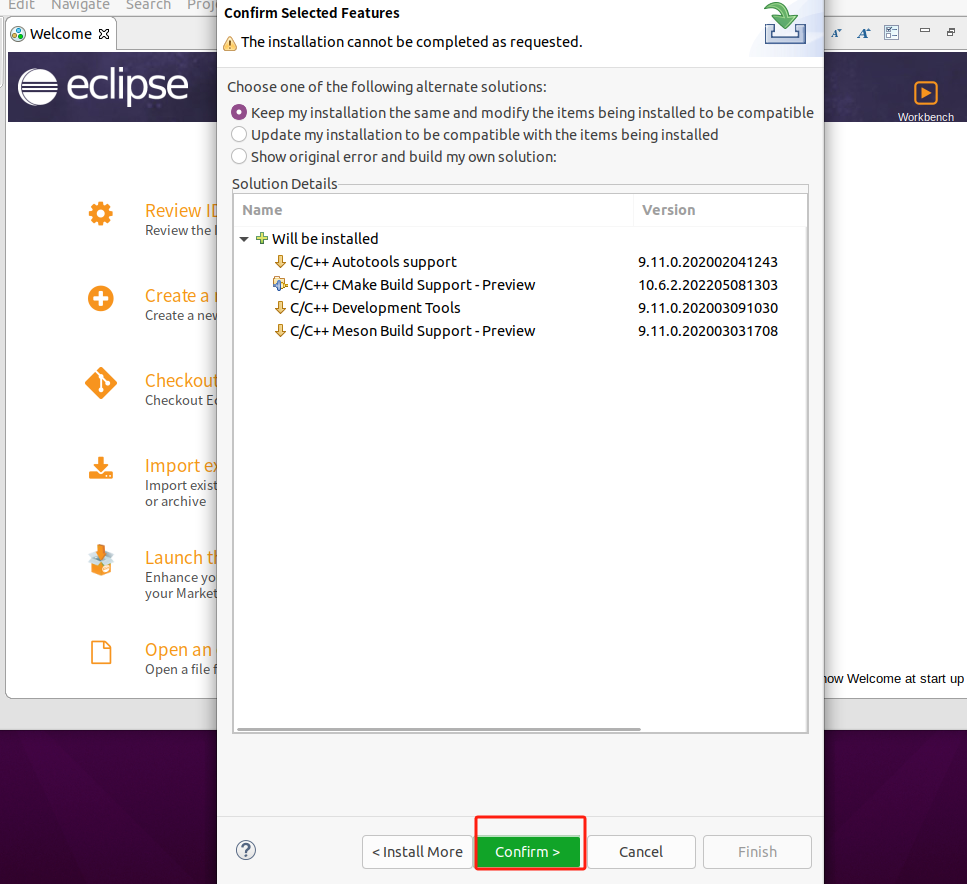
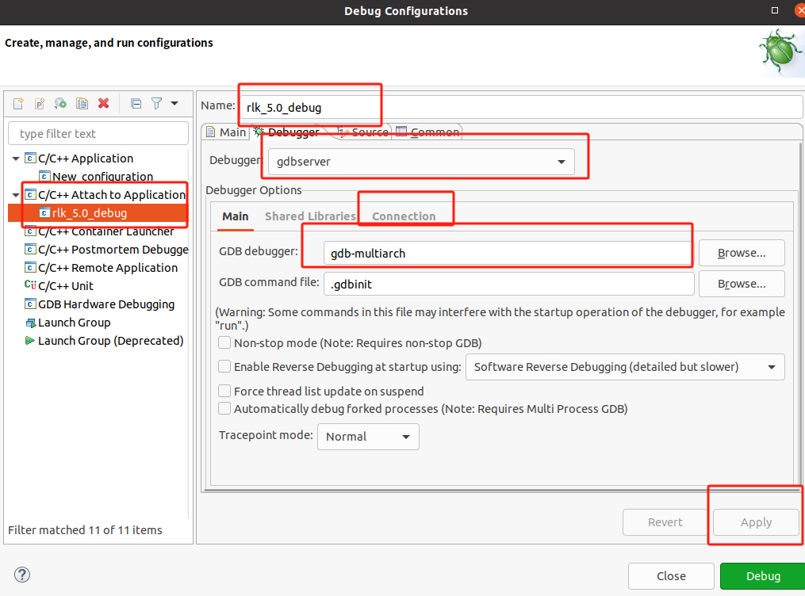
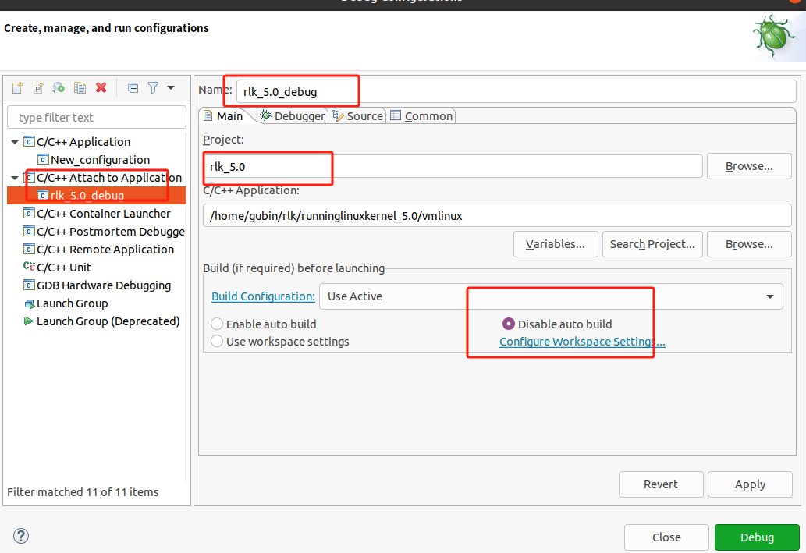
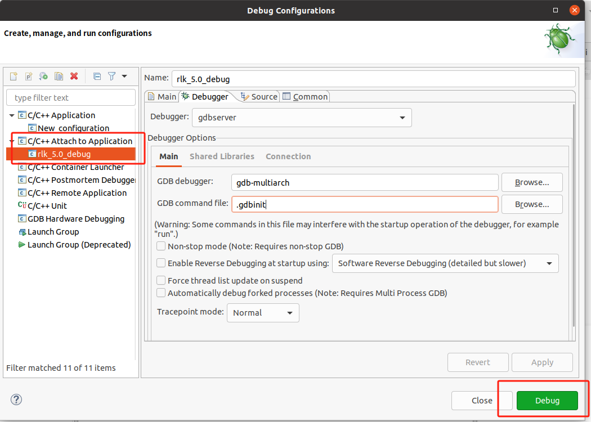
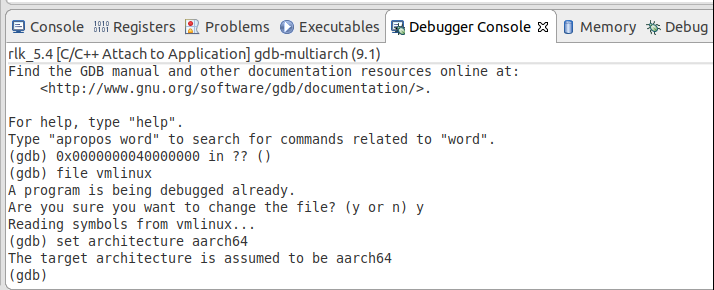

# 实验 4-2：通过 Eclipse+QEMU 单步调试内核

## 一．实验目的

熟悉如何使用 Eclipse+QEMU 以图形方式单步调试 Linux 内核。

## 二．实验详解

​		4.1 节介绍了如何使用 GDB 和 QEMU 虚拟机调试 Linux 内核源代码。由于 GDB 使用的是命令行方式，因此有些读者可能希望在 Linux 中能有类似于 Virtual C++的图形化开发工具。这里介绍使用 Eclipse 工具来调试内核的方式。Eclipse 是著名的跨平台的开源集成开发环境（IDE），最初主要用于 Java 语言开发，目前可以支持 C/C++、Python 等多种开发语言。Eclipse 最初由 IBM 公司开发，2001 年被贡献给开源社区，目前很多集成开发环境是基于 Eclipse 完成的。

​		1）安装 Eclipse-CDT 软件

​		Eclipse-CDT 是 Eclipse 的一个插件，可以提供强大的 C/C++编译和编辑功能。读者可以从 Eclipse-CDT 官网直接下载对应最新版本 x86_64 的 Linux 压缩包，解压并打开二进制文件即可，不过需要提前安装 Java 的运行环境。

```
$ sudo apt install openjdk-13-jre
```

​		

验证是否安装成功


### 第一次安装失败 安装错了版本

进入官网->https://www.eclipse.org/


这里因为是windows端进去下载的，所以这里默认显示的下载选项其实只有你操作系统对应架构的Eclipse，并且是默认为JAVA的，并不是我们要的EclipseCDT。
点击下面的`Download Packages`


下载到目录


解压


当然了，相比于这个，我们肯定更喜欢桌面的快捷方式。

控制台输入: `cd /usr/share/applications`
创建eclipse.desktop：`touch eclipse.destktop`

输入`sudo gedit eclipse.desktop`打开文件。
输入以下内容：

```
[Desktop Entry]
Encoding=UTF-8
Name=eclipse2023
Comment=Eclipse
Exec=/home/edwinwzy/eclipse/eclipse
Icon=/home/edwinwzy/eclipse/icon.xpm
Terminal=false
StartupNotify=true
Type=Application
Categories=Application;Development;

```

Exec=指运行eclipse对应的路径
Icon=指eclipse可执行文件路径下的icon.xpm文件路径

==一开始在root用户下创建desktop这是不对的==


最后使用普通用户安装，并且安装包要在普通用户的文件目录下


==错误版本下安装cdt==





****

### ==第二次安装正确版本==

#### 先卸载

卸载你下载的 **Eclipse IDE** 可以通过手动删除 Eclipse 安装文件夹来完成，因为 Eclipse 不需要专门的安装程序或安装过程。以下是具体步骤：

#### 1. **关闭 Eclipse IDE**

如果 Eclipse IDE 正在运行，请确保已经关闭。

#### 2. **删除 Eclipse 安装文件夹**

通常，你下载的 Eclipse IDE 是解压在某个目录中，比如 `/root/downloads/eclipse/` 或者其他你指定的路径。你可以使用命令行删除这个文件夹：

```
sudo rm -rf /path/to/eclipse/
```

例如，如果 Eclipse 被解压到 `/root/downloads/eclipse/`，你可以运行：

```
sudo rm -rf /root/downloads/eclipse/
```

**注意**：确保你指定的路径正确，以免误删其他文件。


#### 3. **删除工作空间（可选）**

Eclipse 的工作空间（workspace）保存着你的项目和配置文件，通常位于 `~/workspace/` 或者其他你选择的目录中。如果你不再需要这些文件，可以删除工作空间文件夹：

```
rm -rf ~/workspace/
```

如果你工作空间路径不同，确保删除的是正确的路径。

#### 4. **删除桌面快捷方式或启动项（如果有）**

如果你之前创建了桌面快捷方式或菜单项，可以手动删除 `.desktop` 文件：

- **删除桌面快捷方式**： 如果你将 `.desktop` 文件放在桌面上，直接删除即可：

  ```
  rm ~/Desktop/eclipse.desktop
  ```

- **删除全局快捷方式**： 如果你将 `.desktop` 文件放在 `/usr/share/applications/` 中，可以使用以下命令删除：

  ```
  sudo rm /usr/share/applications/eclipse.desktop
  ```

#### 5. **删除 Eclipse 配置文件（可选）**

Eclipse 还会在用户主目录下保存一些配置文件，例如 `.eclipse/` 文件夹。这些配置文件通常位于 `~/.eclipse/` 路径下，你可以选择删除它们：

```
rm -rf ~/.eclipse/
```

这样可以彻底清理掉 Eclipse 的配置文件。

#### 总结：

- 手动删除 Eclipse IDE 安装目录。
- 删除工作空间（如果不再需要）。
- 删除快捷方式或启动项。
- 可选地删除 Eclipse 的配置文件夹。

通过这些步骤，你可以完全卸载 Eclipse IDE。


**desktop文件还可以继续用，不卸载**

下载


放在用户目录下


安装完成

## 启动

​		Eclipse 的启动界面如图 4.6 所示。

​		打开 Eclipse，从菜单栏中选择 Help→About Eclipse，可以看到当前软件的版本，如

图 4.7 所示。


​																				图4.6 Eclipse的启动界面

### 创建工程

​		从 Eclipse 菜单栏中选择 Window→Open Perspective→C/C++。从菜单栏中选择 File→New→Project，再选择 Makefile Project with Exiting Code，即可创建一个新的工程，如图 4.8所示。


### 调试配置

​		接下来配置调试选项。选择 Eclipse 菜单栏中的 Run→Debug Configurations，弹出 Debug Configurations 对话框，在其中完成 C/C++ Attach to Application 的调试配置。

​		在 Main 选项卡中，完成以下配置。

- Project：选择刚才创建的工程。


​																		图4.7 查看Eclipse-版本 


​																				图4.8 创建工程

创建一个新的代码目录，将源代码放进来，但是是用root用户cp的，所以是只读，需要加上权限

如果你想为所有用户（所有者、组和其他用户）添加写权限，可以使用以下命令：

```sh
sudo chmod -R a+w runninglinuxkernel_5.0/
```

#### 补充：

`a+w` 是 Linux 中 `chmod` 命令的一个参数，用于为 **所有用户（all users）** 添加写权限。它的含义是：

- **`a`** 代表 **all**，即所有用户，包括文件的拥有者（owner）、文件所在的组（group）、以及其他用户（others）。
- **`+w`** 代表 **添加写权限（write permission）**。

因此，`chmod a+w` 的意思是给文件或目录的所有用户添加写权限。

##### 如果你只想给普通用户添加写权限：

你可以使用 `chmod` 或 `chown` 来更加细粒度地设置权限。

##### 1. **给特定用户（非root）添加写权限**

假设你想为一个特定的普通用户（比如 `username`）添加写权限，推荐使用 `chown` 来更改文件或目录的所有者，而不是直接修改权限。

- **更改目录的所有者**： 使用 `chown` 将目录的所有权从 `root` 转移给普通用户：

  ```
  sudo chown -R username:username runninglinuxkernel_5.0/
  ```

  这将把目录 `runninglinuxkernel_5.0/` 及其所有子文件和子目录的所有权转移给用户 `username`，并且用户 `username` 将自动拥有读写权限。

##### 2. **给当前用户添加写权限**

如果你只想给文件的所有者（即当前的用户）添加写权限，可以使用 `u+w` 参数：

```
sudo chmod -R u+w runninglinuxkernel_5.0/
```

- **`u`** 代表 **user**（文件的所有者）。
- **`+w`** 代表 **添加写权限**。

这个命令只会给文件的拥有者（例如 `root` 用户）添加写权限，而不会影响其他用户或组。

##### 3. **给文件所属的组添加写权限**

如果你希望文件所在的组内的所有用户都能有写权限，可以使用 `g+w`：

```
sudo chmod -R g+w runninglinuxkernel_5.0/
```

- **`g`** 代表 **group**，即文件或目录所属的组。
- **`+w`** 代表 **添加写权限**。

##### 总结权限参数：

- `a+w`: 给所有用户（所有者、组和其他用户）添加写权限。
- `u+w`: 给文件所有者（当前用户）添加写权限。
- `g+w`: 给文件所属组的所有用户添加写权限。
- `o+w`: 给其他用户（既不是所有者，也不属于组的用户）添加写权限。

如果你要给普通用户添加写权限，通常推荐使用 `chown` 更改文件或目录的所有者，或者使用 `u+w` 或 `g+w` 来调整权限。


-  C/C++ Appliction：选择编译 Linux 内核带符号表信息的 vmlinux。

-  Build<if required>before launching：选中 Disable auto build，如图 4.9所示。


​																			图4.9 调试配置选项（一）


在 Debugger 选项卡中，完成以下配置。

-  Debugger：选择 gdbserver。

-  GDB debugger：填入 gdb-multiarch，如图 4.10 所示。

- 在 Debugger Options 选项区域中，单击 Connection 选项卡，完成以下配置。

-  Host name or IP addrss：填入 localhost。

-  Port number：填入 1234。


​																			图4.10 调试配置选项（二）




#### ==之前好像看错了，配置错了，直接设置C/C++ Attach to Application，按这个来==





​		==调试选项设置完毕后，单击 Debug 按钮==

**切换到调试视角**


### 启动另一个终端

​		在 Linux 主机的另一个终端中使用 run_rlk_arm64.sh 脚本来运行 QEMU 虚拟机以及gdbserver。

```
$ ./run_rlk_arm64.sh run debug
```

 

为了防止错误，重新在新环境编译内核一次

```
make clean 
rm -f rootfs_debian_arm64.ext4
./run_debian_arm64.sh build_kernel
sudo ./run_debian_arm64.sh build_rootfs #根文件编译需要root权限
./run_debian_arm64.sh run debug
```

### gdb调试

​		在Eclipse 菜单栏中选择 Run→Debug History，单击刚才创建的调试配置，或在快捷菜单中单击小昆虫图标，如图 4.11 所示，打开调试功能。


​		在 Eclipse 的 Debugger Console 选项卡（见图 4.12）中输入下面命令

```
file vmlinux
```

 导入调试文件的符号表；


输入以下命令

```
set architecture aarch64
```

选择 GDB 支持的 ARM64 架构，如图 4.12 所示。

**报错**


==**按C/C++ Attach to application来，正确**==


在 Debugger Console 选项卡中输入 

```
b _do_fork
```

在 _do_fork() 函数中设置一个断点。输入_

```
c 
```

_命令，开始运行 QEMU 虚拟机中的 Linux 内核，程序会停在_do_fork()函数中，如图 4.13 所示。



​																	图4.12 Debugger Console选项卡


图4.13 使用Eclipse调试内核

**实操**


输入n

```
n
```


停止调试，另一个终端启动


**实验完成**


​		使用 Eclipse 调试内核比使用 GDB 命令要直观很多，例如参数、局部变量和数据结构的值都会自动显示在 Variables 标签卡上，不需要每次都使用 GDB 的输出命令才能看到变量的值。读者可以单步并且直观地调试内核。