# 实验 5-1：编写一个简单的内核模块

## 一．实验目的

了解和熟悉编译一个基本的内核模块需要包含的元素。

## 二．实验步骤

1）编写一个简单的内核模块程序。

2）编写对应的 Makefile 文件。

3）在 Ubuntu Linux 机器上编译和加载运行该内核模块。

4）在 QEMU 上运行 ARM64 的 Linux 系统，编译该内核模块并运行。

## 三．在 ubuntu 主机上编译和运行

### 1.编写my_test.c和Makefile

my_test.c

```C
#include <linux/module.h>
#include <linux/init.h>

static int __init my_test_init(void)
{
	printk(KERN_EMERG "my first kernel module init\n");
	return 0;
}

static void __exit my_test_exit(void)
{
	printk("goodbye\n");
}

module_init(my_test_init);
module_exit(my_test_exit);

MODULE_LICENSE("GPL");
MODULE_AUTHOR("rlk");
MODULE_DESCRIPTION("my test kernel module");
MODULE_ALIAS("mytest");

```

在 ubuntu 主机上编译和运行一个内核模块，对应的 Makefile 文件如下。

<Makefile文件>

```makefile
#BASEINCLUDE ?= /home/rlk/rlk/runninglinuxkernel_5.0
BASEINCLUDE ?= /lib/modules/`uname -r`/build

CONFIG_MODULE_SIG=n

mytest-objs := my_test.o 

obj-m	:=   mytest.o
all : 
	$(MAKE) -C $(BASEINCLUDE) M=$(PWD) modules;

clean:
	$(MAKE) -C $(BASEINCLUDE) M=$(PWD) clean;
	rm -f *.ko;
```

PS:这里我们使用第五章教程快速搭建


​		第 0 行的 BASEINCLUDE 指向正在运行 Linux 的内核编译目录，为了编译Linux 主机上运行的内核模块，我们需要指定到当前系统对应的内核中。一般来说，Linux 系统的内核模块都会安装到/lib/modules 目录下，通过“uname -r”命令可以找到对应的内核版本。

```shell
$ uname -r
5.4.0-18-generic
$ ls -l
total 5788
lrwxrwxrwx 1 root root 39 Mar 26 23:24 build -> /usr/src/linux-headers-
5.4.0-18-generic
drwxr-xr-x 2 root root 4096 Mar 7 08:23 initrd
drwxr-xr-x 17 root root 4096 Mar 24 00:38 kernel
-rw-r--r-- 1 root root 1382469 Mar 24 00:40 modules.alias
-rw-r--r-- 1 root root 1358633 Mar 24 00:40 modules.alias.bin
-rw-r--r-- 1 root root 8105 Mar 7 08:23 modules.builtin
-rw-r--r-- 1 root root 24985 Mar 24 00:40 modules.builtin.alias.bin
-rw-r--r-- 1 root root 10257 Mar 24 00:40 modules.builtin.bin
-rw-r--r-- 1 root root 63280 Mar 7 08:23 modules.builtin.modinfo
-rw-r--r-- 1 root root 609357 Mar 24 00:40 modules.dep
-rw-r--r-- 1 root root 851773 Mar 24 00:40 modules.dep.bin
-rw-r--r-- 1 root root 330 Mar 24 00:40 modules.devname
-rw-r--r-- 1 root root 219838 Mar 7 08:23 modules.order
-rw-r--r-- 1 root root 791 Mar 24 00:40 modules.softdep
-rw-r--r-- 1 root root 613833 Mar 24 00:40 modules.symbols
-rw-r--r-- 1 root root 746598 Mar 24 00:40 modules.symbols.bin
drwxr-xr-x 3 root root 4096 Mar 24 00:38 vdso
```

这里可通过“uname -r”来查看当前系统的内核版本，比如作者的系统里面安装了5.4.0-18-generic 内核版本，这个内核版本的头文件存放在/usr/src/linux-headers-5.4.0-18-generic 目录中。


​		第 2 行表示该内核模块需要哪些目标文件，格式如下。

```makefile
<模块名>-objs := <目标文件>.o
```

​		第 3 行表示要生成的模块。注意，模块名不能和目标文件名相同。

```makefile
格式是： obj-m :=<模块名>.o
```

​		第 5 和 6 行表示要编译执行的动作。

​		第 8～10 行表示执行 make clean 需要的动作。

#### 补充：Makefile文件分析

这个 Makefile 是为构建 Linux 内核模块（例如 `mytest` 模块）而编写的。它定义了如何使用当前系统的内核头文件编译模块文件，以及如何清理构建文件。下面对其内容进行详细解释：

##### 1. **`BASEINCLUDE ?= /lib/modules/$(shell uname -r)/build`**

```makefile
BASEINCLUDE ?= /lib/modules/$(shell uname -r)/build
```

- `BASEINCLUDE` 定义了内核源代码或内核构建目录的路径。
- `/lib/modules/$(shell uname -r)/build` 是动态获取当前运行内核版本的构建目录路径，`$(shell uname -r)` 使用 shell 命令 `uname -r` 获取当前内核的版本号，并用它来构造内核模块的路径。
- 该路径是系统内核模块的默认编译路径，通常指向 `/usr/src/linux-headers-<kernel_version>`。
- 这里也可以看到有一行被注释掉的 `#BASEINCLUDE ?= /home/rlk/rlk/runninglinuxkernel_5.0`，这表示你也可以自定义内核源代码的位置。如果想编译不同于系统内核的版本，可以取消注释这行并修改路径。

##### 2. **`CONFIG_MODULE_SIG=n`**

```makefile
CONFIG_MODULE_SIG=n
```

- 这一行禁用了模块签名验证（`CONFIG_MODULE_SIG`），即在编译模块时不对模块进行签名。
- 当你将模块插入内核时，内核可以要求模块签名验证，以确保模块没有被篡改。设置 `CONFIG_MODULE_SIG=n` 是为了关闭这个验证，方便开发调试阶段使用。
- 如果系统配置了强制签名验证的安全机制（如在某些安全性较高的发行版中），你可能需要确保模块经过签名才能加载。

##### 3. **`mytest-objs := my_test.o`**

```makefile
mytest-objs := my_test.o
```

- 这是编译 **mytest** 模块的对象文件列表。这里的 **`mytest-objs`** 表示模块 `mytest` 由 `my_test.o` 文件组成。
- 如果模块包含多个源文件，这里会列出所有需要编译的对象文件，例如 `mytest-objs := file1.o file2.o`。

##### 4. **`obj-m := mytest.o`**

```makefile
obj-m := mytest.o
```

- `obj-m` 表示这个模块是一个外部模块，将编译为可加载的内核模块（`mytest.ko` 文件）。`mytest.o` 是最终链接生成模块的目标文件。
- `obj-m` 指明了要生成的模块名称，并且表明这是一个可以被 `insmod` 或 `modprobe` 加载的可加载模块。

##### 5. **`all` 规则**

```makefile
all:
	$(MAKE) -C $(BASEINCLUDE) M=$(PWD) modules
```

- 这个规则定义了当运行 `make` 时会执行的操作，即构建内核模块。

- `$(MAKE)` 调用了 GNU Make 工具。

- ```makefile
  -C $(BASEINCLUDE)
  ```

   切换到 内核构建目录，即 

  ```makefile
  /lib/modules/$(shell uname -r)/build
  ```

  - `-C` 选项是告诉 Make 切换到内核源代码目录下，并在该目录下运行编译过程。

- `M=$(PWD)`：`M=` 指定当前模块的路径，即将 **当前目录（`$(PWD)`）** 作为模块路径传递给内核构建系统。

- `modules`：这是目标，告诉内核构建系统只构建模块。实际上，这会调用内核的 Makefile 来构建你的模块。

这条命令相当于调用内核的 Makefile 来编译你的外部模块，并确保与当前内核匹配。

##### 6. **`clean` 规则**

```makefile
clean:
	$(MAKE) -C $(BASEINCLUDE) M=$(PWD) clean
	rm -f *.ko
```

- `clean` 规则用于清理构建过程中的临时文件。
- `$(MAKE) -C $(BASEINCLUDE) M=$(PWD) clean`：调用内核的 Makefile，执行清理操作，删除编译过程中生成的中间文件，如 `.o` 文件和模块依赖文件。
- `rm -f *.ko`：手动删除所有 `.ko` 文件（内核模块文件）。这是在构建目录下删除生成的 `.ko` 文件。

##### Makefile 工作原理总结：

1. 编译：
   - 当你运行 `make` 时，`all` 规则被触发。它会调用内核的构建系统，并在你指定的路径下编译你的模块文件，最终生成 `.ko` 文件。
2. 清理：
   - 当你运行 `make clean` 时，`clean` 规则被触发。它会删除编译过程中生成的所有中间文件和 `.ko` 文件，保持目录整洁。

##### 使用步骤：

1. 编译模块：

   ```shell
   make
   ```

2. 清理编译生成的文件：

   ```shell
   make clean
   ```

通过这个 Makefile，你可以方便地使用当前系统的内核头文件编译和清理内核模块。


### 2.编译

### make

​		这里在 Linux 主机的终端中输入 make 命令来执行编译。

```shell
$ make
```

​		编译完之后会生成 mytest.ko 文件。

```shell
$ ls
Makefile modules.order Module.symvers my_test.c mytest.ko 
mytest.mod.c mytest.mod.o my_test.o mytest.o
```


### 	file	

​		我们可以通过 file 命令检查编译的模块是否正确，只要能看到变成 x86-64 架构的 ELF 文件，就说明已经编译成功了。

```shell
$file mytest.ko 
mytest.ko: ELF 64-bit LSB relocatable, x86-64, version 1 (SYSV), 
BuildID[sha1]=57aa8267c3049e08ac8f7e47b4e378c284c8d5c3, not stripped
```


#### 补充：命令 `$ file mytest.ko` 是用于确定文件类型的 Linux 命令。

具体解释如下：

##### 1. **命令解释：**

```shell
file mytest.ko
```

- **`file`**：这是一个 Linux 命令，用于查看文件的类型和详细信息。它通过检查文件的 "magic number"（文件中的特定字节序列）来确定文件类型。
- **`mytest.ko`**：这是你要查看的文件，通常在这里指的是一个内核模块文件。

##### 2. **输出解释：**

```
mytest.ko: ELF 64-bit LSB relocatable, x86-64, version 1 (SYSV),
BuildID[sha1]=57aa8267c3049e08ac8f7e47b4e378c284c8d5c3, not stripped
```

##### **逐项解释输出内容：**

- **`ELF`**：指的是 **Executable and Linkable Format（可执行和可链接格式）**，这是 Linux 上常见的可执行文件、目标文件和共享库的格式。内核模块通常也是 ELF 格式的可重定位目标文件。
- **`64-bit`**：表示这个文件是 64 位的，针对 64 位的处理器架构编译。
- **`LSB`**：表示 **Least Significant Byte（最低有效字节）** 在前，也就是说这是 **小端序**（Little Endian）格式。这是 x86-64 架构的标准字节序。
- **`relocatable`**：表示这是一个 **可重定位** 文件。内核模块在加载时可以动态调整地址，并不是硬编码到某个固定地址的。这是内核模块常见的属性，因为它们需要被内核动态加载到不同的内存地址。
- **`x86-64`**：表示该文件是为 **x86-64 架构**（也称为 AMD64 或 Intel 64）编译的。这是现代 64 位 Intel 和 AMD 处理器使用的架构。
- **`version 1 (SYSV)`**：这是 ELF 文件的版本信息，`SYSV` 表示该文件遵循 System V ABI（应用二进制接口）的标准。
- **`BuildID[sha1]=57aa8267c3049e08ac8f7e47b4e378c284c8d5c3`**：这是文件的 **Build ID**，通过 SHA-1 哈希生成，用于唯一标识这个文件的特定构建。内核模块的 Build ID 用于调试符号、调试信息和模块版本的匹配。
- **`not stripped`**：表示该文件没有被 **剥离调试符号**。内核模块通常会保留调试信息（符号表），以便在出现问题时可以进行内核调试。如果文件被 "stripped"，调试符号将被移除，文件大小会减小，但调试会变得困难。

##### 3. **总结：**

- 该文件是一个 **64 位的内核模块文件**，采用 **ELF 格式**，为 **x86-64 架构**编译，并且是 **可重定位的**（即可以动态加载到不同内存地址）。
- 文件还包含 **调试符号**（因为它没有被 `strip` 处理），保留了用于调试的符号表。
- **Build ID** 是这个模块的唯一标识符，便于调试和符号解析。

这表明 `mytest.ko` 是一个为 64 位 Linux 系统准备的内核模块，处于可调试状态，尚未被剥离符号信息，通常是在开发或调试阶段使用的。	

### modinfo

​		另外，也可以通过 **modinfo 命令**做进一步检查。

```shell
$rlk@ubuntu:lab1_simple_module$ modinfo mytest.ko
filename:
/home/rlk/rlk/runninglinuxkernel_5.0/kmodules/rlk_basic/chapter_4/lab1_simple_modul
e/mytest.ko
alias: mytest
description: my test kernel module
author: rlk
license: GPL
srcversion: E1C6E916BC7D77AFC3F99D7
depends: 
retpoline: Y
name: mytest
vermagic: 5.4.0-18-generic SMP mod_unload
```


### insmod,demsg

​		接下来就可以在 Linux 主机上验证我们的内核模块了。

```shell
$sudo insmod mytest.ko
```


​		你会发现没有输出信息，那是因为例子中的输出函数 printk()采用了默认输出等级，可以使用 dmesg 命令查看内核的输出信息。**输出内容很多**

```shell
$dmesg
…
[258.575353] my first kernel module init
```


### lsmod		

​		另外，可以通过 lsmod 命令查看当前模块 mytest 是否已经被加载到系统中，这会显示模块之间的依赖关系。

```shell
$ lsmod 
Module Size Used by
mytest 16384 0
bnep 24576 2
xt_CHECKSUM 16384 1
```


### tree

```shell
apt-get install tree
```

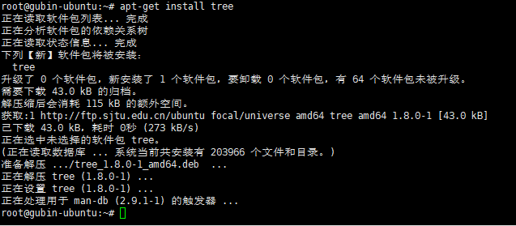		

​		加载完模块之后，系统会在/sys/modules 目录下新建一个目录，比如对于 mytest模块会新建一个名为 mytest 的目录。

```
rlk@ubuntu:mytest$ tree -a
.
├── coresize
├── holders
├── initsize
├── initstate
├── notes
│ ├── .note.gnu.build-id
│ └── .note.Linux
├── refcnt
├── sections
│ ├── .exit.text
│ ├── .gnu.linkonce.this_module
│ ├── .init.text
│ ├── __mcount_loc
│ ├── .note.gnu.build-id
│ ├── .note.Linux
│ ├── .rodata.str1.1
│ ├── .rodata.str1.8
│ ├── .strtab
│ └── .symtab
├── srcversion
├── taint
└── uevent
3 directories, 19 files
```

​		如果需要卸载模块，可以通过 rmmod 命令来实现。

​		我们最后总结一下 Linux 内核模块的结构。

- 模块加载函数：加载模块时，该函数会自动执行，通常做一些初始化工作。

- 模块卸载函数：卸载模块时，该函数也会自动执行，做一些清理工作。

- 模块许可声明：内核模块必须声明许可证，否则内核会发出被污染的警告。

- 模块参数：根据需求来添加，为可选项。

- 模块作者和描述声明：一般都需要完善这些信息。

- 模块导出符号：根据需求来添加，为可选项。

## 四．在 QEMU+runninglinuxkernel 系统中编译运行

​		要编译一个在 ARM64 系统运行内核模块，通常有两种方法，一个是直接在 arm64系统中本地编译，这个方法和在 Ubuntu 主机上编译内核模块类似，另外一个是交叉编译。

### 4.1 交叉编译内核模块

​		交叉编译一个在 ARM64 的 Linux 系统中运行的内核模块和之前我们介绍的Ubuntu 的方法略有不同。需要手工编写一个 Makefile 文件，示例如下如下：

```makefile
BASEINCLUDE ?= /home/rlk/rlk/runninglinuxkernel_5.0

mytest-objs := my_test.o
obj-m := mytest.o

all:
	$(MAKE) -C $(BASEINCLUDE) M=$(PWD) modules

clean:
	$(MAKE) -C $(BASEINCLUDE) SUBDIRS=$(PWD) clean
	rm -f *.ko
```

​		最大的不同就是第 0 行的 BASEINCLUDE 需要指定到编译 runninglinuxkernel 的内核目录，并且该内核目录需要提前编译完成。

​		本实验的参考代码是在：/home/rlk/rlk/runninglinuxkernel_5.0/kmodules/rlk_lab/rlk_basic/chapter_5_module/lab1_simple_module

我们以本实验代码为例来介绍如何编译和安装内核模块。

**PS：我在普通用户中来做**

```
$ cd /home/rlk/rlk/runninglinuxkernel_5.0 //进入runninglinuxkernel内核目录

$ ./run_rlk_arm64.sh build_kernel
```

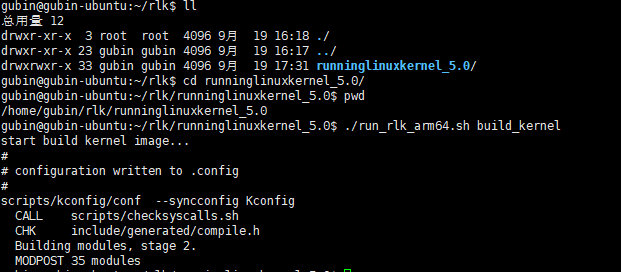

内核编译完成支持就可以编译内核模块了。进入本实验的参考代码目录。

```
$ cd 
/home/rlk/rlk/runninglinuxkernel_5.0/kmodules/rlk_lab/rlk_basic/chapter_5_mod
ule/lab1_simple_module
$ export ARCH=arm64
$ export CROSS_COMPILE=aarch64-linux-gnu-
$ export BASEINCLUDE=/home/rlk/rlk/runninglinuxkernel_5.0
$ make
```


修改makefile文件，将BASEINCLUDE改掉，路径也要改为本机的(其实可以不修改的)

------

### 补充：

是的，你的做法是正确的。通过使用 `export BASEINCLUDE=/home/gubin/rlk/runninglinuxkernel_5.0`，你在当前的 shell 环境中定义了 `BASEINCLUDE` 变量的值，这会覆盖 Makefile 中定义的 `BASEINCLUDE` 变量。这样你可以在不修改 Makefile 的情况下使用你需要的路径。

#### 详细解释：

- 在 Makefile 中，`BASEINCLUDE ?= /lib/modules/$(shell uname -r)/build` 表示 **如果** `BASEINCLUDE` 没有在环境变量中定义，则使用默认的 `/lib/modules/...` 路径。

- 当你在终端中使用 `export BASEINCLUDE=/home/gubin/rlk/runninglinuxkernel_5.0` 时，你已经在环境中定义了 `BASEINCLUDE`，所以 Makefile 中的 `?=` 运算符不会覆盖这个环境变量。

  因此，`export` 变量后再运行 `make` 会让 Makefile 使用你指定的路径，而不会使用 Makefile 中的默认路径。

#### 具体操作步骤：

1. 在终端中运行：

   ```
   export BASEINCLUDE=/home/gubin/rlk/runninglinuxkernel_5.0
   ```

2. 然后运行 `make`，Makefile 会使用你设置的 `BASEINCLUDE` 路径：

   ```
   make
   ```

#### 验证：

你可以在 Makefile 中打印 `BASEINCLUDE` 的值来确认它的来源，方法是在 Makefile 中添加如下调试信息：

```
all:
	@echo "BASEINCLUDE is set to $(BASEINCLUDE)"
	$(MAKE) -C $(BASEINCLUDE) M=$(PWD) modules
```

这会在运行 `make` 时打印 `BASEINCLUDE` 的值，让你确认它是否正确设置为 `/home/gubin/rlk/runninglinuxkernel_5.0`。

总结来说，通过 `export BASEINCLUDE=...` 在 shell 中指定 `BASEINCLUDE` 是一种非常灵活的方式，你不需要修改 Makefile，且可以根据需要动态切换不同的内核源目录。

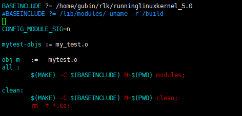

------


### **进行编译**

```
$ export ARCH=arm64
$ export CROSS_COMPILE=aarch64-linux-gnu-
$ export BASEINCLUDE=/home/gubin/rlk/runninglinuxkernel_5.0
$ make
```

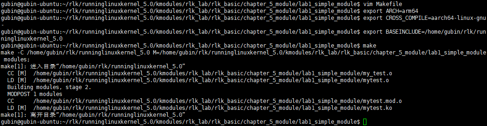

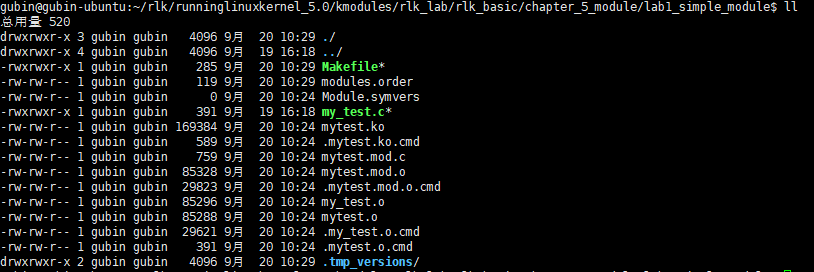

==**注意：**==

1. **我们在交叉编译内核模块的时候，需要指定** BASEINCLUDE 变量到我们runninglinuxkernel_5.0的绝对路径上。这个BASEINCLUDE变量是在Makefile里定义的，当然你可以换一个名字，比如叫 KERNPATH 等。

   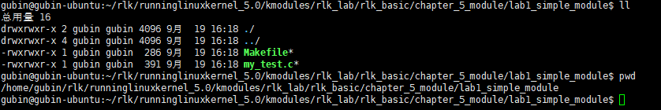

   
   
   编译完成之后就看到 mytest.ko 文件。用 file 命令检查编译的结果是否为 ARM64架构的格式。

```
rlk@rlk:lab1_simple_module$ file mytest.ko 
mytest.ko: ELF 64-bit LSB relocatable, ARM aarch64, version 1 (SYSV), 
BuildID[sha1]=6c9ec8997113baabbba45f0421f88e572c7b9b6a, with debug_info, not 
stripped
```

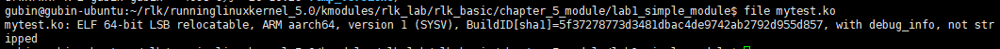

------

### 补充：

`mytest.ko` 是一个 **Linux 内核模块** 文件。

#### 具体解释：

- **`.ko` 文件**：`.ko` 是 **Kernel Object** 的缩写，表示这是一个 **内核模块**，即可以在运行时加载到 Linux 内核中的二进制文件。`.ko` 文件是 Linux 内核加载模块时的标准格式，从 Linux 2.6 内核版本开始，`.ko` 替代了之前的 `.o` 文件格式。
- **`mytest.ko`**：这个模块文件通常是通过编译一个 Linux 内核模块源文件（例如 `my_test.c`）生成的。它是可加载的内核扩展，用于向内核添加特定功能，而不需要重新编译或重启内核。模块的内容和功能是根据你写的代码（如 `my_test.c`）来决定的。

#### 作用：

1. **动态加载**：`mytest.ko` 可以通过 `insmod` 或 `modprobe` 命令加载到内核中，动态添加功能（例如，驱动程序或其他系统扩展）。

   加载内核模块的命令：

   ```
   sudo insmod mytest.ko
   ```

2. **动态卸载**：加载后，也可以通过 `rmmod` 命令将其从内核中移除，释放它所占用的内核资源。

   卸载内核模块的命令：

   ```
   sudo rmmod mytest
   ```

3. **调试与开发**：在开发内核驱动程序或进行系统调试时，通常会将特定功能实现为内核模块，并通过 `.ko` 文件加载到内核中进行测试。

#### 生成方式：

通过编写内核模块源代码（如你之前展示的 `my_test.c`），然后使用 `Makefile` 编译它，生成 `.ko` 文件。`mytest.ko` 是由 `my_test.o` 文件链接生成的，符合内核模块的格式和要求。

例如，在你的 `Makefile` 中，执行以下步骤生成 `mytest.ko`：

```
make
```

这会调用内核构建系统来编译并生成 `.ko` 文件。

#### 结构：

`mytest.ko` 是一个 **ELF（Executable and Linkable Format）** 格式的文件，具有以下特点：

- 它包含二进制指令，允许内核在运行时执行。
- 它包含符号表，用于在加载时与内核现有的符号进行链接。
- 内核模块是 **可重定位的**，意味着它们可以被加载到内存中的不同位置，而不会影响执行。

#### 使用场景：

- **驱动程序**：许多设备驱动程序通过 `.ko` 模块的方式被加载到内核中，确保特定硬件可以与操作系统通信。
- **功能扩展**：如果你想为 Linux 内核添加某些功能，可以将其编写为模块，并在需要时加载。
- **调试和实验**：内核模块也可以用于实验性开发，方便在内核中动态加载或卸载功能，而不需要重启系统。

#### 总结：

- `mytest.ko` 是一个 Linux 内核模块文件，表示一个已编译的内核扩展（如驱动程序或其他功能），可以在不重新编译整个内核的情况下动态加载或卸载。
- 通过加载 `.ko` 文件，你可以将新的功能集成到运行中的 Linux 内核中。

------

### 启动 QEMU+runninglinuxkernel

```
$ cd /home/gubin/rlk/runninglinuxkernel_5.0
$ ./run_rlk_arm64.sh run
```

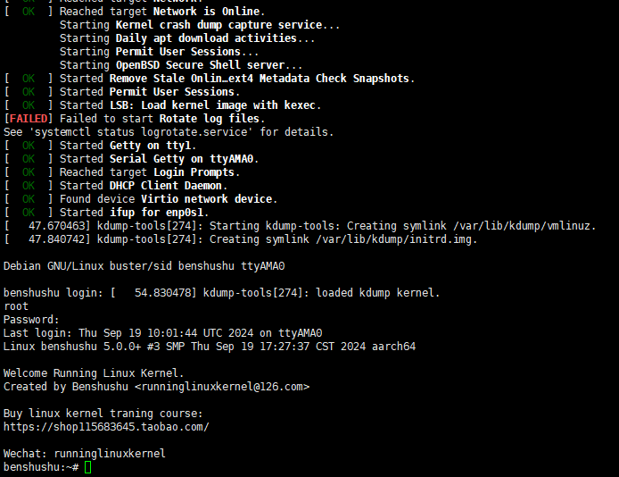

------

### 补充：NET_9P共享文件内核模块在脚本中的体现

你提供的脚本中确实配置了与 **9P 文件系统共享** 相关的 QEMU 设置，但没有明确说明是否在内核中启用了 **NET_9P** 相关的模块支持。

#### 9P 文件系统共享设置：

在脚本的 `run_qemu_debian` 函数中，有如下部分：

```
--fsdev local,id=kmod_dev,path=./kmodules,security_model=none \
-device virtio-9p-pci,fsdev=kmod_dev,mount_tag=kmod_mount \
```

这两行表示 QEMU 已配置使用 **9P 文件系统共享**，即将本地的 `./kmodules` 目录映射到虚拟机，并通过 `virtio-9p-pci` 设备与虚拟机共享。你可以在虚拟机中通过 `kmod_mount` 标签挂载该共享。

#### 检查是否启用了内核中的 9P 支持：

要让 9P 文件系统共享正常工作，内核必须启用相关的 **9P 网络文件系统支持**，具体来说，是 `NET_9P` 和 `9P_FS` 选项。你可以通过以下方法检查或启用：

##### 1. **检查内核配置**：

可以通过查看当前内核配置文件 `.config` 来确认是否启用了 9P 文件系统支持。

在内核源码目录中运行以下命令查看是否启用了相关选项：

```
grep CONFIG_NET_9P .config
grep CONFIG_9P_FS .config
```

输出应该是：

- `CONFIG_NET_9P=m` 或者 `CONFIG_NET_9P=y`
- `CONFIG_9P_FS=m` 或者 `CONFIG_9P_FS=y`

其中：

- `m` 表示 9P 文件系统支持被编译为模块，可以通过 `modprobe 9pnet` 来加载模块。
- `y` 表示 9P 文件系统支持已经直接内建在内核中。

##### 2. **启用内核配置**：

如果没有启用 9P 文件系统支持，你可以通过以下步骤启用：

1. 运行 `make menuconfig` 命令进入内核配置界面：

   ```
   make menuconfig
   ```

2. 进入以下选项以启用 9P 文件系统支持：

   - **File systems** -> **Network File Systems** -> **Plan 9 Resource Sharing Support (9P2000)** (`CONFIG_9P_FS`)
   - **Device Drivers** -> **Network device support** -> **9P TCP support** (`CONFIG_NET_9P`)

3. 保存配置并重新编译内核：

   ```
   make -j$(nproc)
   ```

4. 重新生成内核模块和文件系统，并在 QEMU 虚拟机中进行测试。

##### 3. **加载模块**：

如果你启用了 9P 支持作为模块（即 `CONFIG_9P_FS=m`），你需要在虚拟机中加载 9P 模块：

```
modprobe 9p
modprobe 9pnet
```

#### 总结：

- 脚本中已经配置了 QEMU 的 9P 文件系统共享 (`virtio-9p-pci`)，但你需要确保内核启用了 `NET_9P` 和 `9P_FS` 支持。
- 通过查看 `.config` 文件或使用 `make menuconfig` 来确认或启用 9P 支持。
- 如果启用了 9P 文件系统作为模块，请确保在虚拟机中加载相关模块。

如果这些都正确配置，你应该可以在虚拟机中使用 9P 文件系统共享。

------

### 补充：lrwxrwxrwx   1 gubin gubin         19 9月  19 16:18 run_rlk_arm64.sh -> run_debian_arm64.sh*这个>表示什么意思

在 Linux 文件系统中，`>` 表示这是一个 **符号链接（Symbolic Link，简称软链接）**。它类似于 Windows 中的快捷方式，指向另一个文件或目录。

#### 具体解释：

```
lrwxrwxrwx   1 gubin gubin         19 9月  19 16:18 run_rlk_arm64.sh -> run_debian_arm64.sh*
```

- **`lrwxrwxrwx`**：开头的字母 `l` 表示这是一个符号链接（`l` 是 **link** 的缩写）。后面的 `rwxrwxrwx` 代表该链接文件的权限设置。
- **`run_rlk_arm64.sh`**：这是你创建的符号链接的名称。
- **`-> run_debian_arm64.sh\*`**：符号链接指向的目标文件或路径。在这种情况下，`run_rlk_arm64.sh` 指向了 `run_debian_arm64.sh`。这意味着，当你执行 `run_rlk_arm64.sh` 时，系统实际上会访问并执行 `run_debian_arm64.sh` 文件。

#### 作用：

- **符号链接** 使你可以创建一个文件或目录的别名，它指向目标文件或目录。符号链接本身只占用极少的存储空间，但访问符号链接时，系统会自动重定向到链接的目标文件。

#### 使用场景：

- 你可以用符号链接创建简短的别名，或者为不同版本的文件创建通用的访问路径。
- 符号链接常用于指向共享库、配置文件、或者多个脚本版本，方便管理和切换。

#### 如何创建符号链接：

可以使用 `ln -s` 命令来创建符号链接。例如：

```
ln -s run_debian_arm64.sh run_rlk_arm64.sh
```

这将创建一个符号链接 `run_rlk_arm64.sh`，指向 `run_debian_arm64.sh`。

### 总结：

- `>` 表示 `run_rlk_arm64.sh` 是一个符号链接，它指向 `run_debian_arm64.sh`。
- 执行或访问 `run_rlk_arm64.sh` 时，系统实际上会去操作 `run_debian_arm64.sh`。

------

### 补充：**`run_rlk_arm64.sh` 并不是空的**

它是一个 **符号链接**，指向了另一个文件 **`run_debian_arm64.sh`**。符号链接本身并不存储实际的文件内容，它只包含指向目标文件的路径。

因此，**`run_rlk_arm64.sh`** 的行为实际上是依赖于它指向的目标文件 **`run_debian_arm64.sh`**。当你打开或执行 **`run_rlk_arm64.sh`** 时，系统会自动转到 **`run_debian_arm64.sh`**，并执行它的内容。

#### 如何确认符号链接的目标内容：

你可以通过以下方式查看符号链接的目标文件内容：

1. **查看目标文件的内容**： 直接查看 `run_debian_arm64.sh` 文件的内容：

   ```
   cat run_debian_arm64.sh
   ```

   或者使用任何文本编辑器来查看或编辑它：

   ```
   nano run_debian_arm64.sh
   ```

2. **确认符号链接指向的文件**： 使用 `ls -l` 命令可以查看符号链接指向的目标文件：

   ```
   ls -l run_rlk_arm64.sh
   ```

   输出会显示符号链接指向的文件路径，如你之前提到的：

   ```
   lrwxrwxrwx 1 gubin gubin 19 9月 19 16:18 run_rlk_arm64.sh -> run_debian_arm64.sh*
   ```

#### 总结：

- **`run_rlk_arm64.sh`** 本身是一个符号链接，指向了 **`run_debian_arm64.sh`**，因此它不直接存储内容。
- 你可以通过查看 **`run_debian_arm64.sh`** 的内容来了解执行的脚本逻辑。

### 补充：打开ll等命令在虚拟机

```
vim ~/.bashrc
source ~/.bashrc
```

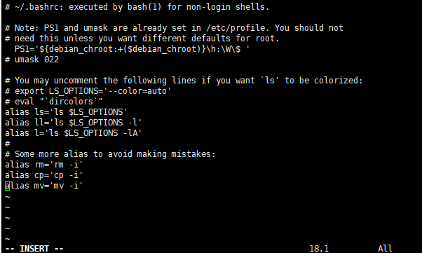

------

进入本实验的参考代码。

```
# cd /mnt/rlk_lab/rlk_basic/chapter_5_module/lab1_simple_module
```

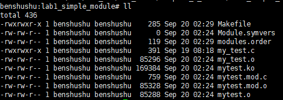

使用 insmod 命令加载内核模块。

```
/mnt # insmod mytest.ko 
my first kernel module init
/mnt #
```


------

### 补充：insmod mytest.ko 内涵

`insmod mytest.ko` 命令的功能是将 **内核模块 `mytest.ko`** 动态加载到正在运行的 Linux 内核中。

#### 具体解释：

1. **`insmod`**：
   - `insmod` 是 Linux 中的一个命令，用于将一个已编译的内核模块（`.ko` 文件）加载到当前运行的内核中。它会直接加载指定的模块文件到内核，并初始化模块中的代码。
   - **`insmod`** 只加载你指定的内核模块，不会处理模块之间的依赖关系。
2. **`mytest.ko`**：
   - 这是一个经过编译的 **内核模块** 文件，通常扩展名为 `.ko`。内核模块是一个可以动态加载到内核中的程序，它可以添加内核的功能，比如设备驱动程序、文件系统支持等。
   - `mytest.ko` 可能是你编写的一个测试内核模块，它实现了某些特定的功能，比如输出日志或添加特定的系统功能。

#### 执行流程：

当你执行 `insmod mytest.ko` 时，系统会：

1. **加载模块**：

   - 将模块 `mytest.ko` 加载到内核中，并分配所需的内存空间。

2. **初始化模块**：

   - 执行模块的初始化函数，通常在模块代码中由 

     ```
     module_init()
     ```

      宏定义。在你之前的代码中，初始化函数是 

     ```
     my_test_init()
     ```

     它会打印出一条信息：

     ```
     printk(KERN_EMERG "my first kernel module init\n");
     ```

3. **模块注册**：

   - 如果模块包含对内核功能的扩展（例如设备驱动程序或文件系统支持），它会向内核注册这些功能。

4. **模块功能生效**：

   - 模块的功能立即生效，可以执行模块代码中定义的功能。

例如，如果 `mytest.ko` 是一个设备驱动程序，它将负责管理某个硬件设备。在模块加载之后，系统就能够识别并与该硬件设备交互。

#### 相关命令：

1. **查看已加载模块**： 你可以使用 `lsmod` 命令查看当前内核中加载的模块列表，包括刚才加载的 `mytest` 模块：

   ```
   lsmod | grep mytest
   ```

2. **卸载模块**： 如果想卸载刚才加载的模块，可以使用 `rmmod` 命令：

   ```
   sudo rmmod mytest
   ```

   这会调用模块的退出函数 `my_test_exit()`，并从内核中移除该模块。

#### 依赖性管理：

- **`insmod` 不会自动加载模块的依赖项**。如果模块依赖其他模块或符号，你需要手动加载这些依赖模块。
- 如果你想自动处理模块依赖，应该使用 `modprobe` 命令，它会自动加载依赖的模块。

#### 总结：

- `insmod mytest.ko` 的功能是将 `mytest.ko` 内核模块加载到 Linux 内核中，动态添加该模块的功能。
- 它会执行模块的初始化函数，分配资源，注册功能，使模块的功能生效。
- 你可以通过 `rmmod` 来卸载该模块，或者使用 `lsmod` 查看已加载的模块。

这是内核开发或驱动开发中常用的命令，用于测试和调试内核模块。

------

通过“/proc/modules”节点可以查看当前系统加载的内核模块。

```
cat /proc/modules
```


通过 rmmod 命令来卸载模块。

```
rmmod mytest
```


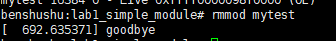

### 4.2 在 ARM64 里编译内核模块

在 arm64 系统里本地编译内核模块和在 Ubuntu Linux 主机上编译内核类似。

启动 QEMU+runninglinuxkernel。

```
$ ./run_rlk_arm64.sh run
```

进入本实验的参考代码。

```
# cd /mnt/rlk_lab/rlk_basic/chapter_5_module/lab1_simple_module
```

我们可以先查看一下 ARM64 系统中的内核版本。

```
benshushu:lab1_simple_module# uname -a

Linux benshushu 5.0.0+ #3 SMP Tue Feb 16 11:40:34 CST 2021 aarch64 GNU/Linux
```


查看一下内核源代码情况。

```
benshushu:lab1_simple_module# ls -l /lib/modules/5.0.0+/
total 68
lrwxrwxrwx 1 root root 14 Dec 3 23:37 build -> /usr/src/linux
drwxr-xr-x 7 root root 4096 Dec 3 23:37 kernel
-rw-r--r-- 1 root root 1153 Dec 3 23:37 modules.alias
-rw-r--r-- 1 root root 1568 Dec 3 23:37 modules.alias.bin
-rw-r--r-- 1 root root 11515 Dec 3 23:37 modules.builtin
-rw-r--r-- 1 root root 0 Dec 3 23:37 modules.builtin.alias.bin
-rw-r--r-- 1 root root 12846 Dec 3 23:37 modules.builtin.bin
-rw-r--r-- 1 root root 1268 Dec 3 23:37 modules.dep
-rw-r--r-- 1 root root 2855 Dec 3 23:37 modules.dep.bin
-rw-r--r-- 1 root root 88 Dec 3 23:37 modules.devname
-rw-r--r-- 1 root root 1188 Dec 3 23:37 modules.order
-rw-r--r-- 1 root root 55 Dec 3 23:37 modules.softdep
-rw-r--r-- 1 root root 2919 Dec 3 23:37 modules.symbols
-rw-r--r-- 1 root root 3559 Dec 3 23:37 modules.symbols.bin
lrwxrwxrwx 1 root root 36 Dec 3 23:37 source ->/home/rlk/rlk/runninglinuxkernel_5.0
```

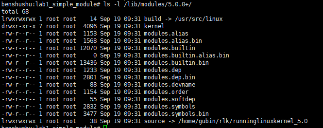

从 build 目录可以看出，这个系统的内核源代码存储在/usr/src/linux 目录。查看/usr/src/linux 目录，可以看到里面有一些和该内核版本对应的依赖文件，例如 vmlinux、System.map 等文件。

```
benshushu:lab1_simple_module# ls -l /usr/src/linux
total 193876
-rw-r--r-- 1 root root 60539 Dec 3 23:37 Makefile
-rw-r--r-- 1 root root 414037 Dec 3 23:37 Module.symvers
-rw-r--r-- 1 root root 3405803 Dec 3 23:37 System.map
drwxr-xr-x 3 root root 4096 Dec 3 23:37 arch
drwxrwxr-x 29 benshushu benshushu 4096 Dec 3 23:31 include
lrwxrwxrwx 1 root root 29 Dec 3 23:37 scripts -> 
/usr/src/linux-kbuild/scripts
-rwxr-xr-x 1 root root 194775264 Dec 3 23:37 vmlinux
```

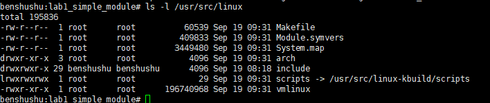

接下来，直接输入 make 命令来编译内核模块。

```
benshushu:lab1_simple_module# make
make -C /lib/modules/`uname -r`/build 
M=/mnt/rlk_lab/rlk_basic/chapter_5_module/lab1_simple_module modules;
make[1]: Entering directory '/usr/src/linux'
 CC [M] 
/mnt/rlk_lab/rlk_basic/chapter_5_module/lab1_simple_module/my_test.o
 LD [M] /mnt/rlk_lab/rlk_basic/chapter_5_module/lab1_simple_module/mytest.o
 Building modules, stage 2.
 MODPOST 1 modules
 CC 
/mnt/rlk_lab/rlk_basic/chapter_5_module/lab1_simple_module/mytest.mod.o
 LD [M] 
/mnt/rlk_lab/rlk_basic/chapter_5_module/lab1_simple_module/mytest.ko
make[1]: Leaving directory '/usr/src/linux'
```

PS:我们先清除之前在Ubuntu中make编译生成的

```
#在ubuntu中
make clean
#在qemu arm64中
make
```

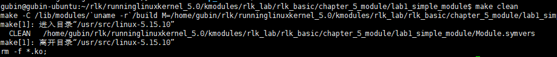

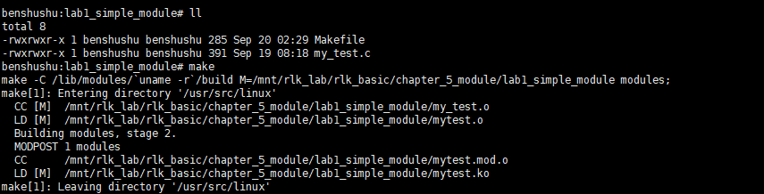

使用 insmod 命令来加载模块。

```
benshushu:lab1_simple_module# insmod mytest.ko 
[ 801.526309] my first kernel module init
```

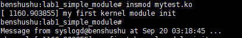

```
#卸载
rmmod mytest
```

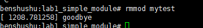

## 五．在树莓派中运行

读者也可以在树莓派中编译和运行本实验。

1. 需要把实验的参考代码拷贝到树莓派的文件系统里，可以通过 U 盘来拷贝。

2. 进入到实验代码里，直接 make 即可编译。

3. 使用 insmod 命令来加载内核模块。

4. 使用 dmesg 命令来查看内核日志。

## 六. 实验代码解析

 本实验的参考代码如下。

```C
#include <linux/module.h>
#include <linux/init.h>

static int __init my_test_init(void)
{
    printk(KERN_EMERG "my first kernel module init\n");
    return 0;
}

static void __exit my_test_exit(void)
{
    printk("goodbye\n");
}

module_init(my_test_init);
module_exit(my_test_exit);

MODULE_LICENSE("GPL");
MODULE_AUTHOR("Ben Shushu");
MODULE_DESCRIPTION("my test kernel module");
MODULE_ALIAS("mytest");

```

代码分析见书上第 5.1 章内容。


实验结束