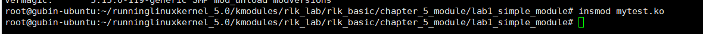

# 实验 5-1：编写一个简单的内核模块

## 一．实验目的

了解和熟悉编译一个基本的内核模块需要包含的元素。

## 二．实验步骤

1）编写一个简单的内核模块程序。

2）编写对应的 Makefile 文件。

3）在 Ubuntu Linux 机器上编译和加载运行该内核模块。

4）在 QEMU 上运行 ARM64 的 Linux 系统，编译该内核模块并运行。

## 三．在 ubuntu 主机上编译和运行

### 1.编写my_test.c和Makefile

my_test.c

```C
#include <linux/module.h>
#include <linux/init.h>

static int __init my_test_init(void)
{
	printk(KERN_EMERG "my first kernel module init\n");
	return 0;
}

static void __exit my_test_exit(void)
{
	printk("goodbye\n");
}

module_init(my_test_init);
module_exit(my_test_exit);

MODULE_LICENSE("GPL");
MODULE_AUTHOR("rlk");
MODULE_DESCRIPTION("my test kernel module");
MODULE_ALIAS("mytest");

```

在 ubuntu 主机上编译和运行一个内核模块，对应的 Makefile 文件如下。

<Makefile文件>

```makefile
#BASEINCLUDE ?= /home/rlk/rlk/runninglinuxkernel_5.0
BASEINCLUDE ?= /lib/modules/`uname -r`/build

CONFIG_MODULE_SIG=n

mytest-objs := my_test.o 

obj-m	:=   mytest.o
all : 
	$(MAKE) -C $(BASEINCLUDE) M=$(PWD) modules;

clean:
	$(MAKE) -C $(BASEINCLUDE) M=$(PWD) clean;
	rm -f *.ko;
```

PS:这里我们使用第五章教程快速搭建


​		第 0 行的 BASEINCLUDE 指向正在运行 Linux 的内核编译目录，为了编译Linux 主机上运行的内核模块，我们需要指定到当前系统对应的内核中。一般来说，Linux 系统的内核模块都会安装到/lib/modules 目录下，通过“uname -r”命令可以找到对应的内核版本。

```
$ uname -r
5.4.0-18-generic
$ ls -l
total 5788
lrwxrwxrwx 1 root root 39 Mar 26 23:24 build -> /usr/src/linux-headers-
5.4.0-18-generic
drwxr-xr-x 2 root root 4096 Mar 7 08:23 initrd
drwxr-xr-x 17 root root 4096 Mar 24 00:38 kernel
-rw-r--r-- 1 root root 1382469 Mar 24 00:40 modules.alias
-rw-r--r-- 1 root root 1358633 Mar 24 00:40 modules.alias.bin
-rw-r--r-- 1 root root 8105 Mar 7 08:23 modules.builtin
-rw-r--r-- 1 root root 24985 Mar 24 00:40 modules.builtin.alias.bin
-rw-r--r-- 1 root root 10257 Mar 24 00:40 modules.builtin.bin
-rw-r--r-- 1 root root 63280 Mar 7 08:23 modules.builtin.modinfo
-rw-r--r-- 1 root root 609357 Mar 24 00:40 modules.dep
-rw-r--r-- 1 root root 851773 Mar 24 00:40 modules.dep.bin
-rw-r--r-- 1 root root 330 Mar 24 00:40 modules.devname
-rw-r--r-- 1 root root 219838 Mar 7 08:23 modules.order
-rw-r--r-- 1 root root 791 Mar 24 00:40 modules.softdep
-rw-r--r-- 1 root root 613833 Mar 24 00:40 modules.symbols
-rw-r--r-- 1 root root 746598 Mar 24 00:40 modules.symbols.bin
drwxr-xr-x 3 root root 4096 Mar 24 00:38 vdso
```

这里可通过“uname -r”来查看当前系统的内核版本，比如作者的系统里面安装了5.4.0-18-generic 内核版本，这个内核版本的头文件存放在/usr/src/linux-headers-5.4.0-18-generic 目录中。


​		第 2 行表示该内核模块需要哪些目标文件，格式如下。

```
<模块名>-objs := <目标文件>.o
```

​		第 3 行表示要生成的模块。注意，模块名不能和目标文件名相同。

```
格式是： obj-m :=<模块名>.o
```

​		第 5 和 6 行表示要编译执行的动作。

​		第 8～10 行表示执行 make clean 需要的动作。

#### 补充：Makefile文件分析

这个 Makefile 是为构建 Linux 内核模块（例如 `mytest` 模块）而编写的。它定义了如何使用当前系统的内核头文件编译模块文件，以及如何清理构建文件。下面对其内容进行详细解释：

##### 1. **`BASEINCLUDE ?= /lib/modules/$(shell uname -r)/build`**

```
BASEINCLUDE ?= /lib/modules/$(shell uname -r)/build
```

- `BASEINCLUDE` 定义了内核源代码或内核构建目录的路径。
- `/lib/modules/$(shell uname -r)/build` 是动态获取当前运行内核版本的构建目录路径，`$(shell uname -r)` 使用 shell 命令 `uname -r` 获取当前内核的版本号，并用它来构造内核模块的路径。
- 该路径是系统内核模块的默认编译路径，通常指向 `/usr/src/linux-headers-<kernel_version>`。
- 这里也可以看到有一行被注释掉的 `#BASEINCLUDE ?= /home/rlk/rlk/runninglinuxkernel_5.0`，这表示你也可以自定义内核源代码的位置。如果想编译不同于系统内核的版本，可以取消注释这行并修改路径。

##### 2. **`CONFIG_MODULE_SIG=n`**

```
CONFIG_MODULE_SIG=n
```

- 这一行禁用了模块签名验证（`CONFIG_MODULE_SIG`），即在编译模块时不对模块进行签名。
- 当你将模块插入内核时，内核可以要求模块签名验证，以确保模块没有被篡改。设置 `CONFIG_MODULE_SIG=n` 是为了关闭这个验证，方便开发调试阶段使用。
- 如果系统配置了强制签名验证的安全机制（如在某些安全性较高的发行版中），你可能需要确保模块经过签名才能加载。

##### 3. **`mytest-objs := my_test.o`**

```
mytest-objs := my_test.o
```

- 这是编译 **mytest** 模块的对象文件列表。这里的 **`mytest-objs`** 表示模块 `mytest` 由 `my_test.o` 文件组成。
- 如果模块包含多个源文件，这里会列出所有需要编译的对象文件，例如 `mytest-objs := file1.o file2.o`。

##### 4. **`obj-m := mytest.o`**

```
obj-m := mytest.o
```

- `obj-m` 表示这个模块是一个外部模块，将编译为可加载的内核模块（`mytest.ko` 文件）。`mytest.o` 是最终链接生成模块的目标文件。
- `obj-m` 指明了要生成的模块名称，并且表明这是一个可以被 `insmod` 或 `modprobe` 加载的可加载模块。

##### 5. **`all` 规则**

```
all:
	$(MAKE) -C $(BASEINCLUDE) M=$(PWD) modules
```

- 这个规则定义了当运行 `make` 时会执行的操作，即构建内核模块。

- `$(MAKE)` 调用了 GNU Make 工具。

- ```
  -C $(BASEINCLUDE)
  ```

   切换到 内核构建目录，即 

  ```
  /lib/modules/$(shell uname -r)/build
  ```

  - `-C` 选项是告诉 Make 切换到内核源代码目录下，并在该目录下运行编译过程。

- `M=$(PWD)`：`M=` 指定当前模块的路径，即将 **当前目录（`$(PWD)`）** 作为模块路径传递给内核构建系统。

- `modules`：这是目标，告诉内核构建系统只构建模块。实际上，这会调用内核的 Makefile 来构建你的模块。

这条命令相当于调用内核的 Makefile 来编译你的外部模块，并确保与当前内核匹配。

##### 6. **`clean` 规则**

```
clean:
	$(MAKE) -C $(BASEINCLUDE) M=$(PWD) clean
	rm -f *.ko
```

- `clean` 规则用于清理构建过程中的临时文件。
- `$(MAKE) -C $(BASEINCLUDE) M=$(PWD) clean`：调用内核的 Makefile，执行清理操作，删除编译过程中生成的中间文件，如 `.o` 文件和模块依赖文件。
- `rm -f *.ko`：手动删除所有 `.ko` 文件（内核模块文件）。这是在构建目录下删除生成的 `.ko` 文件。

##### Makefile 工作原理总结：

1. 编译：
   - 当你运行 `make` 时，`all` 规则被触发。它会调用内核的构建系统，并在你指定的路径下编译你的模块文件，最终生成 `.ko` 文件。
2. 清理：
   - 当你运行 `make clean` 时，`clean` 规则被触发。它会删除编译过程中生成的所有中间文件和 `.ko` 文件，保持目录整洁。

##### 使用步骤：

1. 编译模块：

   ```
   make
   ```

2. 清理编译生成的文件：

   ```
   make clean
   ```

通过这个 Makefile，你可以方便地使用当前系统的内核头文件编译和清理内核模块。


### 2.编译

### make

​		这里在 Linux 主机的终端中输入 make 命令来执行编译。

```
$ make
```

​		编译完之后会生成 mytest.ko 文件。

```
$ ls
Makefile modules.order Module.symvers my_test.c mytest.ko 
mytest.mod.c mytest.mod.o my_test.o mytest.o
```


### 	file	

​		我们可以通过 file 命令检查编译的模块是否正确，只要能看到变成 x86-64 架构的 ELF 文件，就说明已经编译成功了。

```
$file mytest.ko 
mytest.ko: ELF 64-bit LSB relocatable, x86-64, version 1 (SYSV), 
BuildID[sha1]=57aa8267c3049e08ac8f7e47b4e378c284c8d5c3, not stripped
```


#### 补充：命令 `$ file mytest.ko` 是用于确定文件类型的 Linux 命令。

具体解释如下：

##### 1. **命令解释：**

```
file mytest.ko
```

- **`file`**：这是一个 Linux 命令，用于查看文件的类型和详细信息。它通过检查文件的 "magic number"（文件中的特定字节序列）来确定文件类型。
- **`mytest.ko`**：这是你要查看的文件，通常在这里指的是一个内核模块文件。

##### 2. **输出解释：**

```
mytest.ko: ELF 64-bit LSB relocatable, x86-64, version 1 (SYSV),
BuildID[sha1]=57aa8267c3049e08ac8f7e47b4e378c284c8d5c3, not stripped
```

##### **逐项解释输出内容：**

- **`ELF`**：指的是 **Executable and Linkable Format（可执行和可链接格式）**，这是 Linux 上常见的可执行文件、目标文件和共享库的格式。内核模块通常也是 ELF 格式的可重定位目标文件。
- **`64-bit`**：表示这个文件是 64 位的，针对 64 位的处理器架构编译。
- **`LSB`**：表示 **Least Significant Byte（最低有效字节）** 在前，也就是说这是 **小端序**（Little Endian）格式。这是 x86-64 架构的标准字节序。
- **`relocatable`**：表示这是一个 **可重定位** 文件。内核模块在加载时可以动态调整地址，并不是硬编码到某个固定地址的。这是内核模块常见的属性，因为它们需要被内核动态加载到不同的内存地址。
- **`x86-64`**：表示该文件是为 **x86-64 架构**（也称为 AMD64 或 Intel 64）编译的。这是现代 64 位 Intel 和 AMD 处理器使用的架构。
- **`version 1 (SYSV)`**：这是 ELF 文件的版本信息，`SYSV` 表示该文件遵循 System V ABI（应用二进制接口）的标准。
- **`BuildID[sha1]=57aa8267c3049e08ac8f7e47b4e378c284c8d5c3`**：这是文件的 **Build ID**，通过 SHA-1 哈希生成，用于唯一标识这个文件的特定构建。内核模块的 Build ID 用于调试符号、调试信息和模块版本的匹配。
- **`not stripped`**：表示该文件没有被 **剥离调试符号**。内核模块通常会保留调试信息（符号表），以便在出现问题时可以进行内核调试。如果文件被 "stripped"，调试符号将被移除，文件大小会减小，但调试会变得困难。

##### 3. **总结：**

- 该文件是一个 **64 位的内核模块文件**，采用 **ELF 格式**，为 **x86-64 架构**编译，并且是 **可重定位的**（即可以动态加载到不同内存地址）。
- 文件还包含 **调试符号**（因为它没有被 `strip` 处理），保留了用于调试的符号表。
- **Build ID** 是这个模块的唯一标识符，便于调试和符号解析。

这表明 `mytest.ko` 是一个为 64 位 Linux 系统准备的内核模块，处于可调试状态，尚未被剥离符号信息，通常是在开发或调试阶段使用的。	

### modinfo

​		另外，也可以通过 **modinfo 命令**做进一步检查。

```
$rlk@ubuntu:lab1_simple_module$ modinfo mytest.ko
filename:
```

```
/home/rlk/rlk/runninglinuxkernel_5.0/kmodules/rlk_basic/chapter_4/lab1_simple_modul
e/mytest.ko
alias: mytest
description: my test kernel module
author: rlk
license: GPL
srcversion: E1C6E916BC7D77AFC3F99D7
depends: 
retpoline: Y
name: mytest
vermagic: 5.4.0-18-generic SMP mod_unload
```


### insmod,demsg

​		接下来就可以在 Linux 主机上验证我们的内核模块了。

```
$sudo insmod mytest.ko
```



​		你会发现没有输出信息，那是因为例子中的输出函数 printk()采用了默认输出等级，可以使用 dmesg 命令查看内核的输出信息。**输出内容很多**

```
$dmesg
…
[258.575353] my first kernel module init
```


### lsmod		

​		另外，可以通过 lsmod 命令查看当前模块 mytest 是否已经被加载到系统中，这会显示模块之间的依赖关系。

```
$ lsmod 
Module Size Used by
mytest 16384 0
bnep 24576 2
xt_CHECKSUM 16384 1
```


### tree

```
apt install tree
```

​		加载完模块之后，系统会在/sys/modules 目录下新建一个目录，比如对于 mytest模块会新建一个名为 mytest 的目录。

```
rlk@ubuntu:mytest$ tree -a
.
├── coresize
├── holders
├── initsize
├── initstate
├── notes
│ ├── .note.gnu.build-id
│ └── .note.Linux
├── refcnt
├── sections
│ ├── .exit.text
│ ├── .gnu.linkonce.this_module
│ ├── .init.text
│ ├── __mcount_loc
│ ├── .note.gnu.build-id
│ ├── .note.Linux
│ ├── .rodata.str1.1
│ ├── .rodata.str1.8
│ ├── .strtab
│ └── .symtab
├── srcversion
├── taint
└── uevent
3 directories, 19 files
```

​		如果需要卸载模块，可以通过 rmmod 命令来实现。

​		我们最后总结一下 Linux 内核模块的结构。

- 模块加载函数：加载模块时，该函数会自动执行，通常做一些初始化工作。

- 模块卸载函数：卸载模块时，该函数也会自动执行，做一些清理工作。

- 模块许可声明：内核模块必须声明许可证，否则内核会发出被污染的警告。

- 模块参数：根据需求来添加，为可选项。

- 模块作者和描述声明：一般都需要完善这些信息。

- 模块导出符号：根据需求来添加，为可选项。

## 四．在 QEMU+runninglinuxkernel 系统中编译运行

​		要编译一个在 ARM64 系统运行内核模块，通常有两种方法，一个是直接在 arm64系统中本地编译，这个方法和在 Ubuntu 主机上编译内核模块类似，另外一个是交叉编译。

### 4.1 交叉编译内核模块

​		交叉编译一个在 ARM64 的 Linux 系统中运行的内核模块和之前我们介绍的Ubuntu 的方法略有不同。需要手工编写一个 Makefile 文件，示例如下如下：

```
0 BASEINCLUDE ?= /home/rlk/rlk/runninglinuxkernel_5.0
1 
2 mytest-objs := my_test.o 
3 obj-m := mytest.o
4 
5 all : 
6 $(MAKE) -C $(BASEINCLUDE) M=$(PWD) modules;
7 
8 clean:
9 $(MAKE) -C $(BASEINCLUDE) SUBDIRS=$(PWD) clean;
10 rm -f *.ko;
```

​		最大的不同就是第 0 行的 BASEINCLUDE 需要指定到编译 runninglinuxkernel 的内核目录，并且该内核目录需要提前编译完成。

​		本实验的参考代码是在：/home/rlk/rlk/runninglinuxkernel_5.0/kmodules/rlk_lab/rlk_basic/chapter_5_module/lab1_simple_module

我们以本实验代码为例来介绍如何编译和安装内核模块。

```
$ cd /home/rlk/rlk/runninglinuxkernel_5.0 //进入runninglinuxkernel内核目录

$ ./run_rlk_arm64.sh build_kernel
```

内核编译完成支持就可以编译内核模块了。进入本实验的参考代码目录。

```
$ cd 
/home/rlk/rlk/runninglinuxkernel_5.0/kmodules/rlk_lab/rlk_basic/chapter_5_mod
ule/lab1_simple_module
$ export ARCH=arm64
$ export CROSS_COMPILE=aarch64-linux-gnu-
$ export BASEINCLUDE=/home/rlk/rlk/runninglinuxkernel_5.0
$ make
```


==**注意：**==

1. **我们在交叉编译内核模块的时候，需要指定** BASEINCLUDE 变量到我们runninglinuxkernel_5.0的绝对路径上。这个BASEINCLUDE变量是在Makefile里定义的，当然你可以换一个名字，比如叫 KERNPATH 等。

   

   编译完成之后就看到 mytest.ko 文件。用 file 命令检查编译的结果是否为 ARM64架构的格式。

```
rlk@rlk:lab1_simple_module$ file mytest.ko 
mytest.ko: ELF 64-bit LSB relocatable, ARM aarch64, version 1 (SYSV), 
BuildID[sha1]=6c9ec8997113baabbba45f0421f88e572c7b9b6a, with debug_info, not 
stripped
```

启动 QEMU+runninglinuxkernel。

```
$ ./run_rlk_arm64.sh run
```

进入本实验的参考代码。

```
\# cd /mnt/rlk_lab/rlk_basic/chapter_5_module/lab1_simple_module
```

使用 insmod 命令加载内核模块。

```
/mnt # insmod mytest.ko 
my first kernel module init
/mnt #
```


通过“/proc/modules”节点可以查看当前系统加载的内核模块。


通过 rmmod 命令来卸载模块。


### 4.2 在 ARM64 里编译内核模块

在 arm64 系统里本地编译内核模块和在 Ubuntu Linux 主机上编译内核类似。

启动 QEMU+runninglinuxkernel。

```
$ ./run_rlk_arm64.sh run
```

进入本实验的参考代码。

```
# cd /mnt/rlk_lab/rlk_basic/chapter_5_module/lab1_simple_module
```

我们可以先查看一下 ARM64 系统中的内核版本。

```
benshushu:lab1_simple_module# uname -a

Linux benshushu 5.0.0+ #3 SMP Tue Feb 16 11:40:34 CST 2021 aarch64 GNU/Linux
```

查看一下内核源代码情况。

```
benshushu:lab1_simple_module# ls -l /lib/modules/5.0.0+/
total 68
lrwxrwxrwx 1 root root 14 Dec 3 23:37 build -> /usr/src/linux
drwxr-xr-x 7 root root 4096 Dec 3 23:37 kernel
-rw-r--r-- 1 root root 1153 Dec 3 23:37 modules.alias
-rw-r--r-- 1 root root 1568 Dec 3 23:37 modules.alias.bin
-rw-r--r-- 1 root root 11515 Dec 3 23:37 modules.builtin
-rw-r--r-- 1 root root 0 Dec 3 23:37 modules.builtin.alias.bin
-rw-r--r-- 1 root root 12846 Dec 3 23:37 modules.builtin.bin
-rw-r--r-- 1 root root 1268 Dec 3 23:37 modules.dep
-rw-r--r-- 1 root root 2855 Dec 3 23:37 modules.dep.bin
-rw-r--r-- 1 root root 88 Dec 3 23:37 modules.devname
-rw-r--r-- 1 root root 1188 Dec 3 23:37 modules.order
-rw-r--r-- 1 root root 55 Dec 3 23:37 modules.softdep
-rw-r--r-- 1 root root 2919 Dec 3 23:37 modules.symbols
-rw-r--r-- 1 root root 3559 Dec 3 23:37 modules.symbols.bin
lrwxrwxrwx 1 root root 36 Dec 3 23:37 source ->
/home/rlk/rlk/runninglinuxkernel_5.0
```

从 build 目录可以看出，这个系统的内核源代码存储在/usr/src/linux 目录。查看

/usr/src/linux 目录，可以看到里面有一些和该内核版本对应的依赖文件，例如 vmlinux、

System.map 等文件。

```
benshushu:lab1_simple_module# ls -l /usr/src/linux
total 193876
-rw-r--r-- 1 root root 60539 Dec 3 23:37 Makefile
-rw-r--r-- 1 root root 414037 Dec 3 23:37 Module.symvers
-rw-r--r-- 1 root root 3405803 Dec 3 23:37 System.map
drwxr-xr-x 3 root root 4096 Dec 3 23:37 arch
drwxrwxr-x 29 benshushu benshushu 4096 Dec 3 23:31 include
lrwxrwxrwx 1 root root 29 Dec 3 23:37 scripts -> 
/usr/src/linux-kbuild/scripts
-rwxr-xr-x 1 root root 194775264 Dec 3 23:37 vmlinux
```

接下来，直接输入 make 命令来编译内核模块。

```
benshushu:lab1_simple_module# make
make -C /lib/modules/`uname -r`/build 
M=/mnt/rlk_lab/rlk_basic/chapter_5_module/lab1_simple_module modules;
make[1]: Entering directory '/usr/src/linux'
 CC [M] 
/mnt/rlk_lab/rlk_basic/chapter_5_module/lab1_simple_module/my_test.o
 LD [M] /mnt/rlk_lab/rlk_basic/chapter_5_module/lab1_simple_module/mytest.o
 Building modules, stage 2.
 MODPOST 1 modules
 CC 
/mnt/rlk_lab/rlk_basic/chapter_5_module/lab1_simple_module/mytest.mod.o
 LD [M] 
/mnt/rlk_lab/rlk_basic/chapter_5_module/lab1_simple_module/mytest.ko
make[1]: Leaving directory '/usr/src/linux'
```

使用 insmod 命令来加载模块。

```
benshushu:lab1_simple_module# insmod mytest.ko 
[ 801.526309] my first kernel module init
```

## 五．在树莓派中运行

读者也可以在树莓派中编译和运行本实验。

1. 需要把实验的参考代码拷贝到树莓派的文件系统里，可以通过 U 盘来拷贝。

2. 进入到实验代码里，直接 make 即可编译。

3. 使用 insmod 命令来加载内核模块。

4. 使用 dmesg 命令来查看内核日志。

## 六. 实验代码解析

 本实验的参考代码如下。

```
#include <linux/module.h>
#include <linux/init.h>

static int __init my_test_init(void)
{
    printk(KERN_EMERG "my first kernel module init\n");
    return 0;
}

static void __exit my_test_exit(void)
{
    printk("goodbye\n");
}

module_init(my_test_init);
module_exit(my_test_exit);

MODULE_LICENSE("GPL");
MODULE_AUTHOR("Ben Shushu");
MODULE_DESCRIPTION("my test kernel module");
MODULE_ALIAS("mytest");

```

代码分析见书上第 5.1 章内容。