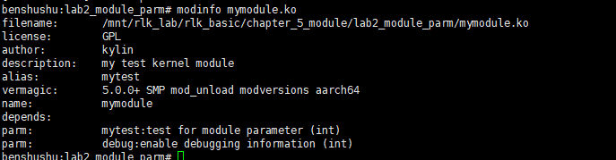

# 实验 5-2：向内核模块传递参数

## 一．实验目的

学会如何向内核模块传递参数。

## 二．实验步骤

编写一个内核模块，通过模块参数的方式向内核模块传递参数。

实验步骤和实验 1 类似，就不在详细说明

#### 实验代码

```C
#include <linux/module.h>
#include <linux/init.h>

static int debug = 1;
module_param(debug, int, 0644);
MODULE_PARM_DESC(debug, "enable debugging information");

#define dprintk(args...) \
	if (debug) { \
		printk(KERN_DEBUG args); \
	}

static int mytest = 100;
module_param(mytest, int, 0644);
MODULE_PARM_DESC(mytest, "test for module parameter");

static int __init my_test_init(void)
{
	dprintk("my first kernel module init\n");
	dprintk("module parameter=%d\n", mytest);
	return 0;
}

static void __exit my_test_exit(void)
{
	printk("goodbye\n");
}

module_init(my_test_init);
module_exit(my_test_exit);

MODULE_LICENSE("GPL");
MODULE_AUTHOR("Ben Shushu");
MODULE_DESCRIPTION("my test kernel module");
MODULE_ALIAS("mytest");

```

实验代码分析见书上第 4.2 章内容。


### 补充：

要学习如何向内核模块传递参数，下面我将根据你提供的代码逐步解释如何设置、传递和使用内核模块的参数。

#### 1. **内核模块参数简介**

在 Linux 内核模块中，可以通过命令行传递参数给模块，使模块能够根据这些参数的值进行动态配置。你可以在加载模块时传递参数，这对于调试或在不同的环境下使用模块非常有用。

在你的代码中，定义了两个模块参数：

- `debug`：用于控制调试信息的输出。
- `mytest`：是一个用于测试的整数参数。

#### 2. **定义和使用模块参数**

在代码中，模块参数通过 `module_param()` 宏来声明和注册。接下来是如何设置和使用模块参数的步骤：

##### 2.1 **声明模块参数**

```C
static int debug = 1;
module_param(debug, int, 0644);
MODULE_PARM_DESC(debug, "enable debugging information");
```

- **`debug`** 是一个整型变量，初始值为 `1`，表示默认情况下启用了调试信息。
- **`module_param(debug, int, 0644)`** 是一个宏，用来声明 `debug` 参数，并告诉内核这个参数的类型是 `int`（整数），并且它的权限是 `0644`（用户可读写，组和其他用户可读）。
- **`MODULE_PARM_DESC(debug, "enable debugging information")`**：这是对 `debug` 参数的描述信息，用于帮助文档和调试工具中显示参数的作用。

同样的，`mytest` 也是通过相同的方式声明的：

```C
static int mytest = 100;
module_param(mytest, int, 0644);
MODULE_PARM_DESC(mytest, "test for module parameter");
```

##### 2.2 **在模块中使用参数**

一旦参数声明好，可以在模块的代码中使用这些参数。在初始化函数 `my_test_init()` 中，使用了 `dprintk` 来有条件地输出调试信息：

```C
c复制代码static int __init my_test_init(void)
{
	dprintk("my first kernel module init\n");
	dprintk("module parameter=%d\n", mytest);
	return 0;
}
```

- **`dprintk`** 是一个宏，基于 `debug` 参数的值来决定是否打印调试信息。如果 `debug` 为 `1`，则输出信息；如果为 `0`，则不输出。
- **`mytest`** 作为模块参数被打印出来，输出值为用户传递的参数值（或使用默认值）。

#### 3. **向模块传递参数**

##### 3.1 **加载模块时传递参数**

模块参数可以在使用 `insmod` 或 `modprobe` 加载模块时传递。例如，假设你的模块文件是 `mytest.ko`，你可以通过以下方式传递参数：

```C
sudo insmod mytest.ko debug=0 mytest=200
```

- `debug=0`：传递 `debug` 参数，关闭调试信息输出。
- `mytest=200`：将 `mytest` 参数设置为 `200`。

##### 3.2 **使用 `modinfo` 查看模块参数**

可以通过 `modinfo` 命令来查看模块支持的参数及其描述。例如，查看 `mytest.ko` 的参数信息：

```shell
modinfo mytest.ko
```

输出中会显示模块参数及其描述：

```C
parm:        debug:enable debugging information (int)
parm:        mytest:test for module parameter (int)
```

##### 3.3 **通过文件系统修改模块参数**

如果模块参数的权限设置为 `0644`，意味着模块加载后，用户还可以通过 `/sys/module/<module_name>/parameters/` 文件来动态修改模块的参数值。

例如，假设模块名为 `mytest`，你可以这样查看和修改参数：

查看 `debug` 参数：

```shell
cat /sys/module/mytest/parameters/debug
```

修改 `debug` 参数（切换调试开关）：

```shell
echo 0 > /sys/module/mytest/parameters/debug
```

#### 4. **卸载模块**

当你不再需要模块时，可以通过 `rmmod` 卸载模块：

```shell
sudo rmmod mytest
```

在卸载时，模块会调用 `my_test_exit()` 函数，这里会输出 `"goodbye\n"`。

#### 5. **总结**

1. **声明参数**：通过 `module_param()` 宏声明参数，并使用 `MODULE_PARM_DESC()` 来添加参数描述。
2. **加载时传递参数**：在使用 `insmod` 或 `modprobe` 加载模块时，直接在命令行传递参数。
3. **动态修改参数**：通过 `/sys/module/` 文件系统中的 `parameters` 目录，可以动态查看和修改模块的参数值。
4. **使用参数**：模块中的逻辑可以根据传递的参数值进行调整。

通过这种方式，你可以为内核模块编写灵活的配置项，让模块行为能够根据外部输入动态调整。


## 实操

在qemu+runningkernel中ARM64中做，这样不需要**交叉编译**了

### 启动 QEMU+runninglinuxkernel

```
cd /home/gubin/rlk/runninglinuxkernel_5.0/
./run_rlk_arm64.sh run
```

### 进入本实验的参考代码

```
cd /mnt/rlk_lab/rlk_basic/chapter_5_module/lab2_module_parm
```

先将之前lab1实验产生的ko删了，去lab1文件目录下执行make clean


```
cat Makefile
```

```makefile
BASEINCLUDE ?= /lib/modules/`uname -r`/build

mymodule-objs := module_parm.o 

obj-m	:=   mymodule.o
all : 
	$(MAKE) -C $(BASEINCLUDE) M=$(PWD) modules;

clean:
	$(MAKE) -C $(BASEINCLUDE) M=$(PWD) clean;
	rm -f *.ko;

```

### 编译

```
make
```


### 加载模块时传递参数

模块参数可以在使用 `insmod` 或 `modprobe` 加载模块时传递。例如，假设你的模块文件是 `mymodule.ko`，你可以通过以下方式传递参数：

```C
sudo insmod mymodule.ko debug=0 mytest=200
```

- `debug=0`：传递 `debug` 参数，关闭调试信息输出。
- `mytest=200`：将 `mytest` 参数设置为 `200`。

==报错，先忽略==


再次测试使用


再次传递参数，本次没报错


再次传递参数开启调试

```
insmod mymodule.ko debug=1 mytest=10
```


##### 3.2 **使用 `modinfo` 查看模块参数**

可以通过 `modinfo` 命令来查看模块支持的参数及其描述。例如，查看 `mymodule.ko` 的参数信息：

```shell
modinfo mymodule.ko
```

输出中会显示模块参数及其描述：

```C
parm:        debug:enable debugging information (int)
parm:        mytest:test for module parameter (int)
```




##### 实验结束

```
rmmod mymodule
make clean
```

