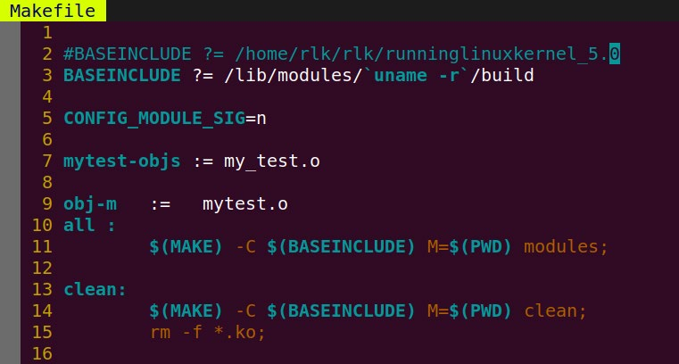
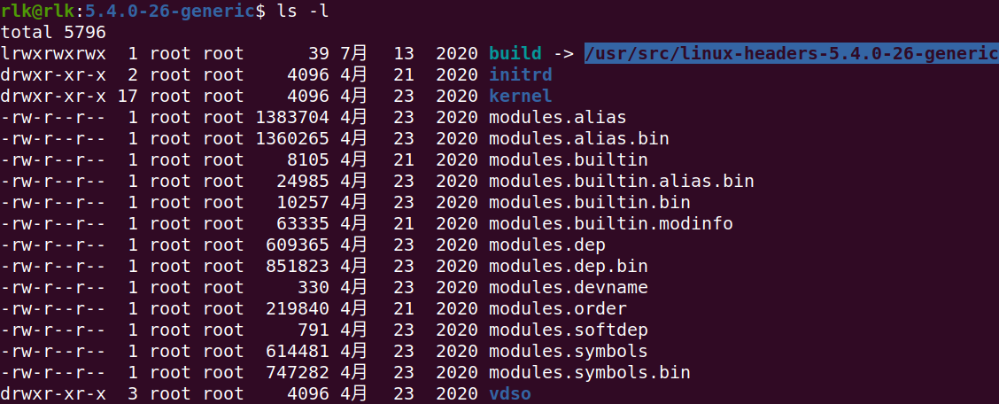
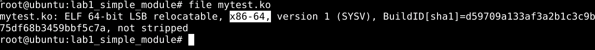
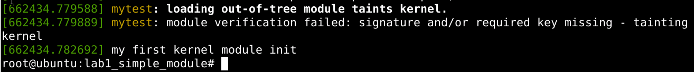
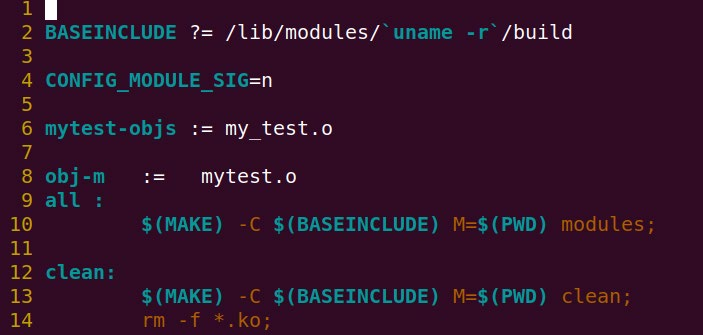

# 实验 5-4 在 Ubuntu 系统中编译内核模块（新增）

## 1．实验目的

了解和熟悉如何在 Host 主机上编译和运行一个内核模块。

## 2．实验步骤

很多企业采用 Ubuntu 或者 Centos 系统来作为基础系统来开发成品，比如服务器

厂商或者其他工业控制的厂商，因此我们有必要知道如何在 Ubuntu 和 Centos 系统中

编译内核模块。

我们采用本章实验 1 的参考代码为例。

```
cd 
/home/rlk/rlk_basic/runninglinuxkernel_5.0/rlk_lab/rlk_basic/chapter_5/lab1_
simple_module
```

​		因为我们这次要编译的内核是 ubuntu Linux 主机上的，因此我们需要使用 ubuntuLinux 主机上的内核头文件，而不能使用 runnlinuxkernel 中的头文件里。我们需要动手来修改 Makefile 文件。

​		我们把第 4 行代码注释掉，然后打开第 5 行代码，也就是 BASEINCLUDE 这个变量指向 ubuntu Linux 主机上的内核头文件，如图所示。



其中“uname -a”命令是查看当前系统的内核版本。

```
rlk@rlk:chapter_5_module$ uname -a
Linux rlk 5.4.0-26-generic #30-Ubuntu SMP Mon Apr 20 16:58:30 UTC 2020 x86_64 
x86_64 x86_64 GNU/Linux
```

​		表示当前 ubuntu Linux 系统的内核版本为：5.4.0-26-generic。

​		那么该版本内核对应的文件是在哪里呢？

​		它对应的目录是在：/lib/moudels/5.4.0-26-generic 目录下面，在这个目录下面有一个 build 链接文件，指向内核头文件目录为/usr/src/linux-headers-5.4.0-26-generic。



接下来开始编译内核模块了。

**注意，编译 host 主机内核模块我们需要 root 用户，而编译 runninglinuxkernel_5.0的内核模块不需要root 用户，建议使用 rlk 用户。**

```
$sudo su //进入root用户
#cd /home/rlk/rlk/runninglinuxkernel_5.0/kmodules/rlk_lab/rlk_basic/chapter_5_mod
ule/lab1_simple_module

#make
```

编译完成，我们需要使用 file 命令来检查，确保编译成了 x86_64 的格式了。



然后使用 insmod 命令加载内核模块。

```
#insmod mytest.ko
```

使用 dmesg 命令来查看内核 log 信息。



​		上面有 3 行 log：

​		第 1 行：表示这是内核代码树之外的一个内核模块。

​		第 2 行：我们内核模块没有签名，但是不影响使用。

​		若想去掉上述两个打印，可以在 Makefile 中增加一行“CONFIG_MODULE_SIG=n”。



第 3 行：就是我们这个内核模块打印的。